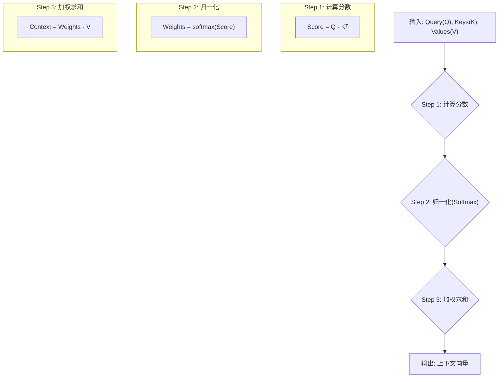

好的，同学！欢迎来到我的算法小课堂。今天，我们要一起攻克一个在现代AI领域，尤其是自然语言处理（NLP）中，堪称“定海神针”的核心概念——**注意力机制的QKV模型**。

别担心，虽然名字听起来有点唬人，但它的思想非常直观。我将扮演你的专属代码向导，用最生活化的比喻和最精简的代码，带你一步步揭开它的神秘面纱。

准备好了吗？让我们开始吧！

---

### 1. 问题引入

还记得我们之前讨论过的Seq2Seq模型吗？它在处理机器翻译任务时，会先把整个中文句子编码成一个固定长度的向量（我们称之为`context vector`），然后再用这个向量去解码生成英文句子。

这就像让你读一篇很长的文章，然后合上书，只凭记忆去复述文章的摘要。如果文章很短，你可能记得住。但如果文章长达几千字呢？你的记忆（那个固定长度的向量）就会成为一个**信息瓶颈**，很多细节都会丢失。

**经典问题：**
在翻译这句话时：“**那个追着老鼠的猫，现在累了。**”

当模型翻译到 "tired"（累了）时，它最需要关注的源头词是什么？是 "猫"，而不是旁边的 "老鼠"。但如果句子很长，Seq2Seq模型可能已经忘记了主语是“猫”。

**我们需要一个更聪明的机制**，让模型在生成每个词的时候，都能“回头看一看”原文的所有部分，并**动态地决定**当前最应该关注哪个词。这个“动态关注”的机制，就是注意力（Attention）的核心，而实现它的主流方法，就是我们今天要学的 **QKV 模型**。

### 2. 核心思想与生活化类比

**核心思想：**
注意力机制的本质，是一种**基于相似度的资源分配**。它模拟了人类的注意力模式：当我们处理信息时，总会把有限的注意力集中在关键部分。QKV模型就是这个过程的数学化表达。

**生活化类比：去图书馆查资料**

想象一下，你为了写一篇关于“人工智能发展”的论文，来到了一个巨大的图书馆。

1.  **你的问题 (Query, Q):** 你脑子里带着一个明确的问题，比如：“我想找关于‘Transformer模型’的资料。” 这个就是你的 **查询（Query）**。

2.  **书架上的标签 (Key, K):** 图书馆里成千上万本书，你不可能一本本翻。你会做什么？你会去看每本书的书名、书脊上的标签或者索引卡片。这些标签就是 **键（Key）**，它们简要描述了书的内容。

3.  **书本的内容 (Value, V):** 当你发现一个标签（Key）和你的问题（Query）高度相关时，比如一本书叫《深度学习与Transformer》，你就会把这本书抽出来，阅读它的具体**内容（Value）**。

整个过程是：
*   你拿着你的 **Q (Query)**，去和图书馆里所有书的 **K (Key)** 进行匹配，计算一个“相关性分数”。
*   相关性分数越高的书，你分配给它的“注意力”就越多。
*   最后，你根据这些注意力分数，把所有相关书籍的 **V (Value)** 内容进行加权组合，形成你对“Transformer模型”的最终理解。

在NLP中，Q、K、V都是向量。
*   **Query**: 当前任务的“提问”向量。例如，在翻译任务中，是解码器当前要生成词的状态。
*   **Key**: 源句子中每个词的“标签”向量，用来和Query匹配。
*   **Value**: 源句子中每个词的“内容”向量，是真正要被提取的信息。

通过计算Q和所有K的相似度，我们得到每个词的“注意力权重”，然后用这个权重去加权求和所有的V，就得到了一个为当前任务量身定制的、蕴含了全文关键信息的上下文向量。

### 3. 最小可运行示例

Talk is cheap, show me the code! 让我们用`numpy`来实现一个最简化的QKV计算过程，让你看到数据是如何流动的。

```python
# code_lang: python
import numpy as np

def softmax(x):
    """一个简单的softmax函数，用于将分数转换为概率分布"""
    e_x = np.exp(x - np.max(x)) # 减去最大值防止数值溢出
    return e_x / e_x.sum(axis=-1, keepdims=True)

# 假设我们有一个包含3个词的输入句子，每个词用一个4维的向量表示
# 这可以看作是编码器的输出
# 词1: [1, 0, 1, 0] -> 代表 "The"
# 词2: [0, 1, 0, 1] -> 代表 "cat"
# 词3: [1, 1, 0, 0] -> 代表 "sat"
input_embeddings = np.array([
    [1, 0, 1, 0],
    [0, 1, 0, 1],
    [1, 1, 0, 0]
])

# 在真实模型中, Q, K, V 是由输入通过不同的权重矩阵(W_q, W_k, W_v)线性变换得到的
# 为了简化，我们这里直接使用输入本身作为K和V
# 假设Keys和Values与输入嵌入相同
Keys = input_embeddings
Values = input_embeddings

# 假设我们有一个Query，代表解码器当前的状态
# 它可能在问：“句子的主语是什么？”
# 它的向量表示与 "cat" ([0, 1, 0, 1]) 更接近
Query = np.array([0, 1, 0, 0])

# --- QKV 注意力计算开始 ---

# Step 1: 计算Query和每个Key的点积相似度分数
# Q · K^T  (Query 向量 和 每个Key向量进行点积)
# (1x4) @ (4x3) -> (1x3)
scores = np.dot(Query, Keys.T)
# 注意：为了简化代码演示，这里省略了实际Transformer中为了稳定训练而进行的缩放（除以sqrt(d_k)）步骤。
print(f"输入嵌入 (Keys/Values):\n{Keys}\n")
print(f"查询 (Query):\n{Query}\n")
print(f"1. 计算分数 (Q · K^T):\n{scores}\n")

# Step 2: 对分数进行Softmax归一化，得到注意力权重
# 这些权重加起来等于1
attention_weights = softmax(scores)
print(f"2. 注意力权重 (Softmax on scores):\n{attention_weights}\n")

# Step 3: 用注意力权重对所有的Value进行加权求和
# 得到最终的上下文向量 (Context Vector)
# (1x3) @ (3x4) -> (1x4)
context_vector = np.dot(attention_weights, Values)
print(f"3. 加权求和得到上下文向量:\n{context_vector}\n")

# --- 预期输出分析 ---
# Query [0, 1, 0, 0] 和 Key [0, 1, 0, 1] ("cat") 的点积是 1，是最大的。
# 因此，"cat" 这个词会获得最高的注意力权重。
# 最终的上下文向量会非常接近 "cat" 的Value向量。
```

**预期输出:**
```
输入嵌入 (Keys/Values):
[[1 0 1 0]
 [0 1 0 1]
 [1 1 0 0]]

查询 (Query):
[0 1 0 0]

1. 计算分数 (Q · K^T):
[0 1 1]

2. 注意力权重 (Softmax on scores):
[0.21194156 0.39402922 0.39402922]

3. 加权求和得到上下文向量:
[0.60597078 0.78805844 0.21194156 0.39402922]
```
*（注意：由于softmax的性质，即使两个分数相同，它们也不会是0.5，因为还有一个分数为0的词也占了一部分权重。但它们依然是权重最高的。）*

看到没？尽管"The"和"sat"也提供了一点信息，但最终的上下文向量主要融合了"cat"的信息，因为它和我们的Query最相关！

### 4. 原理剖析

刚刚的代码已经展示了整个流程，现在我们把它拆解成标准的三个步骤，并配上流程图。



**分步详解:**

1.  **计算注意力分数（Score Calculation）**
    *   **做什么？** 衡量单个`Query`和所有`Keys`的相似度。最常用的方法就是**点积（Dot-Product）**。
    *   **为什么？** 在高维空间中，两个向量的点积可以衡量它们的相似性。如果两个向量方向接近，点积结果就大；如果方向垂直，点积为0；如果方向相反，点积为负。
    *   **数学公式 (轻量版):**
        $AttentionScores = Q \cdot K^T$
    *   在真实的Transformer模型中，为了防止点积结果过大导致梯度消失，还会除以一个缩放因子 $\sqrt{d_k}$ (Key向量的维度)。
        $AttentionScores = \frac{Q \cdot K^T}{\sqrt{d_k}}$

2.  **分数归一化（Normalization）**
    *   **做什么？** 将原始的分数转换成一个概率分布，也就是**注意力权重（Attention Weights）**。这些权重都为正数，且总和为1。
    *   **为什么？** 原始分数（如`[0, 1, 1]`）大小不一，不方便作为“百分比”来使用。Softmax函数能漂亮地完成这个任务，它会放大高分数的权重，压制低分数的权重。
    *   **数学公式:**
        $Weights = \text{softmax}(AttentionScores)$

3.  **加权求和（Weighted Sum）**
    *   **做什么？** 使用上一步得到的注意力权重，去对`Values`向量进行加权求和，得到最终的输出。
    *   **为什么？** 这是最关键的一步。权重高的Value向量会在最终的输出中占据主导地位。这就像我们查资料，最终的笔记里，内容主要来自于那些和我们问题最相关的书籍。
    *   **数学公式:**
        $ContextVector = \sum_{i} (\text{weight}_i \cdot V_i)$

**复杂度分析:**
这里的复杂度分析着眼于更通用的自注意力场景，其中序列中的每个词（共n个）都会扮演一次Query的角色。
假设输入序列的长度为 `n`，向量的维度为 `d`。
*   计算`Q`和`K`的点积 `(Q · K^T)`，涉及到 `n x n` 的矩阵乘法，这步是计算瓶颈，时间复杂度为 **O(n²d)**。
*   空间复杂度主要是存储这个 `n x n` 的注意力矩阵，为 **O(n²)**。

这就是为什么标准Transformer在处理非常非常长的序列（如几万个词）时会遇到性能问题。

### 5. 常见误区与优化点

*   **误区1: “Key 和 Value 是一回事。”**
    *   **纠正:** 它们角色不同。**Key 的作用是“被匹配”，Value 的作用是“被提取”**。虽然在自注意力（Self-Attention）中，它们都源于同一个输入序列，但经过不同的线性变换后，它们已经是不同的向量，承载着不同的使命。
*   **误区2: “忘记了缩放因子 $\sqrt{d_k}$。”**
    *   **提醒:** 在实际实现中，这个缩放步骤至关重要。当向量维度 `d_k` 很大时，点积的结果会变得非常大，这会把Softmax函数推向其饱和区，导致梯度变得极小，模型难以学习。除以 $\sqrt{d_k}$ 是一种有效的“缓解”手段。
*   **误区3: “注意力机制就是加权平均。”**
    *   **纠正:** 更准确地说，它是**动态的、内容相关的**加权平均。权重不是固定的，而是由`Query`和`Key`实时计算出来的。`Query`一变，整个权重分布都会改变。这正是它强大的地方。

### 6. 拓展应用

QKV模型的思想已经渗透到AI的各个角落，远不止NLP：

*   **计算机视觉 (CV):** 在 **Vision Transformer (ViT)** 中，一张图片被切成多个小块（Patches），每个小块就像一个“词”。注意力机制可以帮助模型理解图片中不同部分之间的关系，比如识别出一只猫时，模型会同时关注到它的耳朵、胡须和尾巴。
*   **推荐系统:** 用户的画像或当前行为可以作为 **Query**，物品库中的商品信息可以作为 **Key** 和 **Value**。通过注意力机制，系统可以为用户动态推荐最相关的商品。
*   **语音识别:** 在语音转文字时，模型可以利用注意力机制，在生成当前文字时，关注到音频流中最相关的几帧。

### 7. 总结要点

让我们快速回顾一下今天学习的精华：

1.  **核心目的:** 解决信息瓶颈，让模型能动态关注输入中最相关的部分。
2.  **QKV类比:** 如图书馆查资料，**Q (Query)** 是你的问题，**K (Key)** 是书的标签，**V (Value)** 是书的内容。
3.  **三步计算流程:**
    *   **计算分数:** Q 点积 K，得到相似度。
    *   **归一化:** Softmax将分数转为权重。
    *   **加权求和:** 用权重对 V 进行加权求和，得到最终输出。
4.  **关键优势:** 高度灵活，能捕捉长距离依赖关系。
5.  **核心代价:** 时间复杂度为O(n²·d)，空间复杂度为O(n²)，对长序列不友好。

### 8. 思考与自测

现在，轮到你来动手了！这是一个小挑战，能检验你是否真正掌握了QKV的精髓。

**问题:**
在我们的代码示例中，`Query`是一个独立的外部向量。但在**自注意力机制（Self-Attention）**中，Query、Key和Value都来自输入序列本身。也就是说，序列中的每个词都会扮演一次Query的角色，去“查询”序列中所有其他的词（包括它自己）。

**你的任务:**
请修改上面的Python代码，模拟**第一个词 "The"** 作为Query时，计算出的上下文向量。

**提示:**
1.  `Query`不再是 `np.array([0, 1, 0, 0])`。
2.  `Query`应该是什么？它应该来自 `input_embeddings`。

把你的代码和结果贴出来，或者在脑中推演一下结果会是怎样。这个练习将是你理解自注意力机制，乃至整个Transformer模型的关键一步！

祝你学习愉快！如果还有任何问题，随时可以再来问我。
