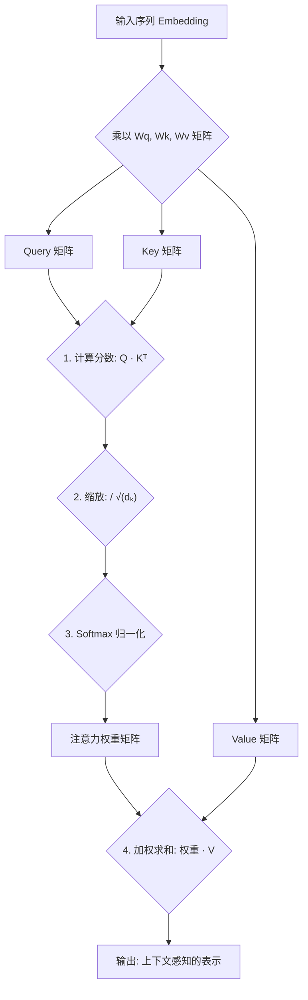

好的，我们开始。作为你的知识讲解者，我将遵循“引导式教学模型”，带你一步步深入理解“自注意力机制（Self-Attention）”的核心。

### **自注意力机制（Self-Attention）初探**

---

#### 1. **问题引入**

让我们先回到我们熟悉的老朋友——基于RNN的Seq2Seq模型。在处理长句子时，它会遇到一个棘手的问题：**信息瓶颈**。编码器（Encoder）需要把一整个句子的所有信息，不论长短，都压缩成一个固定长度的向量（Context Vector）。这就像让你用一句话总结一部鸿篇巨著，信息丢失在所难免。

虽然引入了注意力机制（Attention），允许解码器在生成每个词时，“关注”到输入序列的不同部分，极大地缓解了这个问题。但这种经典的注意力机制，主要用于连接编码器和解码器。那么，一个很自然的问题就浮现了：

**在处理单个句子时，句子内部的词与词之间也存在着复杂的依赖关系，我们能否在句子内部就建立这种“关注”机制，来更好地理解其含义呢？**

例如，在句子 "The animal didn't cross the street because **it** was too tired." 中，"it" 究竟指代的是 "animal" 还是 "street"？对于人类来说这很简单，但模型如何才能直接地将 "it" 和 "animal" 关联起来，而不是依赖RNN那种长长的、容易遗忘的顺序路径呢？

这就是自注意力机制（Self-Attention）试图解决的核心问题。

---

#### 2. **核心定义与生活化类比**

**核心定义**:
自注意力（Self-Attention）是一种允许模型在处理一个序列（如一个句子）时，为序列中的每一个元素（如每一个单词）计算一个“注意力分数”，这个分数衡量了该元素与其他所有元素（包括其自身）的关联程度。最终，每个元素的新表示（representation）是整个序列中所有元素的值（Value）的加权和，而权重就来自于这个注意力分数。

简而言之，它在句子内部进行“自我审视”，让每个词都能“看到”并评估与其他所有词的重要性。

**生活化类比：一场圆桌会议**

想象你正在参加一个圆桌会议，讨论一个复杂的话题。为了形成自己对这个话题的最终看法，你会怎么做？

1.  **提出观点（Query）**: 你脑子里有一个初步的想法或问题，这是你的“查询”（Query）。
2.  **倾听他人（Key）**: 你会听桌上每个人发言的“主题”（Key）。比如，A在谈论市场，B在谈论技术，C在谈论财务。
3.  **评估关联性（Score）**: 你会根据自己的问题（Query），判断每个人的主题（Key）与你的关联性有多大。如果你的问题是关于产品可行性，那么技术专家B和市场专家A的发言对你来说就更重要。
4.  **吸收信息（Value & Weighted Sum）**: 你不会全盘接收所有人的发言内容（Value），而是根据上一步的关联性大小，有选择地、有侧重地吸收他们的信息。关联性高的，你就多听进去一些；关联性低的，就少听一些。

最终，你综合了所有人的有效信息，形成了自己对这个话题的一个深刻、全面的理解。

在这个过程中，句子里的每个单词都像一位参会者，通过自注意力机制，它能够综合句子中所有其他单词的信息，从而得到一个更懂上下文、更丰富的自身表示。

---

#### 3. **最小示例 (场景走查)**

让我们用一个简单的句子来走查这个过程："**The robot hit the ball**"。我们来聚焦于模型如何理解 "hit" 这个词。

1.  **生成三个身份**: 对于 "hit" 这个词，模型不会直接使用它的原始词向量。而是通过三个不同的线性变换（可以想象成戴上三副不同的眼镜），生成三个新的向量：
    *   **查询向量 Q (Query)**: 代表 "hit" 准备去查询、去关联别人的“提问者”身份。
    *   **键向量 K (Key)**: 代表 "hit" 用来被别人查询、被别人匹配的“名牌”身份。
    *   **值向量 V (Value)**: 代表 "hit" 自身实际蕴含的“内容”身份。
    （句子中其他每个词，如 "The", "robot", "ball" 同样会生成它们各自的 Q, K, V 向量。）

2.  **计算关联度 (打分)**: 为了理解 "hit" 的上下文，模型会用 "hit" 的 **Q** 向量，去和句子中每一个词（包括它自己）的 **K** 向量进行点积运算，得到一个分数。
    *   `Score_1 = Q_hit · K_the`
    *   `Score_2 = Q_hit · K_robot`  (这个分数可能会很高，因为主语 "robot" 和谓语 "hit" 关系密切)
    *   `Score_3 = Q_hit · K_hit`
    *   `Score_4 = Q_hit · K_the`
    *   `Score_5 = Q_hit · K_ball` (这个分数可能也会很高，因为宾语 "ball" 和谓语 "hit" 关系密切)

3.  **归一化权重**: 将上一步得到的所有分数通过一个 Softmax 函数进行归一化，得到一组加起来等于1的权重。高分数的词会获得高权重。
    *   例如，权重可能变成：`[0.05, 0.4, 0.05, 0.05, 0.45]`。这意味着在理解 "hit" 时，模型认为应该将40%的注意力放在 "robot" 上，45%的注意力放在 "ball" 上。

4.  **加权求和**: 最后，用这些权重去乘以每个词对应的 **V** 向量，然后把它们全部加起来。
    *   `Z_hit = 0.05 * V_the + 0.4 * V_robot + 0.05 * V_hit + 0.05 * V_the + 0.45 * V_ball`

这个最终得到的向量 `Z_hit` 就是 "hit" 在这个句子中的新表示。它不再是孤立的，而是深度融合了主语 "robot" 和宾语 "ball" 的信息，变得更加“理解上下文”。

---

#### 4. **原理剖析**

现在，我们将上面的过程用更正式的语言和数学公式来描述。自注意力机制最核心的实现被称为“**缩放点积注意力 (Scaled Dot-Product Attention)**”。

**核心三要素：Q, K, V**

对于一个输入序列，其每个元素的词向量首先会通过三个独立的、可学习的权重矩阵 $W^Q, W^K, W^V$ 进行线性变换，得到相应的查询（Query）、键（Key）和值（Value）向量。

-   $Q = X \cdot W^Q$
-   $K = X \cdot W^K$
-   $V = X \cdot W^V$

这里的 $X$ 是输入序列所有词向量组成的矩阵。

**计算流程图**

**数学公式**

整个过程可以浓缩成一个优美的公式：

$Attention(Q, K, V) = \text{softmax}\left(\frac{QK^T}{\sqrt{d_k}}\right)V$

*   **$QK^T$**: 计算查询和键之间的点积相似度。
*   **$\sqrt{d_k}$**: 缩放因子。$d_k$ 是键向量的维度。这一步非常关键，它能防止在维度很高时点积结果过大，导致Softmax函数进入梯度很小的区域，从而使得训练不稳定。
*   **$\text{softmax}(\cdot)$**: 将分数转换为总和为1的概率分布（即注意力权重）。
*   **$(\cdot)V$**: 将得到的权重应用于值向量，进行加权求和。

---

#### 5. **常见误区**

1.  **误区一：自注意力机制只是一个加权平均。**
    *   **辨析**：虽然形式上是加权求和，但其精髓在于**权重是动态生成的**。这个权重不是固定的，而是根据当前词的“查询”（Query）和句子中其他词的“键”（Key）之间的实时关系计算出来的。对于同一个词，在不同的句子（上下文）中，它所关注的焦点（权重分布）是完全不同的。

2.  **误区二：Q, K, V 向量是同一个向量的三个复制品。**
    *   **辨析**：它们源自同一个输入词向量，但通过**三个不同的、独立学习的**权重矩阵（$W^Q, W^K, W^V$）投影到不同的表示空间。这赋予了模型极大的灵活性，让同一个词能够学会扮演不同的角色：作为提问者（Q）去匹配别人，作为被检索的标签（K）来响应提问，以及作为信息提供者（V）贡献内容。

---

#### 6. **拓展应用**

自注意力机制是颠覆性模型 **Transformer** 的核心构件。它的出现，几乎重塑了整个自然语言处理领域。

*   **自然语言处理（NLP）**: 作为Transformer的基础，自注意力机制被广泛应用于BERT、GPT等预训练语言模型中，在机器翻译、文本摘要、情感分析、问答系统等几乎所有NLP任务上都取得了突破性进展。
*   **计算机视觉（CV）**: 近年来，研究者将自注意力机制的思想应用到图像处理中，诞生了Vision Transformer (ViT)等模型。它将图像分割成小块（patches），然后像处理单词一样处理这些图像块，让模型能够捕捉图像中不同区域间的全局关系。

---

#### 7. **总结要点**

1.  **核心目的**：解决长距离依赖问题，通过直接计算序列内任意两个位置之间的关联，让模型更好地理解上下文。
2.  **QKV模型**：自注意力的核心是为每个输入元素生成查询（Query）、键（Key）、值（Value）三个向量，分别代表“我想找什么”、“我有什么标签”和“我有什么内容”。
3.  **动态权重**：注意力权重是根据Q和K的相似度动态计算的，而非静态或仅基于位置。
4.  **并行计算**：与RNN的顺序处理不同，自注意力机制对序列中所有位置的计算可以完全并行化，极大地提高了训练效率。

---

#### 8. **思考与自测**

1.  在句子 "The host poured the guests a drink, but they didn't like **it**." 中，自注意力机制在处理 "it" 这个词时，你认为 "it" 的Query向量会与哪些词的Key向量计算出较高的分数？为什么？这如何体现自注意力相比RNN的优势？
2.  我们提到了缩放因子 $\sqrt{d_k}$。试想一下，如果没有这个缩放步骤，对于一个维度 $d_k$ 很大的向量，点积的结果会怎样？这会对Softmax函数的输出以及模型的训练过程产生什么影响？