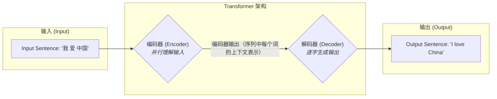

好的，学员，你好！我是你的架构导师。今天，我们将一起探讨一个在自然语言处理（NLP）领域具有里程碑意义的架构设计——Transformer。

我们将告别过去基于RNN（循环神经网络）的编码器-解码器模型，深入理解Transformer是如何通过全新的设计哲学，彻底改变序列数据处理的游戏规则的。

准备好了吗？让我们开始这场架构设计的探索之旅。

---

### 1. 问题引入：旧架构的“天花板”

想象一下，我们正在为一家跨国公司设计一个核心翻译系统。早期的主流方案是基于RNN的“编码器-解码器”架构。这个架构就像一个**单人同声传译员**。

*   **编码器 (Encoder)**：这位传译员会先听完一整句中文，例如“我爱中国”。在听的过程中，他需要将整句话的含义压缩进大脑的一个固定容量的记忆中（即编码器最终输出的`context vector`）。
*   **解码器 (Decoder)**：然后，他开始逐字翻译成英文。每翻译一个词，他都需要回忆一下之前记下的整句话的含义，并结合已经翻译出的部分。

这个设计虽然直观，但很快我们就遇到了两个难以逾越的“天花板”（Pain Points）：

1.  **性能瓶颈（串行处理）**：RNN的工作方式是“逐字处理”，就像一条单车道。无论我们给它多强的计算资源，它都必须一个词一个词地处理，无法并行。当句子很长时，这个过程会非常缓慢，无法满足大规模、低延迟的翻译需求。
2.  **信息瓶颈（记忆遗忘）**：所有输入句子的信息，无论多长多复杂，都必须被压缩进一个固定大小的`context vector`中。这就像要求传译员只用一张小纸条来记录一部长篇小说的所有要点，信息损失是必然的。对于长句子，模型很容易“忘记”句子开头的信息，导致翻译质量下降。

我们的任务是，设计一个全新的架构，打破这两个瓶颈。

### 2. 核心目标与类比：从“流水线”到“圆桌会议”

为了解决上述痛点，我们的新架构必须达成两个核心设计目标：

*   **目标1：并行化处理 (Parallelization)**：彻底摆脱逐字处理的限制，实现对输入序列中所有单词的同步计算，最大化利用现代硬件（如GPU）的并行能力。
*   **目标2：全局信息访问 (Global Information Access)**：允许模型在处理任何一个单词时，都能直接、无障碍地“看到”并参考输入序列中的任何其他单词，消除信息瓶颈。

**架构类比：**

*   **旧的RNN架构** 就像一个 **“工厂流水线”**。每个工人（RNN单元）只能看到前一个工人传递过来的半成品，然后进行加工，再传给下一个。信息是单向、逐步传递的，效率受限于流水线速度，且信息在传递中会失真。

*   **新的Transformer架构** 则像一场 **“高端圆桌会议”**。
    *   **与会者**：输入句子中的每一个单词（的词向量）。
    *   **会议桌**：一个开放的交流空间，即**自注意力机制 (Self-Attention)**。
    *   **会议过程**：桌上的每一位“与会者”（单词）都可以直接与其他任何“与会者”进行自由交流、讨论，评估彼此的重要性。比如，“it”这个词可以同时看向“animal”和“street”来判断自己到底指代谁。所有这些交流都是**同时发生**的。
    *   **会议纪要**：经过充分讨论后，每个单词都吸收了全局信息，形成一个对自己上下文有深刻理解的全新表达。

这个“圆桌会议”的设计，完美地实现了我们的并行化与全局信息访问两大目标。

### 3. 最小示例 (核心组件图)

让我们用一张最简化的蓝图，看看这个“会议”是如何组织的。整个系统依然遵循经典的“编码器-解码器”范式，但内部的运作方式已经焕然一新。

**设计解读：**

*   **编码器 (Encoder)**：负责召开一场关于输入句子的“圆桌会议”。它的唯一职责是充分理解输入句子，并产出一份包含全局上下文信息的“会议纪要”（一系列向量）。
*   **解码器 (Decoder)**：负责生成输出句子。它在写下每个单词前，都会参考编码器产出的“会议纪要”，确保翻译准确地反映了原文的含义。

### 4. 原理剖析 (详细设计与权衡)

现在，我们深入这两个核心部门（编码器和解码器），看看它们的内部设计。

#### **A. 编码器 (Encoder) 的设计**

编码器的目标是为输入序列中的每个单词生成一个富含上下文信息的向量表示。它由一叠完全相同的层（Layers）堆叠而成，每一层都包含两个核心子模块。

1.  **多头自注意力层 (Multi-Head Self-Attention)**
    *   **职责**：这就是我们前面提到的“圆桌会议”的执行场所。它计算句子中每个单词与其他所有单词之间的“关注度”或“相关性”得分，然后根据这些得分，将其他单词的信息加权融合到当前单词的表示中。
    *   **“多头”设计**：“多头”意味着我们同时召开多场（例如8场）并行的“圆桌会议”。每场会议关注点不同，比如一场可能关注语法关系，另一场关注语义关联。这使得模型能从不同角度和维度去理解句子内部的复杂关系，设计更加鲁棒。
    *   **接口**：输入是一组单词向量，输出是同样数量但融合了上下文信息的新向量。

2.  **前馈神经网络 (Feed-Forward Network)**
    *   **职责**：在开完“圆桌会议”后，每个单词都需要对自己新获得的信息进行一次独立的“消化吸收”和非线性变换。这个模块对注意力层的输出进行进一步的加工，增强模型的表达能力。
    *   **接口**：逐个地、独立地作用于每个单词的向量。

**架构支撑设计：**

*   **位置编码 (Positional Encoding)**：由于“圆桌会议”本身是无序的（所有单词同时交互），我们丢失了单词的原始顺序信息（“我 爱 中国” vs “中国 爱 我”）。因此，在将单词送入编码器之前，我们必须像给与会者分配座位号一样，给每个单词向量添加一个包含其位置信息的“位置编码”，让模型知道单词的顺序。这是一个至关重要的**设计补丁**。
*   **残差连接与层归一化 (Add & Norm)**：在每个子模块（注意力层、前馈网络）的周围，我们都使用了这两个“建筑工程”中的最佳实践。
    *   **残差连接**：像修建一条“高速公路”，允许信息直接“跳过”某个处理层，避免在深层网络中信息丢失或梯度消失，确保训练稳定。
    *   **层归一化**：像一个“标准化工序”，将每层输出的数据分布调整到稳定范围，加速模型收敛。

#### **B. 解码器 (Decoder) 的设计**

解码器的目标是基于编码器的理解，生成目标语言的序列。它同样由一叠相同的层构成，但比编码器层多了一个关键模块。

1.  **带掩码的多头自注意力层 (Masked Multi-Head Self-Attention)**
    *   **职责**：解码器在生成文本时是**自回归 (Autoregressive)** 的，即生成第 `t` 个词时，只能依赖于已经生成的前 `t-1` 个词。这一层的作用与编码器的自注意力层类似，但增加了一个“**掩码 (Mask)**”。这个掩码会隐藏掉当前位置之后的信息，防止模型在训练时“作弊”偷看未来的答案。

2.  **编码器-解码器注意力层 (Encoder-Decoder Attention)**
    *   **职责**：这是连接编码器和解码器的**核心桥梁**。在这一步，解码器会根据已生成的部分译文，形成一个‘提问’（Query），然后用这个‘提问’去全面“审视”编码器产出的所有“会议纪要”（输入句子的所有单词表示），并判断：“为了生成我当前的这个词，原文中的哪些词最值得我关注？” 这实现了原文和译文之间的对齐。

3.  **前馈神经网络 (Feed-Forward Network)**
    *   **职责**：与编码器中的一样，用于对信息进行进一步的加工处理。

### 5. 常见误区 (反模式)

*   **误区一：“Transformer完全抛弃了序列概念。”**
    *   **纠正**：这是一个经典的反模式理解。Transformer的**核心计算单元（自注意力）**是无序的，但它通过**位置编码**这一强制性的设计，将序列顺序信息“注入”到了模型中。此外，解码器的**生成过程**本身就是严格按顺序进行的。它的创新在于，对输入序列（在编码器中）和已生成的部分输出（在解码器中）的内部计算，可以利用注意力机制并行处理，从而告别了RNN必须逐个时间步传递状态的串行计算瓶颈。

*   **误区二：“注意力机制越复杂越好。”**
    *   **纠正**：多头注意力的设计已经证明了其有效性。初学者有时会陷入过度设计的陷阱，试图发明更复杂的注意力计算方式。但架构设计的核心是**权衡 (Trade-off)**。原版Transformer的注意力机制在效果和计算效率之间取得了出色的平衡，任何改动都需要有充分的理由和实验验证。

### 6. 拓展应用 (演进路线)

这个经典的Encoder-Decoder架构是Transformer V1.0。它的设计思想极具模块化和扩展性，后续演进出了两大主流分支：

*   **演进路线一：专注理解 -> 编码器-Only 架构 (如 BERT)**
    *   **场景**：当我们只需要模型理解文本，而不需要生成文本时（如情感分析、文本分类）。
    *   **设计**：我们可以只保留并深化**编码器 (Encoder)** 部分。通过在大规模无标签文本上进行预训练，使其成为一个强大的“文本理解引擎”，然后在特定任务上进行微调。

*   **演进路线二：专注生成 -> 解码器-Only 架构 (如 GPT)**
    *   **场景**：当我们只需要模型进行文本生成时（如写故事、聊天机器人）。
    *   **设计**：我们可以只保留**解码器 (Decoder)** 部分。它根据给定的上文（Prompt），利用其强大的自回归和注意力机制来续写文本，成为一个“通用文本生成器”。

这充分体现了优秀架构设计的特点：**核心组件可复用、可独立演化**。

### 7. 总结要点

让我们回顾一下Transformer架构设计的核心原则：

1.  **并行化为王**：通过自注意力机制，彻底摆脱了RNN的串行依赖，实现了计算的并行化，是其性能飞跃的基石。
2.  **全局视野**：自注意力机制允许模型在任意两个位置之间建立直接联系，解决了长距离依赖问题。
3.  **位置信息的显式注入**：承认核心机制的无序性，并设计了位置编码作为补偿，这是一个优雅的“设计补丁”。
4.  **模块化与可堆叠性**：通过残差连接和层归一化，构建了稳定且可深度堆叠的“积木块”，使得构建非常深的网络成为可能。

Transformer不仅是一个模型，更是一种全新的、基于注意力的序列处理设计范式。

### 8. 思考与自测

现在，作为一名初露头角的架构师，请思考这个问题：

**“如果我们的新需求是处理一篇极长的文档（比如一整本书的翻译），现有Transformer架构的哪个部分会最先遇到瓶颈？为什么？你认为可以从哪个方向去优化这个设计？”**

... 思考一下 ...

**答案提示**：挑战主要来自**自注意力层**。它的计算复杂度和内存占用与序列长度的**平方**成正比（O(n²)）。当序列n变得非常大时（成千上万个单词），计算成本会急剧增加，变得难以承受。优化方向可能包括：设计更高效的“稀疏注意力”机制，只让每个单词关注部分最重要的其他单词，而不是全部，从而降低计算复杂度。

希望这次的讲解能帮助你建立对Transformer架构的宏观设计理解。继续探索，你会发现更多设计的智慧！