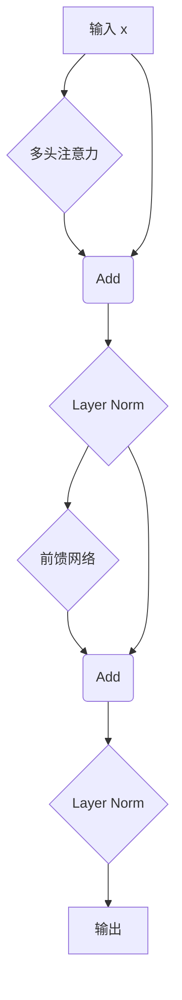

好的，我们开始吧。

你已经了解了 Transformer 的核心部件——多头注意力机制和位置编码。现在，我们要探讨一个看似微小但至关重要的问题：如何将这些强大的部件稳定地堆叠起来，构建一个既深又强大的模型？这就像我们有了顶级的发动机和轮胎，但还需要一个卓越的底盘和悬挂系统来确保整车的稳定性和性能。

在 Transformer 中，这个“底盘和悬挂系统”就是由**残差连接（Residual Connections）**和**层归一化（Layer Normalization）**共同构成的。

### 1. 问题引入

想象一下，你正在建造一座非常高的摩天大楼（一个深度神经网络）。每一层楼（网络层）都是在前一层的基础上建造的。你雇佣了一批顶尖的建筑师（比如“多头注意力”和“前馈网络”），他们各自的设计都非常出色。

但当你把几十甚至上百层楼直接堆叠起来时，问题出现了：
*   **信息损耗**：从底层传递到顶层的信息，经过层层加工，可能会变得面目全非，甚至完全丢失了最初的关键特征。就像一个传话游戏，话传到最后可能已经和原文毫无关系了。
*   **结构不稳定**：大楼太高，整体结构变得非常脆弱。一阵微风（训练过程中的微小梯度变化）就可能导致整座大楼的晃动甚至坍塌（模型训练梯度消失或爆炸，无法收敛）。

如何保证信息在传递过程中不丢失核心内容，并确保整个“建筑”的结构稳定性呢？

### 2. 核心定义与生活化类比

**核心定义**:
在 Transformer 的每个编码器和解码器层中，都包含两个主要的子层（一个多头注意力层和一个前馈神经网络）。在这每一个子层的输出端，都应用了**残差连接**，然后进行**层归一化**。这个组合操作可以公式化地理解为：`LayerNorm(x + Sublayer(x))`。

*   **残差连接 (Residual Connection)**：也叫“捷径连接”（Shortcut Connection）。它将子层的输入 `x` 直接加到子层的输出 `Sublayer(x)` 上。
*   **层归一化 (Layer Normalization)**：对上一步相加后的结果进行“标准化”处理，使其数值分布更加稳定。

**生活化类比：给专业报告添加附注和格式化**

想象你是一位项目经理，正在审阅一份由专家（子层，如注意力机制）撰写的技术分析报告。

1.  **原始资料 (`x`)**: 这是你交给专家的原始数据和背景资料。
2.  **专家分析 (`Sublayer(x)`)**: 专家根据你的资料，撰写了一份深度分析报告。这份报告可能包含了非常复杂的新见解，但也可能偏离了你最初的重点。
3.  **残差连接 (`x + Sublayer(x)`)**: 为了确保信息的主干不丢失，并让模型更容易学习“增量修改”，你没有直接采纳专家的分析稿，而是在最终的报告中，将专家的**“新增见解”或“修正” (`Sublayer(x)`)** 与你提供的**“原始背景资料” (`x`) 整合在一起**。这样，最终的报告既包含了专家深入的分析，也保留了原始信息的核心，确保了信息流在层层处理后仍能回溯到其起点，也使得后续处理者能更好地理解“在原始基础上做了哪些改变”。
4.  **层归一化 (`LayerNorm(...)`)**: 在提交最终版本前，你发现报告的各个章节（特征维度）的格式、字体大小、度量单位（数值尺度）五花八门，非常混乱。于是，你进行了一次**全文档格式化**，将所有章节的风格统一，使数据分布在一个标准的范围内。这让下一位读者（下一层网络）能够更轻松、更稳定地阅读和理解。

通过“整合”（残差连接）和“统一格式”（层归一化），你确保了信息在传递过程中既有深度又不失真，并且格式统一，易于处理。

### 3. 最小示例

我们用一个简单的场景来走查这个流程。假设输入一个句子的 token "learning" 对应的向量 `x`，看看它在一个编码器层中是如何被处理的。

1.  **输入**: 向量 `x` 进入多头注意力子层。
2.  **子层处理**: 多头注意力机制计算后，输出一个新的向量 `attention_output`。这个新向量包含了 "learning" 与句子中其他词的关系信息。
3.  **步骤一：残差连接**: 我们将原始的输入 `x` 和注意力层的输出 `attention_output` **直接相加**。
    *   `residual_output = x + attention_output`
    *   `residual_output` 现在既包含了原始的 "learning" 的信息，也包含了它与其他词的上下文关系信息。
4.  **步骤二：层归一化**: `residual_output` 向量内部的数值可能非常大或非常小，分布不均。我们对这个向量进行层归一化，得到 `norm_output1`。
    *   `norm_output1 = LayerNorm(residual_output)`
    *   `norm_output1` 的数值现在被调整到一个更稳定的范围内（比如均值为0，方差为1）。

这个 `norm_output1` 会接着被送入该编码器层的第二个子层——前馈神经网络（FFN），并**重复**上述的残差连接和层归一化过程，最后才输出给下一个编码器层。

### 4. 原理剖析

#### 为什么需要残差连接？——解决“梯度消失”

在深度网络中，梯度在通过反向传播逐层传递时，会不断地乘以每层的权重梯度。如果这些梯度值小于1，经过多层相乘后，梯度会迅速衰减，趋近于0。这就是**梯度消失（Vanishing Gradients）**。它会导致网络深处的层无法得到有效的更新，模型难以训练。

残差连接创造了一条“高速公路”。

*   数学上，输出 $H(x)$ 是子层函数 $F(x)$ 与输入 $x$ 的和：
    $H(x) = F(x) + x$
*   在反向传播计算梯度时，根据链式法则，对 $x$ 的梯度 $\frac{\partial H}{\partial x}$ 会包含一个直接的 `+1` 项：
    $\frac{\partial H}{\partial x} = \frac{\partial F(x)}{\partial x} + 1$
*   这个 `+1` 确保了即使 $\frac{\partial F(x)}{\partial x}$ 非常小，梯度也至少能以接近 1 的大小传递下去，就像一条不堵车的“梯度高速公路”，保证了梯度能够顺畅地流经整个深度网络。

#### 为什么需要层归一化？——解决“内部协变量偏移”

在训练过程中，每一层的参数都在不断更新。这导致下一层的输入数据分布也在持续变化，这种现象被称为**内部协变量偏移（Internal Covariate Shift）**。这迫使网络层需要不断适应新的数据分布，减慢了训练速度，使得训练过程不稳定。

层归一化通过在**每个样本、每一层**上独立地进行归一化来解决这个问题。它将该层所有神经元的输出，针对**这一个样本**，进行标准化处理。

*   对于一个向量 $x$，首先计算它的均值 $\mu$ 和方差 $\sigma^2$。
*   然后进行归一化，并引入两个可学习的参数 $\gamma$（增益）和 $\beta$（偏置）来保持模型的表达能力：
    $\text{LayerNorm}(x) = \gamma \frac{x - \mu}{\sqrt{\sigma^2 + \epsilon}} + \beta$
    （其中 $\epsilon$ 是一个极小的数，防止分母为零）

通过这种方式，无论输入如何变化，经过层归一化后，输出的分布都会被“拉回”到一个相对固定的、表现良好的状态，从而加速收敛并提高训练的稳定性。

下面是 Transformer 编码器层内部数据流的示意图：

### 5. 常见误区

1.  **误区：“残差连接就是将两个不同的信息流合并。”**
    *   **纠正**：不完全是。它合并的是**同一个信息流**在处理前和处理后的两个版本。关键在于，它保证了即使子层（如注意力）什么都没学到（即`Sublayer(x)`输出为0），原始信息 `x` 也能无损地传递到下一环节。这让模型学习“对原始信息的修改”变得更容易。

2.  **误区：“层归一化（Layer Normalization）和批归一化（Batch Normalization）是一回事。”**
    *   **纠正**：它们的工作维度不同。**批归一化**是在一个批次（batch）的所有样本中，对**同一个特征**进行归一化。而**层归一化**是在**单个样本**内部，对它的**所有特征**进行归一化。在NLP任务中，句子长度可变，使用批归一化会很麻烦且效果不佳，而层归一化完美地适应了这种情况，因为它对每个样本独立操作。

### 6. 总结要点

1.  **核心结构**: Transformer 的每个子层（注意力、前馈网络）都遵循 `Sublayer -> Add -> Norm` 的模式。
2.  **残差连接 (Add)**: 通过创建一条 `x + Sublayer(x)` 的捷径，直接将输入加到输出上，有效解决了深度网络中的梯度消失问题，让梯度可以顺畅地反向传播。
3.  **层归一化 (Norm)**: 通过对每一层每个样本的输出进行标准化，稳定了数据分布，缓解了内部协变量偏移问题，从而加速模型训练并提高稳定性。
4.  **协同作用**: 两者结合，使得构建和训练非常深的 Transformer 模型成为可能，这是其强大性能的基石。

### 7. 思考与自测

1.  如果一个 Transformer 模型在训练时非常不稳定，损失值（loss）剧烈波动，除了调整学习率，从我们今天讨论的知识点出发，你认为可能是哪个环节出了问题？为什么？
2.  试想一下，如果我们将残差连接中的加法 `+` 操作换成乘法 `*` 操作，会对梯度的反向传播产生什么影响？它还能起到“高速公路”的作用吗？