好的，教练就位。

让我们开始构建一份专家级的操作手册，深入剖析 Transformer 解码流程的核心机制。这份手册将严格遵循“引导式教学模型”，确保每一个概念都清晰、每一个步骤都可执行。

---

### **操作手册：Transformer 解码流程详解——自回归与 Masked Self-Attention**

#### 1. **问题引入**

“我正在实现或调试一个基于 Transformer 的生成模型，需要确保解码器（Decoder）的每一步操作都精准无误。特别是在处理序列生成时，如何正确地实现自回归（Autoregressive）机制，并确保 Masked Self-Attention 能够有效防止‘未来信息’的泄露？这个流程的精确步骤是怎样的？”

#### 2. **核心目标与类比**

本流程的核心目标是：**掌握并能够独立实现 Transformer 解码器在推理（Inference）阶段逐个生成目标词元（Token）的完整操作闭环。**

为了更好地理解这个过程，我们可以把它想象成一位**“蒙眼钢琴家即兴演奏”**：

*   **即兴演奏 (生成序列)**: 我们的目标是创作一段新的旋律（生成一个目标序列）。
*   **乐谱 (Encoder 输出)**: 钢琴家脑中有一段固定的主题旋律（来自 Encoder 对源序列的理解），这是他创作的灵感来源。
*   **蒙眼 (Masked Self-Attention)**: 他是蒙着眼睛的，看不见键盘上还未按下的琴键。他只能根据已经弹奏出的音符来决定下一个音符。这确保了创作的“因果性”和“时序性”。
*   **逐音符弹奏 (自回归)**: 他弹奏出一个音符，听听效果，然后基于此前的所有音符（包括刚弹的这一个），决定并弹奏下一个。这个“生成-反馈-再生成”的循环，就是自回归的核心。

#### 3. **最小示例 (核心流程演练)**

让我们以一个最简单的机器翻译任务为例，将 "I am a student" 翻译为 "Je suis un étudiant"。假设编码器已经处理完 "I am a student" 并输出了其最终的表征 `encoder_output`。

**解码流程演练 (Greedy Search 模式):**

*   **第 0 步 (初始化)**:
    *   **输入**: 解码器的初始输入是一个包含起始符 `<BOS>` (Begin Of Sentence) 的序列。
    *   **状态**: `generated_sequence = ["<BOS>"]`

*   **第 1 步 (生成第一个词)**:
    *   **输入到解码器**:
        1.  `encoder_output` (来自编码器，全程不变)
        2.  当前已生成的序列 `["<BOS>"]`
    *   **解码器内部**:
        1.  **Masked Self-Attention**: `<BOS>` 对自身进行注意力计算。此时 Mask 几乎不起作用，因为只有一个输入。
        2.  **Cross-Attention**: `<BOS>` 的表征作为 Query，去 `encoder_output` 中查询信息。
        3.  **FFN & Softmax**: 经过前馈网络和 Softmax 层，输出一个在整个词汇表上的概率分布。
    *   **输出**: 假设概率最高的词是 "Je"。
    *   **状态更新**: `generated_sequence = ["<BOS>", "Je"]`

*   **第 2 步 (生成第二个词)**:
    *   **输入到解码器**:
        1.  `encoder_output`
        2.  当前已生成的序列 `["<BOS>", "Je"]`
    *   **解码器内部**:
        1.  **Masked Self-Attention**: 在计算"Je"的表征时，它的注意力可以同时放在`<BOS>`和自身上；而在计算`<BOS>`的表征时，它的注意力则只能放在自身。Masked机制通过屏蔽未来位置的注意力权重，确保了任意位置 `i` 的输出只依赖于位置 `0` 到 `i` 的输入，从而保证了信息的单向流动。
        2.  **Cross-Attention**: `["<BOS>", "Je"]` 序列的新表征作为 Query，再次查询 `encoder_output`。
        3.  **FFN & Softmax**: 输出新的概率分布。
    *   **输出**: 假设概率最高的词是 "suis"。
    *   **状态更新**: `generated_sequence = ["<BOS>", "Je", "suis"]`

*   **第 3 步 (及后续)**:
    *   重复上述过程，将 `["<BOS>", "Je", "suis"]` 作为新的输入，生成下一个词 "un"，以此类推。

*   **终止条件**: 当模型生成的概率最高的词是终止符 `<EOS>` (End Of Sentence)，或者达到预设的最大长度时，生成过程结束。

#### 4. **原理剖析 (各步骤详解)**

下面，我们将解码器单步生成（Single Step Generation）的过程拆解为可执行的指令和验收标准。

```mermaid
flowchart TD
    subgraph "单步生成循环 (t)"
        A["Start: t=1"] --> B{输入准备}
        B --> C[Decoder Layer 1]
        C --> D[Decoder Layer 2]
        D --> E[...] 
        E --> F[Decoder Layer N]
        F --> G["最终输出层: Linear + Softmax"]
        G --> H["选择Token (e.g., argmax)"]
        H --> I{是否为<EOS>或达到Max Length?}
        I -->|No| J[追加新Token到输入序列, t = t+1]
        J --> B
        I -->|Yes| K["End: 输出完整序列"]
    end

    subgraph "Decoder Layer 内部 (详细)"
        C1("输入: Encoder Output, 前序生成序列") --> C2[Masked Multi-Head Self-Attention]
        C2 --> C3[Add & Norm]
        C3 --> C4[Multi-Head Cross-Attention]
        C4 --> C5[Add & Norm]
        C5 --> C6[Feed-Forward Network]
        C6 --> C7[Add & Norm]
        C7 --> C8("输出: 更新后的序列表示")
    end

    style C fill:#f9f,stroke:#333,stroke-width:2px
    style C4 fill:#ccf,stroke:#333,stroke-width:2px
```



**单步操作指令与验收标准**

1.  **输入准备 (Input Preparation)**
    *   **操作指令**:
        1.  获取编码器的最终输出 `encoder_output` (形状如 `[batch_size, src_len, d_model]`)。此张量在整个解码过程中保持不变。
        2.  获取当前已生成的序列 `tgt_tokens` (形状如 `[batch_size, current_len]`)。在第一步，这仅包含 `<BOS>` 词元的索引。
        3.  将 `tgt_tokens` 通过词嵌入层（Token Embedding）和位置编码（Positional Encoding）转换为输入表征 `tgt_embedding` (形状如 `[batch_size, current_len, d_model]`)。
    *   **验收标准**:
        *   `encoder_output` 已正确缓存。
        *   `tgt_embedding` 的形状和内容正确，包含了词义和位置信息。

2.  **核心机制 1: Masked Multi-Head Self-Attention**
    *   **操作指令**:
        1.  **创建注意力掩码 (Look-ahead Mask)**: 创建一个上三角矩阵，对角线以上（不含对角线）为 `-inf` (或一个非常大的负数)，对角线及以下为 `0`。这个掩码的尺寸应为 `[current_len, current_len]`。
        2.  **计算 Q, K, V**: 从 `tgt_embedding` 线性变换得到 Query, Key, Value 矩阵。
        3.  **应用掩码**: 在计算注意力分数（`softmax(Q @ K.T / sqrt(d_k))`）之前，将掩码矩阵加到 `Q @ K.T` 的结果上。`-inf` 经过 Softmax 后会变为 `0`，从而屏蔽了未来位置的信息。
        4.  **执行多头注意力**: 完成后续的加权求和与多头合并。
    *   **验收标准**:
        *   验证注意力权重矩阵。对于任意位置 `i`，其对位置 `j > i` 的注意力权重应为 `0` 或接近 `0`。
        *   输出的 `self_attn_output` 形状与 `tgt_embedding` 相同。

    ```python
    # Code Snippet: 创建 Look-ahead Mask
    import torch

    def create_look_ahead_mask(size):
        """
        创建一个上三角布尔掩码，用于在自注意力机制中屏蔽未来的词元。
        Args:
            size (int): 目标序列的长度。
        Returns:
            torch.Tensor: 一个形状为 [size, size] 的布尔掩码张量。
                          True 表示相应位置应被屏蔽。
        """
        mask = torch.triu(torch.ones(size, size), diagonal=1)
        return mask == 1 # True表示要被mask掉的位置

    # --- 在Attention模块中的应用 (简化版) ---
    # attention_scores shape: [batch, num_heads, seq_len, seq_len]
    seq_len = K.size(-1)
    look_ahead_mask = create_look_ahead_mask(seq_len).to(device)
    attention_scores = attention_scores.masked_fill(look_ahead_mask, -1e9) # -1e9是一个常用的大负数
    attention_weights = torch.softmax(attention_scores, dim=-1)
    ```

3.  **核心机制 2: Multi-Head Cross-Attention**
    *   **操作指令**:
        1.  **计算 Q, K, V**:
            *   Query (`Q`) 来自上一步（Masked Self-Attention 后）的输出。
            *   Key (`K`) 和 Value (`V`) 来自 `encoder_output`。
        2.  **执行标准多头注意力**: 此处**不**使用防止未来信息泄露的Look-ahead Mask，因为解码器的每个词元都有权查看源序列中的所有词元。（注意：在处理批次数据时，虽然不需要Look-ahead Mask，但仍然需要应用Padding Mask来忽略源序列中的填充词元。）
    *   **验收标准**:
        *   `Q`, `K`, `V` 的来源正确。
        *   输出的 `cross_attn_output` 形状与 `self_attn_output` 相同。

4.  **前馈网络 (FFN) 与最终输出**
    *   **操作指令**:
        1.  将 Cross-Attention 的输出通过残差连接和层归一化后，送入前馈网络。
        2.  将 FFN 的输出再次经过残差连接和层归一化。
        3.  将解码器最终的输出（形状为 `[batch_size, current_len, d_model]`）通过一个线性层，将其维度映射到词汇表大小（得到logits，形状为 `[batch_size, current_len, vocab_size]`）。为了预测下一个词元，我们仅选取序列最后一个时间步的logits（即 `logits[:, -1, :]`，形状为 `[batch_size, vocab_size]`），并对其应用 Softmax 函数，得到最终的概率分布。
    *   **验收标准**:
        *   Softmax 的输出是一个 `[batch_size, vocab_size]` 的概率分布张量，所有元素和为 1。

5.  **词元选择与循环**
    *   **操作指令**:
        1.  从概率分布中选择下一个词元。最简单的方式是贪心搜索（`argmax`），即选择概率最高的词元。
        2.  获取选中词元的索引。
        3.  将其拼接到 `tgt_tokens` 的末尾，形成新的、长度加一的序列。
        4.  检查选中的词元是否为 `<EOS>` 或是否达到最大生成长度。若是，则终止；否则，回到步骤 1，开始下一轮生成。
    *   **验收标准**:
        *   生成循环能够正确终止。
        *   每一步生成的词元索引都被正确地追加到输入序列中。

#### 5. **常见误区 (风险与回退)**

*   **风险 1: 训练与推理不一致 (Teacher Forcing vs. Autoregressive)**
    *   **误区**: 在训练时，解码器的输入是完整的、真实的标签序列（Teacher Forcing），这使得模型可以并行计算所有时间步，非常高效。但在推理时，必须逐词生成，任何一个错误都会被累积到下一步，导致性能下降。这就是所谓的“暴露偏差”（Exposure Bias）。
    *   **回退/缓解方案**: 认识到这种差异是关键。在调试推理流程时，不要想当然地认为它会和训练时一样工作。确保你的推理代码严格遵循自回归的循环逻辑。高级技术如“计划采样”（Scheduled Sampling）可以在训练中部分缓解此问题。

*   **风险 2: 掩码实现错误**
    *   **误区**: 掩码矩阵的维度、数值（`-inf` vs. `0`）或应用时机错误，都可能导致未来信息泄露，模型看似“预测”得很好，实则是作弊。
    *   **回退/缓解方案**: 编写单元测试来验证注意力权重矩阵。在输入一个长度为 `N` 的序列后，检查位置 `i` 的输出是否仅依赖于 `0` 到 `i` 的输入。一个简单的方法是，改变位置 `i+1` 的输入，看位置 `i` 的输出是否发生变化。如果不变，说明掩码工作正常。

*   **风险 3: 位置编码处理不当**
    *   **误区**: 在自回归的每一步，都需要为新生成的序列重新计算或应用正确的位置编码。如果位置编码在循环中没有正确更新，模型将丢失新词元的位置信息。
    *   **回退/缓解方案**: 确保你的位置编码模块能够处理动态增长的序列长度，或者在每一步都为当前长度的序列生成正确的位置编码并与词嵌入相加。

#### 6. **拓展应用 (分支与变体)**

上述核心流程描述的是最简单的**贪心搜索（Greedy Search）**。在实践中，为了生成质量更高的序列，通常会采用更复杂的解码策略：

*   **Beam Search (集束搜索)**:
    *   **变体**: 在每一步，不再只保留概率最高的单个词元，而是保留 `k` (beam size) 个最可能的候选序列。在下一步，为这 `k` 个序列分别生成下一个词，并从所有 `k * vocab_size` 个新序列中选出总概率（通常是 log-probability）最高的 `k` 个。
    *   **适用场景**: 当需要生成更流畅、更准确、更符合语法逻辑的文本时（如机器翻译、文章摘要），Beam Search 通常优于 Greedy Search。

*   **采样方法 (Sampling Methods)**:
    *   **变体**:
        *   **Top-K Sampling**: 从概率最高的 `k` 个词元中按其概率分布进行随机采样。
        *   **Top-P (Nucleus) Sampling**: 从概率累积和超过阈值 `p` 的最小词元集合中进行随机采样。
    *   **适用场景**: 当需要生成更具多样性和创造性的文本时（如故事生成、对话系统），采样方法可以避免模型总是生成重复、保守的回答。

#### 7. **总结要点 (Checklist)**

在你实现或调试 Transformer 解码流程时，请使用以下清单进行核对：

-   [ ] **初始化**: 解码器输入以 `<BOS>` 词元开始。
-   [ ] **循环不变性**: `encoder_output` 在整个生成循环中保持不变。
-   [ ] **自回归输入**: 每一步的解码器输入都是 *之前所有步* 生成的词元序列。
-   [ ] **位置编码**: 确保每个时间步的输入都正确添加了位置编码。
-   [ ] **Masked Self-Attention**:
    -   [ ] 确认已创建并应用了正确的 Look-ahead Mask。
    -   [ ] 验证掩码能够有效阻止信息从未来位置流向当前位置。
-   [ ] **Cross-Attention**:
    -   [ ] 确认 Query 来自解码器，Key 和 Value 来自编码器。
    -   [ ] 确认**没有**使用任何序列掩码（但需要处理 padding mask）。
-   [ ] **输出处理**:
    -   [ ] 确认最终输出通过 Softmax 转换为概率分布。
    -   [ ] 选择了正确的解码策略（Greedy, Beam Search, Sampling）。
-   [ ] **终止条件**:
    -   [ ] 能够正确检测并响应 `<EOS>` 词元。
    -   [ ] 设置了最大生成长度以防止无限循环。

#### 8. **思考与自测**

**问题**: 如果你的任务不是从零开始生成文本，而是**文本摘要（Summarization）**，其中解码器需要同时关注源文本（通过 Cross-Attention）和已经生成的部分摘要（通过 Masked Self-Attention）。现在，假设在生成摘要的过程中，你希望模型能强制包含源文本中的某个特定关键词（例如，人名 "Dr. Aris"）。

这个流程的**第 5 步“词元选择与循环”**需要做什么调整，来实现这种“受约束的生成”？这会对 Greedy Search 和 Beam Search 产生什么不同的影响？