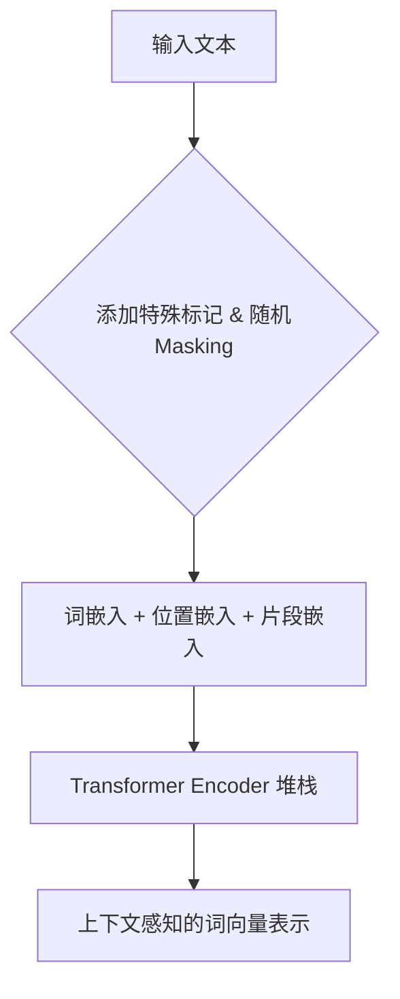
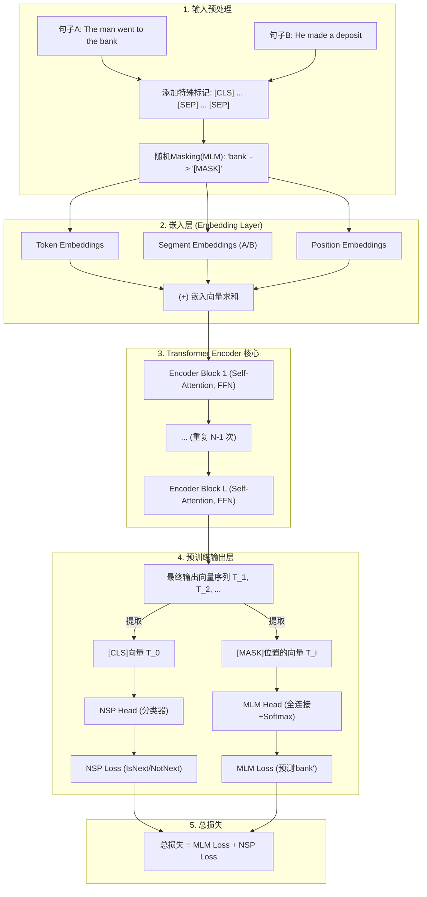

好的，同学！很高兴能以架构师和导师的身份，带你一起深入探索 BERT 这个在NLP领域具有里程碑意义的架构。我们将不仅仅是学习它的原理，更是要理解其背后的设计思想、权衡与演进。

让我们开始吧。

---

### **BERT模型：基于Transformer编码器的双向语言表示**

#### 1. **问题引入：从“单行道”到“信息立交桥”**

在BERT诞生之前，语言模型领域主要由两类“交通系统”主导：

*   **“单行道”系统 (Autoregressive Models, e.g., GPT):** 像GPT这样的模型，在处理文本时，就像在一条单行道上开车。它们在预测一个词时，只能看到它“身后”（左侧）的车辆（词语）。例如，在句子 "The child broke the ___" 中，为了预测空白处的词，GPT只能参考 "The child broke the"。这种单向性对于文本生成任务（续写故事、写邮件）非常出色，因为它模仿了我们说话和写作的方式。
    *   **痛点**: 对于需要通盘理解全文的任务，比如阅读理解或情感分析，这就好比一个侦探只看了案卷的前半部分就试图破案。对句子 "The man went to the bank to deposit money" 中的 "bank" 一词，如果只看左侧，我们很难确定它是“银行”还是“河岸”。

*   **“浅层双向”系统 (e.g., ELMo):** 这类模型尝试解决单向问题，它们会分别从左到右和从右到左处理两次文本，然后将两个方向的信息拼接起来。这就像派两辆车分别从道路两头出发，在中点汇合交换信息。
    *   **痛点**: 这种“拼接式”的双向理解是浅层的。两个方向的信息没有在模型的每一层进行深度融合。就好比两个侦探独立工作，最后才碰头，而不是从一开始就共享线索、共同推理。

**核心架构挑战**: 如何设计一个模型，能在一开始就构建一个“信息立交桥”，让句子中任意两个词之间的信息都能自由、深度地双向流通，从而获得对整个句子真正全局、深度的理解？

#### 2. **核心目标与类比：打造一座“语言理解中心”**

**设计核心目标**: 构建一个**深度双向**的语言表示模型。这个模型的核心使命不是“创造”语言（生成），而是“理解”语言（表示）。它应该能产出一种高质量的“上下文感知词向量”，其中每个词的向量都蕴含了整个句子的语境信息。

**架构类比：一位语言学侦探**

想象一下，我们的模型是一位顶级的语言学侦探，正在分析一条复杂的线索（一个句子）。

*   **旧方法（GPT/ELMo）**: 就像一个按部就班的初级侦探，要么严格按时间顺序（从左到右）阅读线索，要么分派两个人从两头读，最后再汇总。
*   **BERT的设计哲学**: 这位顶级侦探会将所有线索（词语）都铺在一张大桌子上。他会同时审视所有词语，反复交叉比对。他会拿起第一个词，看看它和第五个词、第三个词的关系；再拿起第五个词，看看它和第一个、第二个词的关系。**这种任意词语之间都能直接“对话”的能力，就是BERT架构设计的精髓**。它的目标不是续写线索，而是彻底搞懂这条线索到底是什么意思。

#### 3. **最小示例 (核心组件图)**

要实现这位“侦探”的能力，其核心架构其实非常简洁，它**只采用了Transformer的“编码器”部分**。

**解说**:
*   **输入文本**: 待理解的句子。
*   **Masking**: 这是BERT的“训练魔法”，我们稍后详谈。它通过“挖空”来强迫模型学习上下文。
*   **嵌入层**: 将文本转换为机器能理解的数字，并附加位置和句子归属信息。
*   **Transformer Encoder 堆栈**: 这是架构的核心，是真正的“语言理解中心”。内部的自注意力机制（Self-Attention）就是那张可以让所有词语自由对话的“大桌子”。
*   **输出**: 模型对每个输入词语的深度理解结果，即上下文感知的向量。

#### 4. **原理剖析 (详细设计与权衡)**

现在，我们深入设计细节，看看BERT是如何通过几个关键决策实现其目标的。

**设计决策一：只用编码器，不用解码器 (Encoder-Only Architecture)**

*   **职责**: Transformer编码器的核心是**自注意力机制**，它允许输入序列中的每个位置都能关注到序列中的所有其他位置。这天然就是一种“全知”的视角，是实现深度双向的完美工具。
*   **接口**: 输入是一整个序列的向量，输出是同样长度、但每个向量都融合了全局上下文信息的新序列向量。
*   **权衡 (Trade-off)**:
    *   **得到**: 强大的、深度的双向上下文理解能力。模型在处理任何一个词时，都能无障碍地同时利用其左侧和右侧的所有信息。
    *   **舍弃**: 自回归（Autoregressive）的生成能力。因为解码器中用于防止“未来信息泄露”的掩码（Masked Self-Attention）被移除了，所以BERT不适合像GPT那样逐词生成文本。这是一个明确的设计选择：**用生成能力换取顶级的理解能力**。

**设计决策二：创新的预训练任务 (Pre-training Tasks)**

既然模型能看到整个句子，我们如何训练它呢？如果直接让它预测下一个词，它会“作弊”（因为输入里已经包含了答案）。为此，BERT的设计者提出了两个巧妙的“自监督学习”任务，作为模型的训练考题。

1.  **蒙面语言模型 (Masked Language Model, MLM)**
    *   **设计**: 随机选择输入句子中 15% 的词元（Token）进行预测。为了避免预训练与微调阶段的不匹配，这里采用了一个更精巧的策略：在被选中的15%词元中，有80%的概率被替换为 `[MASK]` 标记，有10%的概率被替换为另一个随机词元，剩下的10%则保持原样。然后，模型的目标是预测这些位置的原始词元。这就像做“完形填空”题。
    *   **示例**: `My dog is [MASK].` -> 模型需要预测 `[MASK]` 是 `hairy`。
    *   **数学视角**: 我们的目标是最小化被遮盖词元的预测损失，通常是交叉熵损失。
        $$
        \mathcal{L}_{MLM} = -\sum_{i \in M} \log p(t_i | T_{\setminus M})
        $$
        其中：
        - $M$：被mask的词元索引集合。
        - $T_{\setminus M}$：未被mask的词元集合（即上下文）。
        - $t_i$：在位置 $i$ 上的原始真实词元。
    *   **为什么有效**: 这个任务强迫模型**必须依赖被遮盖词左右两侧的上下文**来做出准确预测，从而学会融合双向信息，理解深层语义。这是实现双向性的关键所在。

2.  **下一句预测 (Next Sentence Prediction, NSP)**
    *   **设计**: 给模型一对句子（A和B），让它判断句子B是否是句子A在原文中的下一句。为此，输入会加入特殊标记：`[CLS] a dog ... [SEP] a cat ... [SEP]`。模型需要基于 `[CLS]` 标记的最终输出向量来做二分类判断（IsNext / NotNext）。
    *   **目的**: 让模型学习句子间的关系，这对于问答（Question Answering）、自然语言推断（NLI）等需要理解句子对逻辑的任务至关重要。
    *   **权衡**: NSP的设计在当时看来非常合理，但后来的研究（如RoBERTa）发现，这个任务可能不如想象中那么有效，甚至移除它并专注于MLM能在某些基准上取得更好的效果。这是架构设计中一个典型的“事后认知”案例。

**详细架构流程图**

#### 5. **架构师避坑指南：常见的设计陷阱 (Anti-Patterns)**

作为架构师，识别并避免反模式至关重要。

*   **反模式一：将BERT用于开放式文本生成。**
    *   **误区**: 认为BERT既然能“预测”被遮盖的词，就一定能像GPT一样写诗、写故事。
    *   **为什么是错的**: BERT的训练方式和架构（非自回归）是为“填空”优化的，不是为“续写”优化的。强行用它生成长文本，结果往往不连贯且质量低下。这是一个典型的“用错了工具”的例子。

*   **反模式二：忽略 `[CLS]` 和 `[SEP]` 特殊标记的用途。**
    *   **误区**: 在处理单句分类任务时，随意取用词向量的平均值，而不是专门设计的 `[CLS]` 向量。
    *   **为什么是错的**: BERT在预训练时，NSP任务专门训练了 `[CLS]` 标记的输出向量来聚合整个输入序列对的全局信息，使其成为一个天然的、高质量的“句子/句对”的向量表示。忽略它等于浪费了模型精心学习到的能力。

*   **反模式三：认为BERT的“双向”是指像Bi-LSTM那样处理两次。**
    *   **误区**: 混淆了“浅层拼接双向”和“深度融合双向”。
    *   **为什么是错的**: BERT的“双向”是根本性的。在每一层Transformer Encoder里，任何一个词都可以直接与所有其他词进行信息交互。这种交互是深度的、贯穿整个模型网络的，远比简单拼接两个单向模型的结果要强大。

#### 6. **拓展应用 (演进路线)**

一个优秀的架构应该具备良好的演进能力。BERT的发布开启了一个“BERTology”时代，后续模型都是在其核心设计思想上的改进和演化。

*   **V1.0: BERT (Base, Large)**
    *   奠定了“Encoder-Only + MLM”的范式。

*   **V2.0: 优化预训练策略 (RoBERTa, ALBERT)**
    *   **RoBERTa**: 成为了一位更专注、更勤奋的“侦探”。它**移除了NSP任务**（发现其弊大于利），采用**动态Masking**（每次训练时随机mask，而不是预处理时固定），并使用了**巨量的训练数据**和更长的训练时间。这是对训练策略的精炼。
    *   **ALBERT**: 关注“降本增效”。通过**跨层参数共享**（所有Encoder层共享一套参数）和**嵌入层参数分解**，极大地减少了模型参数量，使得模型更轻量。这是对模型结构本身的优化。

*   **V3.0: 适配特定任务与场景 (DistilBERT, SpanBERT)**
    *   **DistilBERT**: 面向“边缘计算/低延迟”场景。通过**知识蒸馏**技术，用一个大的BERT老师模型来“教”一个小的学生模型，保留了97%的性能，但速度提升了60%。
    *   **SpanBERT**: 针对“抽取式问答”等需要理解片段（Span）的任务。它修改了MLM任务，不再mask单个词，而是mask连续的词片段（Span），并训练模型通过片段边界的词来预测整个片段的内容。

这个演进路线清晰地展示了架构优化的方向：从改进训练目标，到优化模型效率，再到为特定下游任务定制化设计。

#### 7. **总结要点**

让我们回顾一下BERT架构设计的核心原则与关键决策：

*   **核心原则1：深度双向表示是理解语言的关键。** 为了实现真正的语境理解，模型必须能够在每一层都无障碍地融合来自左右两侧的信息。
*   **核心原则2：自监督学习是释放大模型潜力的钥匙。** 通过巧妙设计的MLM（完形填空）任务，BERT可以在无标注的的海量文本上进行预训练，学习通用的语言知识。
*   **关键决策1：采用Transformer编码器-Only架构。** 这是一个战略性的权衡，放弃了生成能力，换取了无与伦比的上下文理解能力。
*   **关键决策2：完美适配并普及“预训练-微调”范式。** BERT的架构完美地服务于这一模式：通过MLM等任务在海量文本上预训练，学习通用的语言表示；然后针对下游任务，仅需添加一个简单的输出层进行微调。BERT的巨大成功极大地推动了该范式的广泛应用。

#### 8. **思考与自测**

现在，轮到你了，未来的架构师。请思考这个问题：

**如果新的业务需求是处理超长文档（例如，一篇数千字的法律合同或医疗报告）的分类任务，现有BERT架构的哪个部分最需要修改？为什么？**

> **引导性提示**: 想想我们之前讨论的Transformer Encoder的核心组件，它的计算复杂度和什么有关？当输入序列变得非常长时，会发生什么？

期待你的思考！通过这样的练习，你将能更深刻地理解架构设计的约束与演进之道。

---
**参考资料 (References)**:

1.  Devlin, J., Chang, M. W., Lee, K., & Toutanova, K. (2018). BERT: Pre-training of Deep Bidirectional Transformers for Language Understanding. *arXiv preprint arXiv:1810.04805*.
2.  Liu, Y., Ott, M., Goyal, N., Du, J., Joshi, M., Chen, D., ... & Stoyanov, V. (2019). RoBERTa: A Robustly Optimized BERT Pretraining Approach. *arXiv preprint arXiv:1907.11692*.
3.  Vaswani, A., Shazeer, N., Parmar, N., Uszkoreit, J., Jones, L., Gomez, A. N., ... & Polosukhin, I. (2017). Attention is all you need. *Advances in neural information processing systems*, 30.