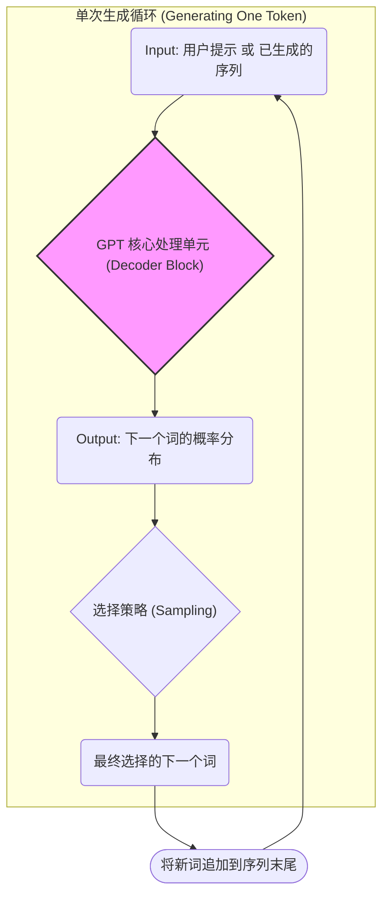
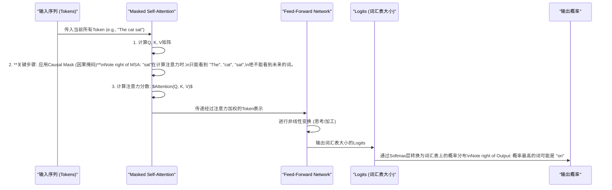

在深入探讨了BERT如何理解语言之后，我们现在将视角转向语言的创造。本文将解构驱动现代内容生成系统的核心架构——GPT。

想象一下，我们不再是分析已有的文本，而是要从零开始，构建一个能写诗、编故事、写代码的“语言生成”系统。这就是GPT系列模型的设计初衷。

现在，让我们以架构师的身份，一步步解构和设计这个系统。

---

### 1. 问题引入

我们的业务场景非常明确：需要一个能够根据用户给出的“引子”（Prompt），自动生成连贯、相关、有创造性的后续文本的AI模型。

**业务痛点:**

*   **上下文连贯性:** 生成的文本不能是零散词语的堆砌，必须前后呼应，逻辑通顺。一个能写出“天空是蓝色的，因为我喜欢吃披萨”的模型是不可接受的。
*   **生成灵活性:** 模型需要能处理各种生成任务，从简单的问答、总结，到复杂的创意写作和代码生成，而不是为每个任务都设计一个独立的模型。
*   **知识的广度:** 模型必须具备海量的世界知识，才能言之有物，而不是胡编乱造。

传统的马尔可夫链或RNN模型在处理长距离依赖和知识广度上都力不从心。BERT虽然强大，但它的设计目标是“完形填空”，而非“续写文章”。我们需要一个全新的架构。

### 2. 核心目标与类比

**设计核心目标:** 构建一个**单向**、**上下文感知**的**序列生成器**。

*   **单向 (Unidirectional):** 就像我们说话或写作一样，模型在生成第 N 个词时，只能看到前面的 N-1 个词，绝不能“偷看”未来的内容。这在架构上被称为**自回归 (Autoregressive)**。
*   **上下文感知 (Context-Aware):** 模型必须拥有强大的记忆力，能够“记住”并理解前面已经生成的所有内容，以确保新内容的连贯性。
*   **序列生成器 (Sequence Generator):** 其根本任务是预测序列中的下一个元素。

**架构类比：一位小说家**

让我们把GPT架构想象成一位正在创作小说的作家。

*   **大脑中的知识库 (预训练权重):** 这位作家通过阅读海量书籍（维基百科、小说、新闻），掌握了语法、事实、风格和叙事结构。这是模型的“预训练”阶段。
*   **稿纸上已有的文字 (输入序列/Context):** 作家在写下每一个新词时，都会回顾稿纸上已经写下的所有句子和段落。
*   **“下一个词”的灵感 (预测过程):** 基于已有的文字和大脑中的知识，作家的脑海中会涌现出几个最可能的下一个词，并选择其中一个下笔。然后，这个新词就成了新的“上下文”，继续这个创作过程。

这个过程是严格**从左到右、不可逆转**的，完美诠释了自回归生成的核心思想。

### 3. 最小示例 (核心组件图)

要实现这位“小说家”的工作流，我们的架构需要一个核心的“思考单元”。这个单元接收当前的文稿，并产出下一个最可能的词。这个过程会不断循环。

这是一个最简化的核心组件流程图：

这个图展示了自回归的本质：**模型的输出，成为了下一次迭代的输入**。这个循环不断进行，直到生成结束符或达到预设长度。

### 4. 原理剖析 (详细设计与权衡)

现在，我们打开那个黑盒子——`GPT 核心处理单元`，看看内部的精巧设计。GPT做了一个大胆而优雅的决策：**它只使用了Transformer架构中的解码器（Decoder）部分**。

#### 4.1 核心组件：Decoder-Only 架构

为什么只用解码器？因为原始Transformer的解码器天生就是为自回归任务设计的。它包含两个关键子组件：

1.  **Masked Self-Attention (带掩码的自注意力机制)**
2.  **Feed-Forward Network (前馈神经网络)**

让我们深入这两个组件的设计。

#### 4.2 关键设计：Masked Self-Attention

这是GPT架构的灵魂。标准的自注意力机制允许序列中的每个词都关注其他所有词，是**双向**的。但这违背了我们“不能偷看未来”的单向生成原则。

**设计决策：** 引入一个“掩码”（Mask）。

这个掩码是一个上三角矩阵，在计算注意力分数时，它会强制将所有未来位置的分数设为一个极大的负数（例如 `-∞`）。

$Attention(Q, K, V) = softmax(\frac{QK^T}{\sqrt{d_k}} + M)V$

*   $M$ 就是我们的掩码矩阵。
*   经过 `softmax` 函数后，这些被掩盖位置的权重就变成了0。

**效果：** 确保了在位置 `i` 的词，其表示只能由位置 `1` 到 `i` 的词来计算，而与位置 `i+1` 及之后的词无关。这就从架构上保证了模型的**因果性 (Causality)**。

#### 4.3 设计权衡 (Trade-offs)

*   **Decoder-Only vs. Encoder-Decoder (如T5, BART):**
    *   **优势:** 架构更简洁，训练目标统一（就是预测下一个词），非常适合纯文本生成任务。
    *   **劣势:** 对于需要深度理解输入（如翻译、摘要）的任务，没有一个专门的编码器来首先“消化”源文本，可能会稍显逊色。它必须在生成的过程中同时“理解”和“创作”。

*   **自回归 vs. 非自回归 (如BERT):**
    *   **优势:** 生成的文本质量高，连贯性强，因为每个词都是在充分考虑了前面所有上下文后生成的。
    *   **劣势:** **生成速度慢**。因为下一个词的生成依赖于上一个词的完成，这个过程是串行的，难以并行化，导致推理延迟较高。

### 5. 常见误区 (反模式)

在理解或应用GPT架构时，要警惕以下几个常见的“反模式”：

1.  **将GPT与BERT混淆：**
    *   **误区:** 认为GPT也能像BERT一样，对输入文本进行完美的双向理解。
    *   **真相:** GPT是**单向**的。对于一个句子 "The cat sat on the mat"，在预测 "on" 之后的词时，它对 "The, cat, sat, on" 有深刻理解，但对 "the, mat" 是一无所知的。这使得它天然不适合做“完形填空”这类任务。

2.  **在训练中忘记使用掩码：**
    *   **误区:** 在训练时，允许模型看到整个句子来预测每个位置的词。
    *   **真相:** 这是一种“数据泄露”。模型会轻易地学会“抄袭”下一个词，而不是学习如何“预测”。这样的模型在实际生成时，因为看不到未来，效果会一塌糊涂。

3.  **认为生成任务只能用GPT：**
    *   **误区:** 所有的文本生成任务都应该首选GPT架构。
    *   **真相:** 对于那些对输入有强约束的生成任务（如文本翻译、摘要），一个带有编码器的架构（如T5或BART）可能通过先对源文本进行深度编码而获得更好的效果。架构选择要视具体任务而定。

### 6. 拓展应用 (演进路线)

GPT的架构设计展现了惊人的可扩展性（Scalability）。它的演进路线清晰地证明了“大力出奇迹”的有效性。

*   **v1.0 (GPT-1):**
    *   **核心贡献:** 验证了“Decoder-Only预训练 + 任务特定微调”范式的可行性。证明了生成式预训练是捕获世界知识的有效途径。

*   **v2.0 (GPT-2):**
    *   **演进方向:** **规模化**。通过使用更多的数据和显著增加模型参数（从117M到1.5B），GPT-2展示了惊人的**零样本 (Zero-shot)** 能力。无需微调，仅通过设计不同的“引子”（Prompt），模型就能完成阅读理解、翻译、摘要等多种任务。

*   **v3.0 (GPT-3):**
    *   **演进方向:** **极致规模化与范式革新**。参数量再次跃升至175B。催生了**情境学习 (In-context Learning)** 的新范式。你可以在Prompt中给出几个示例（Few-shot），模型就能“领悟”你的意图并完成任务，进一步摆脱了对微调的依赖。

*   **v4.0 (GPT-4及未来):**
    *   **演进方向:** **多模态 (Multi-modality)**。架构的核心思想（自回归预测下一个元素）被证明可以扩展到文本之外。通过将图像、声音等也“Token化”，模型可以实现对多模态输入的理解和生成，变得更像一个通用的世界模型。

### 7. 总结要点

作为架构师，我们需要从GPT的设计中提炼出以下核心原则：

1.  **架构服务于目标:** 为了“生成”，选择了最适合自回归任务的 **Decoder-Only** 架构。
2.  **机制保证约束:** 通过 **Masked Self-Attention** 机制，在架构层面强制实现了“不能预知未来”的因果约束。
3.  **统一的预训练目标:** “预测下一个词”这个看似简单的目标，被证明是学习世界知识和语言结构的极其有效的方法。
4.  **规模化的力量:** GPT系列的成功雄辩地证明了，当架构设计正确时，增加数据和模型参数可以带来质变，涌现出新的能力。

### 8. 思考与自测

现在，轮到你了。作为一个正在评估此架构的架构师，请思考以下问题：

**“如果我们的业务需求中，增加了一个对‘实时对话机器人’的超低延迟要求（例如，每次响应必须在100毫秒内完成），现有GPT架构的哪个部分会成为最大的性能瓶颈？我们应该从哪个方向去探索架构优化方案？”**

> **提示：** 思考一下我们在“设计权衡”中讨论过的自回归模型的固有特性。

---
**参考文献**
1.  Radford, A., Narasimhan, K., Salimans, T., & Sutskever, I. (2018). *Improving Language Understanding by Generative Pre-Training*.
2.  Radford, A., Wu, J., Child, R., Luan, D., Amodei, D., & Sutskever, I. (2019). *Language Models are Unsupervised Multitask Learners*.
3.  Brown, T. B., Mann, B., Ryder, N., et al. (2020). *Language Models are Few-Shot Learners*. arXiv:2005.14165.
