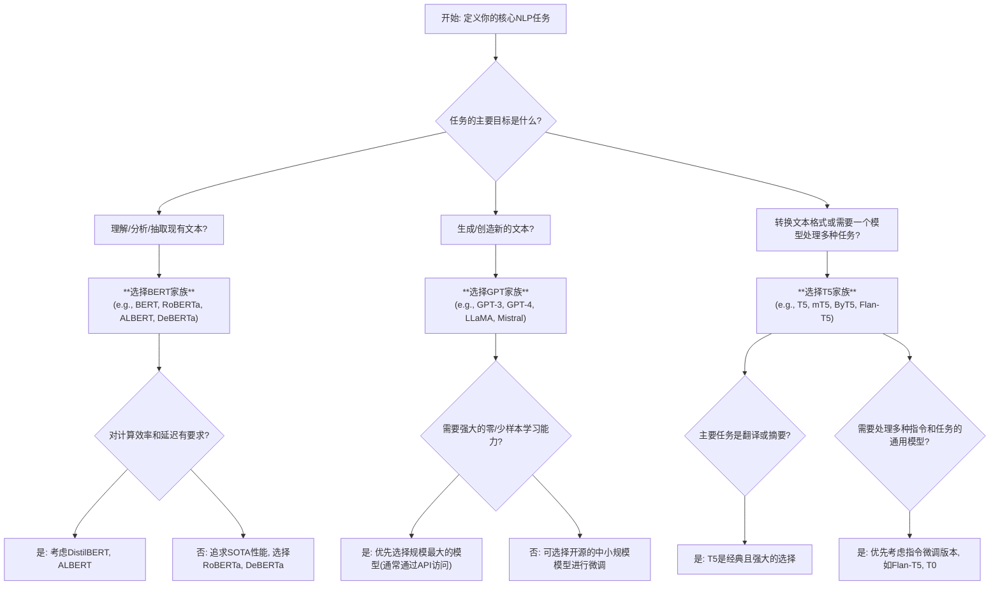

好的，作为一位资深的分析师和老师，我将为你构建一个清晰的比较框架，深入剖析BERT、GPT和T5这三大预训练模型家族的架构差异与适用场景。我们将严格遵循分析的逻辑，为专家级读者提供一个有深度、有洞见的选型指南。

***

### 模型家族对比：BERT、GPT与T5的架构与应用场景差异

#### 1. 问题引入

在复杂的自然语言处理项目中，我们经常面临一个关键的起点决策：“我的任务是文本情感分析/摘要生成/多任务问答，现有BERT、GPT和T5这三大主流模型家族，它们都基于Transformer，但架构和预训练目标各不相同。**为了最大化任务性能、最小化研发成本，我应该选择哪个作为我的基础模型？**” 这个问题不仅关乎最终效果，更直接影响到后续的微调策略、计算资源需求和技术栈的构建。

#### 2. 核心定义与类比

在深入技术细节之前，我们先为这三个模型家族建立一个高层次的认知。它们都是Transformer架构的杰出变体，但侧重点截然不同。

*   **BERT (Bidirectional Encoder Representations from Transformers):** 专注于 **深度理解**。它通过Transformer的编码器（Encoder）部分，在预训练阶段通过掩码语言模型（MLM）任务学习双向上下文表示。
*   **GPT (Generative Pre-trained Transformer):** 专注于 **流畅生成**。它利用Transformer的解码器（Decoder）部分，在预训练阶段通过标准的自回归语言模型任务，从左到右预测下一个词。
*   **T5 (Text-to-Text Transfer Transformer):** 专注于 **框架统一**。它采用完整的Encoder-Decoder架构，将所有NLP任务都转化为一种“文本到文本”的格式，实现了前所未有的灵活性和泛化能力。

**一个恰当的类比：**
将这三者比作不同领域的专家：
*   **BERT是位语言学家/侦探**：他能仔细审阅一段完整的文本，通过上下文的蛛丝马迹，精准理解每个词的确切含义和句子结构。他擅长分析和解读，但不擅长创作新篇章。
*   **GPT是位小说家/演说家**：他基于开头，能够文思泉涌、滔滔不绝地创作出连贯、优美的段落。他擅长从无到有地生成内容，但对给定文本的深度双向分析并非其核心设计。
*   **T5是位全能顾问/翻译家**：他能听懂任何一种“问题语言”（例如，“请总结这段文字”），并将其“翻译”成“答案语言”。他致力于建立一种通用的解决范式，能胜任多种角色，从分析到生成再到转换。

#### 3. 最小示例 (快速感受)

为了直观感受三者的工作模式差异，我们看一个简单的“填空”任务：

**输入上下文：** `The movie was incredibly exciting, the plot was captivating, and the acting was [?]`

*   **BERT的视角 (填空式理解):**
    *   **输入处理:** `... the acting was [MASK].`
    *   **核心任务:** 预测`[MASK]`位置最可能的词。
    *   **典型输出:** `superb`, `excellent`, `outstanding`.
    *   **解读:** BERT同时看到了`[MASK]`前后的内容，做出了最符合上下文语境的推断。

*   **GPT的视角 (续写式生成):**
    *   **输入处理:** `... the acting was`
    *   **核心任务:** 预测下一个词是什么。
    *   **典型输出:** ` superb. I would highly recommend it to anyone who loves action films.`
    *   **解读:** GPT根据前面的文本，自回归地生成了后续内容，它不仅填了“空”，还延续了整个语篇。

*   **T5的视角 (任务式转换):**
    *   **输入处理:** `fill mask: The movie was incredibly exciting, the plot was captivating, and the acting was <extra_id_0>.`
    *   **核心任务:** 将带有任务指令的输入文本，转换为包含答案的输出文本。
    *   **典型输出:** `<extra_id_0> superb <extra_id_1>`
    *   **解读:** T5将填空任务本身也编码为文本，通过其通用的Seq2Seq框架解决。这种模式使其能处理几乎任何可以被表述为文本转换的任务。

#### 4. 原理剖析 (深入对比)

以下表格从关键维度对三大模型家族进行系统性比较。

| 维度 (Dimension) | BERT (Encoder-Only) | GPT (Decoder-Only) | T5 (Encoder-Decoder) |
| :--- | :--- | :--- | :--- |
| **核心架构** (Core Architecture) | Transformer Encoder 栈 | Transformer Decoder 栈 | 完整的 Transformer Encoder-Decoder |
| **预训练任务** (Pre-training Task) | 掩码语言模型 (MLM) & 下一句预测 (NSP) | 因果/自回归语言模型 (Causal LM) | 掩码跨度去噪 (Masked Span Denoising) |
| **信息流** (Information Flow) | **双向 (Bidirectional)**：每个词的表示都融合了左右两侧的全部上下文信息。 | **单向 (Unidirectional/Autoregressive)**：每个词的表示仅依赖于其左侧的上下文。 | **混合式**：编码器内部双向，解码器内部单向，通过交叉注意力连接。 |
| **设计哲学** (Design Philosophy) | 成为强大的**通用语义表示提取器**，为下游NLU任务服务。 | 成为一个强大的**无条件/有条件文本生成器**。 | **统一所有NLP任务**于一个灵活的Text-to-Text框架之下。 |
| **微调范式** (Fine-tuning Paradigm) | 在`[CLS]` token上附加一个分类头，或针对token级别任务进行调整。 | 作为Zero-shot/Few-shot学习器，或进行传统的生成任务微调。 | 在输入前添加**任务前缀**（如`summarize:`, `translate English to German:`）。 |
| **擅长任务类型** (Best for Task Types) | **自然语言理解 (NLU)**：文本分类、情感分析、命名实体识别(NER)、句子关系判断。 | **自然语言生成 (NLG)**：文章写作、对话系统、代码生成、创意内容创作。 | **转换与多任务**：摘要、翻译、问答(QA)，以及需要一个模型处理多种不同任务的场景。 |
| **评估指标侧重** (Evaluation Metric Focus) | **分类/抽取精度**：GLUE/SuperGLUE score, F1-Score (SQuAD), Accuracy。 | **生成质量**：Perplexity, BLEU, ROUGE, METEOR, 人工评估。 | **任务特定指标**：在各大基准（如GLUE, SQuAD, XSum）上都表现出色，评估指标取决于具体任务。 |

#### 5. 常见误区

1.  **误区：“Encoder-Decoder (T5) 架构最完整，因此总是最优选择。”**
    *   **分析：** 并非如此。对于纯粹的NLU任务（如文本分类），BERT-style模型的架构更为直接且高效。Encoder-Decoder架构的计算开销更大，其解码器部分对于一个简单的分类任务来说是冗余的。架构与任务的匹配度（Architectural-Task Fit）比架构的完备性更重要。

2.  **误区：“GPT模型参数量巨大，因此在所有任务上都优于BERT。”**
    *   **分析：** 参数量与性能正相关，但任务特异性是关键。GPT的巨大参数量主要服务于其强大的生成和上下文学习能力。对于需要深度双向理解的判别式任务，一个精调的RoBERTa或DeBERTa（BERT的改进版）模型，在特定数据集上往往能以更小的参数量达到甚至超越GPT的效果。

3.  **误区：“T5的Text-to-Text范式只是对输入格式做了调整，本质没变。”**
    *   **分析：** 这是一个底层范式的转变。通过将所有任务统一，T5使得模型可以在预训练阶段从多种任务的混合数据中学习，极大地增强了其泛化和迁移能力。这种“元学习”（learning to perform tasks）的能力，是其与专门为单一任务类型设计的BERT/GPT的核心区别。

#### 6. 拓展应用 (选型决策树)

为了帮助您在实际项目中做出选择，这里提供一个简化的决策流程图。

#### 7. 总结要点

*   **选择BERT，当你需要一个“阅读理解”专家时**：你的任务是**分类、命名实体识别、情感分析、句子对关系判断**等，需要模型对输入文本有深刻、精准的双向语境理解。
*   **选择GPT，当你需要一个“创意写手”时**：你的任务是**内容生成、对话机器人、代码补全、创意写作**，需要模型能够流畅、连贯地生成新的文本序列。
*   **选择T5，当你需要一个“瑞士军刀”时**：你的任务是**翻译、摘要、问答**等序列到序列的转换任务，或者你希望用一个统一的框架来处理多种截然不同的NLP任务，最大化模型的灵活性和迁移能力。

#### 8. 思考与自测

**问题：** 如果你的团队规模很小，但业务对特定任务的**性能要求极高**（例如，在金融领域的合同关键信息抽取任务），你会选择哪个模型家族作为起点？为什么？

**分析思路：**

这个问题融合了资源限制（小团队）和性能要求（极高）。答案并非唯一，需要辩证看待：

1.  **首选路径：BERT家族 (如RoBERTa或DeBERTa)。**
    *   **为什么？**
        *   **任务匹配度高：** “关键信息抽取”本质上是一个NLU任务（类似于命名实体识别或SQuAD式的问答），这正是BERT架构的优势领域。
        *   **生态成熟：** Hugging Face等社区为BERT家族提供了海量的预训练模型、微调脚本和详尽的教程。小团队可以快速上手，站在巨人的肩膀上，而无需从零开始。
        *   **资源可控：** 微调一个BERT-base或BERT-large模型的成本远低于从头训练或微调一个大型GPT/T5模型。对于小团队而言，这是非常现实的考量。
        *   **性能卓越：** 在许多NLU基准测试中，经过精调的、针对性的BERT变体仍然是SOTA或接近SOTA的选择。

2.  **备选路径：T5家族。**
    *   **为什么？** 如果“关键信息抽取”可以被清晰地表述为一个问答或文本生成问题（例如，输入合同文本，输出“甲方：XXX，乙方：YYY”），T5的Text-to-Text范式也能胜任，并且可能在某些方面更灵活。然而，其微调的复杂度和资源需求通常会略高于BERT。

3.  **通常不选的路径：GPT家族。**
    *   **为什么？** 虽然可以通过精心设计的prompt让大型GPT模型完成抽取任务（in-context learning），但对于要求“极高”且稳定的生产环境性能，依赖prompt的稳定性和可重复性通常不如直接对模型进行有监督微调。此外，为抽取任务微调GPT模型在架构上并非最优解。

**结论：** 对于这个场景，最明智、风险最低且性能可期的选择是，从一个强大的**BERT变体（如DeBERTa）**开始，利用成熟的开源生态进行领域自适应和任务微调。

***
#### 参考资料
1.  Devlin, J., Chang, M. W., Lee, K., & Toutanova, K. (2018). BERT: Pre-training of Deep Bidirectional Transformers for Language Understanding. *arXiv preprint arXiv:1810.04805*.
2.  Radford, A., Narasimhan, K., Salimans, T., & Sutskever, I. (2018). *Improving Language Understanding by Generative Pre-Training*. OpenAI.
3.  Raffel, C., Shazeer, N., Roberts, A., Lee, K., Narang, S., Matena, M., ... & Liu, P. J. (2019). Exploring the Limits of Transfer Learning with a Unified Text-to-Text Transformer. *arXiv preprint arXiv:1910.10683*.
