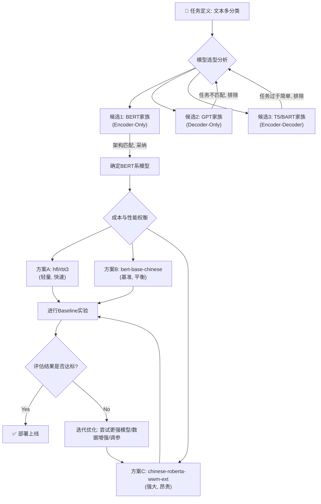

好的，我们现在开始。作为一名在AI浪潮中摸爬滚打多年的实践者，我将带你穿越回一个真实的项目场景。在这个故事里，你不仅是旁观者，更是决策者。我们将一起剖析，在面对一个具体的业务难题时，如何像一位经验丰富的工匠，从琳琅满目的预训练模型库中，挑选出最趁手的那件工具，并将其打磨得锋利无比。

---

### **案例分析：为下游任务选择并微调合适的预训练模型**

#### 1. 问题引入 (故事背景)

故事发生在我们合作的一家快速发展的电商公司，“云尚优品”。随着业务量的激增，他们的客户服务中心每天都会被成千上万条用户工单淹没。这些工单内容五花八门，从“我的订单到哪了？”（物流查询）到“这个商品的材质是什么？”（产品咨询），再到“申请退款流程好复杂”（售后投诉）。

**当时的挑战**：人工分拣工单效率低下，响应延迟导致客户满意度下滑。不同类型的问题需要转交给不同的专家团队，一旦分错，处理周期就会被无效拉长。

**我们的目标**：开发一个高精度的**工单自动分类系统**，准确率要求达到95%以上，将工单自动路由到正确的处理队列（例如：物流组、产品组、售后组、技术支持组）。

这个任务，本质上是一个典型的**多分类文本分类 (Multi-class Text Classification)** 问题。但与学术数据集不同，真实世界的用户语言充满了口语化、错别字、以及复杂的语境依赖。这，就是我们的战场。

#### 2. 核心方案与类比

在BERT、GPT等预训练模型（Pre-trained Models, PLMs）已经成为行业标准的时代，我们自然不会从零开始构建一个复杂的神经网络。我们的核心方案，就是 **“预训练-微调” (Pre-train & Fine-tune) 范式**。

**一个贴切的类比**：
想象一下，你要培养一位能处理“云尚优品”特定客户问题的专家。

*   **从零开始训练**：相当于找一个刚出生的婴儿，从教他识字、语法开始，直到他能理解电商业务。这个过程极其漫长且需要海量数据。
*   **使用预训练模型**：则像是直接聘请一位已经**精通人类语言（甚至是多种语言）、拥有丰富世界知识的大学毕业生（预训练阶段）**。他虽然不懂“云尚优品”的具体业务，但他已经具备了强大的语言理解和推理能力。
*   **微调 (Fine-tuning)**：我们只需要给他一本“云尚优品”的内部培训手册（我们标注好的少量业务数据），让他进行短暂的、高强度的岗前培训。他就能迅速将自己强大的通用语言能力，聚焦并适配到解决公司特定问题的能力上。

这个“大学毕业生”就是我们的预训练模型，而“岗前培训”就是微调过程。我们的任务，就是为“云尚优品”挑选最合适的“毕业生”，并设计最高效的“培训方案”。

#### 3. 最小示例 (关键代码/配置)

`include_code: true`

在正式展开我们的决策过程前，让我们先直观地感受一下“微调”这个动作在代码层面是多么简洁。假设我们已经选定了一个模型（比如 `hfl/rbt3`），并准备好了数据。使用Hugging Face `transformers` 库，核心的微调流程是这样的：

```python
# code_lang: python

from datasets import load_dataset
from transformers import (
    AutoTokenizer,
    AutoModelForSequenceClassification,
    TrainingArguments,
    Trainer
)

# 1. 加载预处理好的数据集 (假设已处理成Hugging Face Dataset格式)
# 数据集应包含 'text' 和 'label' 两列
dataset = load_dataset("csv", data_files={"train": "train.csv", "test": "test.csv"})

# 2. 加载分词器和模型
# 选择一个适合中文任务的BERT变体，例如HFL提供的轻量级模型RBT3
model_checkpoint = "hfl/rbt3"
tokenizer = AutoTokenizer.from_pretrained(model_checkpoint)
model = AutoModelForSequenceClassification.from_pretrained(
    model_checkpoint,
    num_labels=5  # 假设我们有5个工单类别
)

# 3. 数据预处理：将文本转换为模型输入的ID
def tokenize_function(examples):
    # padding=True 会将样本填充至当前批次的最长长度
    # truncation=True 与 max_length 配合确保输入不会超过模型能处理的最大长度
    return tokenizer(examples["text"], padding=True, truncation=True, max_length=512)

tokenized_datasets = dataset.map(tokenize_function, batched=True)

# 4. 设置训练参数
# 这里是微调策略的核心配置
training_args = TrainingArguments(
    output_dir="./results",          # 输出目录
    evaluation_strategy="epoch",     # 每个epoch结束后进行评估
    learning_rate=2e-5,              # 微调的关键：较小的学习率
    per_device_train_batch_size=16,
    per_device_eval_batch_size=16,
    num_train_epochs=3,              # 微调通常不需要太多epoch
    weight_decay=0.01,
    push_to_hub=False,
)

# 5. 初始化训练器并开始训练
trainer = Trainer(
    model=model,
    args=training_args,
    train_dataset=tokenized_datasets["train"],
    eval_dataset=tokenized_datasets["test"],
)

trainer.train()
```
这段代码几乎是所有基于Transformer的分类任务的“标准模板”。真正的挑战，在于如何做出 `model_checkpoint` 的选择，以及如何调整 `TrainingArguments` 中的超参数。

#### 4. 原理剖析 (方案执行与决策过程)

我们的决策过程并非一蹴而就，而是一个包含**假设、实验、评估、迭代**的循环。

`include_mermaid: true`
`diagram_types: ["flowchart"]`
`diagram_depth: "light"`



**决策之旅的关键节点：**

1.  **第一站：模型架构的选择 (BERT vs. GPT vs. T5)**
    *   **我们的思考**：任务是**理解**并**分类**给定的文本，而不是生成新文本。
    *   **GPT系列 (Decoder-Only)**：天生为“生成”而生，如同一个作家。让它做选择题（分类），虽然也能通过特定构造（如few-shot prompting）实现，但属于“杀鸡焉用牛刀”，且其自回归的单向注意力机制在理解整个句子上下文方面，理论上不如双向模型。**因此，排除GPT。**
    *   **T5/BART (Encoder-Decoder)**：这类模型是全能型选手，既能理解又能生成，非常适合摘要、翻译等Seq2Seq任务。但对于简单的分类任务，其Decoder部分是冗余的，会增加不必要的计算开销。**因此，暂时排除T5/BART。**
    *   **BERT系列 (Encoder-Only)**：其双向Transformer编码器架构，天生就是为了深度理解文本上下文而设计的。这与我们的分类任务（NLU - 自然语言理解）完美契合。**最终，我们将选型范围锁定在BERT及其变体上。**

2.  **第二站：具体模型的权衡 (Cost vs. Performance)**
    *   我们圈定了几个候选者：`hfl/rbt3`（轻量级，快速）、`bert-base-chinese`（标准版，基准）、`chinese-roberta-wwm-ext`（改进版，性能更强）。
    *   **策略**：**从最经济的方案开始，建立一个快速的Baseline。** 我们首先选择了 `hfl/rbt3`。为什么？因为它参数量少、推理速度快。如果它能满足95%的准确率要求，我们就能以最低的硬件成本和最快的响应时间完成项目。
    *   `include_case_snippets: true` **实验记录 Snippet 1 (Baseline)**:
        *   **模型**: `hfl/rbt3`
        *   **数据**: 20,000条标注工单
        *   **结果**: 验证集准确率 **92.8%**。
        *   **分析**: 速度很快，但对于一些模棱两可的case，比如“你们这个优惠券怎么用不了，是不是系统有问题？” 它很难区分是“售后问题”还是“技术支持”。模型理解的深度似乎不够。

3.  **第三站：性能瓶颈与模型升级**
    *   **决策**：92.8% 未达到95%的目标。此时我们有两个选择：一是进行复杂的数据增强和特征工程；二是直接升级到更强大的模型。考虑到预训练模型的强大能力，后者的ROI（投入产出比）通常更高。
    *   我们选择了 `chinese-roberta-wwm-ext`。RoBERTa相比原始BERT，在预训练阶段使用了更优的策略（如动态掩码、更大的批次），通常有更好的性能。WWM (Whole Word Masking) 对中文这种以词为单位的语言尤其有效。
    *   `include_case_snippets: true` **实验记录 Snippet 2 (模型升级)**:
        *   **模型**: `chinese-roberta-wwm-ext`
        *   **数据**: 同样20,000条标注工单
        *   **结果**: 验证集准确率 **95.6%**。
        *   **分析**: 成功达标！训练和推理时间约是`hfl/rbt3`的2-3倍，但在可接受范围内。模型在之前出错的模糊case上表现明显更好。

4.  **第四站：微调策略的精调**
    *   即使模型选对了，糟糕的微调策略也会毁掉一切。
    *   **学习率 (Learning Rate)**：这是最重要的超参数。对于微调，必须使用一个**非常小**的学习率（如`2e-5`到`5e-5`）。过大的学习率会破坏模型在预训练阶段学到的通用知识，造成“灾难性遗忘”。
    *   **训练轮次 (Epochs)**：微调不需要长时间训练。通常2-4个epochs就足够了。训练太久模型会开始在你的小数据集上过拟合。
    *   **批次大小 (Batch Size)**：在GPU显存允许的情况下，适当增大batch size有助于稳定训练。我们当时使用了16。

`include_eval_metrics: true`
**评估指标的审视**：除了总体准确率 (Accuracy)，我们还密切关注了**精确率 (Precision)**、**召回率 (Recall)** 和 **F1-Score**，特别是对于那些数量较少的类别（例如“技术支持”类工单）。这确保了模型不是通过“猜”大类来获得虚高的准确率，而是对每个类别都有良好的识别能力。

#### 5. 常见误区 (复盘与反思)

1.  **误区一：“模型越大越好”的迷信。**
    *   **反思**：如果我们一开始就直接上`hfl/chinese-roberta-wwm-ext-large`这样的大模型，可能确实能获得96%或更高的准确率。但与之对应的是数倍的训练成本和推理延迟。在95.6%已经满足业务需求的背景下，这种额外的投入是不必要的。**始终从满足需求的、最经济的模型开始迭代，是工程实践的重要原则。**

2.  **误区二：忽视数据质量，迷信模型能力。**
    *   **反思**：在项目初期，我们发现有大约5%的标注数据存在噪音（标签错误或文本质量差）。在清理了这部分数据后，即使是使用`hfl/rbt3`，其性能也从92.8%提升到了93.5%。**模型的上限由数据质量决定。高质量的数据能让一个中等大小的模型发挥出巨大潜力。**

3.  **误区三：微调时直接套用预训练的超参数。**
    *   **反思**：有同事曾尝试用预训练时常用的`1e-3`这种大学习率去微调，结果模型性能瞬间崩溃。必须牢记：微调是在“微调”，是在巨人肩膀上的小碎步，而不是大刀阔斧的重新训练。

#### 6. 拓展应用 (经验迁移)

`include_steps_checklist: true`

这个案例中沉淀下的方法论，可以迁移到几乎所有NLP任务中。以下是一个可复用的决策清单：

-   [x] **1. 定义任务性质**：是NLU（分类、实体识别）还是NLG（生成、摘要）？或是混合型任务？
-   [x] **2. 匹配模型架构**：
    -   NLU任务 → Encoder-Only (BERT, RoBERTa, ALBERT)
    -   NLG任务 → Decoder-Only (GPT系列)
    -   Seq2Seq任务 (翻译, 摘要) → Encoder-Decoder (T5, BART)
-   [x] **3. 确定资源/性能基线**：
    -   对延迟敏感/资源有限？→ 从蒸馏版/轻量级模型开始 (`hfl/rbt3`, DistilBERT)。
    -   追求最高性能？→ 直接上SOTA（State-of-the-art）的Base或Large模型。
    -   平衡考虑？→ 从被广泛验证的Base模型开始。
-   [x] **4. 建立Baseline实验**：使用选定的最简模型，快速跑通整个数据处理、训练、评估流程。
-   [x] **5. 迭代优化**：
    -   性能未达标？→ a. 检查数据质量；b. 尝试更强大的模型；c. 做针对性的数据增强。
    -   性能已达标？→ a. 尝试蒸馏模型以降低成本；b. 优化推理速度。
-   [x] **6. 精调微调策略**：重点关注学习率、训练轮次、优化器选择（如AdamW）。
-   [x] **7. 选择合适的评估指标**：针对业务痛点选择评估指标（如不平衡分类问题关注F1-score）。

#### 7. 总结要点

这个项目最终成功上线，将工单分拣的平均耗时从15分钟缩短到3秒，准确率稳定在95%以上，为“云尚优品”节省了大量人力成本。

回顾整个过程，成功的关键在于：

1.  **精准的任务-架构匹配**：我们从一开始就选择了最适合NLU任务的BERT家族，避免了在不合适的架构上浪费时间。
2.  **迭代式与成本意识**：我们没有盲目追求SOTA，而是从一个经济的Baseline出发，根据实际结果和业务需求，逐步、有目的地升级模型，实现了成本和性能的最佳平衡。
3.  **数据与模型并重**：我们认识到，高质量的数据和强大的模型是相辅相成的，两者共同决定了项目的上限。
4.  **科学的微调方法论**：遵循了微调的最佳实践（小学习率、少轮次），充分释放了预训练模型的潜力，而没有破坏它。

#### 8. 思考与自测

现在，轮到你了。

**问题**：假设在项目的第二步，你使用 `hfl/rbt3` 得到92.8%的准确率后，业务方突然提出，由于预算削减，无法提供更强的GPU资源来训练更强大的模型（例如`chinese-roberta-wwm-ext`），但95%的准确率目标不变。

**如果你是当时的项目负责人，在“模型无法升级”这个决策点上，你会规划接下来的哪三个步骤来尝试达成目标？为什么？**

---
`include_references: true`
**参考文献/推荐阅读:**
1.  Devlin, J., Chang, M. W., Lee, K., & Toutanover, K. (2018). Bert: Pre-training of deep bidirectional transformers for language understanding. *arXiv preprint arXiv:1810.04805*.
2.  Liu, Y., Ott, M., Goyal, N., Du, J., Joshi, M., Chen, D., ... & Stoyanov, V. (2019). Roberta: A robustly optimized bert pretraining approach. *arXiv preprint arXiv:1907.11692*.
3.  Sanh, V., Debut, L., Chaumond, J., & Wolf, T. (2019). DistilBERT, a distilled version of BERT: smaller, faster, cheaper and lighter. *arXiv preprint arXiv:1910.01108*.
4.  Hugging Face Transformers Documentation: [https://huggingface.co/docs/transformers](https://huggingface.co/docs/transformers)