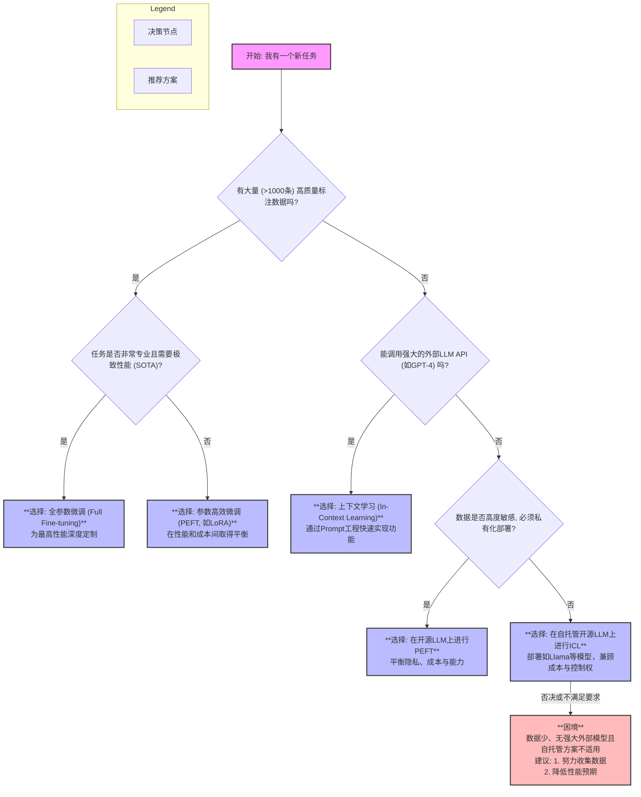

好的，作为一位资深的分析师和老师，我将为你构建一个清晰的比较框架，深入剖析从**微调（Fine-tuning）**到**上下文学习（In-Context Learning, ICL）**这一深刻的范式转变。我们将遵循指定的结构，由浅入深，为技术选型提供明智的指引。

---

### **范式转变：从微调到上下文学习（In-Context Learning）**

#### 1. **问题引入**

我手中有一个强大的预训练语言模型（PLM），现在需要让它来解决一个具体的业务问题，例如特定领域的情感分析、代码生成或法律文书摘要。在技术路径上，我面临一个关键的抉择：

*   **方案A：参数微调（Fine-tuning）**：这是过去几年PLM时代最成熟、最主流的范式。
*   **方案B：上下文学习（In-Context Learning, ICL）**：这是由GPT-3等大语言模型（LLM）开启的新范式，它不改变模型参数。

我应该如何选择？是沿用技术栈成熟的微调路径，将模型“改造”成一个专家？还是拥抱新兴的ICL范式，将模型“当作”一个可被即时指导的通才？它们各自的优劣和适用场景究竟是什么？

#### 2. **核心定义与类比**

在深入比较之前，我们先明确这两个核心概念。

*   **参数微调 (Fine-tuning)**：指在一个已经预训练好的模型基础上，使用特定任务的标注数据，通过反向传播和梯度下降来**更新模型的部分或全部权重**，使其适应新任务。
*   **上下文学习 (In-Context Learning, ICL)**：指在**不改变模型任何权重**的前提下，通过在模型的输入（即Prompt）中提供任务描述和少量示例（shots），让模型理解任务模式，并直接对新的查询进行推理。

**核心类比：** 我们可以将这两种范式比作**培养一名专家**。

*   **微调**就像是**送一位通识教育毕业生去读博士**。这位学生（预训练模型）有广泛的基础知识。通过几年的博士课程（微调数据集和训练过程），他的知识结构（模型权重）被深度重塑，最终成为特定领域的专家（例如，一位古生物学家）。他在此领域的表现无与伦比，但让他去处理金融问题，可能会水土不服。
*   **上下文学习**则像是**向一位经验丰富的资深顾问咨询**。这位顾问（大语言模型）拥有海量的跨领域知识和强大的推理能力。你不需要送他去读新学位，只需给他一份简报（Prompt），其中包含问题背景（任务描述）和几个成功案例（few-shots）。他能迅速领悟你的意图并解决问题。他能处理各种问题，但在某个极其细分的领域，可能不如那位专注的博士精确。

#### 3. **最小示例 (快速感受)**

让我们通过一个简单的情感分类任务，直观感受二者的区别。

##### 示例任务：判断电影评论的情感（积极/消极）

***

<details>
<summary>点击查看【代码示例】</summary>

```python
# ======================================================
# 方案A: 参数微调 (Fine-tuning) 示例
# 使用 Hugging Face Transformers 库
# ======================================================
import torch
from transformers import AutoTokenizer, AutoModelForSequenceClassification, Trainer, TrainingArguments
from datasets import Dataset

# 1. 准备微调数据 (通常需要成百上千条)
# (注意：实际应用中，微调通常需要至少数百条标注数据才能获得有意义的效果)
train_texts = ["This movie was fantastic!", "I would not recommend this film.", "A truly moving performance.", "The plot was predictable and boring."]
train_labels = [1, 0, 1, 0] # 1: 积极, 0: 消极

# 2. 创建数据集
train_dataset = Dataset.from_dict({"text": train_texts, "label": train_labels})

# 3. 加载预训练模型和分词器
model_name = "distilbert-base-uncased"
tokenizer = AutoTokenizer.from_pretrained(model_name)
model = AutoModelForSequenceClassification.from_pretrained(model_name, num_labels=2)

def tokenize_function(examples):
    return tokenizer(examples["text"], padding="max_length", truncation=True)

tokenized_train_dataset = train_dataset.map(tokenize_function, batched=True)

# 4. 定义训练参数并开始训练 (权重会在此过程更新)
training_args = TrainingArguments(
    output_dir="./results",
    num_train_epochs=1,
    per_device_train_batch_size=2,
    logging_dir='./logs',
)

trainer = Trainer(
    model=model,
    args=training_args,
    train_dataset=tokenized_train_dataset,
)

print("--- 开始微调模型 ---")
trainer.train()
print("--- 微调完成，模型权重已更新 ---")

# 5. 使用微调后的模型进行推理
new_review = "The acting was simply brilliant."
inputs = tokenizer(new_review, return_tensors="pt")
with torch.no_grad():
    logits = model(**inputs).logits
predicted_class_id = logits.argmax().item()
print(f"新评论: '{new_review}'\n预测情感: {'积极' if predicted_class_id == 1 else '消极'}")


# ======================================================
# 方案B: 上下文学习 (In-Context Learning) 示例
# 使用 OpenAI API (或其他大型语言模型)
# ======================================================
from openai import OpenAI # New import for openai >= 1.0

# 0. 初始化OpenAI客户端 (请替换为您的API密钥)
client = OpenAI(api_key="YOUR_API_KEY") 

# 1. 构造Prompt，包含任务描述和少量示例 (Few-shots)
# 模型权重保持不变。对于Chat Completion API，Prompt以消息列表格式构造。
messages = [
    {"role": "system", "content": "You are a sentiment classification assistant."},
    {"role": "user", "content": """Classify the sentiment of the movie review as 'Positive' or 'Negative'.

Review: "This movie was a masterpiece, I loved it."
Sentiment: Positive

Review: "A complete waste of my time."
Sentiment: Negative

Review: "The storyline was captivating from start to finish."
Sentiment: Positive

Review: "The acting was simply brilliant."
Sentiment:"""}
]

# 2. 调用模型API进行推理
print("\n--- 使用ICL进行推理 ---")
try:
    response = client.chat.completions.create(
      model="gpt-3.5-turbo", # 使用一个聊天模型，例如gpt-3.5-turbo或gpt-4
      messages=messages, # 传入消息列表
      max_tokens=5, # 限制生成的token数量
      temperature=0 # 设置为0以获取更确定的输出
    )
    # 3. 解析结果
    predicted_sentiment = response.choices[0].message.content.strip() # 从message.content获取结果
    print(f"新评论: 'The acting was simply brilliant.'\n预测情感: {predicted_sentiment}")

except Exception as e:
    print(f"API call failed. Please ensure 'YOUR_API_KEY' is set and `openai` library is installed (version >= 1.0). Error: {e}")
    print("示例预测: Positive (这是ICL期望得到的输出)")

```

</details>

***

从示例中可以清晰地看到：
*   **微调**涉及数据加载、模型训练 `trainer.train()` 等步骤，其核心是**修改模型**。
*   **ICL**的核心是**构建一个精巧的`prompt`**，模型本身是作为一个黑盒服务被调用的，其权重从未改变。

#### 4. **原理剖析 (深入对比)**

为了做出明智的决策，我们需要从多个维度对这两种范式进行系统性地剖析。

| 维度 | 参数微调 (Fine-tuning) | 上下文学习 (In-Context Learning, ICL) | 分析洞察 |
| :--- | :--- | :--- | :--- |
| **核心哲学** | **参数适应 (Parameter Adaptation)** | **上下文激活 (Contextual Activation)** | 微调认为知识需要通过梯度下降**显式注入**到模型权重中；ICL认为庞大的模型已包含解决任务的**隐式知识**，只需通过上下文将其“唤醒”或“引导”。 |
| **知识注入方式** | 通过梯度下降，在特定任务数据上**更新模型权重**。 | 通过注意力机制，在推理时**动态关注**Prompt中的示例和指令。 | 微调是**慢速、持久**的学习过程；ICL是**快速、瞬时**的模式识别过程。 |
| **模型状态** | **动态的**：为每个任务生成一个独立的、权重不同的模型副本。 | **静态的**：一个单一的、权重冻结的基础模型服务于所有任务。 | 微调导致模型管理和部署成本增加（N个任务，N个模型）；ICL则是一个模型服务所有请求，架构更简洁。 |
| **数据需求** | 需要**中到大规模**（几百到数十万）的高质量标注数据来有效更新权重，避免过拟合。 | 仅需**极少量**（0到几十个）高质量示例（shots）即可。**示例的质量远比数量重要**。 | ICL极大地降低了对标注数据的依赖，使得在冷启动和数据稀疏场景下的应用成为可能。 |
| **计算/存储成本** | **训练成本高**：需要GPU进行多轮迭代训练。<br>**存储成本高**：每个微调模型都需要独立存储。 | **训练成本为零**。<br>**推理成本高**：Prompt变长导致注意力计算量（通常是序列长度的平方）显著增加。 | 这是一个典型的**成本转移**：微调将成本前置到训练阶段，ICL将成本后置到推理阶段。 |
| **性能天花板** | 在数据充足的**特定、窄域任务**上，通常能达到**更高**的性能上限（SOTA）。 | 在**通用、开放域任务**上表现出色，但可能不及在窄域上深度优化的微调模型。 | 微调是“专才”，ICL是“通才”。选择取决于你是要解决一个定义明确的窄问题，还是要构建一个灵活的通用系统。 |
| **任务泛化性** | **低**：微调后的模型高度特化，直接用于其他任务效果不佳，存在“灾难性遗忘”风险。 | **极高**：同一个模型实例可以通过切换Prompt来无缝解决无数种任务。 | ICL是实现通用人工智能（AGI）路径上的一个重要体现，其核心是**任务无关的模型和任务相关的Prompt**。 |
| **开发迭代速度** | **慢**：数据准备 -> 训练 -> 评估 -> 部署，整个循环耗时较长。 | **快**：修改Prompt即可看到结果，迭代周期极短，非常适合快速原型验证（Prototyping）。 | ICL将模型开发问题转化为了Prompt工程问题，极大地加速了AI应用的开发流程。 |
| **可控性与安全** | **相对可控**：可以通过控制训练数据来规避某些不当行为。 | **更难控制**：模型行为高度依赖于Prompt，易受Prompt注入等攻击影响。 | 微调提供了在数据层面进行“内容审查”的机会，而ICL的安全性更依赖于模型本身的对齐（Alignment）和对输入输出的过滤。 |

#### 5. **常见误区**

1.  **误区：“ICL 就是 Prompt Engineering。”**
    *   **纠正**：不完全是。ICL 是大模型展现出的**一种能力**（现象），即无需更新权重就能从上下文中学习。Prompt Engineering 则是**一种技术**（方法），是人类为了更好地激发和利用ICL能力而设计和优化Prompt的艺术和科学。ICL是“是什么”，Prompt Engineering是“怎么做”。

2.  **误区：“微调性能永远优于ICL。”**
    *   **纠正**：这取决于基座模型的能力、任务的复杂性以及数据的质量和数量。一个强大的基础模型（如GPT-4）使用ICL，其性能可能远超一个在小数据集上微调的中等模型（如BERT）。当任务的数据极其稀疏时，微调很容易过拟合，而ICL则表现更稳健。

3.  **误区：“ICL 不需要数据。”**
    *   **纠正**：ICL 不需要**训练数据集**，但它严重依赖高质量的**示例（shots）**，这些示例本身就是一种数据。构建有效的few-shot prompt本质上是一种“数据工程”，需要精心挑选和组织。

4.  **误区：“有了ICL，微调就过时了。”**
    *   **纠正**：远非如此。微调，特别是参数高效微调（PEFT，如LoRA），依然是不可或缺的。它在以下场景中至关重要：
        *   **深度领域适应**：需要模型学习特定领域的术语、风格和知识（如医疗、法律）。
        *   **数据隐私与合规**：当数据不能离开本地环境时，必须在私有化部署的模型上进行微调。
        *   **成本与延迟优化**：针对特定高频任务微调一个小型专用模型，其推理成本和延迟可能远低于调用大型通用模型。
        *   **可靠性与行为固化**：需要模型以非常稳定和可预测的方式执行某个任务时，微调能更好地“固化”这种能力。

#### 6. **拓展应用 (选型决策树)**

为了帮助你进行实际决策，这里提供一个简化的选型流程图。



#### 7. **总结要点**

*   **选择参数微调（特别是PEFT）的最佳场景**：
    *   **深度领域专业化**：当你的任务需要模型掌握特定领域的“行话”和深层知识时（例如，训练一个医疗诊断助手）。
    *   **数据驱动的性能压榨**：当你拥有充足的标注数据，并且目标是在一个定义明确的基准上达到业界顶尖性能。
    *   **数据隐私和模型所有权**：当数据不能离开私有环境，需要完全掌控模型时。
    *   **成本优化**：对于高频、单一的任务，微调一个小型专用模型可能比持续调用大型通用模型API更经济。

*   **选择上下文学习（ICL）的最佳场景**：
    *   **快速原型验证与敏捷开发**：当你想在几小时或几天内验证一个AI想法，而不是几周或几个月。
    *   **数据稀疏或冷启动问题**：当你几乎没有标注数据，无法支撑微调时。
    *   **任务多样化与灵活性**：当你需要一个系统能处理多种、甚至动态出现的任务时（例如，构建一个通用的AI助手）。
    *   **利用最前沿的基础能力**：当你希望直接利用GPT-4等最强模型的通用推理、知识和生成能力，而无需自己训练时。

#### 8. **思考与自测**

**问题：** 如果你的团队规模很小，但业务对某个特定任务（例如，从用户反馈中提取特定类型的投诉）的**性能要求极高**，你会选择哪个方案？为什么？

**答案分析：**

这是一个典型的资源约束与高要求并存的场景，答案并非非黑即白，需要分情况讨论：

1.  **首选探索路径：ICL + 顶尖模型**
    *   **理由**：小团队最宝贵的资源是时间。首先应该尝试利用**ICL**配合业界最强的基础模型（如GPT-4）。通过精心的Prompt Engineering（包括任务描述、思维链、高质量的few-shots），可能会直接达到“性能极高”的标准。这种方法的优势是**试错成本极低，迭代速度极快**，且能直接站在巨人的肩膀上。小团队的人力不应消耗在维护复杂的微调基础设施上。

2.  **备选及进阶路径：PEFT (如LoRA) + 开源LLM**
    *   **理由**：如果ICL无法满足性能要求（例如，在识别极其细微的领域术语上存在瓶颈），或者推理成本过高，下一步应考虑**PEFT**。小团队不应轻易尝试全参数微调。
    *   **具体做法**：
        *   选择一个强大的开源模型（如Llama 3, Mistral）。
        *   集中资源，由领域专家**小批量、高质量地标注**一批数据（可能几百到一千条）。
        *   使用LoRA等PEFT方法进行微调。这既能显著提升模型在特定任务上的性能，又比全微调的计算和存储成本低几个数量级，对小团队更友好。

**结论**：小团队面对高性能要求，应采用**“先ICL，后PEFT”**的策略。优先通过Prompt Engineering榨干顶尖基础模型的潜力。当且仅当此路不通或成本不可接受时，再投入有限的资源，在强大的开源模型上进行参数高效的微调。这是一种兼顾了敏捷性、成本效益和性能追求的务实方案。

---
#### **参考文献**
1.  Brown, T. B., et al. (2020). Language Models are Few-Shot Learners. *Advances in Neural Information Processing Systems, 33*, 1877-1901. (首次提出ICL概念的GPT-3论文)
2.  Devlin, J., Chang, M. W., Lee, K., & Toutanova, K. (2018). Bert: Pre-training of deep bidirectional transformers for language understanding. *arXiv preprint arXiv:1810.04805*. (经典的微调范式代表)
3.  Hu, E. J., et al. (2021). Lora: Low-rank adaptation of large language models. *arXiv preprint arXiv:2106.09685*. (参数高效微调PEFT的代表性工作)
