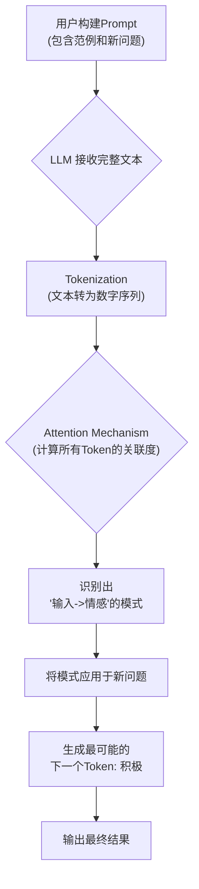

好的，同学你好！作为你的算法老师，今天我们来深入拆解大语言模型（LLM）一项非常迷人且强大的“超能力”——**上下文学习（In-Context Learning, ICL）**。

你已经了解了 LLM 的“涌现能力”，知道它们能做生成、理解、摘要等任务。我们后续还会学习到，LLM 甚至能利用“思维链”来处理更复杂的推理任务。但你有没有想过，我们是如何“告诉”模型在**当下**这个具体的任务里，应该遵循什么样的格式、什么样的风格、什么样的逻辑来回答问题呢？ICL 就是这把钥匙。

我们开始吧！

---

### 1. 问题引入

想象一下，你正在使用一个强大的通用 LLM 来自动化处理用户反馈。你希望模型能将用户的评论快速归类为“积极”或“消极”。

你可能会直接向模型发出这样的指令：

```
指令：请分析以下文本的情感。
文本：这家餐厅的服务太慢了，菜也不好吃。
```

模型的回答可能会是：
- “这段文本表达了负面情绪。”
- “这是一个差评。”
- “情感：消极”

这些答案都对，但格式不统一！在工程实践中，我们需要的是**稳定、可预测、格式一致**的输出，比如，只输出“积极”或“消极”这两个词，以便下游程序（如数据库、API）直接处理。

如何才能让模型像一个训练有素的员工一样，精确地按照我们给定的格式来输出结果，而**无需重新训练或微调（fine-tuning）整个模型**呢？

这就是上下文学习（In-Context Learning）要解决的核心问题。

### 2. 核心思想与生活化类比

**核心思想**：上下文学习的核心思想是，我们不改变模型的任何内部参数（权重），而是在**提交给模型的提示（Prompt）中直接提供几个完整的“问题-答案”范例**。模型会利用其强大的模式识别能力，从这些范例中“领悟”出当前任务的规则、格式和意图，然后用同样的模式去解决我们最后提出的新问题。

**生活化类比**：
这就像你第一天去一家新公司实习，你的经理需要你处理客户邮件。

-   **没有 ICL 的情况（Zero-shot）**：经理只对你说：“去，把这些邮件处理一下。” 你可能会凭自己的理解去回复，但格式、语气、称呼可能五花八门，不符合公司规范。

-   **有 ICL 的情况（Few-shot）**：经理拿来几封已经处理好的邮件，对你说：“看，我们是这样回复的。A 类邮件，我们这样写；B 类邮件，我们这样写。现在，这封新邮件是 A 类，你照着这个**格式和口吻**来处理。”

你并没有经过长达数月的“再培训”（fine-tuning），只是通过看这几个**现场范例（In-Context examples）**，就立刻学会了如何在新任务上做得又快又好。LLM 的 ICL 机制与此高度相似。

### 3. 最小可运行示例

下面的“代码”并不是一种编程语言，而是我们发送给大语言模型 API 的**纯文本提示（Prompt）**。这正是 ICL 的魅力所在——“代码”就是数据，就是指令。

```plaintext
# 任务：二元情感分类 (Binary Sentiment Classification)
# 我们提供了两个完整的范例（demonstrations），这被称为“少样本学习”（Few-shot Learning）

# --- 范例 1 ---
输入：这部电影的节奏很棒，演员的表演也很到位！
情感：积极

# --- 范例 2 ---
输入：等了半个小时才上菜，味道也很一般。
情感：消极

# --- 现在，提出你的新问题 ---
输入：这款耳机的音质清晰，降噪效果出乎意料的好。
情感：
```

**预期输出**:

```plaintext
积极
```

**代码注释**:
-   `# --- 范例 1/2 ---`：这部分被称为“示例”（shot）或“演示”（demonstration）。我们正在“演示”任务应该如何完成。
-   `输入：...` 和 `情感：...`：我们为每个范例都定义了清晰、一致的输入/输出结构。模型会学习这个结构。
-   `情感：` (最后一行)：这是我们留给模型的“填空题”。模型在分析了前面两个范例的模式后，会接着生成最符合这个模式的文本。

### 4. 原理剖析

那么，模型内部究竟发生了什么，让它能够“看懂”我们的范例呢？这背后的核心功臣是 **Transformer 架构中的自注意力机制（Self-Attention Mechanism）**。

让我们一步步拆解这个过程：

1.  **统一编码（Tokenization & Embedding）**：
    -   你提供的整个 Prompt（包含所有范例和最后的问题）被转换成一个统一的数字序列（Tokens）。
    -   模型将这些数字序列映射到一个高维向量空间，每个词或符号都有了它的数学表示。

2.  **上下文关联（Self-Attention at Work）**：
    -   这是最关键的一步。自注意力机制会计算这个序列中**所有 token 之间的关联强度**。
    -   当模型处理到最后一个问题 `这款耳机的音质清晰...` 时，它的注意力机制会发现：
        -   这个句子的结构与前两个范例的 `输入：...` 部分非常相似。
        -   `音质清晰`、`效果好` 这些词，在语义上与范例1中的 `节奏很棒`、`表演到位` 更接近，而与范例2中的 `服务慢`、`味道一般` 相去甚远。
        -   模型还注意到了一个强大的结构模式：`输入：[正面描述]` 后面总是跟着 `情感：积极`，而 `输入：[负面描述]` 后面总是跟着 `情感：消极`。

3.  **模式推断与生成（Pattern Recognition & Generation）**：
    -   通过注意力机制建立的关联，模型“推断”出它当前的任务是根据输入的语义，生成一个标签，且标签必须是“积极”或“消极”。
    -   因此，在最后的 `情感：` 之后，模型会以极高的概率生成 `积极` 这个 token，因为它最符合从上下文中学习到的模式。

下面是一个简化的流程图，展示了 ICL 的运作机制：



**复杂度分析**：
-   **时间/空间复杂度**：ICL 的计算开销主要在模型的**推理（Inference）** 阶段。其复杂度与输入序列的长度（即 Prompt 的长度）大致成**平方关系**（O(n²)），因为自注意力机制需要计算序列中每对 token 之间的关系。这意味着，你提供的范例越多、越长，模型的推理时间和显存占用就会越高。

### 5. 常见误区与优化点

-   **误区 1：ICL 是在“训练”模型**
    -   **纠正**：完全不是。ICL 过程中，模型的权重（weights）**不会发生任何更新**。它是一种纯粹的**推理时能力**，更像是“即时适应”或“任务解锁”，而非学习新知识。所有能力都已存在于预训练好的模型中，ICL 只是激活了它。

-   **误区 2：范例越多越好**
    -   **纠正**：不一定。过多的范例会显著增加推理成本，并可能超出模型的上下文窗口长度限制。通常，从 2 个（2-shot）到 8 个（8-shot）范例效果就很好。关键是**范例的质量和代表性**，而非数量。

-   **优化点 1：范例的格式一致性**
    -   你的范例格式必须**极其一致**。使用了 `输入：` 和 `情感：`，就全程使用。任何微小的变动，如空格、换行，都可能干扰模型的模式识别。

-   **优化点 2：范例的顺序**
    -   研究表明，范例的顺序会影响最终结果。一个常见的技巧是，将与你的新问题**最相似的范例放在最后**，因为它可能在注意力机制中获得更高的权重。

-   **优化点 3：从零样本（Zero-shot）开始尝试**
    -   对于非常简单或模型已经非常熟悉（在预训练数据中见过很多）的任务，可以直接下达指令（Zero-shot），可能就已经足够了。只有当 Zero-shot 效果不佳或格式不可控时，才引入 Few-shot ICL。

### 6. 拓展应用

ICL 的应用场景几乎是无限的，任何需要“指明格式”或“定义任务”的地方都可以使用它：

1.  **代码生成**：
    -   提供几个“自然语言 -> SQL 查询”的范例，然后给一句新的自然语言，让模型生成对应的 SQL。

2.  **信息提取**：
    -   给一段文本，并演示如何从中提取姓名、公司和职位。然后给一段新文本，让模型自动提取。

3.  **风格模仿**：
    -   提供几段莎士比亚风格的文字，然后让模型用同样的风格续写一个新故事。

4.  **小样本分类**：
    -   在没有足够数据来训练一个专用分类器时，用 ICL 快速构建一个效果不错的临时分类器，比如将新闻文章分为“体育”、“科技”、“财经”。

### 7. 总结要点

| 方面 | 关键描述 |
| :--- | :--- |
| **核心机制** | 在 Prompt 中提供任务范例，利用模型的自注意力机制进行模式识别和类比推理。 |
| **本质** | 一种**推理时**（Inference-time）的引导技术，**不改变模型权重**。 |
| **别称** | 常与‘少样本提示 (Few-shot Prompting)’ 互换使用。无范例的‘零样本提示 (Zero-shot Prompting)’ 也依赖于此核心能力。 |
| **优点** | 极其灵活，无需训练数据和计算资源，可以快速适应新任务。 |
| **缺点** | 推理成本随 Prompt 长度增加而变高，受限于上下文窗口大小，效果依赖范例质量。 |
| **适用场景** | 需要精确控制输出格式、定义新任务、或只有少量标注数据时。 |

### 8. 思考与自测

现在，你已经掌握了 ICL 的运作机制。请挑战一下自己：

假设你需要模型扮演一个**客服工单分类机器人**，将用户的请求分为三类：“技术问题”、“账单问题”或“功能建议”。

请**修改**第三节中的“最小可运行示例”代码，构建一个 Few-shot Prompt 来完成这个新的分类任务。

**你的任务清单**：
1.  为每个类别（技术问题、账单问题、功能建议）至少设计一个清晰的范例。
2.  保持输入/输出格式的一致性（例如，使用 `请求：` 和 `类别：`）。
3.  在范例之后，写一个新的用户请求（例如：“我的 App 总是闪退，怎么办？”），并让模型来分类。

这个练习将帮助你真正将 ICL 的理论应用到实践中。祝你成功！