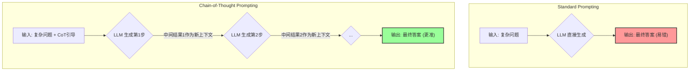

好的，同学你好！欢迎来到我的算法课堂。

今天我们要一起攻克的，是大语言模型（LLM）领域一个非常核心且强大的技术：**思维链（Chain-of-Thought, CoT）**。

你已经了解了 LLM 的“涌现能力”和“上下文学习（In-Context Learning）”，CoT 正是这些概念的完美体现。它是一种解锁和引导 LLM 进行复杂推理的“钥匙”。把它想象成我们给模型安装了一个“草稿本”，让它在回答复杂问题前，先自己打草稿、理清思路。

准备好了吗？让我们开始吧！

---

### 【8步教学模型：思维链（Chain-of-Thought）】

#### 1. 问题引入

想象一下，你拿到一个简单的应用题，直接给模型提问：

```
问题：一个杂货店有23个苹果。如果他们周一用了20个，周二又采购了6个，那么杂货店现在有多少个苹果？
```

对于一个没有经过特殊引导的大模型，它可能会凭“直觉”给出一个不完整的答案，例如只执行第一步计算回答“3个”；或者错误地将所有数字相加，回答“49个”。这些都是因为它没有进行正确的、分步的推理。这就是标准提示（Standard Prompting）在复杂问题上的局限性。

#### 2. 核心思想与生活化类比

**核心思想**：思维链的核心思想非常直观——**“过程重于结果”**。它通过在提示（Prompt）中引导模型，让其在给出最终答案之前，先输出一系列连贯的、中间的推理步骤。这些步骤形成了一条“思维的链条”，模仿了人类解决复杂问题时的思考过程。

**生活化类比**：
这就像你在做一道复杂的数学题。

*   **没有思维链**：你只在答题卡上写下最终答案 `X = 9`。如果答案错了，老师不知道你错在哪里。
*   **有思维链**：你在草稿纸上写下完整的解题步骤：
    1.  “开始时有23个苹果。”
    2.  “周一用了20个，所以剩下 `23 - 20 = 3` 个。”
    3.  “周二又采购了6个，所以现在有 `3 + 6 = 9` 个。”
    4.  “所以，最终答案是9。”

这个写草稿的过程，就是思维链。它不仅帮助你自己理清了逻辑，也让检查者（或模型自身）能够验证每一步的正确性，从而大大提高了最终答案的准确率。

#### 3. 最小可运行示例

下面，我们用“代码”——也就是 Prompt 的形式，来展示思维链的魔力。我们将使用最简单的 **零样本思维链（Zero-shot CoT）**，它不需要提供复杂的示例，只需一句简单的“咒语”即可。

```plaintext
# === 输入：标准提示（Standard Prompt） ===
Q: 一个杂货店有23个苹果。如果他们周一用了20个，周二又采购了6个，那么杂货店现在有多少个苹果？
A:

# === 预期输出（可能会出错） ===
3个。

----------------------------------------------------

# === 输入：思维链提示（Chain-of-Thought Prompt） ===
Q: 一个杂货店有23个苹果。如果他们周一用了20个，周二又采购了6个，那么杂货店现在有多少个苹果？
A: 让我们一步一步地思考。

# === 预期输出（更可能正确） ===
1. 杂货店一开始有23个苹果。
2. 周一用掉了20个，所以剩下的苹果数量是 23 - 20 = 3个。
3. 周二又采购了6个，所以现在的苹果数量是 3 + 6 = 9个。
因此，杂货店现在有9个苹果。
```

看到了吗？仅仅是增加了一句 `让我们一步一步地思考。`（Let's think step by step.），就极大地改变了模型的“行为模式”，引导它从“直接猜测答案”切换到“过程化推理”。

#### 4. 原理剖析

思维链为什么有效？因为它巧妙地利用了 LLM 的核心机制——**自回归（Autoregressive）生成**。模型在生成每一个词时，都会把之前生成的所有词作为上下文。

1.  **分解任务**: CoT 将一个复杂的多步推理任务，隐式地分解成了一系列更简单的、单步的生成任务。
2.  **提供中间上下文**: 当模型生成第一步“`剩下 3 个苹果`”后，这句话就成了下一步推理的“已知条件”。模型在生成第二步时，看到的是“`问题 + 剩下 3 个苹果`”，这比只看原始问题要简单得多。
3.  **分配更多计算**: 生成更长的、包含步骤的文本，意味着模型为这个问题分配了更多的“计算资源”（更多的前向传播步骤），这有助于它处理更复杂的信息。

下面是两种模式的流程对比图：



#### 5. 常见误区与优化点

*   **误区1：任何模型都适用**
    CoT 是一种“涌现能力”，通常只在参数量足够大的模型（如百亿参数以上）上表现明显。对于小模型，它可能无法理解这种引导，甚至会产生更混乱的输出。

*   **误区2：思维链过程绝对正确**
    模型在推理过程中也可能犯错。例如，在第一步就算错了 `23 - 20 = 5`，那么后续的步骤即便逻辑正确，最终答案也是错的。这种错误被称为**推理错误（Reasoning Error）**。

*   **优化点：从零样本到少样本（Few-shot CoT）**
    为了让模型更好地理解你想要的推理格式和逻辑，你可以提供一两个完整的“问题 + 推理步骤 + 答案”的示例。这就像给学生发了一份带解题过程的样卷，效果通常比零样本更好。

*   **优化点：自洽性（Self-Consistency）**
    这是一种更高级的玩法。让模型用不同的方式（比如调整 `temperature` 参数）生成多个思维链，然后对最终答案进行“投票”，选择出现次数最多的答案。这大大降低了因单个推理链出错而导致失败的概率。

**不同提示策略对比**

| 策略 | 核心思想 | 优点 | 缺点 |
| :--- | :--- | :--- | :--- |
| **标准提示** | 直接问答 | 简单直接 | 复杂推理任务上表现差 |
| **零样本 CoT** | 用指令引导模型思考 | 无需示例，方便快捷 | 对模型的理解能力要求高 |
| **少样本 CoT** | 提供完整的推理示例 | 效果和稳定性显著优于零样本 CoT，推理过程可控 | 需要精心设计和编写示例 |

#### 6. 拓展应用

思维链的强大之处在于它的通用性。任何需要多步逻辑、规划或综合分析的任务，都可以从中受益：

*   **代码生成**: 在写代码前，先用注释写下实现逻辑的伪代码或步骤，模型可以更好地完成代码。
    `# 1. 检查输入列表是否为空。# 2. 如果不为空，则...`
*   **故事创作**: 引导模型先构思大纲（起因、发展、高潮、结局），然后再填充细节。
*   **法律文书分析**: 先提取案件的关键事实，再应用相关法条，最后得出结论。
*   **策略规划**: 分析市场现状 -&gt; 识别机会与威胁 -&gt; 制定初步策略 -&gt; 评估策略风险 -&gt; 输出最终方案。

#### 7. 总结要点

让我们快速回顾一下思维链（CoT）的关键点：

1.  **核心目的**: 提升大模型在复杂推理任务（如数学、逻辑、规划）上的准确性。
2.  **实现方式**: 通过在提示中引导模型，使其在给出最终答案前，先生成中间的、循序渐进的推理步骤。
3.  **工作原理**: 将复杂问题分解为简单的子问题，利用自回归机制，将每一步的输出作为下一步的输入上下文。
4.  **关键优势**: 过程透明、可解释性强，并且显著提高了在基准测试（如 MMLU）上的表现。
5.  **适用场景**: 只对足够大的模型有效，属于“涌现能力”。

#### 8. 思考与自测

现在，轮到你来实践了！这里有一个经典的逻辑难题，请你尝试构建一个**零样本思维链（Zero-shot CoT）提示**来引导模型解决它。

**问题**：
“在一个房间里有三个人：Alice、Bob 和 Charlie。其中一个是骑士（只说真话），一个是无赖（只说假话），一个是间谍（可能说真话也可能说假话）。
Alice 说：‘Charlie 是无赖。’
Bob 说：‘Alice 是骑士。’
Charlie 说：‘我是间谍。’

请问，谁是骑士，谁是无赖，谁是间谍？”

**你的任务**：
设计一个 Prompt，包含这个问题以及一句类似“让我们一步一步地逻辑分析”的引导语，然后看看模型能否正确推理出答案。思考一下，一个好的推理链应该包含哪些步骤？（例如：假设法、排除法）

动手试试吧！你会发现，引导模型“思考”和直接向它“索要”答案，得到的结果是天壤之别的。这也是掌握与大模型高效协作的关键一步。