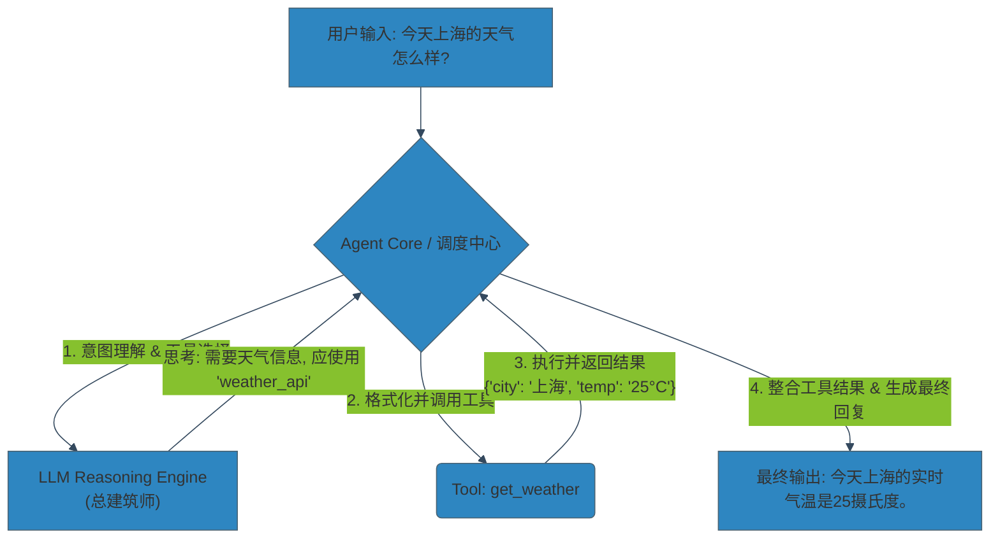
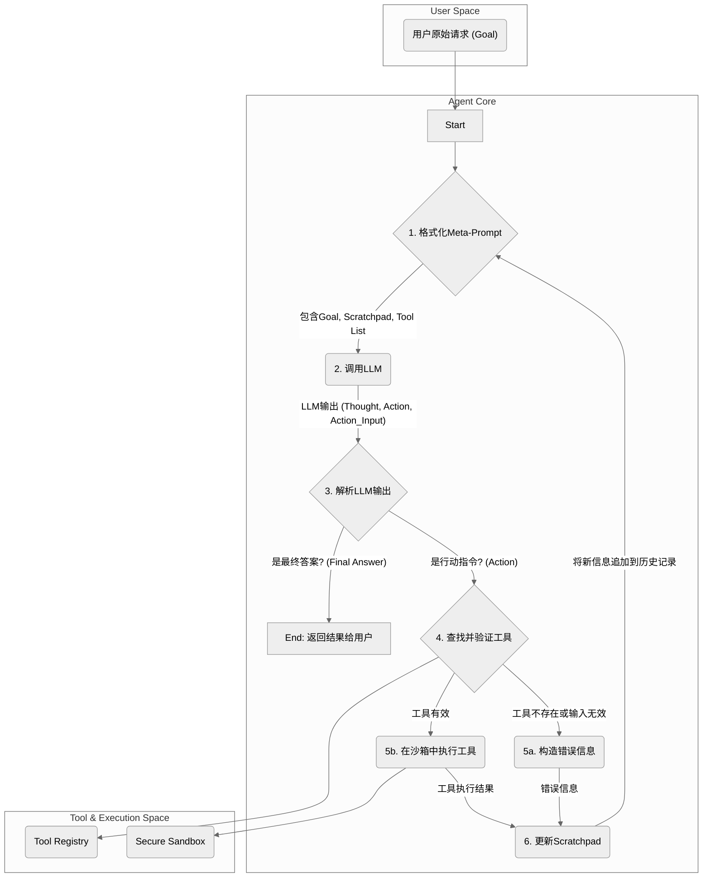
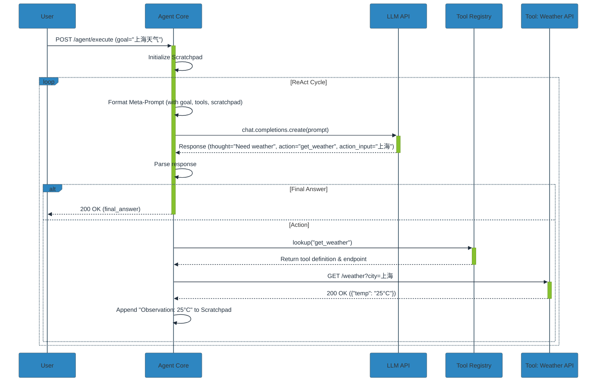

好的，我们开始。作为你的架构导师，今天我们将一同深入探讨“智能体（Agent）与工具使用（Tool Use）”这一高级交互范式。

你已经掌握了AI对齐、RLHF和对话式AI的基础，这非常好。这说明你理解了如何让模型“说”得更好、更安全。现在，我们要解决一个更具挑战性的问题：如何让模型从一个“会说的思考者”进化为一个“能做的行动者”，并确保其行动依然在我们的预期和控制之内。这正是智能体架构设计的核心。

让我们开始吧。

***

### 1. 问题引入: 从“对话”到“行动”的鸿沟

设想一个场景：我们为一家大型金融公司构建了一个基于LLM的分析助手。目前，它可以出色地解读财报、总结新闻、回答关于市场趋势的理论问题。但业务方提出了新的、更尖锐的需求：

*   **实时性**: “它能告诉我当前 AAPL 的实时股价和市盈率吗？” —— 模型的知识截止于训练数据，无法回答。
*   **执行能力**: “帮我根据最新的市场数据，计算出A公司的WACC（加权平均资本成本），并生成一份投资简报。” —— 模型能“解释”WACC，但无法调用API获取实时利率、无法执行精确计算、也无法将结果存入文件系统。
*   **复杂任务分解**: “监控市场，当X股票的波动率超过2%时，立即向我的团队Slack频道发送预警，并附上一份包含关键指标的摘要。” —— 这需要状态持续监控、条件触发、多工具协作（数据API -> 计算 -> 通信API）。

**核心痛点**：我们的LLM是一个强大的“语言推理引擎”，但它被困在自己的“数字象牙塔”里。它无法感知真实世界的动态数据，也无法执行任何改变外部世界状态的操作。这就是“对话”与“行动”之间的鸿沟。我们的架构设计，就是要为它搭建一座安全、高效、可扩展的桥梁。

### 2. 核心目标与类比

在着手设计之前，我们必须明确目标。对于一个Agent-Tool架构，核心目标是：

*   **自主性 (Autonomy)**: 赋予模型根据目标自主规划、决策和执行的能力。
*   **扩展性 (Extensibility)**: 能够轻松地为系统“赋能”，即添加新的工具或能力，而无需重构核心逻辑。
*   **可观测性 (Observability)**: 必须能清晰地追踪模型的“思考链”——它为什么选择这个工具？它的中间步骤是什么？这对调试、审计和对齐至关重要。
*   **安全性 (Safety)**: 所有“行动”都必须在严格的权限和隔离环境中执行，防止误操作或恶意使用。

**架构类比：总建筑师与专业施工队**

想象一下，你不是在写代码，而是在规划一座智能建筑。

*   **大语言模型 (LLM)**：就是那位知识渊博、经验丰富的**总建筑师**。他能理解你的最终目标（“建一座节能、现代的办公楼”），能规划蓝图，能分解任务。但他自己不动手砌墙、接电线。
*   **工具 (Tools)**：就是各个领域的**专业施工队**。比如，`API查询施工队`、`代码执行施工队`、`数据库操作施工队`。每个队伍只做一件事，但做得非常专业。
*   **智能体核心 (Agent Core)**：是介于总建筑师和施工队之间的**项目总监/调度中心**。他负责：
    1.  将总建筑师的宏伟蓝图（用户意图）翻译成具体、可执行的工序。
    2.  根据工序，向正确的施工队下达指令（“电工队，请在这里铺设线路”）。
    3.  检查施工队的完成质量（工具的输出结果）。
    4.  向总建筑师汇报进度，并根据反馈调整下一步计划。

我们的任务，就是设计这个高效、可靠的**项目总监/调度中心 (Agent Core)**，并为所有**施工队 (Tools)** 制定标准化的作业流程和安全规范。

### 3. 最小示例 (核心组件图)

让我们用一张最简化的图来描绘这个“调度中心”的工作流程。这是我们架构的v0.1版本，也是一切复杂设计的基础。



这个流程展示了最核心的**“思考-行动”循环 (Reasoning-Action Loop)**。现在，让我们深入这个循环的内部，剖析它的每一个齿轮。

### 4. 原理剖析 (详细设计与权衡)

一个生产级的Agent-Tool架构远比上图复杂。我们需要对每个组件进行精细化设计。

#### 详细流程图 (Flowchart)

这张图展现了Agent Core内部更完整的决策循环，特别是ReAct（Reason+Act）范式的体现。



#### 核心组件详解

1.  **Meta-Prompt / 系统提示**:
    *   **职责**: 这是Agent的“操作系统”或“DNA”。它告诉LLM它的身份、能力、目标、约束，以及最重要的——如何思考和如何使用工具。
    *   **设计**: 一个典型的Meta-Prompt包含：
        *   **Persona**: "你是一个能干的AI助手。"
        *   **Instructions**: "你需要分解任务，一步步思考。每一步都在`Thought`中写下你的推理过程。"
        *   **Tool Specification**: "你可以使用以下工具：`[TOOL_SCHEMA]`"。这部分至关重要，必须是结构化的（如JSON Schema），详细描述每个工具的名称、功能、参数和返回类型。
        *   **Output Format**: "你的输出必须是严格的JSON格式，包含`thought`和`action`字段。`action`字段的值为`tool_name`或`Final Answer`。"
    *   **权衡 (Trade-off)**:
        *   **详细 vs. 简洁**: 过于详细的提示会占用宝贵的上下文窗口，增加token成本；过于简洁则可能导致LLM无法正确理解和使用工具。
        *   **结构化 vs. 自然语言**: 强制JSON输出格式提高了系统的可靠性和可解析性，但对某些模型的遵循能力是种考验。

2.  **思考-行动循环 (ReAct Loop)**:
    *   **职责**: 这是Agent的核心调度逻辑，负责迭代式地调用LLM和工具，直到任务完成。
    *   **设计**: 如上图所示，循环的核心是维护一个“**Scratchpad**”（暂存器），记录每一步的`Thought`, `Action`, `Observation`（工具执行结果）。每一次调用LLM时，都会把整个Scratchpad的历史传入，让LLM基于完整的上下文进行下一步决策。
    *   **代码示例 (Conceptual Python)**:
        ```python
        # Conceptual code for the ReAct loop
        from llm_api import call_llm
        from tool_executor import execute_tool
        from prompt_formatter import format_meta_prompt

        def agent_loop(user_goal: str, tools: list):
            scratchpad = []
            max_iterations = 10
            
            for i in range(max_iterations):
                # 1. Format the prompt with history
                meta_prompt = format_meta_prompt(user_goal, tools, scratchpad)
                
                # 2. Call the LLM for the next step (thought + action)
                llm_output_str = call_llm(meta_prompt)
                
                try:
                    # 3. Parse the structured output
                    parsed_output = json.loads(llm_output_str)
                    thought = parsed_output.get("thought")
                    action = parsed_output.get("action")
                    action_input = parsed_output.get("action_input")
                    
                    scratchpad.append(f"Thought: {thought}\n")
                    
                    if action == "Final Answer":
                        # 4a. If done, return the final answer
                        return action_input
                    else:
                        # 4b. If action is required, execute it
                        observation = execute_tool(action, action_input, tools)
                        scratchpad.append(f"Action: {action}({action_input})\nObservation: {observation}\n")
                
                except Exception as e:
                    # Handle parsing or execution errors
                    # 注：在生产环境中，最好区分处理LLM输出的解析错误（parsing error）和工具执行错误（execution error），并向LLM提供更有针对性的反馈以帮助其自我修正。
                    observation = f"Error: {e}. Please check your output format and tool usage."
                    scratchpad.append(f"Observation: {observation}\n")

            return "Agent stopped after reaching max iterations."
        ```

3.  **工具抽象与执行 (Tool Abstraction & Execution)**:
    *   **职责**:
        *   **抽象层**: 将五花八门的函数、API调用等统一成标准化的“Tool”接口。
        *   **执行层**: 在一个安全的环境中调用工具，并处理其输出和异常。
    *   **设计**:
        *   **Tool Schema**: 使用OpenAPI Specification或JSON Schema来定义每个工具。这使得工具可以被Agent自动发现和理解。
        *   **安全沙箱 (Sandbox)**: 这是架构的**安全基石**。任何能执行代码（如`python_interpreter`）或访问文件系统/网络的工具，都**必须**在隔离环境中运行（如Docker容器、WebAssembly运行时、gVisor）。这可以防止LLM产生有害代码并破坏宿主系统。
    *   **权衡**:
        *   **安全 vs. 性能**: 沙箱会带来额外的性能开销（启动时间、资源隔离）。需要根据工具的危险级别选择合适的沙箱策略。一个简单的API调用可能不需要沙箱，但一个代码解释器则必须需要。

#### 交互时序图 (Sequence Diagram)

这张图清晰地展示了各组件之间的调用关系和时间顺序。



### 5. 常见误区 (反模式)

作为架构师，识别并规避反模式与设计正向模式同样重要。

*   **反模式1: 巨型提示 (Monolithic Prompting)**
    *   **表现**: 将所有工具的实现逻辑（甚至是Python代码片段）直接塞进提示中，让LLM直接生成可执行的代码字符串，然后由外部解释器（如Python `eval`）直接运行。
    *   **危害**: 极难维护、上下文窗口爆炸、安全风险巨大、无法复用逻辑。
    *   **正向模式**: **工具即服务 (Tools-as-a-Service)**。LLM只负责生成调用工具的“意图”（如`{"tool": "calculator", "args": [2, 3]}`），由外部的、安全的、经过测试的执行器来完成调用。

*   **反模式2: 隐式工具契约 (Implicit Tool Contracts)**
    *   **表现**: 在提示中用模糊的自然语言描述工具，如“我有一个可以查天气的函数”。
    *   **危害**: LLM可能会生成格式错误的参数、调用不存在的工具，导致系统高度不稳定。
    *   **正向模式**: **显式模式定义 (Explicit Schema Definition)**。使用JSON Schema等机器可读的格式精确定义工具的签名，让LLM的输出有据可依。这正是OpenAI的Function Calling功能所倡导的。

*   **反模式3: 缺乏可观测性 (Lack of Observability)**
    *   **表现**: 只关心最终结果，不记录Agent的中间“思考”过程。
    *   **危害**: 一旦出现问题，就如同面对一个黑盒，无法调试、无法分析失败原因、无法改进提示。
    *   **正向模式**: **记录完整的思考链 (Logging the Chain of Thought)**。将每一次的`Thought`, `Action`, `Observation`都作为结构化日志记录下来。这不仅是调试的生命线，也是未来进行Agent微调和对齐的宝贵数据。

### 6. 拓展应用 (演进路线)

我们的v1.0架构是一个单体Agent，但业务不会止步不前。架构需要具备演进的能力。

*   **v1.0: 单一决策者Agent (Single-Agent Decider)**
    *   我们今天设计的架构。一个核心LLM负责所有任务的规划和工具调用。适用于目标明确、流程相对线性的任务。

*   **v2.0: 多智能体协作系统 (Multi-Agent System, MAS)**
    *   **场景**: 处理一个极其复杂的任务，如“为我的新产品写一份完整的市场分析报告”。
    *   **演进**: 将单一Agent分解为一组具有不同角色的专业Agent：
        *   **规划Agent (Planner)**: 接收原始需求，将其分解成子任务（1. 调研竞品 2. 分析用户画像 3. 预测市场规模...），并分配给其他Agent。
        *   **研究Agent (Researcher)**: 专门负责调用搜索引擎、数据库等工具来收集信息。
        *   **分析Agent (Analyst)**: 接收原始数据，调用代码解释器、图表生成等工具进行数据分析。
        *   **写作Agent (Writer)**: 将所有分析结果整合成一篇流畅的报告。
    *   **架构挑战**: 需要引入一个新的组件——**消息总线或协调器 (Message Bus/Coordinator)**，来管理Agent之间的通信、任务分配和结果汇总。Agent之间的交互协议（如Contract Net Protocol）也成为新的设计要点。

*   **v3.0: 自我进化Agent (Self-Evolving Agent)**
    *   **场景**: Agent需要适应不断变化的环境和工具集。
    *   **演进**:
        *   **动态工具创建**: Agent不仅能“使用”工具，还能“创建”工具。例如，当面对一个特定计算任务时，它能自己编写一段Python脚本，将其注册为一个新工具，然后使用它。这需要极高级别的沙箱和代码验证机制。
        *   **自我反思与优化**: Agent可以分析自己的历史执行日志（特别是失败的案例），并自主优化其Meta-Prompt。例如，它发现自己经常误用某个工具，就可以在Prompt中为自己增加一条约束：“注意：在使用`financial_data_api`时，`date`参数格式必须是YYYY-MM-DD。”

### 7. 总结要点

让我们回顾一下构建一个健壮的Agent-Tool架构的核心设计原则：

1.  **分离原则 (Separation of Concerns)**: LLM是“大脑”（负责推理），工具是“双手”（负责执行）。清晰地分离两者，通过结构化的接口（如JSON）进行通信。
2.  **契约优先 (Schema-First)**: 先用机器可读的格式定义好工具的能力和接口，再让LLM学习如何调用。这是系统可靠性的基石。
3.  **可观测性是生命线 (Observability is Lifeline)**: 完整地记录Agent的“思考-行动”链。没有它，你将无法调试、优化或信任你的Agent。
4.  **安全始于沙箱 (Safety Starts with Sandboxing)**: 永远不要信任LLM生成的代码或指令。在最小权限的隔离环境中执行一切有潜在风险的操作。

设计Agent系统，本质上是在设计一个**受控的自主系统**。我们的目标不是创造一个无所不能的“黑盒”，而是构建一个透明、可靠、可扩展的“玻璃盒”。

### 8. 思考与自测

现在，轮到你了。这是一个典型的架构演进问题：

**问题**: 假设我们的v1.0 Agent运行良好。现在业务方提出一个新需求：“Agent需要能够执行长耗时任务，比如‘调用内部API，为过去一年的销售数据生成一份可视化报告’。这个API调用可能需要5-10分钟才能返回结果。在等待期间，系统不能被阻塞，并且用户希望能在任务完成后得到通知。”

**请思考**: 现有我们讨论的同步ReAct循环架构，哪个部分会最先崩溃？为了支持这个需求，你认为架构的哪些部分需要进行最核心的修改？为什么？

期待你的思考。这将引导我们进入异步任务处理、状态持久化和回调机制等更高级的架构领域。

***

#### 参考文献
1.  **ReAct (Reason and Act)**: Yao, S., et al. (2022). *ReAct: Synergizing Reasoning and Acting in Language Models*. [https://arxiv.org/abs/2210.03629](https://arxiv.org/abs/2210.03629)
2.  **Toolformer**: Schick, T., et al. (2023). *Toolformer: Language Models Can Teach Themselves to Use Tools*. [https://arxiv.org/abs/2302.04761](https://arxiv.org/abs/2302.04761)
3.  **OpenAI Function Calling**: [https://platform.openai.com/docs/guides/function-calling](https://platform.openai.com/docs/guides/function-calling)
