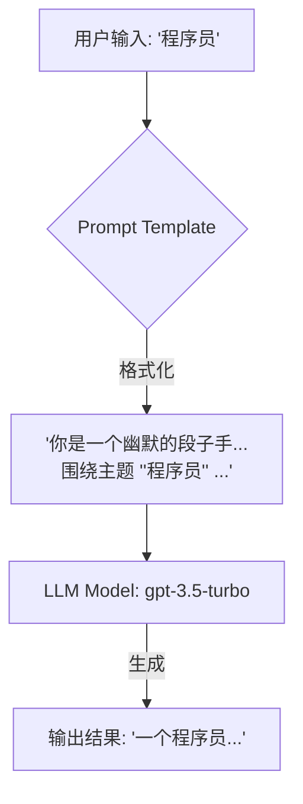

好的，身为资深流程教练，我将采用“引导式教学模型”为你构建一份清晰、可执行的LangChain核心组件与链（Chains）入门手册。让我们开始吧！

---

### 开发框架入门：LangChain的核心组件与链（Chains）

你好！欢迎来到LangChain的世界。在之前的章节中，我们已经了解了如何直接调用LLM的API，也接触了向量数据库，并且思考了不同技术栈的选择。现在，是时候学习如何将这些零散的部件像乐高积木一样组合起来，构建一个真正强大的、自动化的智能应用了。LangChain就是我们手中的“乐高积木套装”。

---

#### 1. 问题引入

你可能会问：“我已经能用API和模型对话了，但如何让它自动完成一个**多步骤**的任务，比如先分析用户问题，再从我的知识库里查找资料，最后结合查到的资料生成一份总结报告？我需要构建一个能按特定流程自动工作的智能应用，正确的流程是怎样的？”

这正是LangChain要解决的核心问题。它提供了一个标准化的框架，来编排和管理与大语言模型（LLM）交互的整个流程。

#### 2. 核心目标与类比

本流程的目标是：**学会使用LangChain最核心的三个组件（Models, Prompts, Chains），并构建你的第一个自动化LLM工作流（Chain）。**

为了更好地理解，我们可以把它想象成**制作一杯手冲咖啡**：

*   **Models (模型)**: 这就是你的**咖啡师（LLM）**。他技艺高超，能根据指令制作出美味的咖啡。你可以选择不同的咖啡师（如OpenAI的GPT-4，或开源的Llama）。
*   **Prompts (提示模板)**: 这是给咖啡师的**“配方卡”**。它不只是说“做杯咖啡”，而是详细规定了“用20克xx咖啡豆，92度水，闷蒸30秒，总萃取时间2分30秒”。它将你的动态需求（比如今天想喝什么风味的）填入一个固定的指令框架中。
*   **Chains (链)**: 这就是**“完整的制作流程”**。它将“配方卡”（Prompt）交给“咖啡师”（Model），并确保整个过程顺利执行，最终递给你一杯完美的咖啡（Output）。一个复杂的流程可能包含多个链，就像制作一杯特调咖啡，需要先萃取浓缩，再打奶泡，最后拉花，环环相扣。

我们的目标就是学会如何写好“配方卡”，指挥“咖啡师”，并把整个过程“流程化”。

#### 3. 最小示例 (核心流程演练)

让我们从最简单的任务开始：构建一个“AI段子手”，你给它一个主题，它就为你创作一个相关的段子。这是一个最基础、无分支的核心流程。

**前提条件:**
1.  你已经安装了Python。
2.  你拥有一个OpenAI的API密钥。

**操作步骤:**

1.  **安装必要的库**:
    ```bash
    pip install langchain-openai langchain langchain-core
    ```

2.  **设置环境变量**: 为了安全，建议将你的API密钥设置为环境变量。
    在你的终端中执行（或者写入`.env`文件并用`python-dotenv`加载）：
    ```bash
    export OPENAI_API_KEY="sk-..." 
    ```

3.  **编写Python代码 (main.py)**:

    ```python
    # 1. 导入所需模块
    from langchain_openai import ChatOpenAI
    from langchain_core.prompts import ChatPromptTemplate # 更新为langchain_core
    from langchain.chains import LLMChain

    # 2. 核心组件 - 实例化模型 (我们的“咖啡师”)
    # 我们选择使用OpenAI的gpt-3.5-turbo模型，并设置temperature为0.9以增加创造性
    llm = ChatOpenAI(model="gpt-3.5-turbo", temperature=0.9)

    # 3. 核心组件 - 创建提示模板 (我们的“配方卡”)
    # 定义一个模板，其中{topic}是一个待填充的变量
    prompt_template = ChatPromptTemplate.from_template(
        "你是一个幽默的段子手，请围绕主题 '{topic}' 创作一个不超过50字的短笑话。"
    )

    # 4. 核心组件 - 创建链 (将“咖啡师”和“配方卡”组装成“工作流”)
    # LLMChain是最基础的链，它将模型和提示模板链接在一起
    chain = LLMChain(llm=llm, prompt=prompt_template)

    # 5. 运行链
    # 使用 .invoke() 方法并传入一个字典来填充模板中的变量
    topic_input = {"topic": "程序员"}
    response = chain.invoke(topic_input)

    # 6. 打印结果
    print(response)
    # response 是一个字典，默认包含了输入变量和模型输出
    # 我们可以通过 'text' 键来获取模型生成的具体内容
    print("\n生成的段子:")
    print(response['text'])
    ```

4.  **运行并查看结果**:
    ```bash
    python main.py
    ```
    你可能会看到类似这样的输出：
    ```
    {'topic': '程序员', 'text': '一个程序员的签名是：“代码是我的注释。” 后来他发现，bug才是。'}

    生成的段子:
    一个程序员的签名是：“代码是我的注释。” 后来他发现，bug才是。
    ```
    恭喜！你已经成功构建并运行了你的第一个LangChain应用！

#### 4. 原理剖析 (各步骤详解)

现在，我们来详细拆解刚才那个最小示例中的每一步。

##### **流程图概览**
这是一个最基础的 `LLMChain` 工作流程：



---

##### **步骤 1: 实例化模型 (Model)**

*   **操作指令**:
    1.  从 `langchain_openai` 库中导入 `ChatOpenAI` 类。
    2.  创建一个 `ChatOpenAI` 的实例，并可以传入参数如 `model` (指定模型版本) 和 `temperature` (控制创造性，0-1之间，越高越随机)。
*   **验收标准**:
    *   ✅ 代码执行后，变量 `llm` 成功被赋值为一个 `ChatOpenAI` 对象。
    *   ✅ 没有出现 `AuthenticationError` (这通常意味着API密钥未设置或无效)。

---

##### **步骤 2: 创建提示模板 (Prompt Template)**

*   **操作指令**:
    1.  从 `langchain_core.prompts` 中导入 `ChatPromptTemplate` 类。
    2.  使用 `ChatPromptTemplate.from_template()` 方法创建一个模板实例。
    3.  在模板字符串中，使用大括号 `{}` 来定义变量，例如 `{topic}`。
*   **验收标准**:
    *   ✅ 变量 `prompt_template` 被成功创建。
    *   ✅ 模板能够正确接收变量。你可以通过 `prompt_template.format(topic="测试")` 来手动测试，它应该返回一个格式化好的字符串。

---

##### **步骤 3: 创建链 (Chain)**

*   **操作指令**:
    1.  从 `langchain.chains` 中导入 `LLMChain` 类。
    2.  实例化 `LLMChain`，并将前面创建的 `llm` 对象和 `prompt_template` 对象作为参数传入。
*   **验收标准**:
    *   ✅ 变量 `chain` 被成功创建为一个 `LLMChain` 对象。
    *   ✅ 该对象内部已经正确关联了你的模型和提示模板。

---

##### **步骤 4: 运行链 (Invoke)**

*   **操作指令**:
    1.  调用链对象的 `.invoke()` 方法。
    2.  传入一个Python字典，字典的 `key` 必须与你在提示模板中定义的变量名（例如 `topic`）完全一致。
*   **验收标准**:
    *   ✅ 代码顺利执行，没有报 `KeyError` (如果字典的key和模板变量不匹配，会报此错)。
    *   ✅ 你能接收到一个包含模型生成结果的字典作为返回值。

#### 5. 常见误区 (风险与回退)

*   **误区1: API密钥配置错误**
    *   **风险**: 程序启动时立即报错，通常是 `openai.AuthenticationError`。
    *   **回退方案**: 仔细检查你的环境变量名称是否为 `OPENAI_API_KEY`，以及密钥值是否完整、正确。确保在运行脚本的终端会话中该环境变量是有效的。

*   **误区2: 提示模板变量与输入不匹配**
    *   **风险**: 运行 `.invoke()` 时程序报错 `KeyError`。例如，模板里是 `{topic}`，但你传入的是 `{"subject": "程序员"}`。
    *   **回退方案**: 确保传入 `.invoke()` 的字典的键（key）与你用 `{}` 在模板中定义的变量名一字不差。

*   **误区3: 混淆输入格式**
    *   **风险**: 直接向 `.invoke()` 传入一个字符串 `chain.invoke("程序员")` 而不是字典，导致报错。
    *   **回退方案**: `LLMChain` 的标准输入是一个字典，即使只有一个变量，也要用字典包裹，如 `{"topic": "程序员"}`。

#### 6. 拓展应用 (分支与变体)

当一个任务需要多个步骤时，我们就可以将多个链（Chains）串联起来，形成一个更强大的**顺序链（Sequential Chain）**。

**场景**: 我们想先让AI为一款产品起一个创意名字，然后**基于这个名字**，再为它写一句广告语。

```python
# (接在最小示例的代码之后，假设llm和导入已存在)
from langchain.chains import LLMChain, SequentialChain # 导入更通用的SequentialChain
from langchain_core.prompts import ChatPromptTemplate # 确保使用langchain_core的Prompt模板

# --- 第一个链：产品起名 (指定输出键) ---
prompt_name = ChatPromptTemplate.from_template(
    "你是一个品牌专家，请为一款主打'{product_feature}'功能的智能手表起一个酷炫的名字。"
)
chain_name = LLMChain(llm=llm, prompt=prompt_name, output_key="product_name") # 关键：指定输出变量名

# --- 第二个链：广告语创作 (输入键与上一步的输出键匹配) ---
prompt_slogan = ChatPromptTemplate.from_template(
    "你是一位广告文案大师，请为名为'{product_name}'的智能手表写一句吸引人的广告语。"
)
chain_slogan = LLMChain(llm=llm, prompt=prompt_slogan, output_key="slogan") # 关键：指定输出变量名

# --- 使用 SequentialChain 将两个链串联起来 ---
# SequentialChain 会按顺序执行链，并根据 input_variables 和 output_variables 传递数据
sequential_chain = SequentialChain(
    chains=[chain_name, chain_slogan],
    input_variables=["product_feature"],        # 定义整个流程的初始输入
    output_variables=["product_name", "slogan"], # 定义整个流程的最终输出
    verbose=True
)

# 运行顺序链，输入现在需要是一个字典，包含所有 input_variables
response_sequential = sequential_chain.invoke({"product_feature": "全天候健康监测"})

print("\n--- 顺序链执行结果 ---")
print(response_sequential)
# 预期输出类似: {'product_feature': '全天候健康监测', 'product_name': 'AuraWatch', 'slogan': 'AuraWatch：感知你的每一刻。'}
```
在这个例子中，`SequentialChain` 就像一个流水线，`chain_name` 的产出（产品名字，通过`output_key="product_name"`指定）被自动传送带送到了 `chain_slogan` 作为原料（因为它需要`{product_name}`作为输入）。整个过程无需人工干预，实现了自动化，并且最终会返回一个包含所有输入和指定输出变量的字典。

#### 7. 总结要点 (Checklist)

在你构建自己的第一个LangChain应用时，可以参照以下清单：

*   [ ] **环境设置**:
    *   [ ] 安装 `langchain`, `langchain-openai`, `langchain-core` 等核心库。
    *   [ ] 正确设置并加载了 `OPENAI_API_KEY` 环境变量。
*   [ ] **组件准备**:
    *   [ ] **模型 (Model)**: 选定并实例化了LLM或ChatModel (如 `ChatOpenAI`)。
    *   [ ] **提示 (Prompt)**: 创建了 `ChatPromptTemplate`，并用 `{}` 定义了所有输入变量。
*   [ ] **链的构建**:
    *   [ ] **基础链**: 使用 `LLMChain` 将模型和提示模板组合起来。
    *   [ ] **顺序链 (可选)**: 如果需要多步骤，考虑使用 `SequentialChain` 将多个基础链串联，并正确设置 `input_variables` 和 `output_variables`。
*   [ ] **执行与调试**:
    *   [ ] 使用 `.invoke()` 方法运行链。
    *   [ ] 传入的输入是一个字典，且key与模板变量完全匹配。
    *   [ ] 检查输出结果是否符合预期。

#### 8. 思考与自测

为了检验你是否真正掌握了，请思考以下问题：

1.  **如果我想换一个模型**，比如从 `gpt-3.5-turbo` 换成 `gpt-4`，这个流程的第几步需要做什么调整？需要改动代码的哪些部分？
2.  在我们的“段子手”例子中，如果我想让它同时考虑**“主题”**和**“风格”**（例如，冷笑话风格），我应该如何修改**提示模板 (Prompt Template)** 和**运行链时的输入**？
3.  `SequentialChain` 相比 `SimpleSequentialChain` 的优势体现在哪里？在什么情况下你必须选择 `SequentialChain`？

通过思考这些问题，你将能更深入地理解LangChain的模块化和灵活性。祝你在LLM应用开发的道路上探索愉快！

---
#### 参考文献
*   LangChain Official Documentation: [https://python.langchain.com/](https://python.langchain.com/)
*   LangChain Chains Documentation: [https://python.langchain.com/docs/modules/chains/](https://python.langchain.com/docs/modules/chains/)
