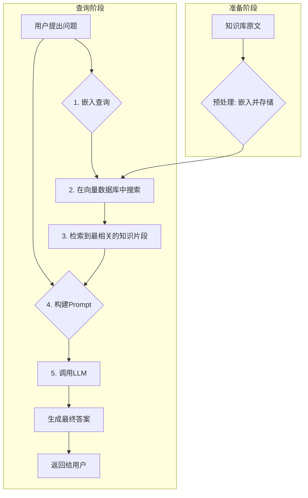

好的，我们开始吧。作为你的知识讲解者，我将遵循“引导式教学模型”，带你一步步深入理解“为应用注入知识：向量数据库的核心概念与集成”这一主题。

### 为应用注入知识：向量数据库的核心概念与集成

---

#### 1. 问题引入

想象一下，你已经成功地利用 LangChain 和一个强大的大型语言模型（LLM）API 构建了一个智能问答机器人。它在通用知识方面表现出色，能和你谈天说地。但当你问它：“我们公司上个季度的财报总结是什么？”或者“根据我们内部最新的技术文档，如何配置新版的服务A？”时，它却只能抱歉地回答：“对不起，我的知识库截止到2023年，并且无法访问你的内部资料。”

这个问题非常现实：**LLM 自身知识是静态的、非私有的。我们如何才能让它掌握我们独有的、实时的、或者私密的知识，从而真正为我们的应用赋能呢？** 这就引出了我们今天的主题——为应用注入外部知识，而向量数据库正是实现这一目标的关键技术。

#### 2. 核心定义与生活化类比

**核心定义**:
**向量数据库 (Vector Database)** 是一种专门设计用来存储、管理和搜索**向量嵌入 (Vector Embeddings)** 的数据库。它的核心能力不是基于关键词进行精确匹配（像传统数据库那样 `WHERE name = '张三'`），而是基于向量的“距离”或“方向”来查找语义上最相似的内容。

**生活化类比**:
把向量数据库想象成一个**拥有超凡空间感和记忆力的图书馆管理员**。

*   **传统数据库**：就像一个老式的图书目录卡片系统。你必须知道书名（`精确关键词`）或作者，才能准确找到那本书。如果你只记得“一本关于一个男孩在魔法学校的故事”，这个系统帮不了你。
*   **向量数据库（这位神奇的管理员）**：你不需要告诉他精确的书名。你只需要向他描述你的**想法**（比如“我想找一本关于孤独、成长和魔法世界的书”）。
    *   **Embedding过程**：管理员在你描述的时候，就在脑海里将你的想法转换成一个“概念坐标”。
    *   **Similarity Search过程**：然后，他利用自己的空间感，迅速在脑海中庞大的“图书概念空间”里，找到与你描述的“概念坐标”最接近的几本书，比如《哈利·波特》、《地海巫师》等，并推荐给你。

在这个类比中，每一本书的内容都被管理员“理解”并放置在了这个概念空间的一个特定位置。内容相似的书，位置就相近。向量数据库做的，就是把这个过程数字化和自动化了。

#### 3. 最小示例

让我们通过一个极简的 Python 代码示例，看看这个过程是如何运作的。我们将使用 `sentence-transformers` 来创建文本的向量嵌入，并使用 `faiss-cpu`（一个由 Facebook AI 开发的高效相似度搜索库）来构建一个内存中的简单向量数据库。

```python
# 安装必要的库
# pip install sentence-transformers faiss-cpu numpy

import numpy as np
from sentence_transformers import SentenceTransformer
import faiss

# 1. 准备数据：一些我们想要注入的“知识”
knowledge_base = [
    "人工智能是未来的核心驱动力。",
    "区块链技术旨在构建去中心化的信任系统。",
    "量子计算有望解决传统计算机无法处理的复杂问题。",
    "云计算提供了按需分配的计算资源与服务。",
    "我们的公司专注于开发先进的人工智能解决方案。"
]

# 2. 创建向量嵌入模型
# 我们选用一个社区流行的、支持中文的预训练模型
model = SentenceTransformer('paraphrase-multilingual-MiniLM-L12-v2')

# 将我们的知识库文本转换为向量
knowledge_vectors = model.encode(knowledge_base)

# 打印一个向量的形状和内容看看
print(f"向量维度 (Dimension): {knowledge_vectors.shape[1]}")
# print(f"第一个知识的向量: {knowledge_vectors[0][:5]}...") # 打印前5个维度

# 3. 构建向量数据库 (使用 FAISS)
# 获取向量维度
d = knowledge_vectors.shape[1]
# 创建一个索引。IndexFlatL2 使用 L2 距离（欧氏距离）进行搜索
index = faiss.IndexFlatL2(d)
# 将向量添加到索引中
index.add(knowledge_vectors)

print(f"索引中向量的数量: {index.ntotal}")

# 4. 执行相似度搜索
# 假设用户的查询是：
user_query = "我们公司是做什么的？"

# a. 将查询也转换为向量
query_vector = model.encode([user_query])

# b. 在索引中搜索最相似的 k 个向量
k = 2  # 查找最相似的2个结果
distances, indices = index.search(query_vector, k)

# c. 输出结果
print(f"\n查询: '{user_query}'")
print("最相关的知识:")
for i, idx in enumerate(indices[0]):
    print(f"  - 结果 {i+1} (距离: {distances[0][i]:.4f}): {knowledge_base[idx]}")

```

**代码解读**：
这个例子完整地展示了核心流程：
1.  **准备知识**：我们有几句关于技术和公司的文本。
2.  **生成嵌入**：`SentenceTransformer` 模型将每一句文本转换成一个高维（通常是384、768等维度）的浮点数向量。
3.  **构建索引**：`faiss` 接收这些向量，并构建一个可以进行高效搜索的数据结构。
4.  **查询与检索**：当用户提出新问题时，我们同样将其转换为向量，然后在 `faiss` 索引中寻找“距离”最近的向量，从而找到语义最相关的原始文本。

#### 4. 原理剖析

向量数据库的工作原理可以拆解为两大核心步骤：**数据向量化** 和 **高效相似度搜索**。

##### a. 数据向量化 (Embedding)

万物皆可 Embedding。无论是文本、图片还是音频，我们都需要一个**嵌入模型 (Embedding Model)** 将其转换为数学上的向量。这个模型通常是深度学习模型（如 BERT、CLIP 等）。

*   **核心思想**：模型被训练用来理解数据的语义。训练完成后，输入一段数据，模型输出的不再是一个分类结果，而是其中间层的一个高维向量。这个向量就代表了输入数据在高维语义空间中的“坐标”。
*   **关键特性**：语义相似的数据，其向量在空间中的位置也相近。例如，“国王”和“女王”的向量距离，会和“男人”和“女人”的向量距离非常相似。

##### b. 高效相似度搜索

当数据库中有数百万甚至数十亿的向量时，如何快速找到与查询向量最相似的几个？逐一计算距离（暴力搜索）是不可行的。因此，向量数据库采用了**近似最近邻 (Approximate Nearest Neighbor, ANN)** 算法。

*   **相似度度量 (Similarity Metrics)**
    最常用的度量方式是**余弦相似度 (Cosine Similarity)**，它衡量两个向量在方向上的接近程度，而非绝对距离。
    
    $
    \text{Cosine Similarity} = \cos(\theta) = \frac{\mathbf{A} \cdot \mathbf{B}}{\|\mathbf{A}\| \|\mathbf{B}\|}
    $
    
    其中 $\mathbf{A}$ 和 $\mathbf{B}$ 是两个向量。结果越接近1，代表方向越一致，语义越相似。

*   **ANN 索引算法**
    ANN 算法通过构建特殊的数据结构（索引）来牺牲一点点精度以换取巨大的速度提升。常见的算法有：
    *   **HNSW (Hierarchical Navigable Small World)**: 像构建一个多层级的“高速公路网”。搜索时先在顶层稀疏的图中找到一个大致方向，然后逐层下降，在越来越密的图中进行更精确的查找。
    *   **LSH (Locality-Sensitive Hashing)**: 通过特殊的哈希函数，让相似的向量有更高的概率落入同一个“桶”里，搜索时只需检查查询向量所在桶内的元素。

##### RAG (Retrieval-Augmented Generation) 流程图

这整个“查询 -> 向量数据库检索 -> LLM 生成答案”的模式，被称为**检索增强生成 (RAG)**。



这个流程清晰地展示了向量数据库是如何作为“外部知识大脑”与 LLM 协同工作的。

#### 5. 常见误区

1.  **误区一：“向量数据库就是用来存向量的，和普通数据库差不多。”**
    *   **纠正**：虽然它确实存储向量，但它的核心价值在于其**专门为高维向量优化的 ANN 索引和查询引擎**。普通数据库用 B-树等结构来索引低维、标量数据，如果强行用它们来处理高维向量的相似度搜索，性能会随着数据量和维度的增加而急剧下降（这被称为“维度灾难”）。

2.  **误区二：“向量数据库本身能‘理解’文本或图片。”**
    *   **纠正**：数据库本身是数学工具，它只认识向量。真正的“理解”能力来自于**外部的嵌入模型**。如果你的嵌入模型质量不高，无法将语义相似的内容映射到相近的向量空间，那么即使最强大的向量数据库也无法返回好的结果。**模型的质量决定了检索效果的上限，数据库的性能决定了检索效率。**

#### 6. 拓展应用

(由于 `include_case_snippets` 为 `false`，此处仅做概念性介绍)

向量数据库的应用远不止于 RAG：
*   **推荐系统**：通过用户的行为（点击、购买）生成用户向量和物品向量。为用户推荐与其向量最相似的物品向量。
*   **以图搜图/以歌搜歌**：将图片或音频片段转换为向量，在数据库中寻找最相似的视觉或听觉内容。
*   **异常检测**：在大量的正常数据向量中，寻找那些离群的、与所有已知模式都“距离”很远的向量，它们很可能就是异常点。

#### 7. 总结要点

1.  **核心目的**：向量数据库为 LLM 应用解决了**知识注入**的难题，使其能够访问私有、实时或领域特定的信息，这是构建企业级AI应用的基础。
2.  **工作流**：其核心工作流程是 **“嵌入-存储-搜索”**。所有数据先通过嵌入模型转化为向量，然后存入数据库，最后通过计算向量间的相似度来检索信息。
3.  **两大支柱**：向量数据库的魔法来源于两个关键技术：高质量的**嵌入模型**（负责语义理解）和高效的**近似最近邻（ANN）算法**（负责快速检索）。
4.  **RAG 架构**：向量数据库是实现检索增强生成（RAG）架构的核心组件，该架构通过“先检索、后生成”的方式，有效提升了LLM回答的准确性和时效性。

#### 8. 思考与自测

1.  假设你要为一个电商网站开发一个智能客服机器人。除了产品描述本身，你认为还有哪些数据（例如：用户评论、Q&A、退货政策等）适合被向量化并存入向量数据库？为什么将这些信息向量化能提升客服机器人的回答质量？
2.  在我们的代码示例中，我们使用了 `IndexFlatL2`，这是一种精确但较慢的搜索方法（暴力搜索）。如果你的知识库从5条增加到500万条，你认为继续使用它会遇到什么问题？你会考虑转向哪类索引（提示：回顾原理剖析部分）来解决这个问题？

---
#### 参考文献
1.  FAISS (Facebook AI Similarity Search) GitHub Repository: [https://github.com/facebookresearch/faiss](https://github.com/facebookresearch/faiss)
2.  Sentence-Transformers Documentation: [https://www.sbert.net/](https://www.sbert.net/)
3.  Jay Alammar, The Illustrated Transformer: [http://jalammar.github.io/illustrated-transformer/](http://jalammar.github.io/illustrated-transformer/) (有助于理解嵌入模型的基础)