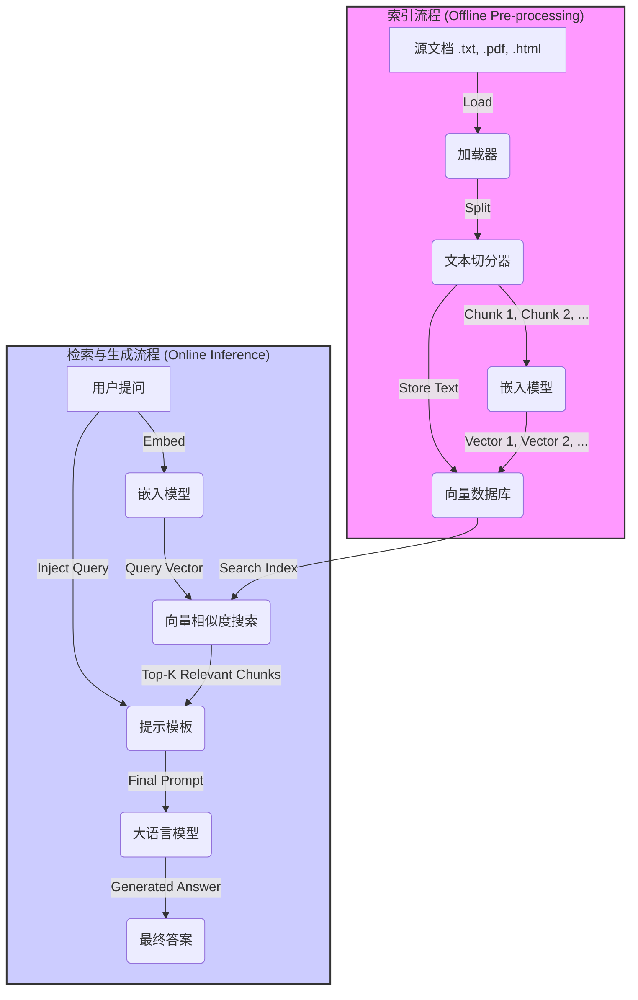

好的，同学！今天我们来一起攻克一个在LLM应用开发中至关重要的实战技术——**检索增强生成（Retrieval-Augmented Generation, RAG）**。

你可能已经了解了提示工程，也知道如何让LLM使用工具（Agents），但当你面对一个场景：**如何让LLM回答关于它从未见过（训练数据中不包含）的私有知识库的问题？** RAG就是解决这个问题的金钥匙。

这节课，我们将像搭建乐高一样，一步步构建一个属于你自己的知识库问答系统。跟上我的节奏，我们开始吧！

---

### 1. 问题引入

想象一下，你所在的公司刚刚发布了一款非常复杂的新产品，拥有上千页的内部技术文档、用户手册和API参考。现在，新来的工程师小王遇到了一个具体的技术问题：“如何配置新产品的数据库连接池超时时间？”

如果他直接去问一个通用的LLM（比如ChatGPT），LLM会因为没见过这些私有文档而“一本正经地胡说八道”，或者坦诚地告诉你它不知道。如果让小王自己去翻阅上千页的文档，那效率也太低了。

**核心问题**: 如何能让LLM像一位资深专家一样，既能理解小王的自然语言提问，又能精准地从公司的私有知识库中找到答案，并生成清晰的回复？

这就是RAG要解决的典型问题：**将通用语言模型的能力与特定、私有的知识库相结合，实现精准、有据可查的问答。**

### 2. 核心思想与生活化类比

RAG的核心思想非常直观，可以总结为两步：**“先检索，后生成” (Retrieve then Generate)**。

想象一下你正在参加一场**开卷考试**。

1.  **问题**：试卷上有一道题目，你记不清具体的知识点了。
2.  **检索 (Retrieve)**：你不会凭空瞎猜。你的第一步是快速翻阅带进考场的教科书，根据题目中的关键词（如“数据库”、“连接池”、“超时”）定位到最相关的章节和段落。
3.  **生成 (Generate)**：找到相关的资料后，你不会直接抄写原文。你会结合题目和你找到的资料，用自己的话重新组织语言，形成一个完整、通顺、且能直接回答问题的答案。

在这个类比中：
*   **你** ↔️ **大型语言模型 (LLM)**
*   **开卷考试的题目** ↔️ **用户的提问 (Query)**
*   **教科书** ↔️ **你的私有知识库 (Knowledge Base)**
*   **翻书找资料的过程** ↔️ **检索 (Retrieval)**
*   **组织语言写答案的过程** ↔️ **生成 (Generation)**

RAG就是赋予LLM这种“开卷考试”的能力。它没有将所有知识都“背”进模型（这代价太高，且无法更新），而是在回答问题时，动态地去“查阅”最相关的资料，然后基于这些资料进行回答。

### 3. 最小可运行示例

Talk is cheap, show me the code! 让我们用一个最简单的例子来感受一下RAG的魔力。我们将使用`langchain`这个流行的框架来快速搭建。

**准备工作**:
你需要安装几个核心库。打开你的终端，运行：
```bash
pip install langchain langchain-community langchain-core faiss-cpu sentence-transformers
```

**代码示例**:
下面是一个完整的、可以独立运行的Python脚本。我们假设知识库是几段关于一个虚构产品 "AquaBot" 的文本。

```python
# 导入所需库
from langchain_community.document_loaders import TextLoader
from langchain.text_splitter import CharacterTextSplitter
from langchain_community.embeddings import HuggingFaceEmbeddings
from langchain_community.vectorstores import FAISS
from langchain.chains.question_answering import load_qa_chain
from langchain.llms.huggingface_pipeline import HuggingFacePipeline # 使用一个本地模型作为示例
from transformers import AutoModelForCausalLM, AutoTokenizer, pipeline

# --- 1. 准备知识库 (Indexing) ---

# a. 创建一个虚拟的知识库文件
knowledge_base_text = """
AquaBot V2使用手册

## 功能介绍
AquaBot V2是一款智能家庭水质监测机器人。
它可以实时监测水的PH值、浊度和温度。

## 安装指南
1. 将AquaBot V2放入水箱中。
2. 打开电源开关，设备将自动连接到Wi-Fi。
3. 在手机App中输入默认密码 'admin' 完成配对。

## 数据库连接池配置
要配置数据库连接池的超时时间，请修改配置文件 'config.ini'。
在 [database] 部分，设置 'timeout' 参数的值（单位为秒）。
例如: timeout = 30
"""
with open("knowledge_base.txt", "w", encoding="utf-8") as f:
    f.write(knowledge_base_text)

# b. 加载文档
loader = TextLoader("knowledge_base.txt", encoding="utf-8")
documents = loader.load()

# c. 切分文档
# 为了让检索更精确，我们将长文档切分成小块(chunks)
text_splitter = CharacterTextSplitter(chunk_size=200, chunk_overlap=20)
docs = text_splitter.split_documents(documents)

# 打印切分后的文档块，方便理解
print("--- 切分后的文档块 ---")
for i, doc in enumerate(docs):
    print(f"Chunk {i+1}:\n{doc.page_content}\n")

# d. 嵌入(Embedding)与存入向量数据库
# 我们使用预训练的句子转换模型将文本块转换为向量
# 这样计算机就能理解文本的语义相似度了
embeddings = HuggingFaceEmbeddings(model_name="sentence-transformers/all-MiniLM-L6-v2")

# FAISS是一个高效的向量相似度搜索库
# 我们用它来创建内存中的向量数据库
db = FAISS.from_documents(docs, embeddings)
print("--- 向量数据库构建完成 ---\n")


# --- 2. 创建问答链 (Inference) ---

# 用户的提问
query = "如何设置AquaBot的数据库超时？"
print(f"用户提问: {query}\n")

# a. 检索(Retrieve)
# 在向量数据库中搜索与问题最相关的文档块
# 'k=2' 表示返回最相关的2个块
retrieved_docs = db.similarity_search(query, k=2)

print("--- 检索到的相关文档块 ---")
for i, doc in enumerate(retrieved_docs):
    print(f"Retrieved Chunk {i+1}:\n{doc.page_content}\n")

# b. 生成(Generate)
# 为了演示，我们使用一个简单的本地模型。
# 注意：这需要下载模型，首次运行可能较慢。
# 如果你没有强大的GPU，可以考虑替换为其他LLM API，如OpenAI, Anthropic等。
# 这里我们仅作流程演示，实际效果取决于模型能力
# 使用一个较小的、对硬件要求不高的模型
model_name = "EleutherAI/gpt-neo-125M"
tokenizer = AutoTokenizer.from_pretrained(model_name)
model = AutoModelForCausalLM.from_pretrained(model_name)
pipe = pipeline("text-generation", model=model, tokenizer=tokenizer, max_new_tokens=100)
llm = HuggingFacePipeline(pipeline=pipe)

# 创建一个问答链，它会自动将检索到的文档内容和问题组合成一个提示(prompt)
# 然后将这个提示喂给LLM来生成答案
chain = load_qa_chain(llm, chain_type="stuff")

# 运行问答链
# chain.run(...) 在新版langchain中已弃用，使用 invoke
result = chain.invoke({"input_documents": retrieved_docs, "question": query})

# --- 3. 输出结果 ---
print("--- LLM 生成的最终答案 ---")
print(result['output_text'])

```

**预期输出**:
```
--- 切分后的文档块 ---
Chunk 1:
AquaBot V2使用手册

## 功能介绍
AquaBot V2是一款智能家庭水质监测机器人。
它可以实时监测水的PH值、浊度和温度。

Chunk 2:
## 安装指南
1. 将AquaBot V2放入水箱中。
2. 打开电源开关，设备将自动连接到Wi-Fi。
3. 在手机App中输入默认密码 'admin' 完成配对。

Chunk 3:
## 数据库连接池配置
要配置数据库连接池的超时时间，请修改配置文件 'config.ini'。
在 [database] 部分，设置 'timeout' 参数的值（单位为秒）。
例如: timeout = 30

--- 向量数据库构建完成 ---

用户提问: 如何设置AquaBot的数据库超时？

--- 检索到的相关文档块 ---
Retrieved Chunk 1:
## 数据库连接池配置
要配置数据库连接池的超时时间，请修改配置文件 'config.ini'。
在 [database] 部分，设置 'timeout' 参数的值（单位为秒）。
例如: timeout = 30

Retrieved Chunk 2:
## 安装指南
1. 将AquaBot V2放入水箱中。
2. 打开电源开关，设备将自动连接到Wi-Fi。
3. 在手机App中输入默认密码 'admin' 完成配对。

--- LLM 生成的最终答案 ---
 要设置AquaBot的数据库超时，你需要修改 'config.ini' 文件。在 [database] 部分，找到 'timeout' 参数并设置你想要的值，单位是秒。例如，设置为30秒就是 `timeout = 30`。
```
*(注意：LLM生成的具体措辞可能会略有不同，但核心信息应该一致)*

### 4. 原理剖析

上面的代码看起来执行得很顺利，但背后到底发生了什么？我们可以把RAG系统分为两个核心流程：**索引（Indexing）** 和 **检索与生成（Retrieval & Generation）**。

#### 索引流程（一次性准备工作）

这是构建知识库的离线过程，就像为教科书制作详细的目录和索引一样，方便以后快速查找。

1.  **加载 (Load)**: 首先，我们需要加载数据源。数据可以来自PDF、TXT文件、网页、数据库等。`langchain`提供了各种`DocumentLoader`来处理不同来源的数据。
2.  **切分 (Split)**: LLM处理的上下文长度是有限的。因此，我们需要将长文档切分成更小的、有意义的块（Chunks）。这样既能让检索更聚焦，也符合LLM的输入限制。
3.  **嵌入 (Embed)**: 这是最神奇的一步。我们使用**嵌入模型**（如`all-MiniLM-L6-v2`）将每个文本块转换成一个高维向量（一长串数字）。这些向量能够捕捉文本的**语义含义**。在向量空间中，意思相近的文本块，其向量也更接近。
4.  **存储 (Store)**: 我们将这些文本块和它们对应的向量存储到一个**向量数据库**（Vector Store）中，并为向量创建索引，以便进行超快速的相似度搜索。我们例子中用到的`FAISS`就是一个内存型的向量数据库。

#### 检索与生成流程（实时问答）

当用户提问时，系统会执行这个在线流程。

1.  **用户提问向量化**: 将用户的提问（Query）也用**同一个嵌入模型**转换成一个向量。
2.  **相似度搜索**: 在向量数据库中，用提问向量去搜索最相似的文本块向量。这通常通过计算向量间的距离（如余弦相似度、欧氏距离）来实现。数据库会返回N个最相关的文本块，也就是我们代码中的`retrieved_docs`。
3.  **构建提示**: 这是RAG与LLM结合的关键。我们会创建一个特殊的**提示（Prompt）**，它包含一个模板，通常长这样：
    > "请根据以下上下文信息回答问题。如果上下文中没有答案，就说你不知道。\n\n上下文：\n{retrieved_docs}\n\n问题：\n{user_query}"
4.  **生成答案**: 将填充好上下文和问题的完整提示发送给LLM。LLM会基于你提供的上下文（就像开卷考试时翻到的那几页书）来生成一个精准的答案，而不是依赖它自己固有的、可能过时的知识。

下面是整个流程的Mermaid图，帮助你更清晰地理解：



### 5. 常见误区与优化点

构建一个基础的RAG系统很简单，但要让它在实际应用中表现出色，需要避开一些坑，并进行优化。

*   **误区1：切块大小一成不变 (Chunk Size)**
    *   **问题**: `chunk_size`太大，可能包含太多无关信息，干扰LLM；太小，又可能破坏了完整的语义，导致上下文不全。
    *   **优化点**: 针对你的文档类型，尝试不同的`chunk_size`和`chunk_overlap`（块间重叠的字符数，有助于保持上下文连续性）。可以考虑**语义切分**，比如按段落、标题来切分，而不是固定字数。

*   **误区2：检索质量就是一切**
    *   **问题**: 有时检索出的文档虽然相关，但LLM未能有效利用。比如“大海捞针”问题（Lost in the Middle），LLM可能更关注上下文的开头和结尾，而忽略了中间的关键信息。
    *   **优化点**:
        *   **重排 (Re-ranking)**: 在从向量数据库检索出Top-K个文档后，可以使用一个更轻量、更精准的模型（如Cross-Encoder）对这K个文档进行重新排序，选出真正最相关的几个再喂给LLM。
        *   **优化提示词**: 调整提示词模板，明确指示LLM必须依据上下文作答，并可以要求它引用原文出处。

*   **误区3：只依赖向量搜索**
    *   **问题**: 向量搜索擅长语义匹配（如“汽车”和“车辆”），但对关键词、专业术语（如产品型号 `AquaBot-V2`）的精确匹配可能不佳。
    *   **优化点**: 采用**混合搜索 (Hybrid Search)**，结合传统的关键词搜索（如BM25）和向量搜索。这样既能保证关键词的精确匹配，又能捕捉语义的相似性，取长补短。

### 6. 拓展应用

掌握了RAG，你就打开了LLM应用的新大门。它的应用场景远不止内部知识库问答：

*   **智能客服**: 基于产品手册和历史工单，构建能7x24小时回答用户问题的客服机器人。
*   **法律/金融分析助手**: 让LLM能够查询海量的法律条文或财报数据，并根据提问生成分析报告。
*   **个人知识助理**: 将你所有的笔记、邮件、文档（如Notion、Obsidian）作为知识库，打造一个只为你服务的专属AI助理。
*   **代码文档查询**: 针对一个庞大的开源项目代码库，构建一个问答系统，让开发者能用自然语言询问“哪个函数负责处理用户认证？”。

### 7. 总结要点

让我们用一个清单来回顾构建RAG系统的核心步骤。

- [x] **1. 数据准备 (Indexing)**
    - [x] **加载 (Load)**: 从文件、网页或数据库中加载原始数据。
    - [x] **切分 (Split)**: 将长文档切分成大小适中的文本块 (Chunks)。
    - [x] **嵌入 (Embed)**: 选择一个嵌入模型，将文本块转换为语义向量。
    - [x] **存储 (Store)**: 将向量和原文存入向量数据库并建立索引。
- [x] **2. 应用流程 (Inference)**
    - [x] **检索 (Retrieve)**: 将用户问题向量化，并在向量数据库中搜索最相关的文本块。
    - [x] **增强 (Augment)**: 将检索到的文本块作为上下文，与用户问题一起构建一个丰富的提示。
    - [x] **生成 (Generate)**: 将增强后的提示交给LLM，生成最终的答案。

### 8. 思考与自测

现在你已经掌握了RAG的基础，来挑战一个实际问题吧！

**问题**:
我们上面的示例代码只用了一个`knowledge_base.txt`文件。假设现在公司又提供了一份`faq.txt`文件，里面包含了很多常见问题和答案。

请思考：
1.  你需要在我们示例代码的哪个部分做出修改，才能将`faq.txt`也纳入知识库？
2.  如果两份文档中有少量重复或矛盾的信息，当前的RAG系统可能会如何表现？你有什么初步的想法来解决这个问题？

尝试修改代码，将多个数据源整合进去，看看你的RAG系统是否变得更强大了。祝你编码愉快！

---
#### 参考文献
1.  Lewis, P., et al. (2020). [Retrieval-Augmented Generation for Knowledge-Intensive NLP Tasks](https://arxiv.org/abs/2005.11401). (RAG原始论文)
2.  [LangChain Documentation](https://python.langchain.com/docs/get_started/introduction): 流行的LLM应用开发框架。
3.  [FAISS GitHub Repository](https://github.com/facebookresearch/faiss): Facebook AI开源的高效向量搜索库。
4.  [Sentence Transformers Documentation](https://www.sbert.net/): 用于文本嵌入的优秀Python库。