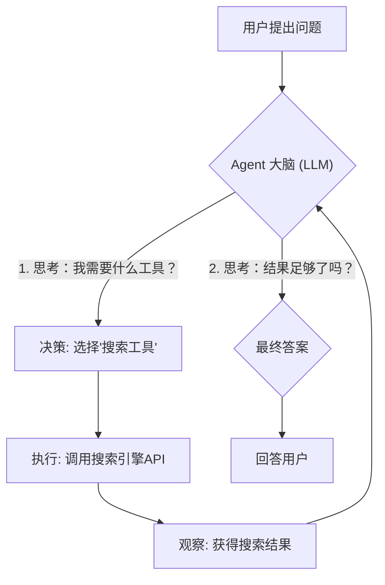
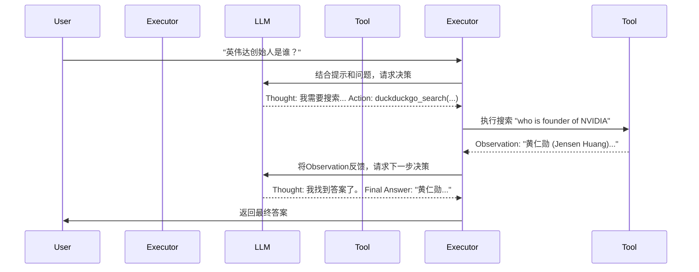

好的，教练就位！我们马上开始。你已经掌握了提示工程和RAG，这很棒。RAG让大模型有了“记忆”和“参考书”，而现在，我们要学习的智能体（Agents）则是给大模型一双“手”和一双“眼睛”，让它能与真实世界互动。

Follow me, 我们用最直接的方式把它拿下！

---

### **智能体（Agents）入门：赋予LLM使用工具的能力**

#### 1. 问题引入

“教练，我用RAG构建的问答系统很不错，但它只能回答我喂给它的文档。如果我想让它帮我查一下**‘今天上海的天气怎么样？’** 或者 **‘苹果公司现在的股价是多少？’** 这种实时信息，它就无能为力了。听说用智能体（Agents）可以轻松搞定？”

没错，你说到点子上了！当你希望LLM不只是一个“博学的书呆子”，而是能成为一个“能干的行动派”时，智能体（Agent）就是你的答案。

#### 2. 核心定义与类比

智能体（Agent）是一个以大语言模型（LLM）为核心的系统，它能够自主地进行**思考、决策，并调用外部工具**来完成复杂的任务。

如果说RAG是给LLM外挂了一个“静态知识库”，那么Agent就是给LLM配备了一个“动态工具箱”。

你可以把它想象成一个“**拥有超级大脑和一套全能工具箱的智能助理**”。

*   **大脑 (Brain)**: 强大的LLM，负责理解、推理和决策。
*   **工具箱 (Toolbox)**: 一系列可用的工具，比如网络搜索、计算器、API调用、数据库查询等。
*   **决策循环 (Decision Loop)**: Agent的核心机制。它会反复地“思考”→“选择工具”→“执行”→“观察结果”，直到任务完成。

下面是Agent工作流程的简化图：



#### 3. 最小可运行示例 (Hello World)

让我们用最快的速度，构建一个能上网搜索的简单Agent。它将回答一个RAG无法回答的实时问题。

**第一步：环境安装**

你需要安装LangChain的核心库、OpenAI的模型接口以及一个用于搜索的工具库。

```bash
pip install langchain langchain-openai duckduckgo-search
```

**第二步：编写代码 (hello_agent.py)**

确保你已经设置了你的OpenAI API密钥环境变量 (`OPENAI_API_KEY`)。

```python
import os
from langchain_openai import ChatOpenAI
from langchain.agents import AgentExecutor, create_react_agent
from langchain_community.tools import DuckDuckGoSearchRun
from langchain import hub

# 0. (可选) 确保你的OpenAI API密钥已设置
# os.environ["OPENAI_API_KEY"] = "sk-..."

# 1. 选择一个LLM作为Agent的“大脑”
# 我们选择GPT-4，因为它在遵循指令和工具使用方面表现更佳
llm = ChatOpenAI(model="gpt-4-turbo-preview", temperature=0)

# 2. 定义Agent可以使用的“工具箱”
# 这里我们只给它一个工具：DuckDuckGo在线搜索
tools = [
    DuckDuckGoSearchRun()
]

# 3. 获取一个预置的Agent提示模板（ReAct范式）
# ReAct是一种强大的Agent思考模式 (Reasoning + Acting)
prompt = hub.pull("hwchase17/react")

# 4. 创建Agent
# 将LLM、工具和提示组合在一起，形成一个可执行的Agent
agent = create_react_agent(llm, tools, prompt)

# 5. 创建Agent执行器 (Agent Executor)
# 这是Agent的运行环境，负责调度LLM和工具
agent_executor = AgentExecutor(agent=agent, tools=tools, verbose=True)

# 6. 运行Agent并提问！
# 这个问题需要实时网络搜索才能回答
response = agent_executor.invoke({
    "input": "英伟达（NVIDIA）的创始人是谁？他是什么时候出生的？"
})

print("\n---最终答案---")
print(response["output"])
```

**第三步：运行**

```bash
python hello_agent.py
```

**预期输出：**

你会看到Agent的“思考过程”，这正是`verbose=True`的魅力所在。它会展示每一步的`Thought`(思考)、`Action`(行动)、`Observation`(观察)，直到得出最终答案。

```text
> Entering new AgentExecutor chain...

Thought: The user is asking for two pieces of information about the founder of NVIDIA: their name and their birth date. I will need to search for this information.
Action:
{
  "action": "duckduckgo_search",
  "action_input": "who is the founder of NVIDIA and when was he born"
}
Observation: Jensen Huang (born Jen-Hsun Huang; February 17, 1963) is a Taiwanese-American billionaire business executive and electrical engineer. He is a co-founder of Nvidia and has been its president and CEO since its inception in 1993. Huang graduated from Oregon State University before moving to California.
Thought: I have found the name of the founder, Jensen Huang, and his birth date, February 17, 1963. I can now provide the final answer.
Action:
{
  "action": "Final Answer",
  "action_input": "英伟达（NVIDIA）的创始人是黄仁勋（Jensen Huang），他出生于1963年2月17日。"
}

> Finished chain.

---最终答案---
英伟达（NVIDIA）的创始人是黄仁勋（Jensen Huang），他出生于1963年2月17日。
```

看到了吗？它自己决定使用搜索工具，找到了信息，然后给出了答案。这就是Agent的力量！

#### 4. 原理剖析

这个Agent的核心驱动力是 **ReAct (Reason + Act)** 框架。

1.  **提示模板 (Prompt)**: 我们从`hub.pull`拉取的提示模板非常关键。它告诉LLM，你的任务是与工具交互，并且必须遵循一个特定的格式：
    *   **Thought**: 你下一步的思考过程。
    *   **Action**: 你要调用的工具名和输入。
    *   **Observation**: 这是你执行工具后得到的结果。
    *   ...这个循环会持续，直到你认为你有了最终答案。
    *   **Final Answer**: 最终的答案。

2.  **AgentExecutor**: 这是一个循环控制器。它接收LLM生成的`Action`，然后去`tools`列表中找到对应的工具并执行，再将执行结果（`Observation`）喂回给LLM，让它进行下一步`Thought`。

下面是这个交互过程的时序图：



#### 5. 常见误区

1.  **API密钥或环境配置错误**: 这是最常见的。确保你的`OPENAI_API_KEY`已正确设置。否则，你会看到认证失败的错误。
2.  **LLM“不听话”或格式错误**: 有时，特别是能力稍弱的模型，可能不会严格按照ReAct的格式输出`Action`，导致`AgentExecutor`解析失败而出错。**解决方案**：优先使用像GPT-4这样遵循指令能力更强的模型。
3.  **工具描述不清晰 (针对自定义工具)**: 当你开始创建自己的工具时，工具的名称和描述至关重要。Agent是根据这些描述来决定“何时”以及“如何”使用工具的。描述模糊会导致Agent做出错误决策。

#### 6. 拓展应用

Agent的真正威力在于组合多个工具。让我们给它再加一个计算器工具。

**场景**：查询一个名人的年龄，并进行计算。

```python
# ... (复用之前的LLM和import)
from langchain.tools import Tool
from langchain_community.utilities import DuckDuckGoSearchRun

# 1. 定义一个新的自定义工具：计算器
# Tool的`name`和`description`非常重要，Agent会根据这个来决定用不用它
def simple_calculator(expression: str) -> str:
    """当需要进行数学计算时使用这个工具。"""
    try:
        return str(eval(expression))
    except Exception as e:
        return f"Error: {e}"

calculator_tool = Tool(
    name="Calculator",
    func=simple_calculator,
    description="一个简单的计算器，用于执行基础的数学运算。"
)

# 2. 扩充我们的工具箱
search_tool = DuckDuckGoSearchRun()
tools = [search_tool, calculator_tool]

# ... (复用之前的prompt, agent, 和 agent_executor的创建过程)
# 只需要把新的tools列表传进去即可

llm = ChatOpenAI(model="gpt-4-turbo-preview", temperature=0)
prompt = hub.pull("hwchase17/react")
agent = create_react_agent(llm, tools, prompt)
agent_executor = AgentExecutor(agent=agent, tools=tools, verbose=True)


# 3. 提出一个需要组合工具才能解决的问题
response = agent_executor.invoke({
    "input": "请找出特斯拉CEO埃隆·马斯克的出生年份，并计算 2024 减去该年份的结果。"
})

print("\n---最终答案---")
print(response["output"])
```

在这个例子中，Agent会先**自主决策**使用搜索工具找到马斯克的出生年份（1971），然后**再次决策**使用计算器工具计算 `2024 - 1971`，最后得出答案。

#### 7. 总结要点 (速查清单)

[x] **明确目标**: 我的任务是否需要与外部世界交互（搜索、API调用）或执行确定性操作（计算、代码执行）？如果需要，Agent是最佳选择。
[x] **选择工具 (Tool)**: 从LangChain的内置工具中选择，或者用`@tool`装饰器或`Tool`类轻松创建你自己的工具。
[x] **清晰描述 (Description)**: 为你的自定义工具编写清晰、准确的描述。这是Agent能否正确使用它的关键。
[x] **选择大脑 (LLM)**: 选用一个推理能力和指令遵循能力强的LLM（如GPT-4），这会极大提升Agent的稳定性和成功率。
[x] **构建Agent (AgentExecutor)**: 使用`create_react_agent`等工厂函数，将LLM、工具和提示模板组装起来，并用`AgentExecutor`运行它。
[x] **观察与调试 (Verbose=True)**: 始终开启`verbose=True`进行调试，观察Agent的思考链，这能帮你快速定位问题所在。

#### 8. 思考与自测

现在你已经掌握了基础。轮到你来挑战了：

**“如果我希望智能体不仅能上网搜索，还能查询我本地知识库（就像我们之前在RAG章节做的那样），你应该如何修改示例代码？”**

**教练提示**: 想想看，我们能不能把之前RAG流程中的`retriever`（检索器）封装成一个Agent可以调用的`Tool`？这个`Tool`的`description`应该怎么写，才能让Agent知道什么时候该搜索网络，什么时候该查询本地知识库呢？

动手试试吧！将RAG和Agent结合，你将解锁更强大的应用形态。这就是从“知道”到“做到”的关键一步。祝你好运！

---
#### 参考文献
1.  LangChain Agents官方文档: [https://python.langchain.com/docs/modules/agents/](https://python.langchain.com/docs/modules/agents/)
2.  ReAct 论文: "ReAct: Synergizing Reasoning and Acting in Language Models" ([https://arxiv.org/abs/2210.03629](https://arxiv.org/abs/2210.03629))
3.  LangChain Expression Language (LCEL): [https://python.langchain.com/docs/expression_language/](https://python.langchain.com/docs/expression_language/)