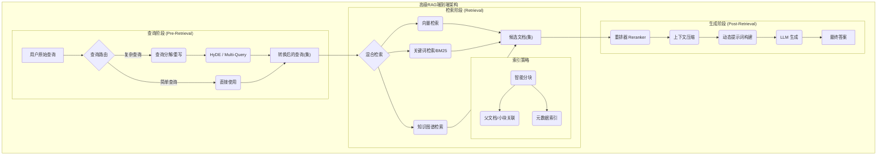

好的，作为你的架构师与导师，我将引导你深入探索高级RAG（Retrieval-Augmented Generation）的架构设计。我们将摒弃基础概念，直接进入专家级的设计与权衡，目标是构建一个不仅能“回答问题”，而且能“高质量、高精度地解决问题”的系统。

我们的对话将遵循一个严谨的结构，从宏观的痛点出发，逐步深入到微观的技术细节与实现，最终让你不仅知其然，更知其所以然。

***

### 1. 问题引入: 从“能用”到“好用”的鸿沟

我们已经成功构建了基础的RAG系统。它能连接知识库，对简单、明确的问题给出不错的回答。然而，在真实业务场景中，我们很快遇到了瓶颈，这些痛点你可能已经深有体会：

*   **检索失配 (Retrieval Mismatch):** 用户的问题在概念上与文档相关，但由于用词不同，导致向量相似度低，检索不到最相关的文档。例如，用户问“公司去年的财务健康状况如何？”，而文档中的表述是“2023年度资产负债表分析”。
*   **信息迷失 (Lost in the Middle):** 检索到的文档很长，虽然包含了答案，但关键信息被淹没在大量无关文本中。LLM在处理长上下文时，往往会忽略中间部分的信息，导致生成答案不完整或不准确。
*   **上下文碎片化 (Context Fragmentation):** 完整的答案需要综合来自多个不同文档（或同一文档的不同部分）的信息，但基础RAG一次只检索最相似的几个“独立”文本块，无法构建完整的逻辑链。
*   **抽象问题无力 (High-level Question Incapability):** 当用户提出“总结一下项目X的风险和挑战”这类高度概括性的问题时，系统中并没有一个文档能直接对应，答案散落在多个事件报告和会议纪要中。

这些问题，正是高级RAG策略要解决的核心。我们的任务，是从一个简单的“信息检索器”，升级为一个具备初步“推理与综合能力”的“知识引擎”。

### 2. 核心目标与类比: 打造一个智能“研究助理团队”

**核心设计目标:**

1.  **高精度 (High Precision):** 确保提供给LLM的上下文信息，每一条都与问题高度相关。
2.  **高召回 (High Recall):** 确保所有与问题相关的关键信息，都能被检索系统“捕获”。
3.  **上下文完整性 (Contextual Completeness):** 保证LLM获取的信息足以形成一个完整的、无歧义的答案。
4.  **鲁棒性 (Robustness):** 能够优雅地处理模糊、复杂或间接的查询。

**架构类比: 从“图书管理员”到“研究助理团队”**

*   **基础RAG** 就像一个勤奋的**图书管理员**。你给他一个关键词（Query），他会快速地从索引卡片（Vector Index）中找出最相似的书籍（Documents）给你。他速度快，但理解力有限。

*   **高级RAG** 则是一个高效的**研究助理团队**：
    *   **查询分析师 (Query Analyst):** 接收你的原始问题，但他不会直接去查。他会先分析你的真实意图，将模糊的问题分解成多个具体的、可执行的子问题，甚至预测你可能需要什么类型的答案（**查询转换**）。
    *   **档案研究员 (Archive Researcher):** 拿到分析师处理过后的任务清单，快速地从海量档案库（Vector Store）中，拉取一大批可能相关的资料（**多路检索**）。他追求的是“宁可错杀，不可放过”，保证高召回率。
    *   **领域专家 (Subject Matter Expert):** 对研究员找来的一大堆资料进行精读和筛选，剔除不相关的，并将最核心、最关键的几份资料按重要性排序（**重排/Reranking**）。他追求的是极致的精准度。
    *   **报告撰写人 (Report Writer - a.k.a. the LLM):** 最后，他只阅读领域专家精选并排序后的材料，并根据这些高质量的上下文，撰写一份条理清晰、内容详实的最终报告（**高质量生成**）。

这个团队协作的模式，就是我们高级RAG架构设计的核心思想：**分层、解耦、各司其职**。

### 3. 最小示例 (核心组件图)

在我们深入探讨整个团队的复杂协作之前，先来看一下这个团队区别于“单个图书管理员”的最核心的升级点：引入了“领域专家”（Reranker）。

```mermaid
graph TD
    subgraph "高级RAG核心流"
        A[用户查询] --> B{"检索器 (Retriever)"}
        B -- 召回 Top-K 候选文档 --- C("重排器 (Reranker"))
        C -- 精选 Top-N 核心文档 --- D[LLM 生成器]
        D -->|最终答案| E[用户]
    end

    style B fill:#cde4ff,stroke:#333,stroke-width:2px
    style C fill:#ffe4b5,stroke:#333,stroke-width:2px,stroke-dasharray: 5 5
    style D fill:#cde4ff,stroke:#333,stroke-width:2px
```

这个最简化的流程图展示了架构的核心变化：我们不再盲目相信检索器的初步结果，而是在检索和生成之间增加了一个**关键的“精炼”步骤**——重排（Reranking）。这是从“能用”到“好用”的第一步，也是最立竿见影的优化之一。

### 4. 原理剖析 (详细设计与权衡)

现在，让我们来详细设计这个“研究助理团队”的每个部分。我们将整个流程划分为三个阶段：**查询阶段（Pre-Retrieval）**、**检索阶段（Retrieval）** 和 **生成阶段（Post-Retrieval）**。



#### **阶段一：查询阶段 (Pre-Retrieval) - 理解真实意图**

*   **组件职责**:
    *   **查询路由 (Query Router):** 这是一个轻量级的决策模型（或基于规则的分类器），用于判断查询的类型。是简单的关键词查找？还是需要深度分析的复杂问题？或是需要与历史对话结合？路由的结果决定了后续走哪个处理流程。
    *   **查询转换 (Query Transformation):**
        *   **多查询生成 (Multi-Query):** 使用LLM将一个复杂问题分解为多个不同角度的子问题，并行检索，以提高召回率。
        *   **假设性文档嵌入 (HyDE - Hypothetical Document Embeddings):** 让LLM先就用户问题“幻想”出一个可能的答案，然后对这个幻想的答案进行Embed，用这个Embedding去检索。因为假设的答案在语言风格和内容上更接近知识库中的文档，所以检索效果更好。
        *   **查询重写 (Query Rewriting):** 在对话场景中，将用户的追问（如“那它呢？”）与历史对话结合，重写成一个完整的、独立的查询。

*   **设计权衡**:
    *   **延迟 vs. 召回率**: 每次查询转换都至少增加一次LLM调用，显著增加系统延迟。因此，需要通过查询路由来决策，只对必要的复杂查询启用转换，简单查询则直通。
    *   **实现**: `langchain` 和 `llama-index` 都提供了开箱即用的模块。

*   **代码示例 (Multi-Query)**:
    ```python
    import_llm_and_prompt_library # e.g., from langchain.llms import OpenAI
    from langchain.chains import LLMChain
    from langchain.prompts import PromptTemplate
    
    # 设计一个Prompt模板，让LLM生成多个视角的查询
    prompt_template = """
    You are an AI language model assistant. Your task is to generate 3 
    different versions of the given user question to retrieve relevant documents from a vector 
    database. By generating multiple perspectives on the user question, your goal is to help
    the user overcome some of the limitations of distance-based similarity search.
    
    Original question: {question}
    
    Provide these alternative questions separated by newlines.
    """
    
    PROMPT = PromptTemplate(template=prompt_template, input_variables=["question"])
    llm_chain = LLMChain(llm=llm, prompt=PROMPT)
    
    original_query = "What are the main risks and mitigation strategies for the 'Project Titan' launch?"
    # 这会生成类似 "Project Titan launch risks", "Mitigation plan for Titan project", "Post-launch challenges of Project Titan" 等查询
    multi_queries = llm_chain.run(original_query).split('\n')
    
    # 接下来，你可以用这些查询并行检索
    retrieved_docs = []
    for query in multi_queries:
        retrieved_docs.extend(vector_store.similarity_search(query))
        
    # 去重
    unique_docs = {doc.page_content: doc for doc in retrieved_docs}.values()
    ```

#### **阶段二：检索阶段 (Retrieval) - 多维度、多层次地搜寻**

*   **组件职责**:
    *   **混合检索 (Hybrid Search):** 结合多种检索方式，取长补短。
        *   **向量检索 (Vector Search):** 擅长捕捉语义相似性。
        *   **关键词检索 (Keyword/BM25):** 擅长匹配专业术语、ID等精确关键词，弥补向量检索在这些方面的不足。
        *   **知识图谱检索 (Graph RAG):** 当问题涉及复杂关系（如“A部门中，谁负责了与B公司合作的C项目？”）时，通过图数据库精准定位实体及其关系。
    *   **智能分块与索引 (Advanced Indexing):**
        *   **小块检索，大块喂食 (Small-to-Big / Parent Document Retriever):** 将文档切分成非常小的块（Sentence-level）用于检索，以提高检索精度。一旦命中，返回该小块所在的整个父文档或一个较大的、有意义的文本块给LLM，以保证上下文的完整性。
        *   **元数据索引 (Metadata Indexing):** 为每个文档块添加创建日期、作者、章节、标签等元数据。允许用户进行“过滤式检索”，例如“查找一下**张三**在**2023年第四季度**写的关于**AI安全**的报告”。

*   **设计权衡**:
    *   **索引复杂性 vs. 检索质量**: 更高级的索引策略（如图索引、父子文档关联）会显著增加数据预处理的复杂度和存储成本，但能大幅提升特定类型查询的质量。
    *   **结果融合 (Result Fusion):** 混合检索需要一个有效的策略来融合不同来源的结果，例如使用Reciprocal Rank Fusion (RRF)算法，它不依赖于各个检索器的原始分数，而是根据排名来融合，效果鲁棒。

#### **阶段三：生成阶段 (Post-Retrieval) - 精炼、压缩与合成**

*   **组件职责**:
    *   **重排器 (Reranker):** 这是提升精度的核心武器。它接收检索器返回的Top-K个候选文档（例如K=20），并使用一个更强大、更昂贵的模型（通常是Cross-Encoder）来计算每个文档与原始查询的真实相关性得分，然后重新排序，只取Top-N（例如N=3）个最相关的文档。
    *   **上下文压缩 (Context Compression):** 对于重排后仍然很长的文档，使用一个LLM来提取与查询直接相关的句子或段落，丢弃无关信息。这能有效对抗“信息迷失”问题，并降低最终生成环节的Token消耗。
    *   **动态提示词构建 (Dynamic Prompting):** 根据重排和压缩后的上下文，动态地组织和构建最终的Prompt。例如，明确指示LLM：“请根据以下三份资料，回答... 资料一：... 资料二：...”。

*   **设计权衡**:
    *   **延迟 vs. 精度**: Reranker是整个流程中最耗时的步骤之一。需要仔细权衡选择的候选文档数量（K值）和最终输出数量（N值）。K值太小可能在检索阶段就丢了正确答案，K值太大则Reranker耗时过长。
    *   **模型选择**: Reranker模型（如`Cohere Rerank`, `bge-reranker`）的选择，需要在效果和性能之间找到平衡。

*   **策略对比表**:
    | 策略 | 主要目标 | 实现复杂度 | 延迟影响 | 适用场景 |
    | :--- | :--- | :--- | :--- | :--- |
    | **Multi-Query** | 提升召回率 | 中 | 高 | 用户查询意图模糊或多面 |
    | **HyDE** | 提升召回率 | 中 | 高 | 适用于“问答”形式的知识库 |
    | **Hybrid Search** | 平衡语义与关键词 | 中 | 低 | 需要精确匹配ID、代码或术语 |
    | **Small-to-Big** | 兼顾检索精度与上下文 | 高 | 中 | 文档结构化，答案依赖大段落 |
    | **Reranker** | 提升精度 | 低 | 高 | 检索结果相关性差，噪声多 |
    | **Compression** | 降低噪声，节省Token | 低 | 中 | 检索到的文档冗长 |

### 5. 常见误区 (反模式)

1.  **盲目堆砌技术 (Over-engineering from Day One):** 一开始就实现了查询分解、混合检索、Reranker等所有高级策略。这会导致系统极度复杂、缓慢且难以调试。**正确做法**是从一个简单的`Retriever -> Reranker -> Generator`开始，通过评估发现瓶颈，然后针对性地引入其他策略。
2.  **忽视数据质量与分块策略 (Ignoring the Foundation):** 最好的检索算法也救不了糟糕的数据。如果文档分块（Chunking）策略不合理（例如，一个完整的表格被拦腰截断），信息就永远无法被完整检索。**正确做法**是投入大量精力进行数据清洗、结构化提取和语义感知的文档分块。
3.  **缺乏端到端的评估体系 (Lack of Evaluation):** "我的RAG效果不好"——是哪个环节不好？是检索没找到？还是重排排错了？还是LLM理解错了？**正确做法**是建立一个评估框架（如 RAGAS, ARES, TruLens），对检索（`Context Precision`, `Context Recall`）和生成（`Faithfulness`, `Answer Relevancy`）等指标进行量化评估，指导优化方向。

*   **核心评估指标 (Evaluation Metrics)**:
    *   **Context Precision & Recall:** 评估检索和重排阶段。检索到的上下文是否相关？所有相关的上下文是否都被检索到了？
    *   **Faithfulness:** 生成的答案是否完全基于所提供的上下文，没有“幻觉”？
    *   **Answer Relevancy:** 生成的答案是否直接回答了用户的问题？

### 6. 拓展应用 (演进路线)

一个优秀的架构应该具备良好的演进能力。

*   **v1.0: 精准问答引擎 (Precision Q&A Engine)**
    *   **架构:** `Query -> Retriever -> Reranker -> LLM`
    *   **核心能力:** 解决了基础RAG最主要的“检索不准”问题，适用于大多数文档问答场景。

*   **v2.0: 自适应知识工作流 (Adaptive Knowledge Workflow)**
    *   **架构演进:** 引入**Agentic**思想，将RAG流程本身变成一个可编排的工具集。
    *   **新增组件:** 一个顶层的**决策智能体 (Decision Agent)**。
    *   **工作流程:**
        1.  智能体接收用户查询。
        2.  它分析查询，决定是直接回答，还是需要使用工具。
        3.  它的工具箱里包含了多种RAG策略，例如 `Simple_RAG_Tool`, `Multi_Query_RAG_Tool`, `Graph_RAG_Tool`。
        4.  根据查询的复杂性，它选择并调用最合适的RAG工具链来获取信息。
        5.  如果一次检索信息不足，它甚至可以进行**多步推理和检索 (Multi-hop Reasoning)**，比如先查“项目A的负责人是谁？”，得到“张三”，再查“张三的联系方式是什么？”。
    *   **核心能力:** 系统从一个固定的流水线，演进为一个能够根据问题动态规划执行路径的、更智能的系统，能够解决需要多步推理的复杂任务。

### 7. 总结要点

设计高级RAG系统，我们必须从系统工程的角度出发，其核心原则可以总结为：

1.  **分阶段优化 (Stage-wise Optimization):** 将RAG解耦为查询、检索、生成三个独立阶段，并针对每个阶段的痛点应用不同的优化策略。
2.  **召回与精度的权衡 (Recall-Precision Trade-off):** 采用“宽进严出”的策略。先用低成本的方法（如向量检索）保证高召回，再用高成本的方法（如Reranker）在小范围候选集上实现高精度。
3.  **上下文为王 (Context is King):** 所有的努力，无论是查询转换还是智能分块，最终目标都是为了给LLM提供一个“完美”的上下文：不多不少、相关性高、信息完整。
4.  **评估驱动开发 (Evaluation-Driven Development):** 建立一套量化的、自动化的评估体系，是指导架构迭代、避免盲目优化的唯一科学方法。

### 8. 思考与自测

现在，请你作为架构师来思考这个问题：

**“如果业务需求中增加了对多轮对话的深度支持，用户会频繁地进行追问、澄清和指代（例如，在问完一个项目的风险后，接着问‘那第二个风险的具体解决方案是什么？’）。现有架构的哪个部分最需要修改？为什么？并简述你的修改思路。”**

这个问题将考验你对架构各组件职责的理解，以及如何将它们组合起来解决新的、更复杂的需求。期待你的思考。

***
**参考文献 (References):**

1.  **RAGAS - Evaluation Framework:** [https://github.com/explodinggradients/ragas](https://github.com/explodinggradients/ragas)
2.  **LlamaIndex Advanced RAG Techniques:** [https://docs.llamaindex.ai/en/stable/module_guides/querying/retriever/root.html](https://docs.llamaindex.ai/en/stable/module_guides/querying/retriever/root.html)
3.  **Reciprocal Rank Fusion (RRF):** [Original Paper/Concept Overview](https://plg.uwaterloo.ca/~gvcormac/cormacksigir09-fusion.pdf)
4.  **Hypothetical Document Embeddings (HyDE):** [https://arxiv.org/abs/2212.10496](https://arxiv.org/abs/2212.10496)