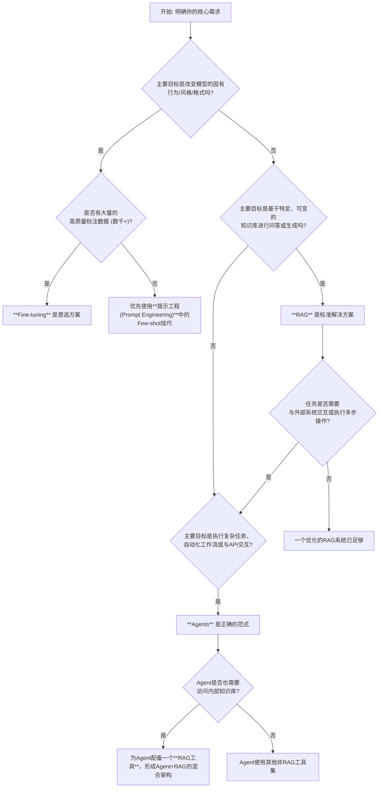

好的，作为一位资深的分析师和老师，我将为你构建一个清晰的比较框架，深入剖析Fine-tuning、RAG与Agents这三种核心的LLM开发范式。本分析面向已具备LLM基础知识的专家级读者，旨在穿透表象，直达技术选型的本质。

---

### **开发范式对比：Fine-tuning、RAG与Agents的选择之道**

#### 1. **问题引入**

在构建复杂的LLM应用时，我们常常面临一个核心的架构抉择：“我的应用需要整合特定的领域知识并执行一系列复杂任务。为了实现这个目标，我应该投入资源对一个基础模型进行Fine-tuning，还是构建一个RAG（检索增强生成）系统来提供外部知识，或者更进一步，设计一个能够自主规划和使用工具的Agent？这三条路径不仅技术栈迥异，其对成本、性能、可维护性的影响也天差地别。到底该选哪个？” 这不是一个简单的技术偏好问题，而是一个关乎项目成败的战略决策。

#### 2. **核心定义与类比**

为了建立一个直观的认知框架，我们先对这三个核心概念进行定义，并用一个“聘请专家顾问”的类比来阐明其本质区别。

*   **Fine-tuning (微调)**: 指在一个预训练好的基础模型（如Llama 3, GPT-4）上，使用一个更小、更具针对性的数据集（通常是成千上万的`prompt-completion`对）继续进行训练。这个过程旨在让模型“内化”特定的知识、风格或行为模式。
    *   **类比: 专有技能的深度培训**。这相当于你聘请了一位聪明的通才顾问（基础LLM），然后花费数周时间，用公司的内部案例、沟通风格和历史项目对他进行封闭式集训。培训结束后，他便内化了公司的行事风格和核心知识，能够本能地以“公司的方式”思考和回应。但他的知识库截止于培训结束的那一刻。

*   **RAG (Retrieval-Augmented Generation)**: 指在不改变模型权重的前提下，通过外部知识库（如向量数据库）为LLM提供与用户查询相关的、即时的上下文信息。LLM的任务是基于这些“开卷”材料来回答问题。
    *   **类比: 开放式资料库的即时查阅**。你聘请了这位通才顾问，但不进行深度培训。相反，你给了他一个权限极高的账户，可以随时访问公司最新、最全的数字图书馆（知识库）。当面临问题时，他会先去图书馆精准地检索相关资料，然后基于这些第一手材料，结合自己的推理能力，给出答案。他的知识永远是最新鲜的。

*   **Agents (智能体)**: 指构建一个系统，其中LLM作为核心的“大脑”或“推理引擎”，能够进行自主规划（Planning）、使用外部工具（Tools）并根据结果进行反思和迭代（Observation）。RAG本身可以被视为Agent可以使用的工具之一。
    *   **类比: 具备行动授权的项目总监**。你不仅给了顾问访问图书馆的权限（RAG），还给了他一套工具箱，里面有计算器、日历、API调用终端、代码解释器等。更重要的是，你授权他根据任务目标自主决定“何时、使用何种工具、如何使用”。他不再只是一个问答者，而是一个能够分解任务、调用资源、执行动作以达成复杂目标的行动者。

#### 3. **最小示例 (快速感受)**

为了获得更具体的体感，我们来看三个范式的典型应用场景。

点击查看案例片段

*   **Fine-tuning 案例片段**:
    *   **目标**: 开发一个SQL代码生成模型，该模型能理解公司内部数据库的非标准SQL方言和特定的表结构命名规范。
    *   **流程**:
        1.  **数据准备**: 收集数千个高质量的样本对：`{"prompt": "自然语言问题，如'查询上季度活跃用户的数量'", "completion": "符合内部方言的SQL查询语句"}`。
        2.  **训练**: 在一个代码基础模型（如Code Llama）上运行微调任务。
        3.  **结果**: 得到的微调模型 `CodeLlama-Internal-SQL` 能够直接将自然语言转换为符合内部规范的SQL，无需在每次请求中提供表结构或方言规则作为上下文。其“知识”已经内化。

*   **RAG 案例片段**:
    *   **目标**: 为一个刚刚发布了数百页详细技术文档的新产品，构建一个7x24小时的技术支持问答机器人。
    *   **流程**:
        1.  **知识库构建**: 将技术文档进行切块（Chunking）、向量化（Embedding），并存入向量数据库。
        2.  **查询处理**: 当用户提问“如何配置XX功能的高级选项？”时，系统首先从向量数据库中检索出最相关的文档片段。
        3.  **生成**: 将检索到的片段作为上下文，与用户问题一同提交给LLM，生成最终答案，并附上原文链接。
    *   **结果**: 系统能够精准回答关于新产品的任何细节问题，且知识更新只需向数据库中增删文档即可，模型本身无需任何改动。

*   **Agents 案例片段**:
    *   **目标**: 创建一个自动化交易分析助手，它能根据指令分析某支股票的近期表现并发送总结报告到Slack。
    *   **流程**:
        1.  **工具定义**: 为Agent提供两个工具：`get_stock_price(ticker, start_date, end_date)` 和 `send_slack_message(channel, message)`。
        2.  **Agent执行**: 用户指令：“分析一下AAPL过去一周的股价，并把总结发到#trading-alerts频道”。
        3.  **思考与行动**:
            *   **Thought**: 我需要获取AAPL过去一周的数据。我需要调用 `get_stock_price` 工具。
            *   **Action**: `get_stock_price(ticker='AAPL', start_date='2024-01-01', end_date='2024-01-07')`
            *   **Observation**: 接收到股价数据。
            *   **Thought**: 数据已获取，现在我需要分析并总结，然后用 `send_slack_message` 工具发送。
            *   **Action**: `send_slack_message(channel='#trading-alerts', message='AAPL过去一周股价总结：...')`
    *   **结果**: Agent自主规划并执行了一个“数据查询 -> 数据分析 -> 信息发送”的跨工具工作流。

#### 4. **原理剖析 (深入对比)**

我们从多个关键维度对这三种范式进行系统性对比。

| 维度 | Fine-tuning (深度培训) | RAG (开卷考试) | Agents (行动授权) |
| :--- | :--- | :--- | :--- |
| **核心哲学** | **内隐知识 (Implicit Knowledge)**：将知识和行为模式编码到模型参数中。 | **外显知识 (Explicit Knowledge)**：将知识与推理能力解耦，动态提供上下文。 | **行动与编排 (Action & Orchestration)**：将LLM作为推理核心，驱动工具执行任务。 |
| **知识处理** | **静态**：知识在训练后固化，更新成本高（需重新训练）。易受“灾难性遗忘”影响。 | **动态**：知识存储在外部，可实时增、删、改、查，更新成本极低。 | **动态+交互**：不仅能从外部知识库检索信息（通过RAG工具），还能通过API与外部世界交互，获取实时状态。 |
| **任务复杂度** | 擅长**风格/行为**的适配，或非常狭窄领域的知识压缩。 | 擅长**知识密集型**的问答与内容生成任务，尤其需要高事实准确性。 | 擅长需要**多步骤、跨系统、动态交互**的复杂任务和自动化工作流。 |
| **数据需求** | 大量高质量、结构化的**指令-响应对**。数据标注成本高昂。 | 非结构化或半结构化的**文档/数据**即可。数据准备主要是ETL和清洗。 | **工具/API的清晰定义**和少量高质量的**示例（Few-shot examples）**。 |
| **开发成本** | **高**：数据准备、GPU训练成本、模型评估和版本管理。需要ML专业知识。 | **中**：主要成本在于ETL流程、向量数据库的选型与维护。更偏向软件工程。 | **高**：复杂性在于Agent的规划逻辑、工具的稳定性和错误处理、状态管理。对系统设计要求高。 |
| **推理成本** | **较低**：单次调用通常更简洁，无额外开销。甚至可以微调出更小的专用模型。 | **较高**：每次调用都包含检索步骤（DB查询）和更长的上下文窗口（Token消耗）。 | **最高**：一次任务可能涉及多次LLM调用（思考-行动循环）和多个工具的执行开销。 |
| **可解释性** | **低**：模型决策过程是黑箱，难以追溯为何生成特定内容。 | **高**：可追溯答案来源，引用原始文档，极大提升了结果的可信度和可调试性。 | **高**：通过ReAct、Chain-of-Thought等框架，可以清晰地看到Agent的每一步思考、决策和工具调用过程。 |
| **幻觉风险** | **中等**：可以减少与训练数据相悖的幻觉，但无法消除基于参数化知识的捏造。 | **极低**：通过将回答严格限制在所提供的上下文中，能最大程度地抑制幻觉。 | **可控**：幻觉风险转移到LLM对工具的选择和参数的生成上。但工具本身的输出是确定的，降低了最终结果的不可预测性。 |

#### 5. **常见误区**

1.  **误区：“用Fine-tuning给模型注入新知识是最佳实践。”**
    *   **纠正**: 这是最常见的误解。Fine-tuning更擅长教授“如何说”和“如何做”，而非“是什么”。用它来灌输事实性知识，效率低、成本高，且极易产生幻觉和知识冲突。对于事实性知识的扩展，RAG是远超Fine-tuning的标准范式。

2.  **误区：“Agent只是RAG的复杂化版本。”**
    *   **纠正**: RAG是Agent可以使用的众多工具之一，但远非全部。Agent的核心是**决策和行动**，而RAG的核心是**知识检索**。一个Agent可以没有RAG（例如，一个只使用计算器和搜索引擎的Agent），但一个纯RAG系统不具备Agent的自主规划和工具调用能力。

3.  **误区：“我必须在这三者中选择一个。”**
    *   **纠正**: 这三者并非完全互斥，而是可以组合形成更强大的系统。一个顶尖的AI应用可能是：**使用一个经过Fine-tuning以理解特定领域术语和指令风格的模型，作为Agent的推理大脑，该Agent配备了包括RAG在内的多种工具，以完成复杂的分析和自动化任务。**

#### 6. **拓展应用 (选型决策树)**

为了帮助你进行快速决策，这里提供一个Mermaid流程图形式的选型决策树。

#### 7. **总结要点**

*   **选择 Fine-tuning 当...**
    *   **核心诉求是改变模型的“性格”而非“知识”**：例如，强制输出特定JSON格式、模仿特定人物的语气、掌握一种全新的代码方言。
    *   **性能和延迟是首要考虑因素**：通过微调蒸馏出一个更小、更快的专用模型。
    *   你有充足、高质量的标注数据，并且愿意承担训练成本。

*   **选择 RAG 当...**
    *   **核心诉求是基于特定、动态的知识源提供准确答案**：例如，企业内部知识库、实时新闻分析、产品文档问答。
    *   **事实准确性、可追溯性和减少幻觉是不可妥协的**。
    *   知识库需要频繁更新，且不希望每次更新都重新训练模型。

*   **选择 Agents 当...**
    *   **核心诉求是“完成工作”而非仅仅“回答问题”**：例如，自动化数据分析、预订旅行、管理智能家居、与多个微服务交互。
    *   任务本质上是**多步骤、需要规划和与外部世界（API、数据库、文件系统）交互的**。
    *   你能清晰地将任务分解为一系列可由工具执行的原子操作。

#### 8. **思考与自测**

**问题**: 如果你的团队规模很小，ML专业知识有限，但应用要求对一个快速迭代的内部产品API文档提供高精度的问答支持。你会优先选择哪个范式？为什么？如果后续发现用户的问题越来越复杂，超出了简单问答的范畴（例如，“帮我对比一下v1和v2版本中‘认证’相关API的差异，并生成一个Python的迁移脚本”），你的架构会如何演进？

**解答思路**:
*   **初期选择**: 毫无疑问，**RAG**是最佳起点。原因：1) 完美匹配“基于动态文档进行高精度问答”的需求。2) 对ML专业知识要求低，更侧重于数据处理和工程实现（ETL, Vector DB）。3) 团队小，资源有限，RAG的可维护性（只需更新文档）远高于Fine-tuning。
*   **架构演进**: 当需求演变为复杂的、包含动作（生成代码脚本）和分析对比的多步骤任务时，架构需要向**Agents**演进。
    1.  原有的RAG系统可以被封装成一个**`query_api_docs`的工具**。
    2.  新增一个**代码解释器（Code Interpreter）工具**，用于生成和执行Python脚本。
    3.  构建一个Agent，它的“大脑”（LLM）会规划任务：
        *   第一步：调用`query_api_docs`工具，分别查询v1和v2版本中关于“认证”的API文档。
        *   第二步：分析两次查询的结果，在内部思考（Chain-of-Thought）中进行对比。
        *   第三步：基于对比结果，调用代码解释器工具，指令其“生成一个从v1迁移到v2的Python认证脚本”。
        *   第四步：将生成的脚本作为最终答案返回给用户。
    这个演进路径体现了从**知识提供者(RAG)**到**任务执行者(Agent)**的平滑过渡，复用了现有组件，并逐步增强了系统的能力。

---
#### **参考文献**
1.  Lewis, P., et al. (2020). "Retrieval-Augmented Generation for Knowledge-Intensive NLP Tasks." *arXiv preprint arXiv:2005.11401*.
2.  Mialon, G., et al. (2023). "Augmented Language Models: a Survey." *arXiv preprint arXiv:2302.07842*.
3.  Yao, S., et al. (2022). "ReAct: Synergizing Reasoning and Acting in Language Models." *arXiv preprint arXiv:2210.03629*.
4.  OpenAI. (2023). "GPTs are a new way for anyone to create a tailored version of ChatGPT." OpenAI Blog.
5.  Zhao, W. X., et al. (2023). "A Survey of Large Language Models." *arXiv preprint arXiv:2303.18223*. (Sections on Fine-tuning and emergent abilities).