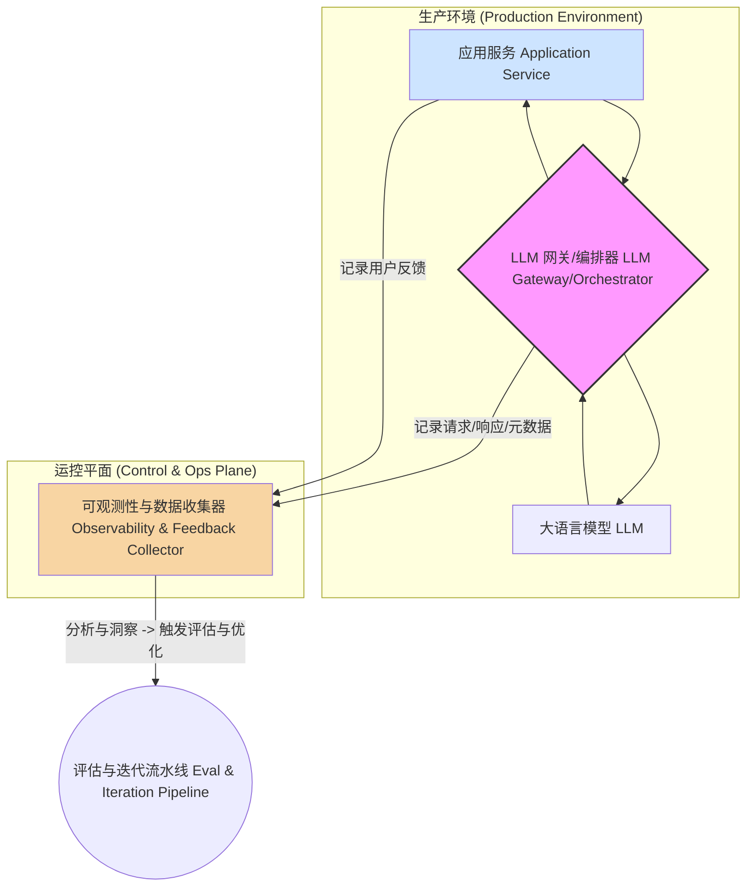
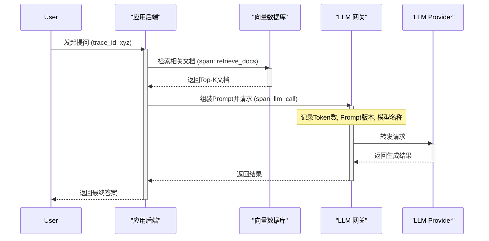

好的，作为一位经验丰富的架构师和导师，我将以“引导式教学模型”为你深度剖析 LLM 应用在迈向生产环境时，其 LLMOps 与可观测性体系的架构设计。我们将围绕一个垂直领域知识库问答系统的上下文展开，假设你已经解决了流式输出、缓存和基础的 Prompt 安全问题，现在正面临着如何将这个系统健壮、可靠、可控地推向生产的挑战。

---

### 1. 问题引入

你已经构建了一个功能强大的知识库问答（RAG）系统原型。在开发环境中，它表现出色：对上传的文档理解精准，回答问题流畅。然而，一旦我们考虑“生产环境”，一系列棘手的问题便浮出水面：

*   **不确定性的黑盒：** LLM 的响应具有非确定性。今天完美的回答，明天可能因为模型微小的更新或用户提问方式的细微变化而产生幻觉。我们如何量化和监控回答的“质量”？
*   **成本失控的风险：** 每次调用 LLM API 都是一次开销。如果一个有问题的上游数据源导致 RAG 系统检索到大量无关上下文，Token 消耗和调用成本可能会飙升。我们如何追踪并控制成本？
*   **迭代的困境：** 业务方提出了新的需求：“优化一下这个场景下的 Prompt”。你修改了 Prompt 模板，如何确定这次修改是全局性的提升，还是“按下葫芦浮起瓢”，在另一些场景下造成了效果衰退？
*   **故障诊断的盲区：** 一个用户反馈“答案不准确”。问题出在哪里？是 RAG 的文档召回（Retrieval）环节出错了？是上下文注入（Augmentation）的格式有问题？还是 LLM 本身的生成（Generation）环节理解错了？没有端到端的追踪，排查问题如同大海捞针。

这些问题，都指向一个核心挑战：**如何将 LLM 应用从一个“炼丹式”的艺术品，转变为一个可度量、可维护、可迭代的工业级系统。** 这就是 LLMOps 与应用可观测性需要解决的核心命题。

### 2. 核心目标与类比

我们的设计核心目标，是构建一个能够支撑 LLM 应用全生命周期的、具备自我迭代能力的“运控平台”。具体可分解为：

*   **可靠性 (Reliability):** 确保系统在各种输入下都能提供稳定、高质量的服务。
*   **可观测性 (Observability):** 能够清晰洞察系统内部的每一个环节，从用户请求到最终响应。
*   **可迭代性 (Iterability):** 能够安全、高效地对 Prompt、模型、数据进行实验、评估和部署。
*   **成本效益 (Cost-Effectiveness):** 精细化地度量和优化资源消耗，尤其是昂贵的模型推理成本。

为了更好地理解这个复杂系统，我们可以做一个类比：**将 LLMOps 体系设计想象成运营一座现代化的“智能制造工厂”。**

*   **原型（PoC）** 就像手工作坊里打造的一件精美样品。
*   **生产化的 LLM 应用** 则是一条完整的自动化生产线。
*   **LLM 模型** 是最高精尖的核心机床，能力强大但需要精心校准。
*   **Prompt 模板** 是生产指令（SOP），规定了机床如何加工。
*   **向量数据库/知识库** 是原材料仓库。
*   **LLMOps 平台** 则是整条产线的中央控制系统（MES）和质量监控中心（QC）。它不仅负责调度生产（CI/CD），更重要的是，它实时监控每一道工序（可观测性），收集次品数据（用户反馈），分析问题根源，并反过来调整生产指令（Prompt 优化）或校准机床（模型微调），形成一个闭环的、持续优化的智能系统。

### 3. 最小示例 (核心组件图)

在深入复杂的细节之前，我们先来看一下 LLMOps 与可观测性体系最核心的三个组件构成的闭环。这个闭环是所有复杂架构的基础。



**核心解读:**

1.  **应用服务 (Application Service):** 你的业务逻辑所在，例如知识库问答的后端 API。
2.  **LLM 网关/编排器 (LLM Gateway/Orchestrator):** 这是整个架构的“交通枢纽”。所有对 LLM 的请求都必须经过它。它不再是简单的直接调用，而是承担了路由、缓存、日志记录等关键职责。
3.  **可观测性与数据收集器 (Observability & Feedback Collector):** 这是系统的“黑匣子”。它收集来自网关的详细交互日志和来自应用的用户反馈，为后续的分析和迭代提供数据基础。

这个最简模型清晰地展示了 **“服务-监控-迭代”** 的核心思想。

### 4. 原理剖析 (详细设计与权衡)

现在，我们将最小示例展开，深入探讨一个生产级 LLMOps 架构的详细设计和其中的权衡。

#### 4.1 详细架构图 (Flowchart)

```mermaid
flowchart TD
    subgraph "开发与部署平面 (Dev & CI/CD Plane)"
        A1["Prompt as Code: Git Repo"] --> A2{CI/CD Pipeline}
        A3[评估数据集 Eval Datasets] --> A2
        A4[模型版本 Model Versions] --> A2
        A2 -->|部署/更新| B1[Prompt Management]
        A2 -->|部署/更新| B2[LLM Gateway]
        A2 -->|部署/更新| B3[RAG Index]
    end

    subgraph "在线服务平面 (Online Serving Plane)"
        C1[User Request] --> C2[Application Backend]
        B1[Prompt Management]
        C2 -->|检索| B3
        B3 -->|上下文| C2
        C2 -->|组装Prompt| B2
        
        subgraph "LLM Gateway / Orchestrator"
            direction LR
            B2[Request Handler]
            B4{Model A/B Test}
        end

        B2 -->|获取Prompt模板| B1
        B2 -->|路由/缓存/限流| B4
        B4 -->|请求| C3[LLM Provider A]
        B4 -->|请求| C4[LLM Provider B]
        
        C3 --> B4
        C4 --> B4
        B4 --> B2
        B2 -->|Response| C2
        C2 -->|"最终响应 (Streaming/Cached)"| C5[User]
    end

    subgraph "可观测性与分析平面 (Observability & Analysis Plane)"
        D1[Trace Collector]
        D2[Metrics Collector]
        D3[Log Collector]
        D4[Feedback API]
        D5[Data Warehouse]
        D6[Evaluation & Analytics Engine]

        B2 -->|Spans, Logs, Metrics| D1 & D2 & D3
        C2 -->|Spans, Business Metrics| D1
        C2 -->|| D2
        C5 -->|👍/👎 Feedback| D4
        
        D1 & D2 & D3 & D4 --> D5
        D5 --> D6
        D6 -->|生成评估报告| A2
        D6 -->|触发告警| C6((On-Call Engineer))
    end
```

#### 4.2 核心组件职责与设计权衡

**1. CI/CD 平面 (Dev & CI/CD Plane):**
*   **职责:** 自动化地测试、打包和部署所有与 LLM 相关的资产，而不仅仅是代码。
*   **关键组件:**
    *   **Prompt as Code (A1):** 将 Prompt 模板（如 Jinja、F-string 模板）存储在 Git 中进行版本控制。这是 LLMOps 的基石。
    *   **CI/CD Pipeline (A2):** 当 Prompt、评估代码或模型配置发生变化时，自动触发。流水线应包括：
        1.  **单元测试:** 验证 Prompt 模板的语法和渲染逻辑。
        2.  **离线评估:** 使用标准评估数据集（A3）对 Prompt/模型变更进行回归测试。评估指标可以是传统的 BLEU/ROUGE，也可以是基于 LLM 的评估（`Correctness`, `Faithfulness`）。
        3.  **部署:** 将验证通过的 Prompt 推送到 Prompt 管理系统（B1），或将新的模型路由规则部署到 LLM Gateway（B2）。
*   **设计权衡:**
    *   **评估粒度:** 运行完整的离线评估可能耗时且昂贵。需要权衡评估集的规模和流水线速度。可以设计分层评估策略：轻量级评估在每次提交时运行，重量级评估在合并到主干前运行。

**2. 在线服务平面 (Online Serving Plane):**
*   **职责:** 高效、稳定地处理实时用户请求。
*   a. **LLM Gateway (B2):** 架构的核心。
    *   **职责:**
        *   **统一入口:** 为所有下游服务提供一个稳定的、与具体模型无关的 API 端点。
        *   **Prompt 管理集成 (B1):** 动态拉取和渲染版本化的 Prompt 模板，实现 Prompt 的热更新，无需重新部署应用服务。
        *   **A/B 测试与路由:** 可以根据请求头或用户百分比，将流量路由到不同的模型（如 GPT-4 vs Claude 3）或不同的 Prompt 版本，进行在线实验。
        *   **可观测性数据发射:** 这是最重要的职责之一。它必须生成详细的、结构化的日志、指标和分布式追踪（Tracing）数据。
    *   **设计权衡:**
        *   **自研 vs. 开源/商业方案:** 自研网关灵活性高，但维护成本大。可以考虑基于 OpenResty/APISix 等 API 网关进行二次开发，或使用 Portkey, OpenAI-Proxy, Helicone 等开源/SaaS 方案。

*   b. **分布式追踪 (Distributed Tracing):**
    *   **原理:** 为每个进入系统的请求生成一个唯一的 `trace_id`。这个 ID 会在请求经过的每一个组件（应用后端、RAG 模块、LLM Gateway）之间传递。每个组件内部的操作（如“数据库查询”、“向量检索”、“LLM API 调用”）都记录为一个 `span`。
    *   **价值:** 当用户反馈问题时，通过 `trace_id` 可以重建整个请求的调用链，精确地定位到是哪个环节耗时过长，或是哪个环节返回了非预期的结果。这对于调试 RAG 的复杂链条至关重要。

下面是一个典型的 RAG 请求的 Trace 序列图：

*   **代码实现示例 (Python with OpenTelemetry):**

```python
# code_lang: python
from opentelemetry import trace

tracer = trace.get_tracer(__name__)

def rag_query(self, user_question: str) -> str:
    """
    一个被OpenTelemetry instrumented的RAG查询函数
    """
    with tracer.start_as_current_span("rag_query") as parent_span:
        parent_span.set_attribute("user.question", user_question)

        # 1. Retrieval Span
        with tracer.start_as_current_span("retrieve_docs") as retrieval_span:
            # 假设 self.vector_db 是向量数据库客户端
            contexts = self.vector_db.search(user_question, k=3)
            retrieval_span.set_attribute("retrieved.doc_count", len(contexts))
            # 实际项目中会记录文档ID等更丰富的信息
            
        # 2. Generation Span (via Gateway)
        with tracer.start_as_current_span("llm_generation") as generation_span:
            prompt = build_prompt(user_question, contexts)
            generation_span.set_attribute("llm.prompt_template_version", "v2.1")
            
            # self.llm_gateway_client 封装了对网关的调用
            # 网关会自动添加更多追踪信息，如模型名称、token用量等
            response = self.llm_gateway_client.complete(prompt)
            
            generation_span.set_attribute("llm.response.text_length", len(response))
        
        parent_span.set_attribute("final.response", response)
        return response

```

**3. 可观测性与分析平面 (Observability & Analysis Plane):**
*   **职责:** 收集、存储、处理和可视化所有遥测数据，并从中提炼洞察。
*   **关键组件:**
    *   **数据收集 (D1-D4):** 使用 OpenTelemetry 作为标准，统一收集 Traces, Metrics, Logs。同时提供一个简单的 API (D4) 用于接收前端传来的用户显式反馈（如“顶”/“踩”）。
    *   **数据仓库 (D5):** 将结构化的遥测数据存储在 ClickHouse, Snowflake 或 BigQuery 等适合大规模分析的数据库中。存储内容应包括：`trace_id`, `timestamp`, `prompt_template_version`, `model_name`, `request_payload`, `response_payload`, `latency`, `token_usage`, `cost`, `user_feedback` 等。
    *   **评估与分析引擎 (D6):**
        *   **在线监控:** 基于 Metrics (D2) 设置告警，如：P99 延迟超过 2s，幻觉率（通过关键词或特定评估 LLM 检测）超过 5%，API 错误率上升等。
        *   **离线分析:** 定期（如每日/每周）运行分析任务。例如：
            *   **版本对比:** 对比 Prompt v1.1 和 v1.2 在真实用户流量下的平均用户满意度、Token 消耗和延迟。
            *   **Bad Case 挖掘:** 筛选出所有用户给了“踩”反馈的请求，聚合它们的 Traces，分析失败的共性模式（例如，是否都是由某个特定类型的文档召回失败引起的）。
            *   **成本归因:** 按业务场景或用户群体分析 LLM 成本分布。

### 5. 常见误区 (反模式)

1.  **将 Prompt 硬编码在应用代码中:** 这是最常见的反模式。它导致 Prompt 的修改需要完整的应用部署流程，无法进行快速实验和回滚。**正确模式：Prompt as Code + Prompt 管理系统。**
2.  **仅依赖离线评估:** 在“黄金标准”评估集上表现优异，不代表在真实、多样的线上流量中表现同样出色。**正确模式：离线评估（用于CI/CD门禁）+ 在线A/B测试（用于真实效果验证）相结合。**
3.  **日志记录不充分:** 只记录最终的问答对，而丢失了中间过程（如 RAG 召回了哪些文档、Prompt 模板版本、调用的具体模型）。这使得问题无法被根因分析。**正确模式：采用分布式追踪，记录端到端的完整上下文。**
4.  **忽视用户反馈闭环:** 系统上线后，没有设计或激励用户提供反馈的机制。这等于关闭了系统最重要的优化数据来源。**正确模式：在产品设计中内置简单明了的反馈机制（👍/👎, 自由文本），并构建从反馈到分析再到迭代的完整数据流。**

### 6. 拓展应用 (演进路线)

一个成熟的 LLMOps 体系不是一蹴而就的，它会随着业务的复杂度而演进。

*   **v1.0 - 基础运控:**
    *   实现中心化的 LLM 网关，统一日志记录。
    *   将 Prompts 从代码中分离，使用配置文件管理。
    *   建立基础的仪表盘，监控 API 调用量、延迟和错误率。
    *   手动分析 Bad Cases。

*   **v1.5 - 自动化与评估:**
    *   建立完整的 CI/CD 流水线，实现 Prompt 的自动化测试和部署。
    *   引入分布式追踪，实现端到端的可视化。
    *   构建离线评估框架，量化 Prompt/模型变更的影响。
    *   在网关层面支持 A/B 测试。

*   **v2.0 - 智能与自优化:**
    *   建立自动化 Bad Case 挖掘和聚类系统。
    *   基于收集到的高质量交互数据，建立自动化微调（Fine-tuning）流水线。
    *   引入在线评估，通过一个“评估 LLM”实时对生产流量的回答质量进行打分。
    *   探索“Auto-prompting”，基于分析结果自动生成和优化 Prompt 候选集。

### 7. 总结要点

迈向生产的 LLM 应用架构设计，核心是从“作坊式开发”转向“工业化运维”。其关键原则包括：

1.  **万物皆可迭代 (Everything as Code/Asset):** 不仅应用代码，Prompt、评估数据、模型配置都应纳入版本控制和自动化流程。
2.  **网关是战略入口 (Gateway as a Strategic Entrypoint):** 利用网关解耦应用与模型，实现路由、实验、缓存和遥测数据的统一控制。
3.  **可观测性是基石 (Observability is the Foundation):** 没有度量就无法优化。端到端的分布式追踪和结构化日志是诊断和理解 LLM 行为的关键。
4.  **闭环决定上限 (The Feedback Loop Defines the Ceiling):** 架构设计的终点，是构建一个能从真实用户交互中学习并自我进化的数据飞轮。

### 8. 思考与自测

**问题:** 如果业务方提出一个新的需求：“为了保护用户隐私，需要在提交给 LLM 的所有请求中，自动检测并脱敏个人身份信息（PII, Personally Identifiable Information），如姓名、电话、身份证号等。”

**现有架构的哪个部分最需要修改？为什么？请阐述你的设计思路。**

> **答案方向提示:**
>
> 1.  **首选修改位置:** LLM 网关/编排器。
> 2.  **为什么:**
>     *   **中心化控制:** 网关是所有 LLM 请求的必经之路，在此处加入 PII 检测逻辑可以确保策略对所有业务场景生效，避免在各个应用服务中重复实现，保证了策略的一致性和可维护性。
>     *   **解耦:** 应用后端无需关心具体的 PII 策略，只需像往常一样发送请求。PII 检测逻辑的更新和迭代可以在网关层面独立进行，不影响上游业务。
> 3.  **设计思路:**
>     *   在 LLM 网关的请求处理流程中，增加一个“预处理中间件/插件 (Preprocessing Middleware)”。
>     *   该中间件负责在请求被发送给下游 LLM Provider 之前，调用一个 PII 检测服务（可以使用预训练的 NER 模型或成熟的第三方服务）。
>     *   检测到 PII 后，进行替换或打码（例如，`张三` -> `[PERSON_1]`）。
>     *   **关键：** 需要在网关的 Trace 和 Log 中记录脱敏行为。例如，在 Span 的 attribute 中增加一个 `pii_detected: true` 和 `anonymized_fields: ["name", "phone"]`。这对于事后审计和问题排查至关重要。
>     *   同时，在 LLM 响应返回后，可能需要一个“后处理中间件 (Postprocessing Middleware)”来尝试将脱敏的占位符还原，但这更复杂且需要权衡。

---
### References

1.  **OpenTelemetry Documentation:** For standards on implementing distributed tracing, metrics, and logs. [https://opentelemetry.io/](https://opentelemetry.io/)
2.  **Full Stack LLMOps by Chip Huyen:** A comprehensive overview of the MLOps landscape extended to LLMs. [https://huyenchip.com/2023/10/24/llmops.html](https://huyenchip.com/2023/10/24/llmops.html)
3.  **Patterns for Building LLM-powered Systems by Eugene Yan:** A collection of architectural and design patterns for LLM applications. [https://eugeneyan.com/writing/llm-patterns/](https://eugeneyan.com/writing/llm-patterns/)
4.  **LangSmith Documentation:** A concrete example of a platform built around LLM observability and tracing. [https://smith.langchain.com/](https://smith.langchain.com/)