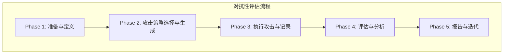

好的，教练就位。

你好，作为一名NLP专家，你已经精通了如何通过GLUE等基准来衡量模型的“平均表现”。但这就像只在风和日丽的赛道上测试赛车。真正的考验来自于极端、非预期的“天气”——也就是对抗性攻击。这些攻击能揭示模型在标准测试集下难以发现的脆弱性。

这本操作手册将引导你系统性地对NLP模型进行“压力测试”，即对抗性评估，从而全面了解其鲁棒性与安全性。

---

### **对抗性评估：测试模型的鲁棒性与安全性 操作手册**

#### 1. **问题引入**

“我的模型在测试集上表现优异，准确率超过95%，但在实际部署后，用户输入的某些看似无害的变体（如同义词替换、拼写错误）却能轻易地让它做出错误的判断。我需要一套系统性的流程来主动发现并量化这些‘盲点’，而不是被动等待线上事故。**正确的对抗性评估流程是怎样的？**”

#### 2. **核心目标与类比**

本流程的核心目标是：**通过模拟恶意或非预期的输入，系统性地评估并量化一个NLP模型在面对输入扰动时的稳定性和可靠性。**

为了更好地理解，可以把它想象成对一座桥梁进行“**结构工程压力测试**”。
*   **标准评估**：测试桥梁在正常车流量和天气下的承载能力。
*   **对抗性评估**：模拟极端情况，如超载卡车编队通过、遭遇百年一遇的强风或地震，来寻找桥梁的结构弱点和断裂点。我们的目标不是证明桥梁“不行”，而是精确了解它“在什么条件下会不行”，以及其安全边界在哪里。

#### 3. **最小示例 (核心流程演练)**

在深入复杂技术之前，我们先走查一个最精简的对抗性评估流程。假设我们有一个情感分类模型，目标是测试它对“同义词替换”的鲁棒性。

1.  **选取一个锚点样本**：从验证集中选择一个模型**正确预测**的样本。
    *   **输入**: `The film was spectacular.`
    *   **模型预测**: `正面 (Positive)` (正确)

2.  **生成对抗性扰动**：对输入进行一个微小的、保持语义的修改。这里我们选择最简单的方式：替换一个关键词。
    *   **关键词**: `spectacular`
    *   **同义词**: `stunning`
    *   **生成对抗样本**: `The film was stunning.`

3.  **重新评估模型**：将新的对抗样本输入到同一模型中。
    *   **输入**: `The film was stunning.`
    *   **模型预测**: `负面 (Negative)`

4.  **判定攻击结果**：比较新旧预测结果。
    *   **结果**: 模型预测发生翻转（Positive -> Negative）。
    *   **结论**: 攻击成功。我们找到了一个能“欺骗”模型的简单对抗样本。

这个四步流程就是所有对抗性评估方法的核心循环：**找一个成功案例 -> 施加微小扰动 -> 观察是否失败**。

#### 4. **原理剖析 (各步骤详解)**

现在，我们将上述核心流程专业化、系统化。一个完整的对抗性评估项目通常包含以下五个阶段。



---

##### **Phase 1: 准备与定义 (Scoping & Preparation)**

*   **操作指令**:
    1.  **明确目标模型**: 确定要评估的具体模型，包括其架构（如BERT, GPT-3.5-turbo）和访问方式（本地加载/API访问）。
    2.  **选定评估数据集**: 选择一个干净、高质量的“源”数据集，模型在该数据集上表现良好。通常是你的验证集或一个标准基准测试集。
    3.  **定义成功标准**: 明确什么是“成功的攻击”。对于分类任务，通常是预测标签翻转。对于生成任务，可能是生成有害内容或事实性错误的回答。
    4.  **设定扰动约束**: 定义什么样的扰动是“可接受的”。扰动后的文本应保持语义一致性、语法流畅性，避免人类一眼就能看出的“乱码”。例如，设置余弦相似度阈值 > 0.8。

*   **验收标准**:
    *   [ ] 目标模型已确定并可访问。
    *   [ ] 用于生成对抗样本的源数据集已准备就绪。
    *   [ ] “攻击成功”的条件已量化。
    *   [ ] 扰动约束（如语义相似度、最大修改词数）已设定。

---

##### **Phase 2: 攻击策略选择与生成 (Attack Strategy Selection & Generation)**

这是技术核心。攻击策略根据对模型的了解程度分为两大类：

| 攻击类型 | 描述 | 优点 | 缺点 | 典型算法 |
| :--- | :--- | :--- | :--- | :--- |
| **白盒攻击 (White-Box)** | 攻击者完全访问模型内部结构，包括梯度、权重等。 | 高效、攻击成功率高。 | 现实中难以获得目标模型的内部权限（如访问商业API）。 | FGSM, PGD, HotFlip |
| **黑盒攻击 (Black-Box)** | 攻击者只能通过输入-输出接口与模型交互，无法看到内部细节。 | 更贴近现实世界的攻击场景。 | 效率较低，通常需要大量查询。 | 基于决策的攻击 (Boundary Attacks), 基于分数的攻击 (Score-based search), 迁移攻击 |

*   **操作指令**:
    1.  **选择攻击类型**: 根据你的模型访问权限（白盒/黑盒）选择合适的攻击大类。对于自训练模型，可采用白盒攻击；对于外部API，只能采用黑盒攻击。
    2.  **实现或选择攻击算法**:
        *   **白盒（以梯度为导向）**: 如果是白盒，可以利用模型梯度来寻找最能影响输出的扰动方向。例如，快速梯度符号法（FGSM）通过以下方式计算扰动 `δ`：
            
            $$ 
            \delta = \epsilon \cdot \text{sign}(\nabla_x J(\theta, x, y))
            $$ 
            
            其中 `ϵ` 是控制扰动大小的超参数，`J(θ, x, y)` 是模型（参数为 `θ`）在输入 `x` 和真实标签 `y` 下的损失函数，而 `∇_x J` 则是损失函数对输入 `x` 的梯度。这个梯度的符号方向指明了能最快增大损失的方向。
            
        *   **黑盒（以搜索为导向）**: 如果是黑盒，则通过智能搜索策略来寻找有效扰动。例如，使用遗传算法或词重要性排序（先遮蔽每个词看置信度下降多少）来指导同义词替换。
    3.  **使用专业工具库**: 强烈推荐使用成熟的对抗性攻击库，如 `TextAttack` 或 `OpenAttack`。它们封装了大量经典攻击算法，让你能快速应用和比较。

*   **验收标准**:
    *   [ ] 已根据模型访问权限选择了攻击类型（白盒/黑盒）。
    *   [ ] 已确定1-3个具体的攻击算法进行测试。
    *   [ ] (可选) 攻击工具库（如`TextAttack`）环境已配置好。

*   **代码示例 (使用 TextAttack 实现黑盒攻击)**
    ```python
    # code_lang: python
    import textattack
    import transformers

    # 1. 准备模型和分词器
    model = transformers.AutoModelForSequenceClassification.from_pretrained("textattack/bert-base-uncased-SST-2")
    tokenizer = transformers.AutoTokenizer.from_pretrained("textattack/bert-base-uncased-SST-2")
    model_wrapper = textattack.models.wrappers.HuggingFaceModelWrapper(model, tokenizer)

    # 2. 选择攻击配方 (Recipe)
    # TextFooler: 一种经典的黑盒攻击算法，通过词重要性排序和同义词替换生成对抗样本
    attack = textattack.attack_recipes.TextFoolerJin2019.build(model_wrapper)

    # 3. 准备数据集
    dataset = textattack.datasets.HuggingFaceDataset("sst2", split="validation")

    # 4. 配置并运行攻击
    attack_args = textattack.AttackArgs(
        num_examples=100,
        log_to_csv="log.csv",
        disable_stdout=True
    )
    attacker = textattack.Attacker(attack, dataset, attack_args)
    results = attacker.attack_dataset()
    ```

---

##### **Phase 3: 执行攻击与记录 (Execution & Logging)**

*   **操作指令**:
    1.  **批量执行攻击**: 遍历在Phase 1中选定的数据集，对每个样本应用Phase 2中选定的攻击算法。
    2.  **记录详细结果**: 对每个原始样本，记录以下信息：
        *   原始文本及其预测结果与置信度。
        *   生成的对抗文本。
        *   对抗文本的预测结果与置信度。
        *   攻击是否成功。
        *   扰动程度（如修改的词数、字符数、语义相似度变化）。
        *   查询次数（对于黑盒攻击）。

*   **验收标准**:
    *   [ ] 攻击脚本已在数据集上成功运行。
    *   [ ] 包含上述所有关键信息的日志文件（如CSV）已生成。

---

##### **Phase 4: 评估与分析 (Evaluation & Analysis)**

*   **操作指令**:
    1.  **计算核心评估指标**: 基于日志文件，计算宏观指标。
        *   **include_eval_metrics: true**
        *   **原始准确率 (Original Accuracy)**: 攻击前模型在源数据集上的准确率。
        *   **攻击后准确率 (Accuracy under Attack)**: 模型在生成的对抗样本上的准确率。
        *   **攻击成功率 (Attack Success Rate, ASR)**: 在模型**原始预测正确**的样本中，攻击成功（导致预测翻转）的样本所占的比例。计算公式为：`ASR = (成功翻转的样本数) / (原始预测正确的样本数)`。这个指标直接衡量攻击算法本身的有效性，而`攻击后准确率`则反映了模型在攻击下的最终鲁棒性水平。
        *   **平均扰动量 (Average Perturbation)**: 成功的攻击平均需要修改多少词/字符。
        *   **平均查询次数 (Average Queries)**: 黑盒攻击平均需要查询多少次模型才能成功。
    2.  **案例分析 (Case Study)**: 深入分析失败的案例。是哪些类型的词（如实体、形容词）被替换后模型更容易出错？扰动是否在语义上仍然合理？

*   **验收标准**:
    *   [ ] 上述核心评估指标已计算并制成表格。
    *   [ ] 至少挑选了3-5个典型的成功攻击案例和失败攻击案例进行定性分析。

*   **include_case_snippets: true**
    *   **案例片段**:
        > **原始**: "An engaging examination of historical events." (预测: Positive)
        > **对抗**: "An **absorbing** examination of historical events." (预测: Negative)
        > **分析**: 模型可能过度依赖特定词汇（如'engaging'），而未能泛化到其近义词'absorbing'，表现出较差的语义鲁棒性。

---

##### **Phase 5: 报告与迭代 (Reporting & Iteration)**

*   **操作指令**:
    1.  **撰写评估报告**: 总结评估发现，包括模型的整体鲁棒性水平（如ASR）、主要的脆弱点类型、以及具体的失败案例。
    2.  **提出改进建议**: 基于发现，提出后续行动方案，如：
        *   **数据增强**: 将成功的对抗样本加入训练集。
        *   **对抗性训练 (Adversarial Training)**: 在训练过程中动态生成并学习对抗样本。
        *   **模型架构调整**: 采用鲁棒性更强的模型架构。

*   **验收标准**:
    *   [ ] 一份清晰的评估报告已完成。
    *   [ ] 至少提出一项可行的模型改进措施。

#### 5. **常见误区 (风险与回退)**

1.  **无效的对抗样本**:
    *   **风险**: 生成的文本在语法或语义上不通顺，失去了“欺骗”的意义（e.g., `The film was spect.acular`）。这种攻击的成功并不能说明模型鲁棒性差。
    *   **回退方案**: 在攻击算法中加入更强的约束，如使用语法检查工具、通用句子编码器（USE）来保证扰动后的语义相似度高于某个阈值（如0.8）。

2.  **攻击算法单一化**:
    *   **风险**: 只使用一种攻击方法（如只用`TextFooler`）可能会让你产生模型很鲁棒的错觉。模型可能恰好对这种攻击免疫，但对其他攻击（如基于字符的攻击）很脆弱。
    *   **回退方案**: 始终使用一个攻击组合（Attack Suite），至少包含基于词替换、字符变换、句子结构改写的多种策略，综合评估结果。

3.  **忽略查询成本**:
    *   **风险**: 对于黑盒模型（尤其是付费API），一个需要数千次查询才能成功的攻击在现实中几乎没有威胁。只看ASR会高估风险。
    *   **回退方案**: 始终将“平均查询次数”作为核心评估指标之一。对于高成本API，优先考虑查询效率高的攻击算法。

#### 6. **拓展应用 (分支与变体)**

1.  **针对生成式模型 (LLMs) 的评估**:
    *   **变体**: 攻击目标不再是分类翻转，而是诱导模型产生：
        *   **安全问题**: 生成有害、歧视性或非法的输出（Jailbreaking）。
        *   **隐私泄露**: 泄露训练数据中的敏感信息。
        *   **事实性错误**: 通过误导性提示让模型产生事实错误的回答。
    *   **方法**: 通常采用更复杂的提示工程（Prompt Engineering）或梯度引导的提示优化（如GCG攻击）。

2.  **后门攻击 (Backdoor Attacks)**:
    *   **变体**: 这是一种更隐蔽的“投毒”攻击。攻击者在训练数据中植入一个“触发器”（如一个罕见词或短语）。平时模型表现正常，一旦输入包含该触发器，模型就会强制输出指定结果。
    *   **评估方法**: 评估流程变为检测模型是否含有后门，而不是生成对抗样本。需要专门的扫描和分析技术。

3.  **物理世界攻击**:
    *   **变体**: 考虑模型部署在物理世界中可能遇到的扰动，如OCR识别中的打印-扫描噪声、语音识别中的背景噪音。
    *   **评估方法**: 生成的扰动模拟这些物理过程，而不是纯粹的数字变换。

#### 7. **总结要点 (Checklist)**

在你开始下一次对抗性评估时，请使用此清单确保流程完整：

*   [ ] **目标明确**:
    *   [ ] 确认了目标模型和数据集。
    *   [ ] 定义了攻击成功标准和扰动约束。
*   [ ] **策略得当**:
    *   [ ] 选择了与模型访问权限匹配的攻击类型（白盒/黑盒）。
    *   [ ] 选用了多种（≥2）攻击算法以避免单一性偏差。
    *   [ ] 配置了`TextAttack`等专业工具库。
*   [ ] **执行与记录**:
    *   [ ] 完整运行了攻击流程。
    *   [ ] 生成了包含原始文本、对抗文本、预测结果、扰动量等信息的详细日志。
*   [ ] **评估深入**:
    *   [ ] 计算了ASR、攻击后准确率等关键量化指标。
    *   [ ] 对典型成功/失败案例进行了定性分析。
*   [ ] **闭环迭代**:
    *   [ ] 完成了评估报告。
    *   [ ] 提出了基于评估结果的模型改进计划（如对抗性训练）。

#### 8. **思考与自测**

为了检验你对本流程的理解，请思考以下问题：

> “如果你的目标模型是一个通过**付费API**提供服务的黑盒大语言模型（LLM），并且该API有**严格的请求频率限制**（如每分钟10次请求）。这个限制会对你在 **Phase 2 (攻击策略选择)** 和 **Phase 4 (评估与分析)** 中产生什么根本性影响？你会优先考虑哪些攻击算法，又会如何调整你的核心评估指标？”

---
**参考文献与工具**
*   **include_references: true**
*   **核心论文**:
    1.  Goodfellow, I. J., Shlens, J., & Szegedy, C. (2014). Explaining and harnessing adversarial examples. *arXiv preprint arXiv:1412.6572*. (Introduced FGSM)
    2.  Jin, D., Jin, Z., Zhou, J. T., & Szolovits, P. (2019). Is Bert Really Robust? A Strong Baseline for Natural Language Attack on Text Classification and Entailment. *arXiv preprint arXiv:1907.11932*. (Introduced TextFooler)
*   **推荐工具库**:
    1.  **TextAttack**: [https://github.com/QData/textattack](https://github.com/QData/textattack)
    2.  **OpenAttack**: [https://github.com/thunlp/OpenAttack](https://github.com/thunlp/OpenAttack)
