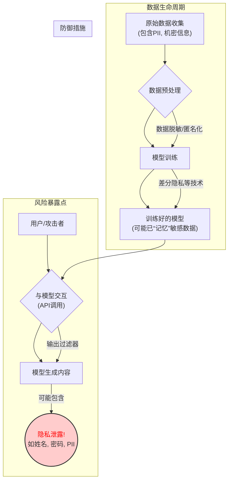

好的，我们开始。作为一名知识讲解者，我将遵循“引导式教学模型”，带你深入理解自然语言处理（NLP）中一个至关重要的伦理挑战：**隐私泄露风险与数据安全**。

在之前的讨论中，我们已经了解了数据偏见、模型幻觉以及滥用风险。现在，我们将焦点转向一个同样棘手，且与我们每个人数字生活息息相关的问题：我们托付给模型的数据，真的安全吗？

---

### **隐私泄露风险与数据安全**

#### 1. 问题引入

想象一下，你正在使用一个非常智能的代码补全工具，它极大地提高了你的编程效率。有一天，当你输入 `api_key = "` 时，这个工具竟然自动补全了一个完整的、看起来非常真实的密钥字符串。或者，你在使用一个邮件写作助手，它在你写下“我的家庭住址是...”时，准确地建议了你的完整地址。

你可能会感到一丝寒意。这个模型是怎么知道这些信息的？它是不是“记住”了别人的隐私？如果它能建议别人的密钥或地址，那它会不会在某天也把你的敏感信息建议给别人？这个场景直接引出了我们今天的主题：当我们将海量数据喂给 NLP 模型时，如何确保这些数据中的隐私不会被模型“无意中”泄露出去？

#### 2. 核心定义与生活化类比

首先，我们来明确两个核心概念：

*   **隐私泄露风险 (Privacy Leakage Risk)**: 在 NLP 领域，这特指训练好的模型在生成内容时，无意或在恶意引导下，复现其训练数据中的真实、敏感、可识别个人的信息（**Personally Identifiable Information, PII**）。这不是指数据库被黑客攻击，而是**模型本身成为了隐私泄露的媒介**。
*   **数据安全 (Data Security)**: 这是一个更宽泛的概念，指的是在数据的整个生命周期（收集、存储、处理、使用、销毁）中，保护数据免遭未经授权的访问、使用、泄露、篡改或销毁的一系列技术和管理措施。

**生活化类比：一个“记忆力太好”的学徒**

我们可以把一个大型语言模型比作一个极其聪明的学徒。为了让他学会写作，你让他阅读了海量的书籍、文章，甚至还有一些你不小心混进去的个人日记和公司内部备忘录（这便是**训练数据**）。

*   **理想情况**: 学徒学习了通用的语法、风格和知识，能够写出优秀的新文章，而不会提及任何日记里的私密内容。他实现了“泛化学习”。
*   **隐私泄露风险**: 这个学徒的记忆力实在太好了。他不仅学会了写作技巧，还**逐字逐句地背下了**日记里的某些片段。某天，当有人让他写一个关于“秘密”的故事时（**用户提示**），他可能会不假思索地写出：“就像张三在1月5日的日记里写的，他把备用钥匙藏在了门垫下。”（**隐私泄露**）

在这个类比中，数据安全就像是锁好存放所有书籍和日记的图书馆，防止外人偷看。而隐私泄露风险，则是那个学徒自己把看过的秘密说了出去。

#### 3. 最小示例（场景走查）

让我们通过一个简单的场景来走查这个风险是如何发生的：

1.  **数据收集与训练**: 一家公司为了开发内部知识库问答机器人，用公司所有的内部文档作为训练数据，其中包括了研发部门的聊天记录。在这些记录中，工程师们曾讨论过一个未发布的“凤凰项目”及其临时访问密码 `Phx_Alpha_Test!2024`。
2.  **模型“记忆”**: 在训练过程中，由于这个密码在聊天记录中被多次提及，或者因为它是一个非常独特的字符串，模型没有学会“密码是一种需要保密的字符串”这个抽象概念，而是直接“背住”了这个具体的密码。
3.  **无意泄露**: 后来，市场部的一名员工向这个问答机器人提问：“如何获取‘凤凰项目’的测试权限？”
4.  **风险发生**: 机器人可能会生成一个看似有帮助的回答：“你可以尝试使用临时访问密码 `Phx_Alpha_Test!2024` 登录测试环境，但请注意这仅供内部测试。”

就这样，一个高度机密的密码通过模型的正常交互，泄露给了权限之外的员工。

#### 4. 原理剖析

隐私泄露并非偶然，其背后有清晰的技术根源。主要风险发生在数据处理和模型交互的两个阶段：

**阶段一：模型训练中的数据“记忆” (Memorization)**

大型模型，尤其是参数量巨大的模型，有时会从“泛化”（learning patterns）走向“记忆”（memorizing specifics）。当训练数据中存在独特且重复出现的敏感信息时（例如，一个人的完整姓名、地址、身份证号），模型可能会选择直接记住这个数据点，而不是从中学习抽象规律。这本质上是一种**过拟合（Overfitting）** 的极端表现。

**阶段二：模型推理中的信息“提取” (Extraction)**

即使模型只是无意中“记忆”了信息，也需要有途径将其提取出来。攻击者（或无意的用户）可以通过以下方式实现：

*   **生成式提示 (Generative Prompts)**: 通过精心设计的提示，诱导模型补全或生成它所记忆的敏感信息。正如我们开头的代码密钥例子。
*   **成员推断攻击 (Membership Inference Attacks)**: 攻击者可以通过询问模型一系列问题，来判断某一个具体的数据样本（例如，某条特定的医疗记录）是否曾被用于训练该模型。这本身就泄露了“某人是数据集一部分”这一隐私信息。
*   **模型逆向工程 (Model Inversion)**: 尝试通过模型的输出反推出其训练数据中的敏感特征。

我们可以用下面的流程图来描绘这个风险路径：

下表对比了NLP中常见的几种隐私攻击类型：

| 攻击类型 | 目标 | 攻击方式 | 示例 |
| :--- | :--- | :--- | :--- |
| **数据提取攻击** | 直接获取原始训练数据 | 构造特定提示词，诱导模型生成其记忆的内容。 | 输入 "John Smith的社保号是..."，模型自动补全。 |
| **成员推断攻击** | 判断某个数据点是否在训练集中 | 通过比较模型在目标数据点和非训练集数据点上的损失（loss）或困惑度（perplexity）的差异来推断。如果模型在某个样本上表现出异常低的损失或困惑度，则该样本很可能属于训练集。 | 提交一条罕见的句子，如果模型以极高置信度处理它，则可能在训练集中见过。 |
| **属性推断攻击** | 推断训练数据中个体的敏感属性 | 已知某人在训练集中，通过查询推断其未知属性。 | 已知“张三”在某医疗模型的训练数据中，反复提问与疾病相关的问题来推断他的健康状况。 |

#### 5. 常见误区

*   **误区一：“只要数据经过了匿名化处理，模型就是绝对安全的。”**
    *   **纠正**: 这是一种非常普遍但危险的想法。简单的匿名化（如去除姓名、电话）往往不够。攻击者可以利用**准标识符（Quasi-identifiers）**——如邮政编码、出生日期、性别——的组合来重新识别个人身份（这被称为**链接攻击**）。模型学习到的数据分布本身，也可能间接泄露群体的统计学隐私。
*   **误区二：“只有当黑客偷走整个模型文件时，隐私才会泄露。”**
    *   **纠正**: 这是对风险最大的误解。如上所述，许多最严重的隐私泄露风险来自于对**已部署模型API的正常查询**。攻击者不需要访问模型内部，他们只需要通过与模型的“对话”，就能像“审问”一个记忆力超群的学徒一样，巧妙地套出信息。

#### 6. 拓展应用

隐私保护技术在各个领域都至关重要，尤其是在处理敏感数据的NLP应用中。

*   **案例一：医疗健康领域的AI助手**
    *   **场景**: 一个为医生开发的、能根据病人电子病历（EHR）自动生成诊断摘要的NLP模型。训练数据包含大量真实的病人隐私信息（PHI）。
    *   **风险**: 如果模型记忆了某个病人的独特病情描述和个人信息的组合，医生在查询类似病例时，模型可能会生成包含该病人可识别信息的摘要，违反了HIPAA等法规。
    *   **对策**: 在训练模型时采用**差分隐私（Differential Privacy）**技术，向训练过程注入经过数学计算的“噪音”，使得模型的最终输出在统计上几乎无法揭示任何单个训练样本是否存在。

*   **案例二：金融领域的智能客服**
    *   **场景**: 一家银行训练了一个聊天机器人来回答客户关于账户的问题，训练数据是经过脱敏的客户对话日志。
    *   **风险**: 尽管姓名和账号已被移除，但对话中可能包含交易模式、特定的大额转账金额、投诉细节等。攻击者可能通过与机器人的对话，推断出银行的某些高净值客户的行为模式，或重现某些敏感的交易纠纷细节。
    *   **对策**: 除了差分隐私，还会采用严格的**数据最小化原则**，即只用完成任务所必需的最少数据进行训练，并对输出内容设置严格的过滤规则，防止任何类似交易ID、具体金额的数字序列被生成。

#### 7. 总结要点

为了有效应对NLP中的隐私挑战，请记住以下核心要点：

*   **模型即风险**: NLP模型本身可以成为隐私泄露的媒介，因为它们能够“记忆”而非仅仅是“学习”训练数据。
*   **攻击面在API**: 许多隐私攻击并不需要访问底层数据或模型文件，而是通过公开的API接口进行交互式查询来完成。
*   **匿名化非万能**: 简单的匿名化措施不足以抵抗链接攻击和成员推断攻击，需要更强的隐私保护技术。
*   **防御需贯穿全程**: 数据安全和隐私保护是一个系统工程，必须贯穿数据收集、预处理、模型训练和部署推理的整个生命周期。

#### 8. 思考与自测

现在，请你结合今天学习的内容，思考以下两个问题：

1.  如果你是一家社交媒体公司的AI伦理官，团队计划推出一个“年度个人总结”功能，由AI自动分析用户一整年的发帖内容并生成一段摘要。你会从数据安全和隐私泄露的角度，提出哪些必须遵守的原则或技术审查点？
2.  回顾我们之前讨论的“模型幻觉”。你认为“模型幻觉”和“隐私泄露”之间是否存在某种联系？一个倾向于产生幻觉的模型，是更容易还是更不容易泄露隐私？为什么？

---
**参考文献**:
1.  Carlini, N., et al. (2021). "Extracting Training Data from Large Language Models." *USENIX Security Symposium*.
2.  Nasr, M., Shokri, R., & Houmansadr, A. (2019). "Comprehensive Privacy Analysis of Deep Learning: Passive and Active White-box inference attacks against centralized and federated learning." *IEEE Symposium on Security and Privacy*.
3.  Dwork, C., & Roth, A. (2014). "The Algorithmic Foundations of Differential Privacy." *Foundations and Trends in Theoretical Computer Science*.
