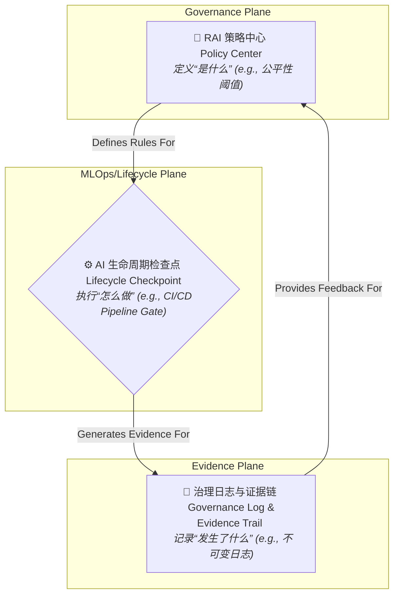

好的，我们开始。作为你的架构导师，我将引导你从零开始，设计一个强大且可扩展的负责任AI（Responsible AI, RAI）框架与治理架构。现在，我们的任务是设计一个“免疫系统”，而不仅仅是“对症下药”。

### 1. 问题引入: 从“救火队”到“城市消防系统”

想象一下你所在的团队刚刚发布了一个先进的NLP客服机器人。初期反响热烈，但很快，问题接踵而至：

*   **公关危机**：社交媒体上，用户抱怨机器人对某些人群的提问存在微妙的偏见。运营团队手忙脚乱地进行道歉和公关。
*   **监管审查**：某个用户数据在模型的交互日志中被意外泄露，引发了数据保护机构（如GDPR监管方）的质询。
*   **产品失效**：模型开始出现大规模的“幻觉”，为用户提供了错误的、甚至有害的建议，导致客户投诉激增。

目前，你们的应对方式是“头痛医头，脚痛医脚”：发现偏见后，工程师紧急微调模型；发现泄露后，安全团队介入调查；发现幻觉后，算法团队加班加点重新训练。你们是技术精湛的“救火队”，但火灾却此起彼伏。

**痛点在于**：这种**被动、事后响应式**的治理模式，成本高昂、风险巨大，且无法规模化。每一次“救火”都是一次性的，知识和经验无法沉淀为组织能力。我们需要一个系统性的架构，将负责任AI的原则**内嵌（baked-in）**到AI生命周期的每一个环节，而不是作为一个**附加项（bolt-on）**。

---

### 2. 核心目标与类比: 构建AI治理的“城市规划”

我们的核心设计目标不是简单地“解决偏见”或“防止泄露”，而是建立一个**可信、可控、可审计（Trustworthy, Controllable, Auditable）**的AI生产体系。

为了更好地理解这个复杂系统，让我们用一个类比：**城市规划与建筑**。

*   **失控的AI开发**就像一个没有规划、野蛮生长的城镇：建筑（模型）随处搭建，没有统一的建筑规范（标准），没有消防系统（安全措施），也没有市政部门（治理机构）。虽然短期内发展迅速，但长远来看，充满了结构性风险。
*   **我们的目标**是设计一套完整的**AI城市规划蓝图**：
    *   **《城市总体规划》 (RAI Policy)**：定义了整个“城市”发展的核心原则，比如公平性、透明度、安全性。
    *   **《建筑规范与标准》 (Model Development Standards)**：对每一栋“建筑”（AI模型）的设计、材料、施工过程提出明确要求，如数据隐私处理规范、偏见测试标准。
    *   **“建筑许可审批中心” (Governance Gates)**：在建筑（模型）的关键阶段（如设计、施工、封顶、交付）进行强制性审查，确保其符合规范。
    *   **“城市运营与监控中心” (MLOps & Monitoring)**：对已建成的建筑（上线的模型）进行7x24小时的监控，检查其运行状态、水电安全（数据漂移、性能衰减、公平性指标恶化）。
    *   **“市政档案库” (Model & Data Registry)**：记录每一栋建筑的完整图纸、材料来源、施工日志和历次维修记录，确保一切都有据可查。

通过这套体系，我们追求的不是扼杀创新（限制建筑师的创意），而是**在保障安全和秩序的前提下，实现可持续的繁荣**。

---

### 3. 最小示例 (核心组件图)

在我们深入复杂的“城市规划”之前，先来看最核心的骨架。任何RAI治理体系都离不开这三个基本组件的交互闭环：



这个最简模型清晰地展示了：
1.  **策略中心 (Policy Center)**：集中定义规则。这是治理的“大脑”。
2.  **生命周期检查点 (Checkpoint)**：在AI开发和运维流程中强制执行这些规则。这是治理的“手和脚”。
3.  **证据链 (Evidence Trail)**：记录下每一次检查和决策的结果，形成可审计的日志。这是治理的“记忆”。

---

### 4. 原理剖析 (详细设计与权衡)

现在，我们将最小示例扩展为一个更完整的、可落地的企业级架构。我们将它划分为三个层面：**治理与策略层**、**执行与运营层**、**基础支撑层**。

#### 详细架构图

```mermaid
flowchart TD
    subgraph Governance & Strategy Plane [治理与策略层: The "Control Tower"]
        P["📝 **策略即代码 (Policy-as-Code) 引擎**
<i>(e.g., OPA - Open Policy Agent)</i>
定义机器可读的RAI规则"]
        D["📊 **风险与合规仪表盘**
<i>(Risk & Compliance Dashboard)</i>
可视化风险、审计报告、追踪问题"]
        P --> D
    end

    subgraph Execution & Operations Plane [执行与运营层: The "Assembly Line"]
        subgraph CI [CI: 开发与构建]
            T1["🔧 **偏见与公平性扫描器**
<i>(e.g., Fairlearn, AIF360)</i>"]
            T2["🕵️ **隐私数据扫描器**
<i>(e.g., Presidio)</i>"]
            T3["🧩 **可解释性报告生成器**
<i>(e.g., SHAP, LIME)</i>"]
        end
        subgraph CD [CD: 部署与交付]
            G["🛡️ **治理审批门 (Governance Gate)**
<i>Automated Policy Check</i>"] %% Modified node label
        end
        subgraph Ops [Ops: 监控与运维]
            M1["📈 **模型性能与公平性监控**
<i>(Drift, Bias, Fairness Degradation)</i>"]
            M2["🛡️ **对抗性攻击与滥用检测**
<i>(Adversarial Attack Detection)</i>"]
            H["🙋 **人机协同干预接口**
<i>(Human-in-the-loop Escalation)</i>"]
        end
    end

    subgraph Foundation Plane [基础支撑层: The "System of Record"]
        MR["📚 **模型注册中心 (Model Registry)**
<i>- RAI元数据 (风险等级, 公平性报告)
- 模型卡 (Model Cards)</i>"]
        DC["🗄️ **数据目录 (Data Catalog)**
<i>- 数据血缘 (Lineage)
- PII/敏感数据标签</i>"]
        ES["⛓️ **证据存储库 (Evidence Store)**
<i>- 不可变的审计日志
- 数字签名</i>"]
    end

    %% Connections
    P -->|Enforces Policies On| G
    T1 & T2 & T3 -->|Feeds Data To| G
    G -->|Gates Publication to| MR %% Modified arrow label
    MR -->|Is Source for Deployment| Ops %% Modified arrow label (connecting to subgraph Ops)
    M1 & M2 -->|Triggers| H
    M1 & M2 & H -->|Reports Metrics to| D
    
    %% Data Flow
    DC -->|Informs| T2
    T1 & T2 & T3 -->|Generate Artifacts for| ES
    G -->|Logs Decisions to| ES
    MR -->|Links to Evidence in| ES
    D -->|Queries| ES
```

#### 组件职责与设计权衡

| 组件/层面 | 核心职责 | 关键设计决策与权衡 (Trade-offs) |
| :--- | :--- | :--- |
| **治理与策略层** | 定义“好”的AI是什么样的，并提供全局视野。 | **策略的灵活性 vs. 刚性**：<br>- **硬编码策略**：简单直接，但难以适应新法规或业务变化。<br>- **策略即代码 (Policy-as-Code)**：如使用OPA，非常灵活，可动态更新，但有学习曲线，需要专门维护。这是推荐的**设计选择**。 |
| **执行与运营层** | 将抽象的策略转化为具体的、自动化的技术行动，嵌入到现有的DevOps (MLOps) 流程中。 | **“左移”程度 (Degree of Shift-Left)**：<br>- **仅在部署前设门禁**：能拦住最差的模型，但反馈循环长，开发人员在最后时刻才发现问题，修复成本高。<br>- **深度集成到CI**：在代码提交、PR阶段就进行扫描和反馈。开发效率更高，但可能增加CI/CD的复杂性和运行时间。这是推荐的**设计选择**。 |
| **基础支撑层** | 作为所有治理活动和AI资产的“单一事实来源”(Single Source of Truth)，确保一切可追溯、可审计。 | **中心化 vs. 联合式元数据管理**：<br>- **中心化**：所有RAI元数据（模型卡、公平性报告等）强制存储在统一的Model Registry中。易于管理和审计，但可能成为瓶颈。<br>- **联合式**：允许元数据存储在不同地方，通过API聚合。更灵活，能适应异构环境，但实现和维护一致性更复杂。初期推荐**中心化**，成熟后可演进为联合式。 |

---

### 5. 常见误区 (反模式)

在设计和实施此类架构时，请务必避开以下几个常见的“反模式”：

1.  **治理即清单 (Governance-as-Checklist)**
    *   **表现**：将RAI简化为一份需要手动勾选的表格，在模型上线前由某个“伦理委员会”审批。
    *   **危害**：这会使治理成为研发流程的瓶颈和对立面，开发人员视其为官僚主义的障碍，而非有价值的工程实践。它缺乏自动化、无法扩展、且容易流于形式。
    *   **正确做法**：采用**治理即代码 (Governance-as-Code)**，将规则和检查自动化，无缝集成到开发人员的工作流中。

2.  **技术万能论 (Technology Solutionism)**
    *   **表现**：认为只要购买或开发了最先进的偏见检测、可解释性工具，RAI问题就解决了。
    *   **危害**：忽视了负责任AI是一个涉及**人、流程、技术**的社会技术系统。没有清晰的责任分配、升级路径和决策流程，再好的工具也无法发挥作用。
    *   **正确做法**：架构设计必须包含**人机协同**的接口（如上图的`H`组件）和清晰的运营流程（Playbooks）。

3.  **一次性审计 (One-off Audit)**
    *   **表现**：只在模型上线前进行一次全面的公平性、安全性审计。
    *   **危害**：AI系统是动态的。输入数据的分布会变化（Data Drift），导致模型的公平性等指标在生产环境中持续衰减。
    *   **正确做法**：架构必须包含**持续监控**（如上图的`M1`, `M2`组件），将RAI指标视为与延迟、吞吐量同等重要的一等公民。

---

### 6. 拓展应用 (演进路线)

一个好的架构是能够演进的。你的RAI治理体系可以分阶段实施：

#### v1.0: "有指导的启蒙" (Guided Awareness)

*   **目标**：建立基础，提升意识，实现手动但规范的治理。
*   **架构**：
    *   重点建设**基础支撑层**：建立一个功能丰富的**Model Registry**，要求每个模型都附带手动填写的**模型卡 (Model Card)** 和 Datasheet。
    *   在CI/CD中集成RAI扫描工具，但**仅生成报告，不阻塞流水线**。
    *   成立一个跨职能的RAI审查委员会，根据CI生成的报告和模型卡进行**手动审批**。
    *   所有决策和报告归档到**证据存储库**。

#### v2.0: "自动化的护栏" (Automated Guardrails)

*   **目标**：将大部分治理规则自动化，减少人工干预，提高效率。
*   **架构演进**：
    *   引入**策略即代码 (Policy-as-Code) 引擎**。将v1.0中审查委员会的规则转化为机器可读的策略。
    *   将CI/CD中的**审批门 (Gating) 从手动转为自动**。如果模型的公平性指标低于策略中定义的阈值，流水线自动失败。
    *   部署**实时监控系统**，对生产环境中的模型公平性、数据漂移进行告警。
    *   建立与事件响应系统的集成，当监控到严重问题时，能自动创建工单或触发**人机协同干预流程**。

---

### 7. 总结要点 (Checklist & Principles)

此负责任AI框架与治理架构的核心设计原则可以总结为以下几点：

- **治理即代码 (Governance-as-Code)**: 将抽象的伦理原则和合规要求转化为可由机器自动执行、版本化管理的策略代码。
- **左移原则 (Shift-Left)**: 尽可能早地在AI生命周期的早期（开发、构建阶段）发现并修复问题，而不是等到部署后。
- **全生命周期覆盖 (Full Lifecycle Coverage)**: 治理措施必须覆盖从数据准备、模型训练、部署上线到持续监控和最终下线的每一个环节。
- **可审计性是核心 (Auditability by Design)**: 系统的设计必须确保每一个与AI资产相关的决策、每一次评估和每一次变更都有不可篡改的记录，形成完整的证据链。
- **人机协同 (Human-in-the-Loop)**: 承认自动化工具的局限性，为复杂的、边缘的、高风险的决策场景设计清晰的人工介入和监督机制。

---

### 8. 思考与自测

现在，轮到你了。作为一个架构师，你需要不断思考系统的扩展性和适应性。

**问题**：如果你的组织决定采纳欧盟的《AI法案》(EU AI Act)，其中一个核心要求是**对不同风险等级（如“高风险”、“有限风险”、“最小风险”）的AI应用进行差异化治理**。例如，“高风险”AI应用需要更严格的测试、更详尽的文档和更严密的人工监督。

**请思考：现有架构的哪个或哪些部分最需要修改以支持这一新需求？为什么？**

> *提示：思考一下，风险等级这个“元数据”应该在哪里定义？这个信息将如何影响整个治理流程？*
