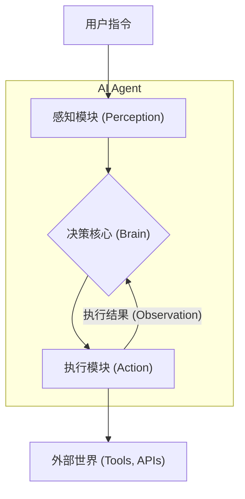
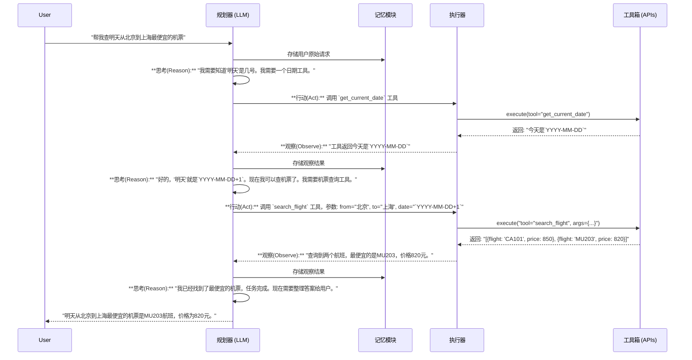

好的，学员。欢迎来到架构师的指导课堂。今天，我们将一起探讨一个令人兴奋的前沿领域：**AI Agent**。

我们不再满足于仅仅与 AI 对话，而是希望它能成为我们真正的“数字雇员”，能够理解我们的意图，并自主地为我们完成任务。这背后，需要一套精妙的架构设计。

让我们以建筑师的视角，一步步搭建起这个“智能体”的蓝图。

---

### 1. 问题引入: 从“对话者”到“行动者”的鸿沟

想象一下，你正在使用的智能助手。你可以问它：“帮我规划一个周末去上海的旅行，预算3000元。”

-   **现状 (Pain Point 1)**: 它可能会给你一个详尽的文本计划，包括推荐的航班、酒店和景点。但它无法**真正**去查询实时票价、比较酒店优劣，更不用说下单预订了。它是一个“知识渊博的顾问”，但不是一个“能干的执行者”。
-   **挑战 (Pain Point 2)**: 如果在执行过程中出现意外，比如首选航班售罄，或者酒店价格超出预算，它无法像人一样**自主调整策略**，比如换个出发时间或者选择另一家性价比更高的酒店。它缺乏动态适应和解决问题的能力。

我们的任务，就是设计一个架构，跨越从“语言理解”到“自主行动”的鸿沟，让 AI 真正具备“做事”的能力。

### 2. 核心目标与类比: 打造一个“数字化项目经理”

在设计任何系统之前，我们必须明确其核心目标。对于 AI Agent，我们的目标是构建一个能够**自主感知、规划、行动并从结果中学习**的闭环系统。

为了更好地理解这个概念，让我们做一个类比：

> **建筑类比：** 我们要设计的不是一座孤立的“信息亭”（像传统聊天机器人），而是一个**“项目管理办公室（PMO）”**。
> 
> -   **CEO (用户)**: 提出高层级的战略目标（“我要去上海过周末”）。
> -   **项目经理 (AI Agent 大脑)**: 领会 CEO 的意图，将其拆解为一系列具体的、可执行的任务（查询航班、预订酒店、规划路线）。
> -   **专业团队 (工具/API)**: 项目经理并不亲自砌墙或画图，而是调用内部的“工程部”（机票查询API）、“采购部”（酒店预订API）等专业团队来执行具体任务。
> -   **进度报告 (反馈)**: 专业团队会向项目经理汇报工作成果（“航班 B737 有余票，价格1200元”）或遇到的问题（“该酒店已满房”）。
> -   **调整会议 (反思与重规划)**: 项目经理根据反馈，调整整体计划，并下达新的指令，直到最终目标达成。

这个 PMO 的核心能力，就是**整合资源、制定计划、调度执行、并根据反馈动态调整**。这正是我们 AI Agent 架构设计的灵魂。

### 3. 最小示例 (核心组件图)

在我们深入复杂的细节之前，先来看一下这个“项目管理办公室”最核心的三个部门。这构成了我们 AI Agent 的最小可行架构（MVP）。

-   **感知模块 (Perception)**: 负责接收和理解来自用户的指令。
-   **决策核心 (Brain)**: 这是我们的大脑，通常由一个大型语言模型（LLM）担任。它负责思考、规划和决策。
-   **执行模块 (Action)**: 负责调用外部工具（如 API）来执行决策核心制定的具体动作。

请注意那个关键的反馈环：**执行结果**会返回给**决策核心**，形成一个不断迭代的闭环。这是 Agent 实现“自主性”的关键。

### 4. 原理剖析 (详细设计与权衡)

现在，让我们把这个简单的蓝图细化，看看每个模块内部的设计细节和需要权衡的地方。
具体来说，在更细致的视角下，'感知模块(Perception)'主要与用户指令交互，'决策核心(Brain)'可以进一步分解为负责长期策略的'规划器(Planner)'和提供上下文的'记忆(Memory)'；而'执行模块(Action)'则由'工具箱(Toolbox)'管理和驱动，并通过'执行与反思循环'共同实现。
我们将使用一个更详细的序列图来展示一次完整的交互流程。

#### 详细组件设计

一个成熟的 AI Agent 架构通常包含以下四个核心组件：

1.  **规划器 (Planner)**:
    *   **职责**: 接收用户的高层级目标，将其分解为一系列可行的、有序的步骤。它是 Agent 的“大脑中负责战略规划的部分”。
    *   **实现**: 通常利用 LLM 的思维链（Chain-of-Thought）或更高级的 Tree-of-Thought / Graph-of-Thought 能力。通过精心设计的 Prompt，引导 LLM 输出一个 JSON 格式的计划列表。
    *   **设计权衡 (Trade-off)**:
        *   **一次性规划 vs. 逐步规划**: 是一开始就生成完整计划，还是走一步看一步？前者效率高但对意外情况适应性差；后者更灵活但可能导致目标漂移和更多的 LLM 调用成本。

2.  **记忆 (Memory)**:
    *   **职责**: 存储对话历史、过去的行动记录、成功/失败的经验，为长期任务和持续学习提供上下文。
    *   **实现**: 
        *   **短期记忆**: 通常是对话窗口内的上下文（Context Window）。
        *   **长期记忆**: 使用向量数据库（Vector Store）存储过去的经验，通过语义相似度搜索来检索相关记忆。
    *   **设计权衡 (Trade-off)**:
        *   **记忆的粒度**: 是存储完整的对话，还是只存储关键的摘要和结论？前者信息完整但检索噪音大；后者检索高效但可能丢失重要细节。

3.  **工具箱 (Toolbox)**:
    *   **职责**: 定义和管理 Agent 可以使用的所有外部能力。每个工具都是一个封装好的函数或 API 调用。
    *   **实现**: 提供一个工具注册表，包含每个工具的名称、功能描述和输入/输出参数。LLM 通过理解描述来决定调用哪个工具。
    *   **设计权衡 (Trade-off)**:
        *   **专用工具 vs. 通用工具**: 是提供大量高度专用的工具（如 `search_cheapest_flight`），还是少量但功能强大的通用工具（如 `python_code_interpreter`）？前者更安全可控，但扩展性差；后者极度灵活，但伴随着巨大的安全风险（如执行恶意代码）。

4.  **执行与反思循环 (Execution-Reflection Loop)**:
    *   **职责**: 这是驱动 Agent 运行的核心循环。它负责执行计划中的下一步、观察结果，并根据结果决定是继续、修改计划还是向用户求助。
    *   **实现**: 一个控制流，通常被称为 ReAct (Reason + Act) 模式。
    *   **设计权衡 (Trade-off)**:
        *   **错误处理机制**: 当工具执行失败时，是简单地重试，还是启动一个“反思”子流程让 LLM 分析失败原因并提出新的解决方案？后者更智能，但也更复杂，需要更强大的 LLM 和更精巧的 Prompt 设计。
        *   **自主执行 vs. 人工确认 (Autonomous Execution vs. Human Confirmation)**: 对于高风险或高成本操作（如支付、发送重要邮件、修改核心数据），是让 Agent 自主完成，还是在关键步骤生成一个执行计划并请求用户批准？前者体验更流畅，但风险高；后者更安全可靠，但牺牲了部分自动化程度和响应速度。在实际应用中，通常会采用基于操作风险等级的混合模式，并引入“人工确认环路（Human-in-the-loop）”机制，例如通过通知、审批流等方式。

#### 动态交互序列图

下面这张图展示了用户说出“帮我查一下明天从北京到上海最便宜的机票”后，Agent 内部的完整工作流程。

### 5. 常见误区 (反模式)

在架构设计中，了解“不该做什么”和“该做什么”同样重要。以下是新手在设计 Agent 时容易陷入的几个误区：

1.  **“万能提示词”反模式 (The God Prompt Anti-Pattern)**:
    *   **表现**: 试图将所有逻辑——规划、工具描述、记忆、输出格式——全部塞进一个巨大而复杂的 Prompt 中，交给 LLM 一步到位地处理。
    **后果**: 这样的系统极其脆弱，难以调试和扩展。Prompt 的微小改动都可能导致整个系统崩溃。
    *   **正确做法**: 遵循**模块化**和**关注点分离**原则。将规划、工具选择、反思等不同阶段分解为独立的、由不同 Prompt 驱动的 LLM 调用。

2.  **“无记忆”反模式 (The Amnesiac Agent Anti-Pattern)**:
    *   **表现**: Agent 在每次交互中都从零开始，不记录之前的行动和结果。
    *   **后果**: 无法执行需要多步骤、跨回合的复杂任务。当某个步骤失败时，它会一遍又一遍地重复同样的错误。
    *   **正确做法**: 精心设计记忆模块，让 Agent 能够“从过去的经验中学习”，至少是在当前任务的生命周期内。

3.  **“开放式执行”反模式 (The Open Execution Anti-Pattern)**:
    *   **表现**: 为了追求灵活性，直接赋予 Agent 执行任意代码（如 Python `exec`）或访问文件系统的能力，且没有任何安全沙箱。
    *   **后果**: 带来灾难性的安全风险。恶意的用户输入可能诱导 Agent 执行删除文件、窃取数据等危险操作。
    *   **正确做法**: 采用**工具白名单**和**权限最小化**原则。只为 Agent 提供完成任务所必需的、经过严格审查和封装的工具。对需要执行代码的场景，必须在隔离的沙箱环境中进行。

### 6. 拓展应用 (演进路线)

我们设计的 v1.0 架构已经能够处理单一任务。但未来业务会变得更复杂，我们的架构需要如何演进呢？

#### v1.0: 单一任务执行 Agent (Task-Oriented Agent)
-   **架构**: 如上文所述的 Planner + Memory + Toolbox + Executor 循环。
-   **能力**: 专注于完成一个定义明确的目标，如“预订会议室”、“查询天气”等。
-   **限制**: 无法处理模糊不清或需要多个领域知识的复杂目标。

#### v2.0: 多智能体协作系统 (Multi-Agent System)
-   **演进驱动**: 用户提出了一个更复杂的需求：“帮我组织下周的技术分享会，包括预订会议室、发会议通知、并根据参会人员的饮食偏好预订午餐。”
-   **架构升级**:
    1.  **引入“总调度师” Agent (Orchestrator Agent)**: 这是一个更高层级的 Agent，它不执行具体任务，而是像一个总项目经理，负责将复杂任务分解，并分配给下属的专业 Agent。
    2.  **创建“专业” Agents (Specialized Agents)**:
        *   **会议 Agent**: 拥有查询日历、预订会议室的工具。
        *   **通讯 Agent**: 拥有发送邮件、创建群聊的工具。
        *   **餐饮 Agent**: 拥有访问员工档案（查询偏好）、调用外卖 API 的工具。
    3.  **共享记忆/状态总线**: 建立一个公共的“项目白板”（如 Redis 或数据库），让所有 Agent 可以共享任务状态和信息，实现协作。

通过这种“分而治之”的演进，我们的系统从一个“单兵作战的专家”演变成一个“高效协作的团队”，能够应对远比 v1.0 复杂的挑战。

### 7. 总结要点

让我们回顾一下今天的设计之旅。构建一个从语言理解到自主行动的 AI Agent，其架构设计的核心原则是：

1.  **闭环驱动 (Loop-Driven)**: 核心是 **感知-思考-行动-观察** 的迭代循环。这是 Agent 自主性的基石。
2.  **模块化设计 (Modularity)**: 必须将规划、记忆、工具使用等不同功能解耦，这使得系统更健壮、可维护和可扩展。
3.  **记忆是核心 (Memory is Key)**: Agent 的智能程度很大程度上取决于其记忆系统的设计。没有记忆，就没有上下文，也就没有真正的智能。
4.  **安全优先 (Safety First)**: Agent 与现实世界的交互能力是一把双刃剑。必须通过严格的工具管理和权限控制来确保安全。

记住，设计 AI Agent 不仅仅是写好一个 Prompt，而是构建一个有机的、能够与环境交互并从中学习的软件系统。

### 8. 思考与自测

现在，作为未来的架构师，请思考这个问题：

**问题:** 如果我们的需求中增加了一个新要求：**“让 Agent 具备自我优化的能力，即在多次执行相似任务后，能够总结出更高效的行动策略（例如，发现某个订票网站总是最便宜，优先查询它）。”**

**请问：现有架构的哪个部分最需要进行修改或增强？为什么？**

> *提示：思考一下，“经验”和“策略”应该存储在哪里，又该在哪个环节被应用？*

---
这个引导式教学希望能为你打开设计 AI Agent 的大门。架构设计是一门权衡的艺术，期待你在实践中构建出更强大的智能体。