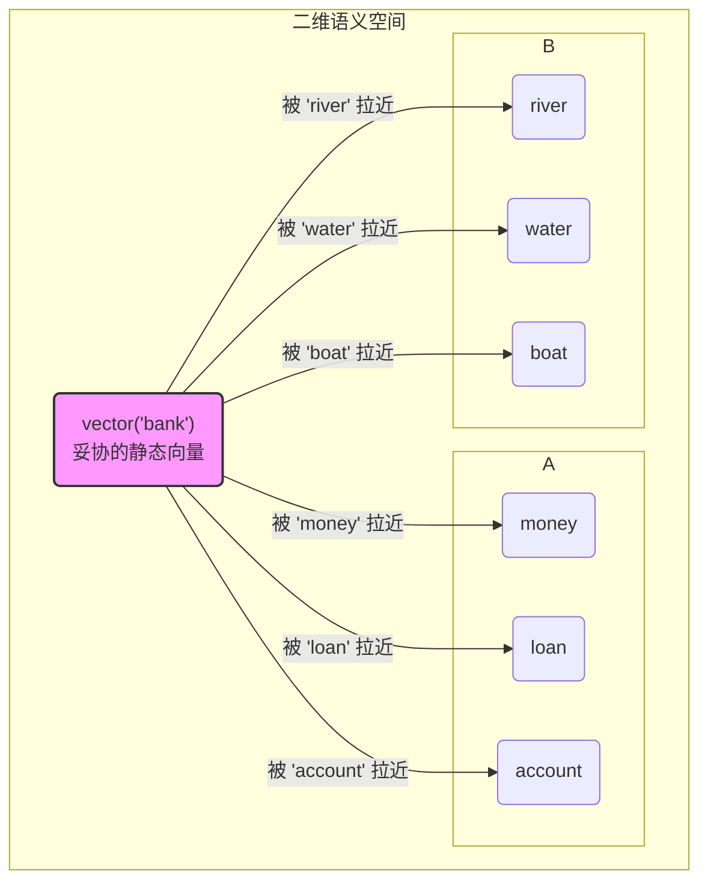

在上一节中，我们见证了Word2Vec与GloVe带来的范式革命。它们通过“预测”代替“计数”，将词语映射到低维、稠密的语义空间中，`King - Man + Woman ≈ Queen` 等优雅的等式，展示了模型捕捉词汇关系的能力。这无疑是自然语言处理领域的一大飞跃。

然而，当一项技术趋于成熟时，其内在的局限性也愈发清晰。对于这些基于预测的词向量模型而言，其根基之上存在一个根本性的局限，那就是它们的**静态性**。

---

## 2.4 承上启下：静态向量的局限与上下文的呼唤

### “bank”的身份危机：一个向量的自我矛盾

让我们再次回到那个引发了我们所有思考的词：**“bank”**。

在Word2Vec或GloVe的训练过程中，模型会阅读数以十亿计的句子。它会看到成千上万个包含“bank”的上下文：

1.  *Context Set A (金融语境)*:
    *   "... deposit money at the **bank** ..."
    *   "... applied for a loan from the **bank** ..."
    *   "... the central **bank** raised interest rates ..."

2.  *Context Set B (地理语境)*:
    *   "... sitting on the river **bank** ..."
    *   "... the boat drifted towards the **bank** ..."
    *   "... erosion of the south **bank** of the Thames ..."

在训练的每一步，模型都在努力调整 `vector('bank')` 的位置。当它看到集合A中的句子时，反向传播算法会像一只无形的手，将 `vector('bank')` 向 `vector('money')`、`vector('loan')`、`vector('rates')` 这些词的向量方向**拉近**一些。而当它看到集合B中的句子时，这只手又会反过来，将 `vector('bank')` 向 `vector('river')`、`vector('boat')`、`vector('water')` 的方向**拖拽**。

**类比：一场永无休止的拔河比赛**

想象一下，`vector('bank')` 是拔河比赛中心的那面红旗。绳子的一端是“金融概念队”，另一端是“地理概念队”。两支队伍都在拼命地将红旗拉向自己的阵营。比赛进行了无数个回合（即模型处理了无数个句子），最终，当训练结束时，这面红旗会停在哪里？

它不会完全倒向任何一边，而是会悬停在一个由两股力量决定的**平衡点**上，一个**统计上的加权平均位置**。

这个“平衡点”，就是我们最终得到的那个唯一的、静态的 `vector('bank')`。它是一个**妥协的产物**，一个**统计上的平均体**。它既不完全属于金融世界，也不完全属于地理世界。它被迫承载了两种截然不同、甚至毫无关联的语义，最终变得“四不像”。

让我们用一个简化的二维向量空间来将这个过程具象化：

这个妥协的向量在实际应用中会带来什么问题？当我们的下游模型（比如一个情感分析模型）读到句子 "The river bank was beautiful" 时，它接收到的 `vector('bank')` 却携带着一丝若有若无的“金融”气息。这就像是在欣赏一幅宁静的风景画时，背景里总有一个模糊的银行ATM机的影子，这种语义上的噪声和歧义，无疑会干扰模型的判断，限制了其性能的天花板。

### 架构的本质：上下文无关的查找机制

为什么会这样？问题的根源在于这些模型的**架构本身**。

Word2Vec和GloVe的核心产出物，是一个巨大的**查找表（Look-up Table）**，也就是那个我们称之为“嵌入矩阵”的权重矩阵 `W`。这个矩阵的行数是词汇表的大小，列数是词向量的维度。当你需要获取一个词的向量时，整个过程是这样的：

1.  **输入一个词**：例如 "bank"。
2.  **查找其ID**：在词汇表中找到 "bank" 对应的唯一索引，比如是 4321。
3.  **提取向量**：从嵌入矩阵 `W` 中，直接抽出第4321行。这一行，就是 `vector('bank')`。

请注意这个流程的关键点：**在这个查询过程中，上下文是完全缺席的。**

无论你输入的 "bank" 来自于 "money bank" 还是 "river bank"，上述查找过程都**一模一样**。模型没有机制去“看一眼”这个词的邻居，然后再决定给它一个什么样的向量。上下文信息，在模型训练结束的那一刻，其历史使命就已经完成了。它所有的作用，都已经被“烘焙”进了那个静态的、唯一的向量里。

**类比：一本奇特的“平均主义”词典**

想象一本词典，它不是像常规词典那样，为“bank”这个词条列出多个义项（1. 银行；2. 河岸...）。相反，这本词典的编纂者（模型训练算法）阅读了所有关于“bank”的用法后，大笔一挥，将所有义项融合，写下了一个全新的、独一无二的释义：

> **bank**: *一个与存钱和河流都有点关系的实体。*

当你查阅这本词典时，无论你是在读金融报告还是在读地理杂志，你得到的都是这个模糊不清、高度概括的定义。这本词典就是静态词嵌入模型。它在编纂时（训练阶段）确实参考了所有上下文，但在查阅时（应用阶段），它提供的却是一个上下文无关的、固化的结果。

> ### 常见误区：训练时使用上下文 vs. 应用时理解上下文
> 
> 这是一个非常容易引起混淆，但又至关重要的区别。
> 
> *   **静态模型（如Word2Vec）**：**使用上下文作为工具来塑造一个固定的词表示**。上下文是雕刻刀，词向量是最终成型的大理石雕像。一旦雕刻完成，雕刻刀就被收起来了。我们之后使用的，永远是那座定型的雕像。
> *   **我们理想中的模型**：应该**将上下文作为实时输入来动态生成一个临时的词表示**。上下文是光线，词的意义是变色龙。在不同的光线（上下文）下，变色龙（词）会呈现出不同的颜色（向量表示）。

| 模型类型 | 上下文的角色 | 词向量的性质 | 核心隐喻 |
| :--- | :--- | :--- | :--- |
| **静态词向量 (Word2Vec, GloVe)** | **训练数据 (Training Data)**：用于在训练时，将词向量推向其“平均”位置。 | **静态 (Static)**：一个词对应一个固定的向量，存储在查找表中。 | **雕像**：由上下文这把刻刀一次性雕刻而成。 |
| **(未来) 动态词向量** | **实时输入 (Runtime Input)**：用于在应用时，根据当前语境动态计算词的向量。 | **动态 (Dynamic)**：同一个词在不同句子中拥有不同的向量。 | **变色龙**：根据上下文这个环境，实时改变自身的颜色。 |

这个认知上的厘清，为我们指明了下一次技术革命的必然方向。我们不能再满足于为每个词锻造一把“万能钥匙”，因为根本不存在这样的钥匙。我们需要的是一个能够根据不同的锁（上下文），实时变形的“液态金属”钥匙。

### 引出新问题：如何让模型拥有记忆和序列感？

至此，我们已经将问题的症结诊断得一清二楚：**静态模型缺乏在“运行时”理解上下文的能力**。

这个诊断引出了一系列更深层次的、关于模型设计哲学的根本性问题：

1.  **如何超越“词袋”？** CBOW模型明确地将上下文视为一个无序的“袋子”（通过平均向量）。Skip-gram虽然不是直接平均，但它对上下文位置的处理也是相对独立的。这些模型本质上都没有真正理解词语的**顺序**。但语言的魔力，恰恰蕴藏在顺序之中。“狗咬人”和“人咬狗”，词汇完全相同，意义却天差地别。我们的模型如何才能理解这种由顺序决定的结构差异？

2.  **如何赋予模型“记忆”？** 当人类阅读一个长句 "Despite the initial setbacks and the challenging market conditions, the company eventually launched a successful product" 时，我们读到 "product" 时，我们脑中依然保留着对 "initial setbacks" 和 "challenging conditions" 的印象。正是这种**记忆能力**，让我们能够理解整个句子的转折和最终的积极含义。一个只能看到固定大小窗口（比如前后5个词）的模型，如何能拥有这种跨越长距离的记忆力？

3.  **表示的主体应该是什么？** 我们一直以来的努力，都是在为“词汇”（Word）这个基本单位寻找一个完美的向量表示。但“一词多义”问题告诉我们，也许问题的关键在于，**意义的基本载体可能根本不是孤立的词，而是处于特定序列中的词**。那么，我们的模型是否应该从生成 `vector(word)`，转向生成 `vector(word | sequence)`？

这些问题，像三把钥匙，共同指向了通往下一代自然语言处理模型的大门。我们需要的，不再是一个处理“集合”的数学模型，而是一个能够处理“**序列（Sequence）**”的、拥有**状态（State）**和**记忆（Memory）**的全新架构。

---

### 总结与前瞻

在这一节，我们为静态词向量的辉煌时代画上了一个清醒的句号。我们没有否定它的巨大成就，而是站在它的肩膀上，看得更远，也思考得更深。

*   **要点回顾**：
    1.  **核心缺陷**：所有静态词向量（Word2Vec, GloVe等）的根本局限在于其**静态性**，即一个词在任何上下文中都只有一个固定的向量表示，无法解决**一词多义**问题。
    2.  **“bank”的隐喻**：通过“bank”的案例，我们看到静态向量是多重语义在训练过程中相互“拉扯”后形成的一个**妥协的、平均的**结果，它无法精确地表达任何一个具体语境下的含义。
    3.  **架构根源**：这种静态性源于其**查找表**的架构本质。上下文仅在训练阶段用于“塑造”这个查找表，而在应用阶段，向量的提取过程是**上下文无关**的。
    4.  **新的呼唤**：要解决这个问题，模型必须具备理解**序列信息**和拥有**长时记忆**的能力，从而能够根据实时上下文**动态地生成**词表示。

我们已经走到了一个十字路口。左边是静态词向量世界的尽头，右边是一条通往未知但充满希望的道路。在这条新路上，我们将不再问“‘这个词’是什么意思？”，而是开始问：“‘这句话里的这个词’是什么意思？”。

这个问题的转变，预示着我们将要进入一个新的领域——序列建模（Sequence Modeling）。在那里，我们将遇到一群全新的、为序列而生的模型，比如循环神经网络（Recurrent Neural Networks, RNN）。它们，将是我们赋予机器“记忆”和“语境感”的第一次伟大尝试。准备好，我们的旅程即将进入一个动态的、流动的、真正开始触及语言本质的新篇章。