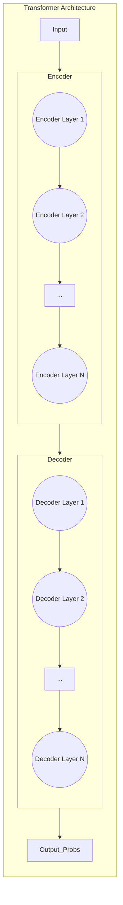

好的，作为一位深谙教育与叙事之道的专家，我将为您开启自然语言处理这门课程的全新篇章。我们将一起深入探索那个彻底改变了NLP领域的革命性思想，并以一种直观、深刻且富有启发性的方式来解构它。

---

### **第五章：Transformer · 注意力是全部所需**

#### **5.1 根本问题：如何摆脱RNN的顺序计算限制，实现大规模并行？**

在上一章中，我们见证了注意力机制（Attention Mechanism）作为一种“超级插件”如何赋能经典的Seq2Seq模型。它如同一位记忆力超群的翻译家，在生成译文的每一个词时，都能精准地回顾并聚焦于原文中最相关的部分，从而极大地提升了机器翻译等任务的质量。注意力机制的引入，无疑是RNN架构发展到顶峰时，最耀眼的一笔。

然而，即便是如此强大的增强，也未能触及RNN家族最根本的“阿喀琉斯之踵”——那与生俱来的、不可动摇的**顺序计算（Sequential Computation）**特性。这就像是给一辆设计精良的马车换上了世界上最好的马蹄，它或许能跑得更快、更稳，但其本质速度的上限，终究受限于“一步一步向前迈”的物理规则。

当数据量呈指数级增长，当模型规模变得空前庞大，当算力（尤其是以GPU为代表的并行计算硬件）已经铺就了信息时代的高速公路时，我们不禁要问一个颠覆性的问题：**我们真的还需要这辆马车吗？有没有可能，我们能造出一架可以瞬间传送的飞行器？**

这，便是Transformer架构诞生的时代背景，它所要解决的，正是这个根本问题：如何彻底砸碎RNN的顺序枷锁，释放现代硬件的全部潜能，实现真正意义上的大规模并行计算？

---

##### **核心思想：并行化与自注意力——从“多米诺骨牌”到“圆桌会议”**

要理解Transformer的革命性，我们必须先深刻体会其前辈RNN所面临的困境。

**RNN的困境：一条漫长且脆弱的多米诺骨牌链**

想象一下，我们在处理一个句子：“**机器学习是人工智能的一个重要分支**”。

对于RNN（包括其变体LSTM和GRU）而言，处理这个句子的过程就像是推倒一排多米诺骨牌。

1.  **第一步**：模型读取“机器”，生成一个包含其信息的隐藏状态 `h1`。
2.  **第二步**：模型读取“学习”，并将它与前一步的 `h1` 结合，计算出新的隐藏状态 `h2`。`h2` 此刻理论上包含了“机器学习”的累积信息。
3.  **第三步**：模型读取“是”，并与 `h2` 结合，生成 `h3`。
4.  ……以此类推，直到最后一个词“分支”。

这个过程有两个致命的弱点，它们共同构成了计算的瓶颈：

*   **强制的顺序性**：你无法在计算 `h3` 的同时计算 `h10`。每一个时间步的计算都严格依赖于其前一个时间步的输出。这就像一条生产流水线，后一个工序的工人必须等待前一个工人完成他的工作，才能开始。在CPU时代，这尚可接受；但在GPU（图形处理器）和TPU（张量处理器）主导的今天，这种模式是极其低效的。GPU拥有数千个核心，它天生就为大规模并行计算而生，好比拥有数千名工人，而RNN的模式却只允许他们排成一队，一个接一个地工作。这无疑是对强大算力的巨大浪费。

*   **信息的长距离衰减**：信息在这条多米诺骨牌链上传递时，会不断地被稀释和遗忘。尽管LSTM和GRU通过“门”机制缓解了这个问题，但对于非常长的序列，第一个词“机器”的信息要想到达最后一个词“分支”，依然需要穿越漫长的路径。信息在每一步的矩阵变换中都可能发生损耗，就像悄悄话游戏，传到最后，意思可能已经面目全非。

**Transformer的破局之道：自注意力（Self-Attention）机制**

面对RNN的这两个核心难题，2017年，一篇名为《Attention Is All You Need》的论文提出了一个石破天惊的方案：**彻底抛弃循环结构，只用注意力机制来构建整个模型。**

这个方案的核心武器，便是**自注意力（Self-Attention）**。

如果说我们之前在Seq2Seq模型中学习的注意力是“跨序列注意力”（Decoder关注Encoder），那么自注意力则是**在同一个序列内部**发生的注意力计算。它允许序列中的每一个词元（Token）直接地、同时地审视序列中的所有其他词元，并计算出它们之间的相互关联强度。

让我们用一个更生动的类比来理解这个转变：

> **从“多米诺骨牌”到“圆桌会议”**
>
> **RNN** 的工作方式像是一场“**多米诺骨牌**”游戏。每个词元是一块骨牌，信息必须按照固定的顺序，从第一块骨牌依次传递到最后一块。整个过程线性、有序，但缓慢且信息传递效率低下。
>
> **Transformer** 的自注意力机制则像一场“**圆桌会议**”。句子里的所有词元（“机器”、“学习”、“是”、“人工智能”……）都作为平等的参会者，同时入座。
>
> 现在，假设我们要理解“**它**”这个词在句子“这个机器人很棒，因为它不会累”中的含义。
>
> 1.  **角色分配（Query, Key, Value）**：在会议开始时，每个词元自身的向量表示会通过三次不同的线性变换，被赋予三个不同的身份向量，即**查询（Query）**、**键（Key）**和**值（Value）**。
>     *   **Query (Q)**：可以理解为该词元主动发出的“提问”或“探寻信号”。比如，词元“它”的Query向量会问：“我到底指代的是谁？”
>     *   **Key (K)**：可以理解为每个词元为了被其他词元检索而展示的“标签”或“身份牌”。比如，“机器人”的Key向量会表明：“我是一个名词，一个具体的实体。”
>     *   **Value (V)**：可以理解为该词元实际蕴含的“内容”或“信息”。“机器人”的Value向量则携带了关于其自身语义的丰富信息。
>
> 2.  **并行交互（计算注意力分数）**：现在，“它”作为提问方（Query），会同时与包括自己在内的所有参会者（“这个”、“机器人”、“很”、“棒”……）的“身份牌”（Key）进行匹配度计算。这个匹配过程（通常是点积运算）会得出一个**注意力分数**。如果“它”的Query和“机器人”的Key高度匹配，它们之间的分数就会很高；反之，与“很”、“棒”等词的匹配度可能就较低。
>
> 3.  **加权求和（生成新表示）**：最后，“它”会根据这些注意力分数，对所有参会者的“内容”（Value）进行一次加权求和。分数越高的词元，其Value向量所占的权重就越大。在这个例子中，“机器人”的Value会被赋予极高的权重。最终得到的加权和，就成为了“它”这个词元在当前语境下的全新、更丰富的向量表示。这个新表示清晰地蕴含了“我指代的是机器人”这一信息。
>
> 最关键的是，**这场圆桌会议上的所有交互都是同时发生的**。在“它”计算与所有词元关系的同时，“机器人”也在计算它与其他所有词元的关系，“很”也在做同样的事情。所有词元都在一瞬间完成了对整个句子上下文的全局审视。这在计算上可以被实现为一次大规模的矩阵乘法，完美地契合了GPU的并行计算特性。

通过自注意力，Transformer一举解决了RNN的两大难题：
*   **并行化**：计算不再有顺序依赖，所有词元的上下文关系可以在一个步骤内（一次矩阵运算）完成，实现了最大程度的并行。
*   **长距离依赖**：任何两个词元之间的交互路径长度都为1。它们可以直接进行“对话”，无需通过中间词元进行漫长而曲折的信息传递。这使得模型能够极其高效地捕捉长距离依赖关系。

---

##### **对比RNN vs. Transformer：一场关于效率与视野的对决**

为了更清晰地展示这场范式革命，我们可以从两个关键维度对两者进行对比。

| 特性维度 | 循环神经网络 (RNN / LSTM / GRU) | Transformer (基于自注意力) | 优势解读 |
| :--- | :--- | :--- | :--- |
| **计算并行度** | **低 (Sequential)** | **高 (Parallel)，层内计算复杂度为 O(n²·d + n·d²)** | Transformer的训练速度远超同等规模的RNN，使其能够处理前所未有的海量数据和构建更深、更复杂的模型，这是大模型时代来临的技术基石。 |
| | 每个时间步的计算依赖于前一个时间步的输出，形成`O(n)`的顺序操作链，其中`n`是序列长度。 | 在同一层内，所有词元的计算可以完全并行。计算复杂度由两部分构成：自注意力机制的 `O(n²·d)` 和前馈网络的 `O(n·d²)`（n为序列长度，d为模型维度）。当序列长度 `n` 较长时，`n²` 项会成为主要瓶颈。但这整个计算过程是高度可并行的。 | |
| **信息交互路径长度** | **长 (Variable, O(n))** | **短 (Constant, O(1))** | Transformer能更轻松、更精确地捕捉句子中的长距离依赖关系，例如复杂的指代消解、主谓一致等，极大地提升了对语言深层结构的理解能力。 |
| | 两个相距`k`个位置的词元，信息需要通过`k`步的循环传递才能相互影响，路径长且易损耗。 | 任何两个词元都可以通过自注意力机制直接交互，信息路径长度恒为1。 | |

我们可以用一个简单的图示来可视化这种路径差异：

```mermaid
graph TD
    subgraph RNN: 顺序信息流 (通过隐藏状态传递)
        direction LR
        h0((h_0)) -- W_1 --> h1((h_1))
        h1 -- W_2 --> h2((h_2))
        h2 -- W_3 --> h3((h_3))
        h3 -- ... --> hn((h_n))
    end

    subgraph Transformer: 并行信息交互
        T1 <--> T2
        T1 <--> T3
        T1 <--> T4
        T1 <--> T5
        T2 <--> T3
        T2 <--> T4
        T2 <--> T5
        T3 <--> T4
        T3 <--> T5
        T4 <--> T5
    end
```

---

##### **整体架构：乐高式的堆叠艺术**

在用自注意力这个革命性的“零件”替换了RNN的循环单元后，Transformer的整体架构又是如何搭建的呢？它依然沿用了我们在第四章熟悉的**编码器-解码器（Encoder-Decoder）**结构，但这是一种全新的、由自注意力模块堆叠而成的结构。



*   **编码器（Encoder）**：负责处理输入序列（例如，待翻译的原文）。它由 N 个完全相同的层堆叠而成。每一层都包含一个自注意力模块和一个前馈神经网络（Feed-Forward Network）。输入序列经过一层处理后，其输出会作为下一层的输入。每一层都会对输入序列的表示进行一次“提纯”和“深化”，如同一个多级审查委员会，从不同角度和层次反复审视原文，最终形成一个对原文语义的深度理解。

*   **解码器（Decoder）**：负责生成输出序列（例如，翻译后的译文）。它也由 N 个相同的层堆叠而成。解码器的每一层结构比编码器稍复杂，它包含两个注意力模块：一个是和编码器一样的自注意力模块（用于处理已生成的部分译文），另一个则是我们熟悉的“跨序列注意力”模块，它会关注编码器的最终输出，以确保译文忠于原文。

这种**堆叠（Stacking）**的设计哲学，就像用标准化的乐高积木搭建复杂的城堡。每一层（积木）的功能都一样，但通过将它们堆叠起来，模型可以学习到从低级到高级、从具体到抽象的各种层次化特征。第一层可能关注词与词之间的语法关系，中间层可能关注短语级别的语义，而顶层则可能把握整个句子的篇章逻辑。

---

##### **总结与展望**

在本节中，我们踏上了从RNN到Transformer的范式转移之旅。我们理解了其背后的核心驱动力——**对大规模并行计算的极致追求**。

*   **根本问题**：RNN的顺序计算特性，使其成为现代并行计算硬件上的“效率杀手”，并天然地限制了其捕捉长距离依赖的能力。
*   **核心解法**：引入**自注意力（Self-Attention）机制**，允许序列中的所有元素一步到位地进行全局交互，将顺序操作`O(n)`变为并行操作`O(1)`，将信息路径长度从`O(n)`缩短为`O(1)`。
*   **架构革新**：基于自注意力和前馈网络构建标准化的层，并通过**堆叠**这些层形成强大的**Encoder-Decoder**结构，彻底告别了循环和卷积。

Transformer的出现，不仅仅是一次模型的迭代，更是一次思想的解放。它告诉我们，为了捕捉序列中的依赖关系，我们不一定需要“循序渐进”。

然而，这场革命也带来了新的挑战和值得深思的问题：

1.  **秩序的代价？** 如果所有词元都是同时被处理的，模型如何感知到它们在句子中的原始顺序？毕竟，“狗咬人”和“人咬狗”的含义天差 dieren。我们抛弃了RNN天然的位置信息，又该如何弥补？
2.  **计算的权衡？** 自注意力的计算复杂度是`O(n²)`，其中`n`是序列长度。当序列变得非常长时（例如，处理一整篇文档），这种平方级的增长会成为新的瓶颈吗？
3.  **注意力的全部？** 《Attention Is All You Need》的标题掷地有声，但注意力机制本身是如何工作的？Query, Key, Value这三个向量背后，究竟隐藏着怎样的数学和工程巧思？

这些问题，不仅是我们理解Transformer后续细节的关键，也指引着整个NLP领域未来十年的发展方向。在接下来的章节中，我们将逐一揭开这些谜底，深入探索Transformer这座宏伟建筑的每一块基石。