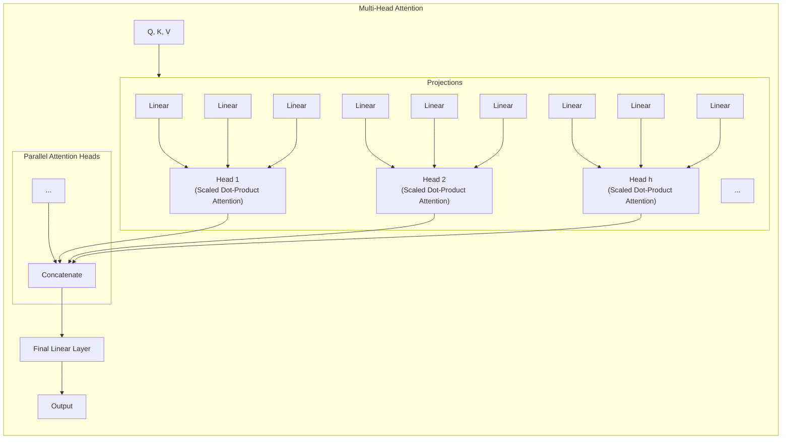

好的，作为您的课程撰写者，我将续写这一章节。我们将从宏观的“圆桌会议”比喻，深入到驱动这一切运转的微观齿轮——自注意力与多头注意力的具体实现。

---

### **5.2 拆解关键机制 (一)：自注意力与多头注意力**

在上一节中，我们将自注意力机制比作一场所有词元同时参与的“圆桌会议”，彻底打破了RNN的顺序计算枷锁。这个比喻为我们描绘了一幅宏伟的并行计算蓝图。现在，是时候走近会议桌，仔细研究这场会议的议事规则了。Query、Key、Value 这三个神秘的角色究竟是如何被设计出来的？它们之间“匹配”与“加权”的背后，又遵循着怎样精妙的数学原理？

让我们从一个更贴近其计算本质的类比开始。

#### **自注意力：Q, K, V 的直觉 —— 一场高效的图书馆信息检索**

想象你是一位研究员，正置身于一座浩瀚的图书馆中，撰写一篇关于“人工智能伦理”的论文。你的大脑中有一个明确的**查询（Query）**：“我需要关于‘AI决策的偏见问题’的资料。”

这座图书馆里的每一本书，为了便于检索，都贴着一张**标签（Key）**，上面写着这本书的核心主题，比如“机器学习算法”、“自然语言处理”、“计算机视觉”或“AI伦理与社会”。同时，每本书自身都蕴含着丰富的**内容（Value）**。

你的研究过程，完美地映射了自注意力的核心三部曲：

1.  **匹配（Query vs. Keys）**：你拿着你的查询“AI决策的偏见问题”，去逐一比对图书馆里每一本书的标签（Key）。
    *   当看到标签为“AI伦理与社会”的书时，你发现匹配度极高。
    *   当看到“机器学习算法”时，匹配度也还不错，因为偏见往往源于算法。
    *   而当看到“计算机视觉”时，匹配度可能就相对较低了，除非你的研究恰好涉及图像识别中的偏见。
    *   这个“匹配度”在自注意力中，就是一个**注意力分数（Attention Score）**。

2.  **加权（Softmax）**：你不会只选择匹配度最高的那一本书，然后忽略其他所有书籍。一个优秀的研究员会根据相关性，为每本书分配一个“阅读优先级”或“参考权重”。匹配度最高的书，你会投入80%的精力去研读；次相关的，可能分配15%；相关性很低的，只分配5%的精力粗略翻阅。这个分配权重的过程，确保了所有信息源都被考虑在内，但最重要的信息源占据主导地位。这正是`softmax`函数的作用——将原始的注意力分数转换成一个总和为1的概率分布（权重）。

3.  **求和（Weighted Sum of Values）**：最后，你开始撰写你的论文。你的最终产出，并不是任何一本书的原文复制，而是你根据刚刚分配的权重，从每一本书的内容（Value）中汲取信息，然后**融合、提炼、重组**后形成的全新知识体系。你从“AI伦理与社会”这本书中引用了核心观点，从“机器学习算法”中补充了技术细节，甚至从“计算机视觉”中也摘录了一个有关人脸识别偏见的案例。

现在，让我们将这个过程无缝切换回自然语言处理的场景中。句子中的每一个词元（Token），都扮演着双重角色：它既是提出查询的研究员，也是被查询的书籍。更准确地说，在计算时，**句子中的每一个词元都会同时生成自己的Q、K、V三个向量**。然后，每个词元的Q向量都会去并行地“查询”所有词元（包括自己）的K向量，以决定如何融合所有词元的V向量来更新每一个词元自身的表示。

当模型处理句子“The animal didn't cross the street because **it** was too tired”时，为了理解“**it**”的含义：

*   “**it**”会生成一个**Query**向量，这个Q向量可以被理解为在发问：“在这个句子里，我最可能指代的是谁？”
*   同时，句子中的每一个词（包括“it”自己）都会生成一个**Key**向量和一个**Value**向量。
    *   “animal”的**Key**向量会像它的名片一样，标识着“我是一个名词，一个实体”。其**Value**向量则携带了“animal”这个词本身的语义信息。
    *   “street”的**Key**向量标识着“我是一个地点名词”。其**Value**向量携带了“街道”的语义。
    *   “tired”的**Key**向量标识着“我是一个形容词，描述状态”。其**Value**向量携带了“疲惫”的语义。
*   接下来，“**it**”的**Query**会与所有词元的**Key**进行匹配计算（点积），得出注意力分数。显然，`Q_it · K_animal`的分数会远高于`Q_it · K_street`。
*   这些分数经过`softmax`归一化后，“animal”会获得一个非常高的权重，而其他词的权重则相应较低。
*   最后，模型将所有词元的**Value**向量根据这些权重进行加权求和。结果是，“animal”的**Value**向量几乎被完整地“注入”到了“**it**”的新表示中。

通过这一过程，词元“**it**”的输出向量就成功地吸收了其指代对象“animal”的语义信息，变得上下文感知（context-aware）。最关键的是，这个过程对所有词元是同时发生的，实现了彻底的并行化。

#### **关键算法步骤：缩放点积注意力 (Scaled Dot-Product Attention)**

现在，让我们揭开这套优雅机制背后的数学公式。Transformer论文中提出的自注意力实现方式，被称为“缩放点积注意力”。其公式简洁而强大：

`Attention(Q, K, V) = softmax( (QK^T) / sqrt(d_k) ) * V`

这个公式看似一体，实则可以分解为四个清晰的步骤，构成了一条精密的计算流水线。

```mermaid
graph TD
    subgraph Scaled Dot-Product Attention
        direction LR
        Q --> MatMul1
        K_T[K Transposed] --> MatMul1
        MatMul1[1. MatMul: QK^T] --> Scale[2. Scale: / sqrt(d_k)]
        Scale --> Softmax[3. Softmax]
        Softmax --> MatMul2
        V --> MatMul2
        MatMul2[4. MatMul: Weighted Sum] --> Output
    end
```

**第一步：`QK^T` - 计算原始注意力分数**

*   **输入**：查询矩阵`Q`和键矩阵`K`。假设我们有一个包含`n`个词元的句子，每个词元的Q、K向量维度都是`d_k`。那么`Q`的形状是 `(n, d_k)`，`K`的形状也是 `(n, d_k)`。
*   **操作**：计算`Q`与`K`的转置`K^T`（形状为`(d_k, n)`）的点积。
    *   `Q * K^T` 的结果是一个形状为 `(n, n)` 的矩阵。我们称之为**注意力分数矩阵**。
    *   这个矩阵的第 `i` 行第 `j` 列的元素，正是第 `i` 个词元的Query向量与第 `j` 个词元的Key向量的点积结果。这完美地实现了“每一个词元都与所有其他词元（包括自己）计算相似度”的并行操作。
*   **直觉**：点积是衡量向量相似度或对齐程度的一种有效方式。如果两个向量方向越接近，它们的点积通常越大。在这里，它量化了“提问者”（Query）和“标签持有者”（Key）之间的关联强度。

**第二步：`/ sqrt(d_k)` - 缩放的智慧：防止梯度消失的“冷却剂”**

*   **问题背景**：`d_k`是Q、K向量的维度，在Transformer基础模型中通常是64。当`d_k`变大时，`Q`和`K`向量中元素的方差会保持稳定（通常初始化为均值为0，方差为1），但（在Q和K的元素均值为0，方差为1的常见假设下）它们的点积 `q · k = Σ(q_i * k_i)` 的方差会近似增长到`d_k`。这意味着，如果`d_k=64`，点积结果的方差大约也是64，标准差为8。
*   **严重后果**：这意味着点积的结果会有很多绝对值非常大的数。当这些大数值被送入`softmax`函数时，`softmax`的输出会变得极其“尖锐”（peaky）。也就是说，它会给匹配度最高的那个词元分配一个接近1的概率，而给其他所有词元分配接近0的概率。这种现象被称为“硬化”（hardening）。
    *   这会导致模型在训练初期就变得过于“自信”，只关注一个源头信息，忽略了其他可能同样重要的上下文。
    *   在数学上，当`softmax`的输入值过大或过小时，其梯度会变得非常小，接近于0。这就是**梯度消失**问题。一旦梯度消失，模型参数就无法有效更新，训练过程就会停滞。
*   **解决方案**：将点积的结果除以`sqrt(d_k)`（在这里是`sqrt(64)=8`）。这个简单的缩放操作，将点积结果的方差重新拉回到1左右，使得送入`softmax`的数值分布更加平缓。这就像给过热的引擎注入了冷却剂，确保了梯度能够在一个健康的范围内流动，从而让训练过程更加稳定、高效。这是一个看似微小但对模型成功至关重要的工程技巧。

**第三步：`softmax` - 归一化为注意力权重**

*   **操作**：对缩放后的 `(n, n)` 分数矩阵的每一行独立应用`softmax`函数。
*   **结果**：矩阵中的每一行都变成了一个和为1的概率分布。第 `i` 行的 `j` 个元素，现在表示第 `i` 个词元在生成新表示时，应该给予第 `j` 个词元内容（Value）多大的关注度。这就是最终的**注意力权重矩阵**。

**第四步：`...V` - 加权求和，生成融合上下文的输出**

*   **输入**：上一步得到的 `(n, n)` 注意力权重矩阵，以及值矩阵`V`（形状为`(n, d_v)`，`d_v`通常等于`d_k`）。
*   **操作**：将权重矩阵与`V`矩阵相乘。
*   **结果**：得到一个形状为 `(n, d_v)` 的输出矩阵。
    *   这个输出矩阵的第 `i` 行向量，是通过将`V`矩阵中的所有行向量（即所有词元的Value向量）按照注意力权重矩阵第 `i` 行的权重进行加权求和得到的。
    *   至此，我们为句子中的每一个词元，都生成了一个全新的、深度融合了全局上下文信息的向量表示。

```python
# code_example: A simplified implementation of Scaled Dot-Product Attention in PyTorch

import torch
import torch.nn.functional as F
import math

def scaled_dot_product_attention(q, k, v, mask=None):
    """
    Args:
        q: query, shape = (..., seq_len_q, d_k)
        k: key, shape = (..., seq_len_k, d_k)
        v: value, shape = (..., seq_len_v, d_v) (note: seq_len_k == seq_len_v)
        mask: optional mask
    Returns:
        output: weighted value, shape = (..., seq_len_q, d_v)
        attention_weights: shape = (..., seq_len_q, seq_len_k)
    """
    d_k = q.size(-1)
    
    # 1. MatMul: QK^T
    scores = torch.matmul(q, k.transpose(-2, -1))
    
    # 2. Scale: / sqrt(d_k)
    scaled_scores = scores / math.sqrt(d_k)
    
    # (Optional mask step would be here, e.g., for decoder)
    if mask is not None:
        scaled_scores = scaled_scores.masked_fill(mask == 0, -1e9)
        
    # 3. Softmax
    attention_weights = F.softmax(scaled_scores, dim=-1)
    
    # 4. MatMul: Weighted Sum with V
    output = torch.matmul(attention_weights, v)
    
    return output, attention_weights

# Example usage:
batch_size, seq_len, d_k, d_v = 2, 5, 64, 64 # 2 samples, 5 tokens each, dimension 64
q = torch.randn(batch_size, seq_len, d_k)
k = torch.randn(batch_size, seq_len, d_k)
v = torch.randn(batch_size, seq_len, d_v)

output, weights = scaled_dot_product_attention(q, k, v)
print("Output shape:", output.shape) # Expected: torch.Size([2, 5, 64])
print("Weights shape:", weights.shape) # Expected: torch.Size([2, 5, 5])
```

#### **多头注意力机制：从单一视角到全景视野**

缩放点积注意力机制已经非常强大，但它仍然存在一个潜在的局限性。它就像一位只有一个专业领域的专家，在审视一个复杂问题时，可能会不自觉地只从自己熟悉的角度出发。

例如，在分析句子“The animal didn't cross the street because **it** was too tired”时，一个自注意力“头”（head）可能非常擅长捕捉“it”指代“animal”这种**共指关系**。但它可能因此忽略了句子中同样重要的**因果关系**（“tired”是“didn't cross”的原因）。我们希望模型能同时拥有多个“专家”，每一位专家关注一种不同类型的语言关系。

这正是**多头注意力（Multi-Head Attention）**机制的设计初衷。它不是对单一注意力机制的简单重复，而是一种“合奏”（ensemble）策略，让模型能够从多个不同的**表示子空间（representation subspaces）**中并行地学习信息。



多头注意力的流程如下：

1.  **投影（Projection）**：首先，我们将原始的`Q`, `K`, `V`矩阵，通过`h`组不同的、可学习的线性变换（即乘以不同的权重矩阵 `W_i^Q`, `W_i^K`, `W_i^V`），投影到`h`个较低维度的子空间中。如果原始模型维度是`d_model`（例如512），头的数量是`h`（例如8），那么每个头的`d_k`和`d_v`维度通常会被设为`d_model / h`（即`512 / 8 = 64`）。这样，我们就得到了`h`套独立的、低维的`Q_i`, `K_i`, `V_i`。

2.  **并行计算注意力（Parallel Attention）**：接着，对这`h`套`Q_i`, `K_i`, `V_i`并行地执行我们刚刚学过的缩放点积注意力计算。这将产生`h`个不同的输出矩阵 `head_i`。每一个`head_i`都代表了一个“专家”从其独特的视角对输入信息进行加权整合后得出的结论。一个头可能专注于语法结构，另一个头可能关注语义关联，还有一个头可能捕捉到了词语的位置关系。

3.  **拼接与再次投影（Concatenate & Final Projection）**：最后，我们将这`h`个输出矩阵`head_i`在维度上拼接（concatenate）起来，形成一个大的特征矩阵。然而，这个拼接后的矩阵还不能直接交给下一层。我们还需要通过最后一个可学习的线性变换（乘以权重矩阵`W^O`），将这个融合了多方面信息的矩阵重新投影回原始的模型维度`d_model`。这一步可以看作是“专家委员会”的最终决策过程：将所有专家的意见汇总，并形成一个统一、全面的最终报告。

#### **优势：为什么这套组合拳如此强大？**

通过将自注意力与多头机制相结合，Transformer获得了几项决定性的优势：

*   **捕捉长距离依赖**：这一点在5.1节已经强调。任何两个词元间的交互路径长度都为1，这是通过`QK^T`矩阵直接实现的，多头机制继承并强化了这一点。
*   **计算可并行**：整个注意力计算，无论是单头还是多头，其核心都是矩阵乘法。这些运算在现代GPU上可以被极度高效地并行处理。多头机制的并行性更是锦上添花。
*   **参数效率与表征丰富性**：乍看之下，`h`个头似乎意味着`h`倍的计算量。但由于每个头的维度被缩减为`1/h`，总的计算成本与一个全维度的单头注意力大致相当。然而，其收益却是巨大的。这种“分而治之”的策略让模型在不显著增加参数的情况下，能够学习到更加丰富和多样的特征表示，极大地增强了模型的表达能力。

---

##### **总结与前瞻**

在本节中，我们从直观的类比到具体的数学公式，彻底拆解了自注意力和多头注意力这两个Transformer的核心引擎。

*   **自注意力** 本质上是一个高效的、可并行的信息检索与加权融合过程，通过`Q`, `K`, `V`三个角色，让每个词元都能动态地审视并整合全局上下文。
*   **缩放点积注意力** 是其具体的数学实现，通过点积计算相似度，通过`softmax`归一化权重，并通过一个至关重要的**缩放因子`sqrt(d_k)`**来保证训练的稳定性。
*   **多头注意力** 则是对自注意力的升华，它像一个专家委员会，允许模型从多个不同的表示子空间并行地审视信息，最终融合成一个更全面、更鲁棒的上下文表示。

我们已经深入了解了Transformer如何让信息在序列内部自由流动和交互。然而，一个至关重要的问题依然悬而未决：在这个所有词元“同时”被处理的并行世界里，模型是如何知道“狗咬人”和“人咬狗”之间那决定性的**顺序差异**的？我们抛弃了RNN与生俱来的时序性，又该如何将位置信息重新“编码”并注入模型之中？

这便是我们下一节将要探索的谜题：**位置编码（Positional Encoding）**——在无序的世界中，重构秩序的艺术。