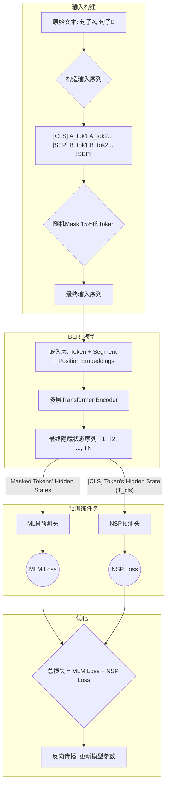

好的，作为一位致力于启发与教育的作家，我将为您呈现这一章节的内容。我将以叙事的方式，引领读者穿越BERT的诞生背景，深入其精巧的设计，最终展望其深远的影响。

---

### **第六章：新范式 · 预训练、提示与微调**

#### **6.2 工具一 (编码器)：BERT及其变体**

在上一节中，我们共同见证了自然语言处理领域一场深刻的范式革命——“预训练-微调”模式的崛起。这如同工业革命中标准件的发明，我们不再需要为每一个任务都从零开始打造机器，而是可以基于一个强大的、通用的预制引擎，稍加改造，便能驱动各式各样的应用。今天，我们将要深入剖析这个新范式中最具里程碑意义的“引擎”之一，一个彻底改变了我们对语言理解（NLU）认知深度的模型：**BERT**。

##### **核心思想与工作原理：一场“深读”语言的革命**

在BERT（Bidirectional Encoder Representations from Transformers）于2018年横空出世之前，语言模型的世界主要由“单行道”主宰。像GPT-1这样的模型，其本质是一个从左到右的阅读者。当它试图理解句子中的某个词时，它只能“看到”这个词之前的所有内容。另一位先行者ELMo虽然通过拼接两个独立训练的单向模型（一个从左到右，一个从右到左）实现了一种“伪双向”，但这好比一个侦探在阅读案件卷宗时，先顺着读一遍，再倒着读一遍，然后把两次的笔记拼在一起。他确实获得了更多的信息，但在这两个阅读过程中，他从未能同时将一个词的“前因”与“后果”放在一起进行通盘考量。

**问题在哪里？** 语言的精髓在于上下文。想象一下这个句子：“The man went to the **bank** to deposit his money.” 和 “The man sat on the river **bank** and fished.” 如果一个模型在处理 `bank` 这个词时，只能看到前面的 “The man went to the...”，它或许能猜到与金融有关，但信息的确定性大打折扣。而如果能同时看到后面的 “...to deposit his money.”，`bank` 的含义便被牢牢锁定。真正的理解，要求我们能站在一个词的“十字路口”，同时环顾它的左邻右舍、前因后果。

**BERT的解决方案：真正的双向深度理解**

BERT的缔造者们，来自Google的研究人员，提出了一个颠覆性的设想：我们能否构建一个模型，让它在处理句子中的任何一个词时，都能不受限制地、同时地审视整个句子的所有上下文？

他们找到了完美的工具——Transformer的**编码器（Encoder）**。我们知道，Transformer编码器的核心是自注意力机制（Self-Attention），它天生就具有“全局视野”。在自注意力机制的计算中，序列中的每一个词都会与其他所有词（包括它自己）计算一个注意力分数，然后根据这个分数加权聚合所有词的信息，形成自己新的、更丰富的表示。这个过程是并行的、一步到位的，不存在从左到右或从右到左的顺序限制。

这就像一位经验丰富的文本解读专家，在解读一首诗中的某个意象时，她不会逐字逐句地线性分析，而是会将这个意象置于整首诗的结构、韵律、情感基调和所有其他意象的相互关系中，反复审视，从而获得一个深刻、立体、且与全局融为一体的理解。BERT正是通过堆叠多层Transformer编码器，让每个词的表示在每一层都不断地与全局上下文进行深度融合、反复“磋商”，最终生成**深度上下文相关的词表示（Deeply Contextualized Word Representations）**。

这种“深读”能力，是BERT的灵魂所在，也是它在众多NLU任务上取得突破性进展的根本原因。它生成的词向量不再是像Word2Vec那样“一词一义”的静态向量，也不是像ELMo那样“浅尝辄辄”的上下文向量，而是一个在特定语境中被彻底浸润和定义的动态表征。

##### **关键技术组件：MLM & NSP - BERT的“自我修养”**

现在，我们面临一个棘手的技术难题。既然BERT能够“看到”整个句子，那么在训练它预测一个词时，它岂不是可以直接“偷看”到答案？如果我让你预测句子“我爱[?]京”中括号里的词，但同时把完整的句子“我爱北京”都展示给你，这个任务就变得毫无意义。这便是双向模型训练中的“作弊”问题。

为了解决这个问题，BERT的设计者们构思了两个巧妙的、无需人工标注的**预训练任务**，让模型在海量的无标签文本中进行“自我修养”。

**1. 掩码语言模型 (Masked Language Model, MLM)**

MLM的灵感来源于我们都做过的“完形填空”（Cloze Test）。与其预测下一个词，不如随机地“抠掉”句子中的一些词，让模型去猜这些被“抠掉”的词是什么。

**工作方式：**

1.  **随机掩码**：在输入的一个句子中，随机选择15%的词元（Token）进行处理。
2.  **具体策略**：对于这15%的词元，应用以下规则：
    *   **80%的概率**：用一个特殊的 `[MASK]` 标记替换这个词。例如，“我爱北京” -> “我爱`[MASK]`京”。这是主要的训练方式，直接告诉模型：“这里有个词被盖住了，请你猜猜它是什么。”
    *   **10%的概率**：用一个随机的其他词替换这个词。例如，“我爱北京” -> “我爱**纽约**”。这样做是为了让模型学会判断一个词在当前语境下是否合理，增加了模型的辨别能力。它告诉模型：“这个位置的词看起来不对劲，你觉得正确的应该是什么？”
    *   **10%的概率**：保持原词不变。例如，“我爱北京” -> “我爱**北京**”。这看似奇怪，但其目的是为了减轻预训练（有`[MASK]`标记）和微调（没有`[MASK]`标记）之间的不匹配。模型因此被要求不仅要预测被遮盖的词，还要对所有输入词都生成一个好的表示。

通过这个任务，BERT被迫去深入理解每个词左右的上下文，因为这是预测被掩码词的唯一线索。它不再是简单的序列生成，而是一种基于深层语境的**双向推理**。

**2. 下一句预测 (Next Sentence Prediction, NSP)**

MLM让BERT掌握了词级别的语境理解，但对于句子之间、段落之间的逻辑关系（如因果、延续、转折），MLM是无能为力的。例如，理解幽默、识别论点和论据，都需要对句子间的关系有深刻的把握。

**工作方式：**

1.  **构造句对**：从训练语料中，选取两个句子A和B。
2.  **正负样本**：
    *   **50%的概率**（正样本）：句子B就是句子A在原文中紧邻的下一句。标签为 `IsNext`。
    *   **50%的概率**（负样本）：句子B是从语料库中随机抽取的、与A无关的一个句子。标签为 `NotNext`。
3.  **输入格式**：BERT的输入被设计成可以处理句对的形式：`[CLS] 句子A [SEP] 句子B [SEP]`。
    *   `[CLS]`：这是一个特殊的分类标记，位于整个输入序列的开头。BERT被设计为将这个标记对应的最终隐藏状态，作为整个输入序列的聚合表示，用于分类任务。
    *   `[SEP]`：用于分隔两个句子。
4.  **训练目标**：模型需要基于`[CLS]`标记的输出，预测这两个句子是否是连续的。这本质上是一个二分类任务。

通过NSP任务，BERT被迫去学习更高层次的语义连贯性和逻辑关系，这对于问答（QA）、自然语言推理（NLI）等需要理解句子间关系的任务至关重要。

下面是一个流程图，清晰地展示了BERT的预训练过程：



这两个任务就像一个严苛的导师，通过完形填空和句子关系判断，不断地锤炼着BERT的内功，使其在阅读了海量文本（如维基百科、书籍）后，成为一个对语言有着深刻理解的“通才”。

##### **微调实践：从“通才”到“专才”的蜕变**

预训练完成的BERT，就像一位博览群书、知识渊博的大学毕业生。他拥有强大的通用语言理解能力，但尚未具备解决特定领域问题的专业技能。**微调（Fine-tuning）**就是对这位“毕业生”进行短暂而高效的“在职培训”，使其迅速成为特定任务的“专家”。

这个过程出奇地简单和高效：

1.  **替换“头部”**：根据具体任务，在预训练好的BERT模型之上，添加一个或几个简单的、未训练的输出层。这个新加的层被称为“任务头”（Task-specific Head）。
2.  **端到端训练**：使用特定任务的**有标签数据**，对整个模型（包括BERT的主体和新加的头部）进行训练。由于BERT的主体已经有了非常好的参数初始化，我们通常只需要用较小的数据量和较少的训练轮次，就能达到非常好的效果。

**示例应用：**

*   **文本分类/情感分析**：
    *   **结构**：BERT + 一个全连接层 + Softmax。
    *   **工作原理**：将输入文本喂给BERT，取其`[CLS]`标记对应的最终输出向量，这个向量被认为是整个文本的语义表示。然后将这个向量输入到全连接层进行分类。
    *   **代码示例 (使用Hugging Face Transformers库)**:
        ```python
        from transformers import BertTokenizer, BertForSequenceClassification
        import torch

        # 1. 加载预训练的BERT模型和分词器
        #    `num_labels=2` 表示这是一个二分类任务 (例如, 正面/负面)
        tokenizer = BertTokenizer.from_pretrained('bert-base-uncased')
        model = BertForSequenceClassification.from_pretrained('bert-base-uncased', num_labels=2)

        # 2. 准备输入数据
        text = "This movie was absolutely fantastic!"
        inputs = tokenizer(text, return_tensors="pt") # "pt" for PyTorch tensors

        # 3. 准备标签
        labels = torch.tensor([1]).unsqueeze(0)  # 假设1代表正面情感

        # 4. 在微调阶段，计算损失并进行反向传播
        #    模型内部会自动使用[CLS] token的输出进行分类
        outputs = model(**inputs, labels=labels)
        loss = outputs.loss
        logits = outputs.logits

        print(f"Loss: {loss.item()}")
        # 在实际训练中，会执行 loss.backward() 和 optimizer.step()
        ```

*   **命名实体识别 (Named Entity Recognition, NER)**：
    *   **结构**：BERT + 针对每个Token的分类层。
    *   **工作原理**：将文本喂给BERT，但这次我们不只关心`[CLS]`。我们取**每一个词元**对应的最终输出向量，然后各自通过一个分类层，来判断该词元属于哪个实体类别（如`B-PER`-人名开始, `I-LOC`地点中间, `O`-非实体等）。

微调的优雅之处在于，它极大地降低了为新任务训练高性能模型的门槛。研究者和工程师们不再需要设计复杂的特定任务架构，只需“即插即用”地利用BERT强大的表示能力，便能在各种NLU基准测试中刷新纪录。

##### **主要变体及其权衡：站在巨人肩上的探索**

BERT的成功开启了一个“后BERT时代”，无数研究者开始在它的基础上进行改进和优化，催生了众多变体。这里我们介绍两个最具代表性的。

**1. RoBERTa (A Robustly Optimized BERT Pretraining Approach)**

RoBERTa的作者们像一群严谨的实验科学家，他们重新审视了BERT的每一个训练细节，并发现了一些可以大幅改进的地方。

*   **关键创新**：
    *   **移除NSP任务**：他们通过实验发现，NSP任务不仅对性能提升帮助不大，有时甚至会损害性能。移除它，让模型专注于MLM，效果反而更好。
    *   **动态掩码**：原始BERT在数据预处理时就确定了掩码位置，这意味着一个句子在训练中每次出现时，被掩码的词都是固定的。RoBERTa改为**动态掩码**，每次向模型输入一个序列时，才临时生成一个新的掩码模式。这增加了训练的多样性，让模型学习得更充分。
    *   **更大的数据和更长的训练**：他们使用了远超BERT的训练数据，并显著增加了训练步数。

**结果**：RoBERTa在几乎所有NLU任务上都超越了BERT，成为了一个新的、更强大的基线模型。

**2. DistilBERT (Distilled BERT)**

BERT虽然强大，但其庞大的体积和计算需求使其难以部署在资源受限的环境中（如移动设备）。DistilBERT应运而生，旨在创建一个更小、更快、更轻量级的版本。

*   **关键创新**：
    *   **知识蒸馏 (Knowledge Distillation)**：这是一种模型压缩技术。它将一个大的、性能好的“教师模型”（如BERT）的知识，“蒸馏”到一个小的“学生模型”（DistilBERT）中。学生模型不仅学习去拟合真实标签，还学习去模仿教师模型在输出层的概率分布，甚至中间层的表示。这就像一位学徒不仅学习师傅最终的作品，还学习师傅在制作过程中的思考方式和技巧。

**结果**：DistilBERT的参数量减少了40%，速度提升了60%以上，同时保留了BERT约97%的性能。它在性能和效率之间取得了绝佳的平衡。

| **模型比较** | **BERT-base** | **RoBERTa** | **DistilBERT** |
| :--- | :--- | :--- | :--- |
| **核心预训练任务** | MLM + NSP | 仅 MLM (动态掩码) | MLM (从教师BERT处蒸馏) |
| **关键创新** | 首次提出双向Transformer预训练 | 优化训练策略、移除NSP、更大规模训练 | 知识蒸馏，模型压缩 |
| **模型规模/速度** | 标准 (约110M参数) | 略大于BERT-base | 更小、更快 (约66M参数) |
| **适用场景** | 通用的强大基线，研究和应用的起点 | 当追求极致性能，计算资源充足时 | 对推理速度和模型大小有要求的生产环境 |

---

**总结与前瞻**

今天，我们深入了BERT的世界。我们理解了它如何通过**双向Transformer编码器**实现了对语言的“深读”，彻底改变了词语表示的生成方式。我们剖析了其两大核心预训练任务——**掩码语言模型（MLM）**和**下一句预测（NSP）**——是如何在没有人工标注的情况下，赋予模型强大的通用语言理解能力。我们还看到了如何通过简单的**微调**，将这个“通才”模型转变为解决特定任务的“专才”，并领略了其后继者如**RoBERTa**和**DistilBERT**如何在其基础上进行优化与权衡。

BERT的出现，不仅仅是一个模型的成功，它更像是在NLP宇宙中点亮了一座灯塔，照亮了基于大规模预训练的道路。然而，这座灯塔也引发了我们更深层次的思考：

*   BERT作为编码器的典范，其“理解”能力令人惊叹。那么，如果我们把焦点放在生成任务上，完全依赖Transformer的解码器（Decoder），又会诞生怎样的模型？
*   MLM这种“完形填空”式的训练，是否是语言学习的终极形态？它是否也有其固有的局限性？
*   当模型越来越大，我们是否总能通过“大力出奇迹”的方式获得更好的性能？效率与性能的权衡，将把我们引向何方？

带着这些问题，我们将在接下来的章节中，继续探索这个新范式下的其他重要工具和思想。BERT的故事远未结束，它只是宏大叙事的精彩开篇。