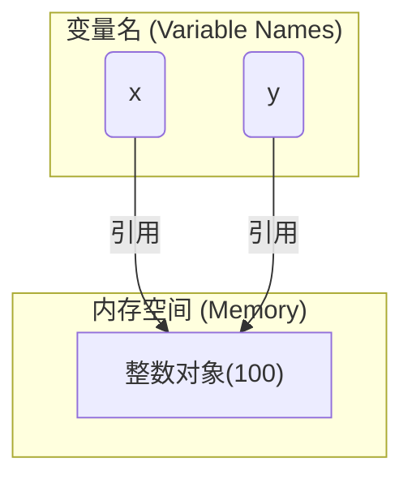

### 🎯 核心目标 (Core Goal)

本节旨在帮助你理解编程世界最基础也是最重要的概念：**变量**。你将理解变量如同给数据贴上的“命名标签”，并熟练掌握 Python 中最核心的几种“原子”数据类型：数字（整数、浮点数）、字符串、布尔值以及特殊的 `None`。

### 🔑 核心语法与参数 (Core Syntax & Parameters)

在 Python 中，操作变量与数据类型主要依赖以下两个核心语法：

1.  **变量赋值 (Assignment)**：使用赋值运算符 `=` 将数据（值）绑定到一个变量名上。

    ```python
    variable_name = value
    ```

    *   `variable_name`: 你为变量起的名字，需遵循命名规则（例如，不能以数字开头，不能使用 Python 关键字）。
    *   `=`: 赋值运算符，它的作用是“将右边的值赋给左边的变量”。
    *   `value`: 任何 Python 的数据对象，如数字 `10`、字符串 `"Hello"` 等。

2.  **类型检查 (Type Checking)**：使用内置函数 `type()` 查看一个变量或值的数据类型。

    ```python
    type(object)
    ```

    *   `object`: 你想要检查其类型的变量或值。

### 💻 基础用法 (Basic Usage)

让我们通过代码实例，直观地感受如何声明变量并赋予不同类型的值。

#### 1. 变量的声明与赋值

在 Python 中，变量的声明与赋值是同时完成的。当你第一次给一个变量名赋值时，这个变量就被创建了。

```python
# 将字符串 "Alice" 赋值给变量 user_name
user_name = "Alice"

# 将整数 30 赋值给变量 age
age = 30

print(user_name)
print(age)
```

#### 2. 数字类型：整数 (int) 与浮点数 (float)

*   **整数 (`int`)**: 不带小数点的数字。
*   **浮点数 (`float`)**: 带小数点的数字。

```python
# 整数 (int)
item_count = 10
total_score = -5

# 浮点数 (float)
price = 99.9
pi_approx = 3.14159
```

#### 3. 字符串类型 (str)

字符串是文本数据，需要用单引号 `'...'` 或双引号 `"..."` 括起来。

```python
# 使用双引号
greeting = "Hello, Python!"

# 使用单引号
motto = 'Code is poetry.'
```

#### 4. 布尔值 (bool) 与 NoneType

*   **布尔值 (`bool`)**: 只有 `True` (真) 和 `False` (假) 两个值，常用于逻辑判断。
*   **`None`**: 特殊类型 `NoneType` 的唯一值，表示“空”或“无定义”。

```python
# 布尔值 (bool)
is_logged_in = True
has_permission = False

# NoneType
user_input = None # 例如，在用户还未输入任何内容时
```

#### 5. 使用 `type()` 函数检查变量类型

要验证一个变量当前存储的数据是什么类型，`type()` 函数是你的得力助手。

```python
user_name = "Alice"
age = 30
price = 99.9
is_logged_in = True
user_input = None

print(f"'{user_name}' 的类型是: {type(user_name)}")
print(f"{age} 的类型是: {type(age)}")
print(f"{price} 的类型是: {type(price)}")
print(f"{is_logged_in} 的类型是: {type(is_logged_in)}")
print(f"{user_input} 的类型是: {type(user_input)}")
```
**输出:**
```
'Alice' 的类型是: <class 'str'>
30 的类型是: <class 'int'>
99.9 的类型是: <class 'float'>
True 的类型是: <class 'bool'>
None 的类型是: <class 'NoneType'>
```

### 🧠 深度解析 (In-depth Analysis)

#### 变量在内存中到底是什么？

初学者常误以为“变量是一个装有数据的盒子”。在 Python 中，一个更精确的比喻是：**“变量是贴在数据对象上的一个标签”**。

当你执行 `x = 100` 时，Python 首先在内存中创建了一个整数对象 `100`，然后创建了一个名为 `x` 的标签，并将它“贴”在这个 `100` 对象上。

如果接着执行 `y = x`，Python 不会复制 `100` 这个对象，而是创建了一个新的标签 `y`，然后把它也贴到同一个 `100` 对象上。


*上图展示了变量 `x` 和 `y` 都指向了内存中同一个值为 `100` 的对象。*

#### Python 的动态类型特性

与 C++ 或 Java 等静态类型语言不同，Python 是**动态类型**的。这意味着你不需要在创建变量时预先声明它的类型。变量的类型是在运行时，根据它被赋予的值来决定的。同一个变量名可以在程序的不同位置指向不同类型的对象。

```python
# my_var 最初指向一个整数对象
my_var = 10
print(f"值: {my_var}, 类型: {type(my_var)}")

# 现在，我们将 my_var 这个标签撕下来，贴到一个字符串对象上
my_var = "Hello World"
print(f"值: {my_var}, 类型: {type(my_var)}")
```

### ⚠️ 常见陷阱与最佳实践 (Common Pitfalls & Best Practices)

#### 常见陷阱

1.  **无效的变量名 (SyntaxError)**:
    *   使用 Python 关键字（如 `if`, `for`, `class`）做变量名。
    *   以数字开头（如 `1st_place`）。
    *   包含非法字符（如 `my-var`, `user@name`）。

    ```python
    # 错误示例
    # for = "a keyword"  # SyntaxError: invalid syntax
    # 1st_place = "gold" # SyntaxError: invalid decimal literal
    ```

2.  **混淆赋值与比较 (`=` vs `==`)**:
    *   `=` 是赋值符号，用于将值绑定给变量。
    *   `==` 是比较符号，用于判断两个值是否相等（后续章节会详细讲解）。
    *   初学者常在需要判断的地方误用 `=`，导致逻辑错误。

3.  **类型不匹配操作 (TypeError)**:
    *   尝试对不同数据类型的变量进行不支持的操作，最常见的是字符串和数字相加。

    ```python
    # 错误示例
    # 'Your score is: ' + 95 # TypeError: can only concatenate str (not "int") to str
    
    # 正确做法 (需要先将数字转换为字符串)
    message = 'Your score is: ' + str(95)
    print(message)
    ```

#### 最佳实践

1.  **使用描述性的名称 (可读性)**:
    *   变量名应清晰地反映其存储的数据的含义。
    *   遵循 **PEP 8** 风格指南，使用 `snake_case`（小写字母和下划线）命名变量。

    ```python
    # 不推荐 👎
    x = "John Doe"
    y = 35

    # 推荐 👍
    user_name = "John Doe"
    user_age = 35
    ```

2.  **保持类型一致性**:
    *   尽管 Python 允许改变变量的类型，但在一个明确的上下文或函数中，应尽量让一个变量始终存储同一种类型的数据。这会让代码更容易理解和维护。

### 🚀 实战演练 (Practical Exercise)

**任务：** 创建一个简单的“迷你用户档案”脚本。

1.  创建四个变量：
    *   `name`: 存储你的名字 (字符串)。
    *   `age`: 存储你的年龄 (整数)。
    *   `height_m`: 存储你的身高（单位：米，浮点数）。
    *   `is_developer`: 存储你是否是开发者 (布尔值)。
2.  为这些变量赋上你自己的信息。
3.  使用 `print()` 和 f-string 格式化输出一句完整的自我介绍。
4.  最后，分别打印出每个变量的数据类型。

**参考解决方案:**

```python
# 1. & 2. 创建变量并赋值
name = "Alex"
age = 28
height_m = 1.75
is_developer = True

# 3. 格式化输出自我介绍
intro_message = f"大家好，我叫 {name}。我今年 {age} 岁，身高 {height_m} 米。我是一名开发者吗？答案是：{is_developer}。"
print(intro_message)

print("-" * 20) # 打印分割线

# 4. 打印每个变量的类型
print(f"变量 'name' 的类型是: {type(name)}")
print(f"变量 'age' 的类型是: {type(age)}")
print(f"变量 'height_m' 的类型是: {type(height_m)}")
print(f"变量 'is_developer' 的类型是: {type(is_developer)}")
```

### 💡 总结 (Summary)

恭喜你！你已经掌握了 Python 编程的基石。让我们快速回顾一下核心知识点：

*   **变量是数据的命名标签**：通过 `=` 运算符，我们可以将一个名字（变量）与内存中的一个数据对象关联起来。
*   **核心基本类型**:
    *   `int`: 整数，用于精确计数。
    *   `float`: 浮点数，用于表示小数或科学计数。
    *   `str`: 字符串，用于表示文本。
    *   `bool`: 布尔值 (`True`/`False`)，用于逻辑判断。
    *   `NoneType`: 特殊类型，其唯一值 `None` 表示“空”。
*   **动态类型**: Python 变量的类型由其指向的值决定，并且可以在程序执行过程中改变。
*   **`type()` 函数**: 是你诊断和理解变量背后数据类型的必备工具。
*   **编码规范**: 良好的变量命名是编写清晰、可维护代码的第一步。