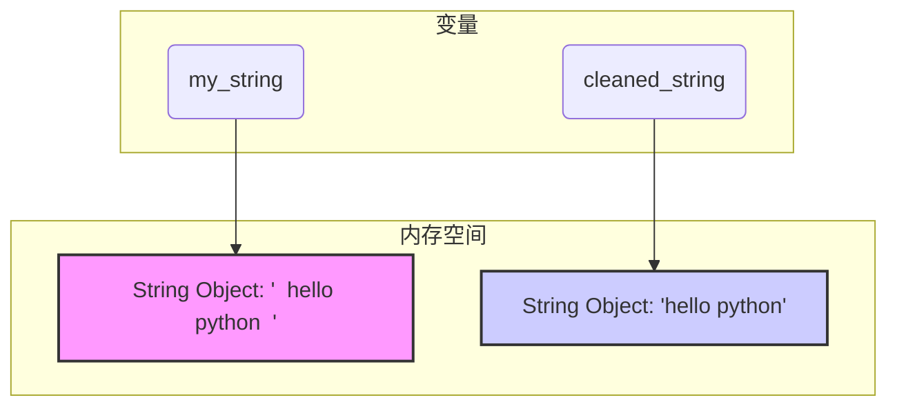

在上一节中，我们了解了字符串 (`str`) 是 Python 的基本数据类型之一，是用来存储文本的容器。现在，我们将深入探索如何驾驭这个强大的类型，学习各种切割、组合与美化文本的技巧，这对于处理任何文本数据都至关重要。

### 🎯 核心目标 (Core Goal)

本节的核心目标是让你**精通 Python 字符串的常用操作**。学完本节，你将能够自如地使用 f-string 进行优雅的文本格式化，通过索引和切片精确地提取子字符串，并运用一系列强大的内置方法来清洗、分割和重组文本。这是你日后进行数据分析、网络爬虫、Web 开发等一切文本处理任务的坚实基础。

### 🔑 核心语法与参数 (Core Syntax & Parameters)

字符串操作的核心语法和方法构成了我们与文本交互的工具箱。

1.  **格式化 (f-string)**: 在字符串前加上 `f` 或 `F`，并在花括号 `{}` 内直接嵌入变量或表达式。
    ```python
    f"任意文本 {variable_or_expression} 任意文本"
    ```

2.  **拼接与重复 (Concatenation & Repetition)**:
    *   `+`: 将两个字符串连接成一个新字符串。
    *   `*`: 将一个字符串重复指定的次数。
    ```python
    string1 + string2
    string * integer
    ```

3.  **索引与切片 (Indexing & Slicing)**: 使用方括号 `[]` 访问字符串中的字符或子串。
    ```python
    string[index]
    string[start:stop:step]
    ```
    *   `start`: 切片开始的位置（包含），默认为 0。
    *   `stop`: 切片结束的位置（不包含），默认为字符串末尾。
    *   `step`: 步长，即每隔多少个字符取一个，默认为 1。

4.  **常用方法 (Common Methods)**: 通过点号 `.` 调用字符串对象的方法。
    *   `.strip([chars])`: 移除字符串首尾指定的字符（默认为空白字符）。
    *   `.split(sep=None, maxsplit=-1)`: 按指定分隔符 `sep` 将字符串分割成列表。
    *   `.join(iterable)`: 用调用该方法的字符串（作为分隔符）将一个可迭代对象（如列表）中的所有字符串元素连接成一个新字符串。
    *   `.upper()` / `.lower()`: 将所有字符转换为大写/小写。
    *   `.replace(old, new, count=-1)`: 将字符串中的 `old` 子串替换为 `new`。
    *   `.find(sub)`: 查找子串 `sub`，找到则返回其首次出现的索引，否则返回 -1。
    *   `.index(sub)`: 类似于 `.find()`，但如果找不到子串会引发 `ValueError` 异常。
    *   `.startswith(prefix)`: 检查字符串是否以指定前缀 `prefix` 开头。
    *   `.endswith(suffix)`: 检查字符串是否以指定后缀 `suffix` 结尾。

### 💻 基础用法 (Basic Usage)

让我们通过具体的代码示例来逐一掌握这些强大的操作。

#### 1. f-string 格式化

f-string (格式化字符串字面值) 是 Python 3.6+ 引入的特性，因其简洁、直观和高效而成为首选的字符串格式化方法。

```python
name = "Alice"
age = 30
score = 95.5

# 在字符串中直接嵌入变量
greeting = f"Hello, my name is {name} and I am {age} years old."
print(greeting)

# 可以在 {} 中执行简单的表达式
summary = f"{name}'s score is {score}, which is {score / 100:.2%} of the total."
print(summary)
```
**输出:**
```
Hello, my name is Alice and I am 30 years old.
Alice's score is 95.5, which is 95.50% of the total.
```

#### 2. 字符串拼接 (+) 与重复 (*)

这是最基础的字符串组合方式。

```python
# 拼接 (+)
first_name = "Alan"
last_name = "Turing"
full_name = first_name + " " + last_name
print(full_name) # 输出: Alan Turing

# 重复 (*)
separator = "-" * 20
print(separator) # 输出: --------------------
```

#### 3. 索引与切片 [start:stop:step]

索引让我们能够像访问数组元素一样访问字符串中的单个字符。切片则能提取出一段子字符串。

```python
py_string = "Python"

# 索引 (从 0 开始)
print(f"第一个字符: {py_string[0]}")   # P
print(f"最后一个字符: {py_string[-1]}")  # n (负数索引从-1开始，表示倒数第一个)

# 切片 [start:stop]
print(f"从第2位到第4位: {py_string[1:4]}") # yth (不包含索引4)
print(f"从头到第3位: {py_string[:3]}")      # Pyt
print(f"从第3位到末尾: {py_string[2:]}")      # thon

# 切片 [start:stop:step]
alphabet = "abcdefghijklmnopqrstuvwxyz"
print(f"每隔一个字符取一个: {alphabet[::2]}") # acegikmoqsuwy

# 巧妙地逆转字符串
print(f"'Python' 逆序: {py_string[::-1]}") # nohtyP
```

#### 4. 清洗与转换方法

这些方法极大地简化了常见的文本处理任务。

```python
# .strip(): 清理首尾空白
raw_input = "   some important data    "
clean_input = raw_input.strip()
print(f"'{raw_input}' -> '{clean_input}'")

# .split(): 分割字符串
csv_line = "apple,banana,cherry,date"
fruits_list = csv_line.split(',')
print(f"水果列表: {fruits_list}")

# .join(): 用指定字符串连接列表元素
words = ["Python", "is", "awesome"]
sentence = " ".join(words)
print(f"组合成的句子: {sentence}")

# .upper() & .lower(): 大小写转换
mixed_case = "HeLLo WoRLd"
print(f"全大写: {mixed_case.upper()}")
print(f"全小写: {mixed_case.lower()}")

# .replace(): 替换子串
message = "I like cats. Cats are cute."
new_message = message.replace("cats", "dogs")
print(f"替换后的消息: {new_message}")
```

#### 5. 查找与判断方法

这类方法用于检查字符串的内容，而不改变它。

```python
# .find() & .index(): 查找子串
sentence = "Python is a powerful language."
print(f"'powerful' 的位置 (find): {sentence.find('powerful')}") # 12
print(f"'powerful' 的位置 (index): {sentence.index('powerful')}") # 12
print(f"查找 'java' (find): {sentence.find('java')}") # -1 (未找到)
# print(sentence.index('java')) # 会引发 ValueError

# .startswith() & .endswith(): 检查首尾
filename = "document.pdf"
print(f"文件名是否以 'doc' 开头: {filename.startswith('doc')}") # True
print(f"文件名是否以 '.pdf' 结尾: {filename.endswith('.pdf')}") # True
```

### 🧠 深度解析 (In-depth Analysis)

#### 核心概念：字符串的不可变性 (Immutability)

这是理解字符串操作行为的关键。在 Python 中，字符串是**不可变 (immutable)** 的。这意味着一旦一个字符串对象被创建，它的内容就不能被修改。所有看起来像在“修改”字符串的方法（如 `.upper()`, `.replace()`, `.strip()`），实际上都没有改变原始字符串，而是**创建并返回了一个新的、修改后的字符串**。

```python
my_string = "  hello python  "

# 尝试调用 .strip()，但没有将结果赋给任何变量
my_string.strip() 

# 打印原始字符串，发现它并未改变
print(f"原始字符串依然是: '{my_string}'")

# 正确的做法：将返回的新字符串赋给一个变量 (可以是原变量名)
cleaned_string = my_string.strip()
print(f"新字符串是: '{cleaned_string}'")
```


*上图展示了 `my_string.strip()` 操作后，`my_string` 变量仍然指向原始的字符串对象，而新变量 `cleaned_string` 指向了内存中新创建的、处理过的字符串对象。*

#### 性能对比：`+` 拼接 vs `.join()`

在需要拼接大量字符串（例如，在一个循环中）时，使用 `+` 会非常低效。因为每次执行 `a + b`，Python 都需要创建一个全新的字符串来存储结果，这涉及到大量的内存分配和复制。

相比之下，`.join()` 方法则高效得多。它会先计算出最终需要的总空间，然后一次性地将所有元素复制到新空间中。

```python
# 场景：将一个包含10000个短字符串的列表合并成一个长字符串

import time

words_list = ["word"] * 10000

# 方法一: 使用 '+' 循环拼接
start_time = time.time()
result_plus = ""
for word in words_list:
    result_plus += word
end_time = time.time()
print(f"使用 '+' 拼接耗时: {end_time - start_time:.6f} 秒")

# 方法二: 使用 .join()
start_time = time.time()
result_join = "".join(words_list)
end_time = time.time()
print(f"使用 '.join()' 拼接耗时: {end_time - start_time:.6f} 秒")
```
**可能的输出 (具体时间取决于机器性能):**
```
使用 '+' 拼接耗时: 0.001123 秒
使用 '.join()' 拼接耗时: 0.000085 秒
```
结论显而易见：当需要拼接多个字符串时，**始终优先使用 `.join()`**。

### ⚠️ 常见陷阱与最佳实践 (Common Pitfalls & Best Practices)

#### 常见陷阱

1.  **忘记字符串的不可变性**: 最常见的错误是调用一个字符串方法，却忘记将其返回的新字符串赋值给一个变量。
    ```python
    # 错误示例
    my_text = "PYTHON"
    my_text.lower() # 这行代码的结果被丢弃了
    print(my_text)  # 输出仍然是 "PYTHON"
    ```

2.  **索引越界 (IndexError)**: 尝试访问一个不存在的索引位置。
    ```python
    word = "spam"
    # print(word[4]) # IndexError: string index out of range
    ```

3.  **类型不匹配的拼接 (TypeError)**: 试图用 `+` 将字符串和其他类型（如数字）直接拼接。
    ```python
    # print("Your age is " + 25) # TypeError: can only concatenate str (not "int") to str
    # 正确做法：使用 f-string 或 str() 函数转换
    print(f"Your age is {25}")
    print("Your age is " + str(25))
    ```

#### 最佳实践

1.  **优先使用 f-string**: 对于任何需要嵌入变量或表达式的字符串，f-string 都是最清晰、最现代、性能也最好的选择。
2.  **使用 `.join()` 合并序列**: 当你有一个字符串列表或元组需要合并时，使用 `" ".join(my_list)` 远胜于循环和 `+`。
3.  **链式调用方法**: 由于字符串方法返回新字符串，你可以将多个方法调用链接在一起，使代码更简洁。
    ```python
    # 链式调用示例
    messy_data = "   UserID: aLiCe01,  "
    # 先移除空白，再转为小写，再移除"userid: "前缀
    # 注意：这里为了示例简洁，直接替换。更健壮的方法是先找到':'再切片。
    username = messy_data.strip().lower().replace("userid: ", "") 
    print(username) # 输出: alice01,
    ```

### 🚀 实战演练 (Practical Exercise)

**任务：** 解析一条系统日志。

你收到一条格式不固定的日志记录字符串。你的任务是编写一个脚本，从中提取出关键信息（用户ID、操作和状态），并将它们格式化后输出。

1.  **原始日志字符串**: `log_entry = "  INFO:user_id=Alex, action=login, status=SUCCESS   "`
2.  **要求**:
    *   移除日志字符串首尾的空白。
    *   将整个字符串转换为小写，以方便处理。
    *   将日志信息部分（`user_id=...`）与级别（`info:`）分离。
    *   从信息部分，分割出每个键值对。
    *   提取出 `user_id`、`action` 和 `status` 的值。
    *   最后，格式化输出一条消息，如: `"User 'alex' login status: success."`。

**参考解决方案:**

```python
# 1. 原始日志
log_entry = "  INFO:user_id=Alex, action=login, status=SUCCESS   "

# 2. 清理和标准化
clean_log = log_entry.strip().lower()

# 3. 分离级别和信息
info_part = clean_log.split(':')[1] # 获取 ':' 之后的部分

# 4. 分割键值对
parts = info_part.split(',')

# 5. 提取所需值 (这里使用循环查找，更具通用性)
user_id = ""
action = ""
status = ""
for part in parts:
    key_value = part.split('=')
    key = key_value[0].strip() # 再次 strip 以防万一
    value = key_value[1].strip()
    
    if key == "user_id":
        user_id = value
    elif key == "action":
        action = value
    elif key == "status":
        status = value

# 6. 格式化输出
output_message = f"User '{user_id}' {action} status: {status}."
print(output_message)
```

### 💡 总结 (Summary)

在本节中，你已经全面掌握了 Python 字符串操作的核心技能，它们是你处理文本数据的瑞士军刀。

*   **字符串是不可变的**: 任何对字符串的操作都会返回一个**新**的字符串，原字符串保持不变。
*   **格式化首选 f-string**: 它提供了最强大、最直观的方式来构建动态字符串。
*   **索引和切片是利器**: `[start:stop:step]` 语法让你能够精确地“切割”出任何你想要的子字符串。
*   **善用内置方法**: `.strip()`, `.split()`, `.join()`, `.replace()`, `.find()`, `.startswith()` 等方法能极大地简化代码，提高开发效率。
*   **性能考量**: 在拼接大量字符串时，`.join()` 的性能远超 `+`。

现在，你已经具备了坚实的文本处理基础。在后续的学习中，你会发现这些操作无处不在。