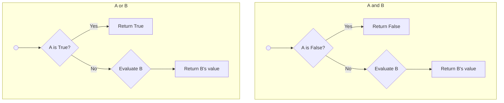

在前两节中，我们已经掌握了如何创建和管理数据（变量与数据类型），以及如何处理文本（字符串操作）。现在，我们将进入编程的核心——逻辑构建。运算符是连接数据和逻辑的桥梁，它们让我们能够对数据进行计算、比较和组合，从而创造出有意义的程序行为。

### 🎯 核心目标 (Core Goal)

本节的核心目标是让你**熟练掌握 Python 中最基本的四类运算符：算术、比较、逻辑和赋值**。学完本节，你将能够对数字进行任意计算，对数据进行真假判断，组合复杂的逻辑条件，并高效地更新变量的值。这是编写任何判断、循环和算法语句的绝对基础。

### 🔑 核心语法与参数 (Core Syntax & Parameters)

运算符是特殊的符号或关键字，用于执行特定的操作。以下是本节将要学习的核心运算符概览：

1.  **算术运算符 (Arithmetic Operators)**: 用于执行数学计算。
    *   `+`: 加法
    *   `-`: 减法
    *   `*`: 乘法
    *   `/`: 浮点除法 (结果总是浮点数)
    *   `//`: 整数除法 (结果向下取整)
    *   `%`: 取模 (返回除法的余数)
    *   `**`: 幂运算 (求指数)

2.  **比较运算符 (Comparison Operators)**: 用于比较两个值，返回一个布尔值 (`True` 或 `False`)。
    *   `==`: 等于
    *   `!=`: 不等于
    *   `>`: 大于
    *   `<`: 小于
    *   `>=`: 大于等于
    *   `<=`: 小于等于

3.  **逻辑运算符 (Logical Operators)**: 用于组合布尔表达式。
    *   `and`: 逻辑与 (两个都为 `True` 时，结果为 `True`)
    *   `or`: 逻辑或 (只要有一个为 `True` 时，结果为 `True`)
    *   `not`: 逻辑非 (反转布尔值)

4.  **赋值运算符 (Assignment Operators)**: 用于给变量赋值。
    *   `=`: 基本赋值
    *   `+=`, `-=`, `*=`, `/=`, 等: 增强赋值 (将算术运算与赋值合并)

### 💻 基础用法 (Basic Usage)

让我们通过代码实例，看看这些运算符在实践中如何工作。

#### 1. 算术运算符

这些运算符让你能像使用计算器一样处理数字。

```python
a = 10
b = 3

print(f"{a} + {b} = {a + b}")   # 加法 -> 13
print(f"{a} - {b} = {a - b}")   # 减法 -> 7
print(f"{a} * {b} = {a * b}")   # 乘法 -> 30
print(f"{a} ** {b} = {a ** b}") # 幂运算 -> 1000

# 重点比较：/ vs //
print(f"{a} / {b} = {a / b}")   # 浮点除法 -> 3.333...
print(f"{a} // {b} = {a // b}") # 整数除法 -> 3 (结果向下取整)
print(f"7 // 3 = {7 // 3}")     # -> 2
print(f"-7 // 3 = {-7 // 3}")   # -> -3 (注意负数的向下取整)

print(f"{a} % {b} = {a % b}")   # 取模 (余数) -> 1
```

#### 2. 比较运算符

比较运算符的结果永远是 `True` 或 `False`，这对于后续学习的 `if` 条件判断至关重要。

```python
x = 5
y = 10

print(f"{x} == {y} is {x == y}")   # 等于 -> False
print(f"{x} != {y} is {x != y}")   # 不等于 -> True
print(f"{x} > {y} is {x > y}")     # 大于 -> False
print(f"{x} <= {y} is {x <= y}")   # 小于等于 -> True

# 也可以用于字符串比较 (按字典序)
print(f"'apple' < 'banana' is {'apple' < 'banana'}") # -> True
```

#### 3. 逻辑运算符

逻辑运算符用于将多个比较表达式“粘合”在一起，形成更复杂的逻辑判断。

```python
age = 25
is_student = True

# and: 所有条件都必须为 True
can_get_discount = age < 30 and is_student
print(f"年龄 {age} 且是学生 ({is_student})，可以获得折扣吗？ {can_get_discount}") # -> True

# or: 只要有一个条件为 True
can_enter = age > 18 or is_student
print(f"年龄 {age} 或身份是学生 ({is_student})，可以入场吗？ {can_enter}") # -> True

# not: 取反
is_adult = age >= 18
is_minor = not is_adult
print(f"是未成年人吗？ {is_minor}") # -> False
```

#### 4. 赋值运算符

除了基本的 `=`，增强赋值运算符能让代码更简洁。

```python
# 基本赋值
count = 10

# 增强赋值
# count = count + 2 的简写形式
count += 2
print(f"计数器现在是: {count}") # -> 12

# 同样适用于其他算术运算符
price = 100
price *= 0.8 # 打八折
print(f"折扣后的价格是: {price}") # -> 80.0

value = 20
value /= 4 # value = value / 4
print(f"除法赋值后是: {value}") # -> 5.0
```

### 🧠 深度解析 (In-depth Analysis)

#### 1. 运算符优先级 (Operator Precedence)

当一个表达式中包含多个运算符时，Python 会遵循一个固定的顺序来计算，这就是运算符优先级。这和我们小学学的“先乘除后加减”类似。

*   **最高**: `**` (幂运算)
*   **其次**: `*`, `/`, `//`, `%` (乘、除、整除、取模)
*   **最低**: `+`, `-` (加、减)
*   **比较、逻辑、赋值** 运算符的优先级通常更低。

```python
# 2 + 3 * 4
# Python 会先计算 3 * 4，得到 12
# 然后计算 2 + 12，得到 14
result = 2 + 3 * 4
print(f"2 + 3 * 4 = {result}") # -> 14

# 使用括号可以改变默认的运算顺序
result_with_parens = (2 + 3) * 4
print(f"(2 + 3) * 4 = {result_with_parens}") # -> 20
```
**最佳实践**: 当你不确定优先级时，或者想让代码意图更清晰时，**请毫不犹豫地使用括号 `()`**。

#### 2. 逻辑运算符的“短路求值” (Short-circuit Evaluation)

这是一个非常重要且有用的特性。Python 在计算 `and` 和 `or` 表达式时，一旦能够确定最终结果，就会立即停止计算。

*   **对于 `A and B`**: 如果 `A` 为 `False`，整个表达式的结果必然是 `False`，因此 Python **不会**再去计算 `B`。
*   **对于 `A or B`**: 如果 `A` 为 `True`，整个表达式的结果必然是 `True`，因此 Python **不会**再去计算 `B`。



这种行为不仅能提升效率，更重要的是可以用来编写更安全的代码：

```python
user_data = None # 假设用户数据可能不存在

# 如果不使用短路求值，直接访问 user_data['name'] 会导致 TypeError
# if user_data['name'] == 'admin': # 这会报错！

# 使用短路求值，代码安全可靠
# 因为 user_data is not None 是 False，Python 不会执行 and 后面的部分
if user_data is not None and user_data['name'] == 'admin':
    print("管理员登录")
else:
    print("安全检查通过，未执行危险操作")
```

### ⚠️ 常见陷阱与最佳实践 (Common Pitfalls & Best Practices)

#### 常见陷阱

1.  **浮点数比较的精度问题**: 由于计算机内部表示浮点数的方式，直接使用 `==` 来比较两个浮点数是否相等是危险的。
    ```python
    # 陷阱示例
    val1 = 0.1 + 0.2
    val2 = 0.3
    print(val1 == val2) # -> 输出 False
    print(val1)       # -> 输出 0.30000000000000004
    ```

2.  **混淆 `/` 和 `//`**: 在需要精确整数结果的场景（如索引计算）中误用 `/`，或在需要精确小数结果的财务计算中误用 `//`。

3.  **误用 `=` 和 `==`**: 这是初学者最常见的错误之一。在 `if` 语句等需要判断的地方，误将 `==` (比较) 写成 `=` (赋值)。Python 语法通常不允许在 `if` 条件中直接赋值，会抛出 `SyntaxError`，但这在其他语言中是常见的逻辑 bug。

#### 最佳实践

1.  **安全地比较浮点数**: 判断两个浮点数的差的绝对值是否在一个极小的范围内（称为“容差”或 epsilon）。
    ```python
    # 最佳实践
    tolerance = 1e-9 # 设置一个很小的容差值
    if abs(val1 - val2) < tolerance:
        print("浮点数 val1 和 val2 在容差范围内相等")
    ```

2.  **使用增强赋值**: 优先使用 `+=`, `*=` 等增强赋值运算符，它们不仅代码更短、更易读，有时还能获得微小的性能提升（对于可变类型）。

3.  **链式比较**: Python 支持优雅的链式比较，使代码更符合数学直觉。
    ```python
    # 不推荐
    age = 22
    if age > 18 and age < 30:
        print("年轻人")

    # 推荐 (更 Pythonic)
    if 18 < age < 30:
        print("年轻人")
    ```

### 🚀 实战演练 (Practical Exercise)

**任务：** 编写一个简单的“购物车结算”脚本。

1.  **设定商品信息**:
    *   `price` (单价): 19.99 (浮点数)
    *   `quantity` (数量): 5 (整数)
    *   `coupon_discount` (优惠券减免): 5.0 (浮点数)
    *   `loyalty_points` (会员积分): 300 (整数)
2.  **计算逻辑**:
    *   计算商品总价（`price` * `quantity`）。
    *   计算应用优惠券后的价格。
    *   判断会员积分是否大于等于 100，如果是，则在优惠券基础上再享受 10% 的折上折。
    *   计算最终需要支付的金额。
3.  **输出结果**: 清晰地打印出每一步的计算结果和最终支付金额。

**参考解决方案:**

```python
# 1. 设定商品信息
price = 19.99
quantity = 5
coupon_discount = 5.0
loyalty_points = 300

print(f"商品单价: ${price}, 购买数量: {quantity}")
print("-" * 30)

# 2. 计算总价
total_price = price * quantity
print(f"商品总价: ${total_price:.2f}")

# 3. 应用优惠券
price_after_coupon = total_price - coupon_discount
print(f"使用优惠券后价格: ${price_after_coupon:.2f}")

# 4. 判断会员积分折扣
final_price = price_after_coupon
has_loyalty_discount = loyalty_points >= 100

if has_loyalty_discount:
    print("会员积分达标，享受额外 10% 折扣！")
    # 应用折上折
    final_price *= 0.9 
else:
    print("会员积分未达标。")

# 5. 输出最终金额
print("-" * 30)
print(f"最终支付金额: ${final_price:.2f}")
```

### 💡 总结 (Summary)

在本节中，你已经掌握了 Python 程序逻辑构建的基石——运算符。它们是让你的代码从简单的存储数据，迈向执行复杂任务的关键。

*   **四类核心运算符**:
    *   **算术**: `+`, `-`, `*`, `/`, `//`, `%`, `**`，用于数值计算。特别注意 `/` (浮点除) 和 `//` (整数除) 的区别。
    *   **比较**: `==`, `!=`, `>`, `<`, `>=`, `<=`，用于比较值，结果总是布尔型，是条件判断的基础。
    *   **逻辑**: `and`, `or`, `not`，用于组合布尔表达式，实现复杂的逻辑判断。
    *   **赋值**: `=`, `+=`, `-=` 等，用于更新变量的值，增强赋值是代码简洁之道。
*   **关键概念**:
    *   **运算符优先级**决定了复杂表达式的计算顺序，善用括号 `()` 可以让意图更清晰。
    *   **短路求值**是 `and` 和 `or` 的一个重要特性，它不仅高效，而且是编写安全代码的技巧。
*   **编码实践**:
    *   避免直接用 `==` 比较浮点数，应使用容差比较法。
    *   尽可能使用 `+=` 等增强赋值和链式比较，写出更 Pythonic 的代码。

有了这些运算符的知识，你就已经准备好学习 Python 中最重要的流程控制语句，如 `if-else` 判断和 `for/while` 循环了。