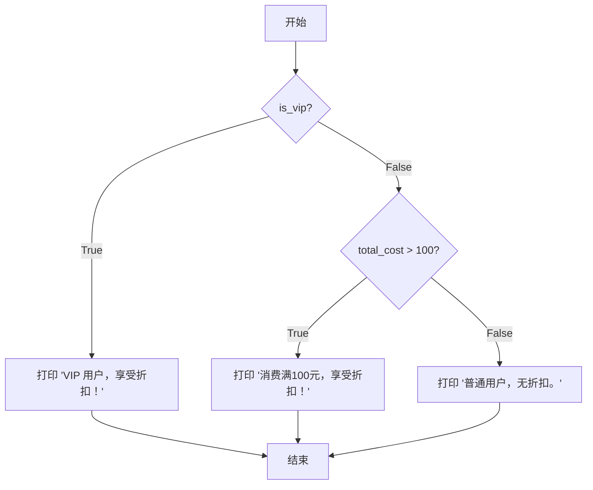

### 🎯 核心目标 (Core Goal)

本节的核心目标是学习如何使用 `if`, `elif`, `else` 条件语句，让程序能够像人一样“思考”和“决策”。通过掌握条件判断，你的代码将能够根据不同的情况执行不同的代码块，从而实现复杂的逻辑。

### 🔑 核心语法与参数 (Core Syntax & Parameters)

条件判断的核心是检查一个**条件 (condition)** 的真伪（`True` 或 `False`），并据此决定执行哪段代码。其基本语法结构由 `if`、`elif`（可选）、`else`（可选）关键字，以及冒号 `:` 和代码缩进构成。

*   **`if condition:`**
    *   `condition`: 任何最终结果为布尔值 (`True` 或 `False`) 的表达式。例如 `age > 18` 或 `name == "Alice"`。
    *   如果 `condition` 为 `True`，则执行紧随其后的缩进代码块。

*   **`elif condition:`**
    *   `elif` 是 "else if" 的缩写，必须在 `if` 语句之后。
    *   如果前面的 `if` 或 `elif` 条件不成立，则检查当前 `elif` 的 `condition`。如果为 `True`，则执行其下的代码块。一个 `if` 语句后可以跟任意多个 `elif` 语句。

*   **`else:`**
    *   `else` 用于捕捉所有以上条件都不成立的情况，它不需要任何条件。
    *   必须放在 `if`...`elif`... 链的最后。当所有 `if` 和 `elif` 的条件都为 `False` 时，执行 `else` 下的代码块。

> **关键点**: Python 使用 **缩进** (通常是4个空格) 而不是花括号 `{}` 来定义代码块的范围。正确的缩进至关重要。

### 💻 基础用法 (Basic Usage)

让我们通过几个层层递进的例子来掌握这些基本结构。

#### 1. `if` 语句的基本结构

`if` 是最简单的条件判断，用于处理“如果……就……”的场景。

```python
# code_example
temperature = 31

if temperature > 30:
    print("天气炎热，建议开空调！")

print("程序执行结束。") # 这行代码无论条件是否成立都会执行
```
**输出:**
```
天气炎热，建议开空调！
程序执行结束。
```
在这个例子中，因为 `temperature > 30` 的结果是 `True`，所以 `if` 下方的 `print` 语句被执行了。

#### 2. `if-else` 结构

`if-else` 用于处理“如果……就……，否则就……”的二选一场景。

```python
# code_example
age = 17

if age >= 18:
    print("您已成年，可以进入。")
else:
    print("您是未成年人，禁止入内。")
```
**输出:**
```
您是未成年人，禁止入内。
```
这里，`age >= 18` 的结果是 `False`，所以程序跳过了 `if` 块，执行了 `else` 块中的代码。

#### 3. `if-elif-else` 链

当存在多个互斥的条件需要判断时，我们可以使用 `if-elif-else` 链，它像一个决策树，依次检查每个条件。

```python
# code_example
score = 85

if score >= 90:
    grade = "A"
elif score >= 80:
    grade = "B"
elif score >= 70:
    grade = "C"
elif score >= 60:
    grade = "D"
else:
    grade = "F"

print(f"你的成绩是 {score} 分，等级为 {grade}。")
```
**输出:**
```
你的成绩是 85 分，等级为 B。
```
程序首先检查 `score >= 90` (False)，然后检查 `score >= 80` (True)，便执行了对应的代码 `grade = "B"`，并跳过了后续所有的 `elif` 和 `else`。

### 🧠 深度解析 (In-depth Analysis)

掌握了基础用法后，我们来探索一些更高级和更简洁的用法。

#### 1. 嵌套条件语句

条件语句内部可以包含另一个完整的条件语句，形成嵌套结构，用于处理更复杂的逻辑判断。

```python
# code_example
# 假设VIP用户或消费满100元的用户可以获得折扣
is_vip = True
total_cost = 80

if is_vip:
    print("VIP 用户，享受折扣！")
else:
    if total_cost > 100:
        print("消费满100元，享受折扣！")
    else:
        print("普通用户，无折扣。")

```
**输出:**
```
VIP 用户，享受折扣！
```
**执行流程图 (Mermaid Diagram):**



#### 2. 复合条件与逻辑运算符

当需要同时判断多个条件时，可以使用逻辑运算符 `and`, `or`, `not` 来构建复合条件。

*   **`and` (与)**: 当 `and` 连接的**所有**条件都为 `True` 时，整个表达式才为 `True`。
*   **`or` (或)**: 当 `or` 连接的条件中**至少有一个**为 `True` 时，整个表达式就为 `True`。
*   **`not` (非)**: `not` 用于反转一个布尔值，`not True` 变为 `False`，`not False` 变为 `True`。

```python
# code_example
# 改进之前的折扣判断逻辑
is_vip = False
total_cost = 120

if is_vip or total_cost > 100:
    print("满足折扣条件，享受折扣！")
else:
    print("不满足折扣条件，无折扣。")

# 另一个例子：判断工作年龄
age = 30
if age >= 18 and age <= 60:
    print("处于合法工作年龄段。")
```
**输出:**
```
满足折扣条件，享受折扣！
处于合法工作年龄段。
```

#### 3. 三元运算符 (Conditional Expressions)

对于简单的 `if-else` 赋值语句，Python 提供了一种更紧凑的写法，称为“三元运算符”或“条件表达式”。

**标准写法:**
```python
# code_example
age = 20
if age >= 18:
    status = "成年人"
else:
    status = "未成年人"
print(status)
```

**三元运算符写法:**
```python
# code_example
age = 20
status = "成年人" if age >= 18 else "未成年人"
print(status)
```
**输出 (两种写法相同):**
```
成年人
```
它的语法是 `value_if_true if condition else value_if_false`。这种写法代码更少，可读性强，非常适合在单行内完成简单的条件赋值。

### ⚠️ 常见陷阱与最佳实践 (Common Pitfalls & Best Practices)

在编写条件判断时，新手常常会遇到一些问题。

*   **陷阱1: 混淆赋值 `=` 和比较 `==`**
    *   `=` 是赋值运算符，用于给变量赋值。
    *   `==` 是比较运算符，用于判断两个值是否相等。
    *   `if name = "admin":` 是语法错误，正确的应该是 `if name == "admin":`。

*   **陷阱2: 缩进错误 (IndentationError)**
    *   Python 对缩进要求极为严格。`if`, `elif`, `else` 下的代码块必须保持一致的缩进（通常是4个空格）。混用Tab和空格，或缩进不一致，都会导致 `IndentationError` 或逻辑错误。

    ```python
    # common_mistake_warning
    # 错误示例: 缩进不一致
    weather = "sunny"
    if weather == "sunny":
        print("天气很好！")
      print("适合出门。") # IndentationError: unexpected indent
    ```

*   **陷阱3: `elif` 条件的顺序**
    *   在 `if-elif-else` 链中，条件的检查是**从上到下**的。一旦某个条件满足，后面的 `elif` 和 `else` 就会被完全忽略。因此，条件的顺序至关重要。
    *   **错误逻辑示例**:
        ```python
        score = 95
        if score >= 60: # 这个条件会先被满足
            grade = "D"
        elif score >= 90:
            grade = "A"
        print(grade) # 输出将是 "D"，而不是预期的 "A"
        ```
    *   **最佳实践**: 通常将范围更小、更精确的条件放在前面。

*   **最佳实践: 保持条件简洁**
    *   避免写出过于冗长和复杂的条件表达式，如 `if (x > 10 and y < 20) or (z == 5 and not is_active):`。可以考虑将其拆分或用辅助变量来提高可读性。

*   **最佳实践: 理解并利用 'Truthy' 和 'Falsy' 值**
    *   在 Python 中，不仅 `True` 和 `False` 可以用于条件判断。所有值本身都有一个布尔“倾向”。
    *   **Falsy (被视为 `False`)**: `None`, `False`, 所有值为零的数字 (`0`, `0.0`), 空的序列和集合 (`""`, `[]`, `()`, `{}` 等)。
    *   **Truthy (被视为 `True`)**: 所有其他值。
    *   这使得我们可以编写更简洁的代码：
        ```python
        # code_example
        # 不推荐的写法
        user_list = []
        if len(user_list) == 0:
            print("列表为空。")

        # 推荐的 Pythonic 写法
        if not user_list:
            print("列表为空。")

        username = input("请输入用户名: ")
        if username: # 等同于 if username != ""
            print(f"欢迎, {username}!")
        else:
            print("用户名不能为空。")
        ```

### 🚀 实战演练 (Practical Exercise)

**场景**: 编写一个简单的电影院售票程序。根据年龄计算票价：
*   12岁及以下的儿童，票价5美元。
*   13岁到60岁的成人，票价12美元。
*   61岁及以上的老人，票价7美元。

请编写一个程序，接收用户输入的年龄，并输出对应的票价。

**代码框架:**
```python
# 你的代码将在这里
try:
    age_str = input("请输入您的年龄: ")
    age = int(age_str)
    price = 0

    # --- 开始编写你的 if-elif-else 逻辑 ---
    if age <= 12:
        price = 5
    elif age <= 60: # 注意这里的逻辑顺序
        price = 12
    else:
        price = 7
    # --- 逻辑结束 ---

    print(f"您的年龄是 {age} 岁，票价为 {price} 美元。")

except ValueError:
    print("无效输入，请输入一个数字。")
```

**参考输出:**
```
请输入您的年龄: 10
您的年龄是 10 岁，票价为 5 美元。
```
```
请输入您的年龄: 30
您的年龄是 30 岁，票价为 12 美元。
```

### 💡 总结 (Summary)

今天，我们系统学习了 Python 中控制程序流程的基石——条件判断。

*   **`if`**: 用于处理单一条件。
*   **`if-else`**: 应对二选一的决策场景。
*   **`if-elif-else`**: 解决多分支的复杂决策，注意条件的顺序。
*   **逻辑运算符 (`and`, `or`, `not`)**: 用于组合多个条件，实现更复杂的逻辑。
*   **嵌套 `if`**: 用于处理更深层次的逻辑判断，但需注意代码可读性。
*   **三元运算符**: 是 `if-else` 赋值语句的简洁写法，能让代码更紧凑。
*   **Truthy/Falsy**: 利用值的布尔倾向可以写出更 Pythonic 的代码。

务必牢记，正确的语法（冒号 `:` 和 **缩进**）和清晰的逻辑是编写有效条件判断的关键。通过它们，你的程序将不再是一条道走到黑的直线，而是拥有了智能决策的分岔路口。