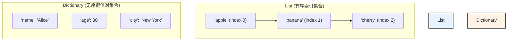

### 🎯 核心目标 (Core Goal)

本节的核心目标是：**掌握 Python 字典（Dictionary）的核心用法**。学完本节，你将能够使用这种强大的键值对（key-value pair）数据结构，通过唯一的“键”来高效地存储、访问、修改和管理任何类型的数据。

### 🔑 核心语法与参数 (Core Syntax & Parameters)

字典是 Python 中极其重要的数据结构，它由一系列的键值对组成，并被包含在花括号 `{}` 中。

| 操作             | 语法                                                    | 说明                                                                                              |
| ---------------- | ------------------------------------------------------- | ------------------------------------------------------------------------------------------------- |
| **创建字典**     | `my_dict = {'key1': 'value1', 'key2': 2}`               | 使用花括号 `{}` 创建，每个元素都是一个 `key: value` 对，用逗号 `,` 分隔。                         |
| **访问值**       | `value = my_dict['key1']`                               | 使用方括号 `[]` 和键来获取对应的值。如果键不存在，会引发 `KeyError`。                             |
| **添加/修改**    | `my_dict['new_key'] = 'new_value'`                      | 如果键已存在，则更新其值；如果键不存在，则创建新的键值对。                                        |
| **删除键值对**   | `del my_dict['key1']`                                   | 使用 `del` 关键字，通过键来彻底删除一个键值对。                                                   |
| **安全访问**     | `value = my_dict.get('key1', default_value)`            | 使用 `.get()` 方法访问值。如果键不存在，它会返回 `None` 或你指定的 `default_value`，而不会报错。 |
| **获取所有键**   | `my_dict.keys()`                                        | 返回一个包含所有键的视图对象（view object）。                                                     |
| **获取所有值**   | `my_dict.values()`                                      | 返回一个包含所有值的视图对象。                                                                    |
| **获取所有项**   | `my_dict.items()`                                       | 返回一个包含所有 `(键, 值)` 元组对的视图对象。                                                    |
| **检查键存在**   | `if 'key1' in my_dict:`                                 | 使用 `in` 关键字检查一个键是否存在于字典中，返回布尔值 `True` 或 `False`。                        |

### 💻 基础用法 (Basic Usage)

让我们通过一系列代码示例，快速掌握字典的基本操作。

#### 1. 创建字典

你可以创建一个空字典，或者在创建时就初始化一些键值对。

```python
# 创建一个存储用户信息的字典
user_profile = {
    "username": "coder_jack",
    "level": 15,
    "is_active": True
}

# 创建一个空字典
inventory = {}

print(f"用户信息: {user_profile}")
print(f"空库存: {inventory}")
```

#### 2. 通过键访问、添加和修改值

字典的强大之处在于通过键进行快速操作。

```python
# 访问值
print(f"用户名: {user_profile['username']}") # 输出: 用户名: coder_jack

# 修改值
user_profile['level'] = 16 # 用户升级了
print(f"更新后的等级: {user_profile['level']}") # 输出: 更新后的等级: 16

# 添加新的键值对
user_profile['email'] = 'jack@example.com'
print(f"添加邮箱后的用户信息: {user_profile}")
```

#### 3. 使用 `del` 删除键值对

如果某个信息不再需要，可以使用 `del` 将其从字典中移除。

```python
# 假设我们不再需要追踪用户的活跃状态
del user_profile['is_active']
print(f"删除键'is_active'后的用户信息: {user_profile}")
```

#### 4. 遍历字典

遍历是处理字典数据的常见需求。推荐使用 `.items()` 来同时获取键和值。

```python
# 遍历所有的键
print("\n--- 遍历键 ---")
for key in user_profile.keys():
    print(key)

# 遍历所有的值
print("\n--- 遍历值 ---")
for value in user_profile.values():
    print(value)

# 遍历所有的键值对（最常用）
print("\n--- 遍历键值对 ---")
for key, value in user_profile.items():
    print(f"{key}: {value}")
```

#### 5. 使用 `.get()` 安全地访问值

直接使用 `[]` 访问不存在的键会程序崩溃。`.get()` 方法是更安全的选择。

```python
# 尝试访问一个不存在的键
# print(user_profile['location']) # 这行代码会引发 KeyError

# 使用 .get() 安全访问
location = user_profile.get('location')
print(f"用户地址 (不存在): {location}") # 输出: 用户地址 (不存在): None

# 使用 .get() 并提供默认值
location_with_default = user_profile.get('location', '未知')
print(f"用户地址 (带默认值): {location_with_default}") # 输出: 用户地址 (带默认值): 未知
```

### 🧠 深度解析 (In-depth Analysis)

#### 字典 (Dictionary) vs. 列表 (List)

为了更深刻地理解字典，我们将其与之前学过的列表进行比较。它们是 Python 中最常用的两种数据容器，但设计哲学和适用场景截然不同。



| 特性     | **列表 (List)**                               | **字典 (Dictionary)**                               |
| :------- | :-------------------------------------------- | :-------------------------------------------------- |
| **结构** | 元素的**有序**集合。                          | 键值对的**无序**集合 (在Python 3.7+版本中变为有序)。 |
| **访问** | 通过**整数索引**访问，如 `my_list[0]`。       | 通过**唯一的键**访问，如 `my_dict['name']`。        |
| **性能** | 索引访问速度极快 (O(1))。查找元素较慢 (O(n))。 | 键查找、插入、删除的平均速度极快 (O(1))。           |
| **用途** | 存储需要保持顺序的同类数据，如日志记录、队列。 | 存储需要通过唯一标识符快速查找的数据，如用户信息、配置。 |

**核心差异**：列表关心的是“第几个”，而字典关心的是“叫什么”。当你需要将一个信息（值）与另一个唯一的标识符（键）关联起来时，字典是最佳选择。其内部通过哈希表实现，保证了极高的查找效率。

### ⚠️ 常见陷阱与最佳实践 (Common Pitfalls & Best Practices)

1.  **陷阱：访问不存在的键导致 `KeyError`**
    直接使用 `my_dict['non_existent_key']` 是一种“自信”的访问方式，如果键不存在，程序会立即停止并抛出 `KeyError`。

    *   **最佳实践**：在不确定键是否总是存在的情况下，优先使用 `.get()` 方法或 `in` 关键字进行检查。
        ```python
        # 推荐做法
        if 'location' in user_profile:
            print(user_profile['location'])
        else:
            print("用户地址未设置")
        
        # 或者更简洁的 .get()
        print(user_profile.get('location', '用户地址未设置'))
        ```

2.  **陷阱：使用可变对象作为键**
    字典的键必须是“可哈希的”（hashable），这意味着它们的值在生命周期内不能改变。字符串、数字和元组都是可哈希的，而列表和字典是不可哈希的（可变的）。

    ```python
    # 错误示例：使用列表作为键
    my_dict = {}
    my_list = [1, 2]
    # my_dict[my_list] = 'some_value' # 这会引发 TypeError: unhashable type: 'list'
    ```

    *   **最佳实践**：始终使用不可变类型（如字符串、整数、元组）作为字典的键。如果你确实需要使用一个类似列表的结构作为键，应先将其转换为元组：`my_dict[tuple(my_list)] = 'value'`。

3.  **陷阱：在遍历时修改字典大小**
    在 `for` 循环中遍历一个字典的同时，添加或删除其中的键，可能会导致 `RuntimeError` 或不可预测的行为。

    ```python
    # 错误示例
    numbers = {'a': 1, 'b': 2, 'c': 3}
    # for key, value in numbers.items():
    #     if value % 2 != 0:
    #         del numbers[key] # RuntimeError: dictionary changed size during iteration
    ```
    *   **最佳实践**：如果需要在遍历时修改字典，应先创建键的副本（如列表）进行遍历。
        ```python
        numbers = {'a': 1, 'b': 2, 'c': 3}
        # 创建键的副本列表
        for key in list(numbers.keys()):
            if numbers[key] % 2 != 0:
                del numbers[key] # 安全地删除
        print(numbers) # 输出: {'b': 2}
        ```

### 🚀 实战演练 (Practical Exercise)

**任务：** 编写一个函数 `count_word_frequency(text)`，它接收一个字符串 `text`，并返回一个字典，该字典统计了文本中每个单词出现的次数。

**要求：**
1.  函数应忽略单词的大小写（例如，"Python" 和 "python" 算作同一个单词）。
2.  函数应忽略文本中的标点符号（如 `.`, `,`, `!`, `?`）。

**解题思路：**
1.  将文本转换为小写。
2.  高效地移除所有标点符号。
3.  将文本分割成单词列表。
4.  遍历单词列表，使用一个字典来累计每个单词的出现次数。

**参考代码：**

```python
import string

def count_word_frequency(text):
    """
    统计文本中每个单词的出现频率。
    
    Args:
        text (str): 输入的文本字符串。
        
    Returns:
        dict: 一个包含单词及其频率的字典。
    """
    # 1. 预处理文本：转小写并高效移除标点
    text = text.lower()
    # 创建一个转换表，将所有标点符号映射为 None (即删除)
    translator = str.maketrans('', '', string.punctuation)
    text = text.translate(translator)
        
    # 2. 分割成单词
    words = text.split()
    
    # 3. 使用字典统计频率
    frequency_dict = {}
    for word in words:
        # 使用 .get(word, 0) 来优雅地处理新单词
        frequency_dict[word] = frequency_dict.get(word, 0) + 1
            
    return frequency_dict

# 测试函数
sample_text = "Python is a great language. Python is versatile and easy to learn!"
word_counts = count_word_frequency(sample_text)
print(word_counts)
# 预期输出: {'python': 2, 'is': 2, 'a': 1, 'great': 1, 'language': 1, 'versatile': 1, 'and': 1, 'easy': 1, 'to': 1, 'learn': 1}
```

### 💡 总结 (Summary)

在本节中，我们深入学习了 Python 的核心数据结构——字典。现在，我们来回顾一下关键知识点：

- **核心概念**：字典是无序（在现代Python中有序）的键值对集合，通过唯一的、不可变的键来存储和检索数据，效率极高。
- **基本操作**：我们掌握了字典的创建 `{}`, 访问 `[]`, 添加/修改 `[key] = value`, 以及删除 `del`。
- **高级方法**：学会了如何使用 `.keys()`, `.values()`, `.items()` 进行高效遍历，以及如何利用 `.get()` 进行安全的键访问，避免 `KeyError`。
- **最佳实践**：理解了字典与列表的关键区别，并意识到了使用不可变对象作键、以及在遍历时安全修改字典的重要性。

字典是解决现实世界中“映射”和“查找”问题的利器。熟练掌握它，将极大提升你编写复杂程序的能力。