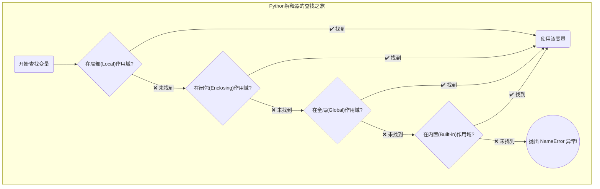

好的，总建筑师。接续上一节“函数的定义与调用”，我将为您精心打造关于“变量作用域”的教程。本节将深入探讨变量在 Python 程序中的“管辖范围”，揭示 LEGB 规则的奥秘。

---

### 🎯 核心概念
变量作用域（Scope）定义了一个变量能够被访问的“可见范围”，它就像是变量的“国籍”和“活动区域”，决定了你在代码的哪个位置可以“看到”并使用这个变量，从而避免了命名冲突，让程序更加模块化和安全。

### 💡 使用方式
Python 遵循 **LEGB** 规则来查找一个变量，这是一个优先级从高到低的查找顺序：

1.  **L (Local)**: **局部作用域**，指当前函数或类的内部。这是查找的第一站。
2.  **E (Enclosing)**: **闭包作用域**，指在嵌套函数中，外部函数（非全局）的作用域。
3.  **G (Global)**: **全局作用域**，指在模块（`.py` 文件）的顶层定义的变量。
4.  **B (Built-in)**: **内置作用域**，指 Python 解释器启动时就加载的内置名称，如 `print()`, `len()`, `str` 等。

解释器会像玩寻宝游戏一样，从 L 开始逐层向外寻找，一旦找到就不会再继续。如果找到 B 层还没找到，就会抛出 `NameError`。

这个过程可以用下图清晰地展示：



### 📚 Level 1: 基础认知（30秒理解）
最常见的就是局部作用域（函数内）和全局作用域（函数外）。函数内部的变量，外面是看不到的。

```python
# G (Global): 这是一个全局变量，在文件的任何地方都可见
player_level = 10 

def enter_dungeon():
    # L (Local): 这是一个局部变量，只在 enter_dungeon 函数内部有效
    dungeon_name = "哀嚎洞穴"
    print(f"玩家等级 {player_level}，进入了局部地图：{dungeon_name}。")

# 调用函数
enter_dungeon()

# 在函数外部，我们可以访问全局变量 player_level
print(f"在函数外部，玩家等级依然是 {player_level}。")

# 但是，如果我们尝试在外部访问局部变量 dungeon_name，就会失败
# print(dungeon_name)  # 取消这行注释会引发 NameError: name 'dungeon_name' is not defined

# 预期输出:
# 玩家等级 10，进入了局部地图：哀嚎洞穴。
# 在函数外部，玩家等级依然是 10。
```

### 📈 Level 2: 核心特性（深入理解）
默认情况下，你可以在函数内读取上层作用域的变量，但如果你想“修改”它们，就需要特殊的关键字来“申请权限”。

#### 特性1: 使用 `global` 修改全局变量
如果你在函数内对一个与全局变量同名的变量进行赋值，Python 会默认创建一个新的局部变量。要真正修改全局变量，必须使用 `global` 关键字声明。

```python
# G (Global): 游戏分数
game_score = 0
print(f"游戏开始，初始分数: {game_score}")

def defeat_enemy_simple(points):
    """一个尝试增加分数的函数，但没有使用 global"""
    # 这里，Python 创建了一个新的同名局部变量 game_score
    game_score = points 
    print(f"函数内部（局部变量）的分数变为: {game_score}")

def defeat_enemy_pro(points):
    """使用 global 关键字正确地修改全局分数"""
    # 告诉 Python，我们接下来要操作的是全局作用域的 game_score
    global game_score
    game_score += points
    print(f"函数内部（修改全局变量）的分数变为: {game_score}")

# 调用第一个函数
defeat_enemy_simple(50)
print(f"调用 simple 版后，全局分数依然是: {game_score}  (未被修改！)")

# 调用第二个函数
defeat_enemy_pro(100)
print(f"调用 pro 版后，全局分数成功变为: {game_score}")

# 预期输出:
# 游戏开始，初始分数: 0
# 函数内部（局部变量）的分数变为: 50
# 调用 simple 版后，全局分数依然是: 0  (未被修改！)
# 函数内部（修改全局变量）的分数变为: 100
# 调用 pro 版后，全局分数成功变为: 100
```

#### 特性2: 嵌套函数与 `nonlocal` (闭包作用域)
当函数嵌套时，内部函数可以访问外部函数的变量，这构成了闭包（Enclosing）作用域。要修改这个闭包变量，需要使用 `nonlocal` 关键字。

```python
def spell_book():
    """这是一个法术书，记录了法力值。"""
    # E (Enclosing): 闭包作用域变量
    mana = 100
    
    def cast_fireball():
        """施放火球术，会消耗法力。"""
        # 声明 mana 不是局部变量，而是来自上一层（闭包）作用域
        nonlocal mana
        cost = 30
        
        if mana >= cost:
            mana -= cost
            print(f"🔥 施放火球术成功！消耗 {cost} 法力，剩余 {mana}。")
        else:
            print(f"法力不足！剩余 {mana}，无法施放火球术。")

    # 返回的是内部函数本身
    return cast_fireball

# 我们得到了一个“绑定了法力值”的法术
my_spell = spell_book()

# 连续施法，可以看到 mana 的状态被“记住”了
my_spell()
my_spell()
my_spell()
my_spell() # 第四次施法时法力不足

# 预期输出:
# 🔥 施放火球术成功！消耗 30 法力，剩余 70。
# 🔥 施放火球术成功！消耗 30 法力，剩余 40。
# 🔥 施放火球术成功！消耗 30 法力，剩余 10。
# 法力不足！剩余 10，无法施放火球术。
```

### 🔍 Level 3: 对比学习（避免陷阱）
一个与作用域和生命周期紧密相关的经典陷阱是：**使用可变类型（如列表、字典）作为函数的默认参数**。

**规则：** 函数的默认参数值在函数定义时只被创建一次，并在后续所有调用中共享。

```python
# === 错误用法 ===
# ❌ 默认参数是一个可变对象 (list)
def add_quest_item(item, inventory=[]):
    """
    这个函数的默认参数 inventory 只在定义时创建一次。
    之后所有的调用都共享这同一个列表！
    """
    inventory.append(item)
    print(f"添加 '{item}' 后，你的任务背包里有: {inventory}")

print("--- 错误的用法 ---")
add_quest_item("龙鳞")          # 第一次调用，看起来正常
add_quest_item("狮鹫羽毛")      # 第二次调用，"龙鳞"竟然还在！
# 解释：
# 第一次调用时，默认的空列表 inventory 被修改，加入了"龙鳞"。
# 第二次调用时，由于没有提供新的列表，函数继续使用那个已经被修改过的默认列表，
# 导致"狮鹫羽毛"被添加到了含有"龙鳞"的列表后面，引发了意外的共享状态。


# === 正确用法 ===
# ✅ 使用 None 作为哨兵值，在函数体内创建新对象
def add_quest_item_safe(item, inventory=None):
    """
    这是一种更安全、更符合直觉的写法。
    """
    if inventory is None:
        # 仅当调用者未提供 inventory 时，才在函数内部创建一个全新的列表
        inventory = []
    inventory.append(item)
    print(f"添加 '{item}' 后，你的任务背包里有: {inventory}")

print("\n--- 正确的用法 ---")
add_quest_item_safe("龙鳞")
add_quest_item_safe("狮鹫羽毛") # 这次结果符合预期，两个背包是独立的

# 预期输出:
# --- 错误的用法 ---
# 添加 '龙鳞' 后，你的任务背包里有: ['龙鳞']
# 添加 '狮鹫羽毛' 后，你的任务背包里有: ['龙鳞', '狮鹫羽毛']
#
# --- 正确的用法 ---
# 添加 '龙鳞' 后，你的任务背包里有: ['龙鳞']
# 添加 '狮鹫羽毛' 后，你的任务背包里有: ['狮鹫羽毛']
```

### 🚀 Level 4: 实战应用（真实场景）

**场景：** 🤖 AI 机器人状态管理系统

我们来创建一个管理机器人能量和任务状态的系统。这个系统将综合运用全局、闭包和局部作用域。

```python
import time
import random

# --- 全局作用域 (Global) ---
# 机器人的全局唯一ID和总开关状态
robot_id = "Alpha-007"
is_system_active = True

def mission_control(mission_name, task_count):
    """
    创建一个任务控制器，它有自己的能量储备。
    """
    # --- 闭包作用域 (Enclosing) ---
    mission_energy = 100.0
    tasks_completed = 0
    print(f"\n[任务控制器] {mission_name} 已启动，能量: {mission_energy}，待办任务: {task_count}。")

    def execute_task():
        """
        执行单个任务，会影响闭包和全局状态。
        """
        nonlocal mission_energy, tasks_completed
        global is_system_active

        if not is_system_active:
            print("🚨 系统总开关已关闭，无法执行任务！")
            return

        if tasks_completed >= task_count:
            print(f"✅ {mission_name} 所有任务已完成！")
            return

        # --- 局部作用域 (Local) ---
        energy_cost = random.uniform(15.5, 25.0)

        if mission_energy >= energy_cost:
            print(f"正在执行任务... (耗能: {energy_cost:.1f})")
            time.sleep(0.5) # 模拟任务执行
            mission_energy -= energy_cost
            tasks_completed += 1
            print(f"任务完成！[剩余能量: {mission_energy:.1f}] [已完成: {tasks_completed}/{task_count}]")
        else:
            print(f"能量不足！需要 {energy_cost:.1f}，剩余 {mission_energy:.1f}。任务失败！")
            is_system_active = False # 能量耗尽，关闭全局开关
            print("系统能量耗尽，全局系统已紧急关闭。")

    return execute_task

# --- 模拟开始 ---
print(f"启动机器人 {robot_id}...")

# 创建一个“火星探测”任务控制器，包含3个任务
mars_mission = mission_control("火星地表扫描", 3)

# 依次执行任务
if is_system_active: mars_mission()
if is_system_active: mars_mission()
if is_system_active: mars_mission()
if is_system_active: mars_mission() # 尝试执行第四次，会提示任务已完成

# 创建一个需要更多能量的“深空导航”任务
deep_space_mission = mission_control("深空导航", 5)

# 这个任务可能会因为能量耗尽而失败
while is_system_active and tasks_completed < 5: #
    deep_space_mission()
    if not is_system_active:
        break

# 预期输出 (由于随机性，具体数值会变化):
# 启动机器人 Alpha-007...
#
# [任务控制器] 火星地表扫描 已启动，能量: 100.0，待办任务: 3。
# 正在执行任务... (耗能: 22.1)
# 任务完成！[剩余能量: 77.9] [已完成: 1/3]
# 正在执行任务... (耗能: 18.3)
# 任务完成！[剩余能量: 59.6] [已完成: 2/3]
# 正在执行任务... (耗能: 24.5)
# 任务完成！[剩余能量: 35.1] [已完成: 3/3]
# ✅ 火星地表扫描 所有任务已完成！
# ...
```

### 💡 记忆要点
- **要点1**: **LEGB 查找顺序**：Python 找变量的顺序是：先**局部 (Local)**，再**闭包 (Enclosing)**，然后**全局 (Global)**，最后是**内置 (Built-in)**。这个顺序刻在脑子里。
- **要点2**: **修改靠声明，读取随意**：你可以自由地读取外层作用域的变量，但要**修改**它们，必须用 `global` 声明修改全局变量，用 `nonlocal` 声明修改闭包变量。
- **要点3**: **警惕可变默认参数**：函数的默认参数在定义时只创建一次。绝对不要用列表、字典等**可变类型**做默认参数，推荐的模式是 `def func(arg=None): if arg is None: arg = []`。