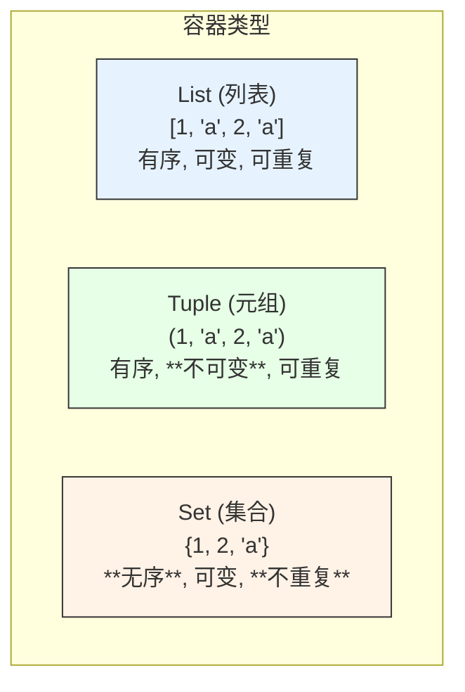

在掌握了强大的字典之后，我们再来学习另外两种同样重要但用途更加专一的核心数据结构：**元组（Tuple）** 和 **集合（Set）**。它们分别解决了“不可变的数据序列”和“不重复的元素集合”这两个核心问题。

### 🎯 核心目标 (Core Goal)

本节的核心目标是：**理解元组（Tuple）的不可变性和集合（Set）的唯一性，并学会在适当的场景下使用它们。** 学完本节，你将能够利用元组保护数据的完整性，并利用集合高效地进行去重和成员关系运算。

### 🔑 核心语法与参数 (Core Syntax & Parameters)

#### 元组 (Tuple)

元组是一个**有序**且**不可变**的数据序列 (sequence)，通常用于存储一系列不应被修改的数据。它由圆括号 `()` 包裹。

| 操作 | 语法 | 说明 |
| :--- | :--- | :--- |
| **创建元组** | `my_tuple = (1, 'a', True)` | 使用圆括号 `()` 创建，元素可以是不同类型。 |
| **创建单元素元组**| `single_tuple = (1,)` | **关键**：单元素元组末尾必须有一个逗号 `,`。 |
| **访问元素** | `value = my_tuple[0]` | 和列表一样，通过索引访问，索引从 0 开始。 |
| **切片** | `sub_tuple = my_tuple[0:2]` | 和列表一样，可以获取子元组。 |
| **不可变性** | `my_tuple[0] = 2` (会报错) | **核心特性**：一旦创建，元组的任何元素都不能被修改、添加或删除。 |
| **解包 (Unpacking)**| `x, y, z = my_tuple` | 将元组中的元素一次性赋值给多个变量。 |

#### 集合 (Set)

集合是一个**无序**且**不含重复元素**的集合。它主要用于成员测试和数学集合运算。它由花括号 `{}` 包裹。

| 操作 | 语法 | 说明 |
| :--- | :--- | :--- |
| **创建集合** | `my_set = {1, 2, 'a'}` | 使用花括号 `{}` 创建。重复的元素会自动被移除。 |
| **创建空集合** | `empty_set = set()` | **必须**使用 `set()` 函数，因为 `{}` 创建的是空字典。 |
| **添加元素** | `my_set.add(4)` | 使用 `.add()` 方法添加单个元素。 |
| **删除元素(安全)** | `my_set.discard(1)` | 使用 `.discard()` 删除元素，如果元素不存在，不会报错。 |
| **删除元素(严格)** | `my_set.remove(2)` | 使用 `.remove()` 删除元素，如果元素不存在，会引发 `KeyError`。 |
| **并集** | `set1 \| set2` 或 `set1.union(set2)` | 返回包含两个集合所有元素的新集合。 |
| **交集** | `set1 & set2` 或 `set1.intersection(set2)` | 返回两个集合共有的元素组成的新集合。 |
| **差集** | `set1 - set2` 或 `set1.difference(set2)` | 返回在 `set1` 中但不在 `set2` 中的元素组成的新集合。 |

### 💻 基础用法 (Basic Usage)

#### 1. 元组 (Tuple): 创建、访问与不可变性

元组就像一个被“锁定”的列表，它的内容是固定的。

```python
# 创建一个元组，例如存储一个点的坐标
point = (10, 20)

# 访问元素
print(f"X 坐标: {point[0]}") # 输出: X 坐标: 10
print(f"Y 坐标: {point[1]}") # 输出: Y 坐标: 20

# 尝试修改元组，这将导致错误
try:
    point[0] = 15
except TypeError as e:
    print(f"修改元组失败: {e}") # 输出: 修改元组失败: 'tuple' object does not support item assignment
```
元组的不可变性确保了数据的完整性，非常适合用作函数返回值或字典的键。

#### 2. 元组解包 (Tuple Unpacking)

元组解包是一种优雅且极具 Pythonic 风格的语法，可以同时为多个变量赋值。

```python
# 定义一个包含配置信息的元组
db_config = ("localhost", 5432, "my_user")

# 使用解包将值赋给不同变量
host, port, user = db_config

print(f"数据库主机: {host}") # 输出: 数据库主机: localhost
print(f"端口: {port}") # 输出: 端口: 5432
print(f"用户: {user}") # 输出: 用户: my_user
```

#### 3. 集合 (Set): 创建与元素操作

集合最大的特点是元素的唯一性，非常适合用于数据去重。

```python
# 从一个有重复元素的列表创建集合
user_ids = [101, 102, 103, 101, 102]
unique_user_ids = set(user_ids)
print(f"原始ID列表: {user_ids}")
print(f"去重后的ID集合: {unique_user_ids}") # 输出: {101, 102, 103}

# 添加和删除元素
unique_user_ids.add(104) # 添加新用户
print(f"添加新用户后: {unique_user_ids}")

unique_user_ids.remove(101) # 删除一个存在的用户
print(f"删除用户101后: {unique_user_ids}")
```

#### 4. 集合运算：并集、交集、差集

集合运算是其最强大的功能之一，可以轻松处理成员关系问题。

```python
# 假设有两组参加不同活动的参与者
event_a_attendees = {'Alice', 'Bob', 'Charlie', 'David'}
event_b_attendees = {'Charlie', 'David', 'Eve', 'Frank'}

# 并集：所有参加过活动的人
all_attendees = event_a_attendees | event_b_attendees
print(f"所有参与者 (并集): {all_attendees}")

# 交集：同时参加了两场活动的人
both_events_attendees = event_a_attendees & event_b_attendees
print(f"两场都参加的人 (交集): {both_events_attendees}")

# 差集：只参加了活动A，但没参加活动B的人
only_a_attendees = event_a_attendees - event_b_attendees
print(f"只参加了活动A的人 (差集): {only_a_attendees}")
```

### 🧠 深度解析 (In-depth Analysis)

#### 列表 vs. 元组 vs. 集合：何时使用哪一个？

选择正确的数据结构是高效编程的关键。让我们通过一个清晰的对比来理解它们的适用场景。



| 特性 | **列表 (List)** | **元组 (Tuple)** | **集合 (Set)** |
| :--- | :--- | :--- | :--- |
| **可变性** | ✅ **可变 (Mutable)** | ❌ **不可变 (Immutable)** | ✅ **可变 (Mutable)** |
| **有序性** | ✅ **有序** | ✅ **有序** | ❌ **无序** |
| **重复性** | ✅ **允许重复元素** | ✅ **允许重复元素** | ❌ **元素唯一** |
| **语法** | `[1, 2, 3]` | `(1, 2, 3)` | `{1, 2, 3}` 或 `set()` |
| **核心用途**| 存储需要动态修改的有序数据序列。 | 存储不应改变的固定数据序列，如配置、坐标、函数多返回值。 | 快速去重、成员测试、数学集合运算（交集、并集等）。 |
| **性能** | 索引访问快，但成员查找慢 (O(n))。 | 索引访问快，通常比列表略快，因为其大小固定。 | **成员查找极快 (O(1))**，是其核心优势。 |

**决策指南**:
- 当你需要一个可以随时添加、删除或修改元素的有序列表时，使用 **列表**。
- 当你有一组固定的数据，希望保护它不被意外修改，或者需要将其用作字典的键时，使用 **元组**。
- 当你关心的是元素的“是否存在”而不是“在第几位”，并且需要保证没有重复元素时，使用 **集合**。

### ⚠️ 常见陷阱与最佳实践 (Common Pitfalls & Best Practices)

1.  **陷阱：创建单元素元组时忘记逗号**
    这是初学者最常犯的错误之一。没有逗号，Python 会将其解释为普通的括号表达式。

    ```python
    not_a_tuple = (42)  # 这不是元组，而是一个整数 int
    is_a_tuple = (42,)   # 这才是包含一个元素的元组

    print(type(not_a_tuple)) # 输出: <class 'int'>
    print(type(is_a_tuple))  # 输出: <class 'tuple'>
    ```
    *   **最佳实践**：牢记创建单元素元组的 `(item,)` 语法。

2.  **陷阱：误解元组的“不可变性”**
    元组的不可变性指的是元组本身所包含的元素的**引用**不可变，而不是元素所指向的对象不可变。如果元组中的元素是可变对象（如列表），那么这个对象本身是可以被修改的。

    ```python
    # 元组中包含一个列表
    tricky_tuple = (1, 2, ['a', 'b'])
    
    # 你不能改变元组的第三个元素（即不能让它指向另一个列表）
    # tricky_tuple[2] = ['c', 'd'] # 这会引发 TypeError

    # 但是，你可以修改那个列表本身！
    tricky_tuple[2].append('c')
    print(tricky_tuple) # 输出: (1, 2, ['a', 'b', 'c'])
    ```
    *   **最佳实践**：为了实现真正的不可变，确保元组中只包含不可变类型的元素（如数字、字符串、其他元组）。

3.  **陷阱：用 `{}` 创建空集合**
    由于语法上的历史原因，使用空的花括号 `{}` 创建的是一个**空字典**，而不是空集合。

    ```python
    empty_dict = {}
    empty_set = set()

    print(type(empty_dict)) # 输出: <class 'dict'>
    print(type(empty_set))  # 输出: <class 'set'>
    ```
    *   **最佳实践**：始终使用 `set()` 函数来创建空集合，以避免混淆。

### 🚀 实战演练 (Practical Exercise)

**任务：** 编写一个函数 `analyze_user_groups(group_a, group_b)`，它接收两个用户ID列表，并分析它们之间的关系。

**要求：**
1.  `group_a` 和 `group_b` 是两个可能包含重复用户ID的列表。
2.  函数应返回一个元组，包含三个集合：
    *   同时属于两个组的用户 (交集)。
    *   只属于 A 组的用户。
    *   只属于 B 组的用户。

**解题思路：**
1.  将输入的两个列表转换为集合，这样可以自动去重并利用集合运算。
2.  使用交集运算符 `&` 找出共同用户。
3.  使用差集运算符 `-` 分别找出只属于 A 组和只属于 B 组的用户。
4.  将这三个结果集合打包成一个元组返回。

**参考代码：**
```python
def analyze_user_groups(group_a, group_b):
    """
    分析两个用户组，找出共同用户和各自的独有用户。

    Args:
        group_a (list): A 组的用户 ID 列表。
        group_b (list): B 组的用户 ID 列表。
        
    Returns:
        tuple: 一个包含三个集合的元组 (common_users, only_a_users, only_b_users)。
    """
    # 1. 将列表转换为集合，实现去重和高效运算
    set_a = set(group_a)
    set_b = set(group_b)
    
    # 2. 使用集合运算进行分析
    common_users = set_a & set_b
    only_a_users = set_a - set_b
    only_b_users = set_b - set_a
    
    # 3. 将结果打包成元组返回
    return (common_users, only_a_users, only_b_users)

# 测试数据
group_a_ids = [1, 2, 3, 4, 5, 2]
group_b_ids = [4, 5, 6, 7, 5]

# 调用函数并解包结果
common, only_a, only_b = analyze_user_groups(group_a_ids, group_b_ids)

print(f"共同用户: {common}")   # 预期输出: {4, 5}
print(f"只在A组的用户: {only_a}") # 预期输出: {1, 2, 3}
print(f"只在B组的用户: {only_b}") # 预期输出: {6, 7}
```
这个练习完美地结合了元组（用于返回多个固定的结果）和集合（用于高效的数据分析）。

### 💡 总结 (Summary)

在本节中，我们学习了 Python 的另外两种核心数据结构——元组和集合，它们为我们提供了处理特定问题的强大工具。

-   **元组 (Tuple)**：它的核心是**不可变性 (Immutability)**。使用 `()` 创建，一旦定义，内容不可更改。它非常适合存储那些不应被修改的有序数据，例如函数返回多个值、坐标点或用作字典键。优雅的**元组解包**是其标志性特性。
-   **集合 (Set)**：它的核心是**唯一性 (Uniqueness)** 和**高效的成员测试**。使用 `{}` 或 `set()` 创建，它会自动去除重复元素。集合的主要应用场景是数据去重以及执行高效的数学运算，如**并集 (`|`)、交集 (`&`) 和差集 (`-`)**。

掌握元组和集合，你将能够根据数据的特性选择最合适的数据结构，写出更安全、更高效、也更具表现力的 Python 代码。