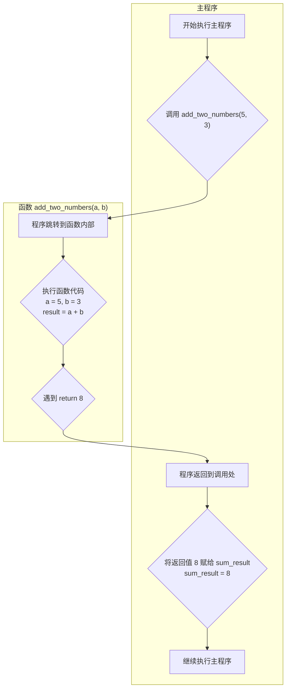

### 🎯 核心目标 (Core Goal)

本节的核心目标是掌握 Python 中函数（Function）的定义与调用方法。你将学会如何使用函数来封装重复的代码逻辑，将其变为可复用的代码单元，从而显著提升代码的可读性、可维护性和组织性。这是从编写零散脚本到构建结构化程序的关键第一步。

### 🔑 核心语法与参数 (Core Syntax & Parameters)

函数定义的核心是 `def` 关键字。一个标准的函数定义结构如下：

```python
def function_name(parameter1, parameter2, ...):
    """
    这是一个文档字符串 (Docstring)，用于描述函数的功能。
    """
    # 函数体 (Function Body)
    # 这里是函数的逻辑代码
    return some_value # 可选的 return 语句
```

**语法解析:**

*   **`def`**: 定义函数的关键字，告诉 Python 解释器：“接下来我要创建一个函数”。
*   **`function_name`**: 你为函数起的名字。命名规则与变量相同，通常使用小写字母和下划线（snake_case 风格），例如 `calculate_area`。
*   **`()`**: 函数名后的圆括号是必须的，即使函数不需要任何输入。
*   **`parameter1, parameter2`**: 形式参数（Parameters）。它们是函数在定义时声明的变量，作为函数内部的占位符，等待被调用时传入的实际值。
*   **`:`**: 冒号，标志着函数头部的结束和函数体的开始。
*   **`"""Docstring"""`**: 文档字符串。紧跟在函数定义下的三引号字符串，用于解释函数的作用、参数和返回值。这是一个极其重要的编程习惯。
*   **函数体 (Function Body)**: 缩进的代码块，包含了函数要执行的具体逻辑。
*   **`return`**: `return` 语句用于结束函数执行，并（可选地）将一个值返回给调用者。如果一个函数没有 `return` 语句，它会默认返回 `None`。

### 💻 基础用法 (Basic Usage)

让我们从两个最基础的例子开始：一个不返回任何值的函数和一个返回值给调用者的函数。

**示例 1: 定义并调用一个简单的问候函数**

这个函数接收一个名字作为输入，并打印一句问候语。它没有 `return` 语句。

```python
# 1. 定义函数
def greet(name):
    """打印一句个性化的问候语。"""
    print(f"你好, {name}！欢迎来到 Python 的世界。")

# 2. 调用函数
# "Alice" 是传递给参数 name 的实际参数 (Argument)
greet("Alice")
greet("Bob")
```
**输出:**
```
你好, Alice！欢迎来到 Python 的世界。
你好, Bob！欢迎来到 Python 的世界。
```

**示例 2: 定义并调用一个计算和的函数**

这个函数接收两个数字，计算它们的和，并使用 `return` 语句将结果返回。

```python
# 1. 定义函数
def add_two_numbers(a, b):
    """计算两个数字的和并返回结果。"""
    result = a + b
    return result

# 2. 调用函数并将返回值赋给一个变量
sum_result = add_two_numbers(5, 3)

# 3. 打印结果
print(f"5 和 3 的和是: {sum_result}")
print(f"10 和 20 的和是: {add_two_numbers(10, 20)}")
```
**输出:**
```
5 和 3 的和是: 8
10 和 20 的和是: 30
```

### 🧠 深度解析 (In-depth Analysis)

#### 1. 形参 (Parameters) vs. 实参 (Arguments)

这是一个非常关键且容易混淆的概念：

*   **形参 (Parameter)**: 定义函数时，在函数名后括号里声明的变量名。它们是函数内部的局部变量，是抽象的占位符。在 `def add_two_numbers(a, b):` 中，`a` 和 `b` 就是形参。
*   **实参 (Argument)**: 调用函数时，传递给函数的具体值。它们是真实的数据。在 `add_two_numbers(5, 3)` 中，`5` 和 `3` 就是实参。

可以这样理解：函数定义就像一份菜谱，形参（如“盐”、“糖”）是菜谱上的配料名；函数调用就像实际做菜，实参（如“一勺盐”、“两勺糖”）是你放进去的真实配料。

#### 2. 函数的执行流程：调用与返回

当我们调用一个函数时，程序的执行流程会发生一次“跳转”。


这个图清晰地展示了：
1.  主程序执行到函数调用处。
2.  控制权和参数被传递给函数。
3.  函数内部的代码被执行。
4.  当遇到 `return` 语句时，函数执行结束，并将返回值传回。
5.  主程序在之前调用的地方接收返回值，并继续向下执行。

#### 3. 文档字符串 (Docstrings) 的威力

文档字符串不仅仅是注释，它是 Python 的一个内置特性。我们可以通过内置的 `help()` 函数或特殊属性 `__doc__` 来访问它。

```python
def calculate_circle_area(radius):
    """
    计算圆的面积。

    参数:
        radius (float or int): 圆的半径。

    返回值:
        float: 圆的面积。
    """
    pi = 3.14159
    return pi * (radius ** 2)

# 使用 help() 函数查看文档
help(calculate_circle_area)

# 直接访问 __doc__ 属性
print("\n--- Docstring via __doc__ ---")
print(calculate_circle_area.__doc__)
```
**`help()` 的输出:**
```
Help on function calculate_circle_area in module __main__:

calculate_circle_area(radius)
    计算圆的面积。
    
    参数:
        radius (float or int): 圆的半径。
    
    返回值:
        float: 圆的面积。
```
编写清晰的 Docstrings 是专业 Python 开发者的标志，它让你的代码能够“自解释”，极大地便利了团队协作和未来的维护。

### ⚠️ 常见陷阱与最佳实践 (Common Pitfalls & Best Practices)

**常见陷阱:**

1.  **调用时忘记括号**:
    *   `my_func` 是函数对象本身。
    *   `my_func()` 才是执行函数调用。
    *   错误示例: `result = add_two_numbers` (这只是把函数对象赋给了 `result`，并没有执行计算)。

2.  **参数数量不匹配**: 调用函数时提供的实参数量必须与定义时的形参数量一致，否则会引发 `TypeError`。
    *   `add_two_numbers(10)` 会报错，因为它需要两个参数。

3.  **忽略返回值**: 如果一个函数有返回值，但你调用时没有用变量接收它，那么这个返回值就会丢失。
    *   `add_two_numbers(5, 3)` 这样单独一行代码，计算结果 `8` 会被丢弃。

**最佳实践:**

1.  **函数名清晰达意**: 使用动词或动词+名词的组合，如 `send_email`, `validate_input`, `calculate_average`。
2.  **单一职责原则 (Single Responsibility Principle)**: 一个函数只做一件事情，并把它做好。这使得函数更易于理解、测试和复用。
3.  **保持函数简短**: 如果一个函数变得过长（例如超过一个屏幕），考虑将其拆分成几个更小的辅助函数。
4.  **为所有函数编写 Docstrings**: 即使是简单的函数，也应该养成编写文档字符串的好习惯。

### 🚀 实战演练 (Practical Exercise)

**任务:** 创建一个函数，用于检查一个给定的年份是否是闰年。

**背景知识:**
闰年的判断规则是：
1.  能被 4 整除但不能被 100 整除。
2.  或者能被 400 整除。

**要求:**
1.  定义一个名为 `is_leap_year` 的函数。
2.  它接收一个参数 `year` (年份，整数)。
3.  函数应包含一个清晰的 Docstring，说明其功能、参数和返回值。
4.  函数内部实现闰年的判断逻辑。
5.  如果年份是闰年，函数返回 `True`；否则返回 `False`。
6.  调用该函数测试几个年份（例如 2000, 2023, 1900），并打印出易于理解的结果。

**参考答案:**

```python
def is_leap_year(year):
    """
    判断给定的年份是否为闰年。

    参数:
        year (int): 需要判断的年份。

    返回值:
        bool: 如果是闰年则返回 True，否则返回 False。
    """
    if (year % 4 == 0 and year % 100 != 0) or (year % 400 == 0):
        return True
    else:
        return False

# --- 测试函数 ---
test_years = [2000, 2023, 1900, 2024]

for y in test_years:
    if is_leap_year(y):
        print(f"{y} 年是闰年。")
    else:
        print(f"{y} 年不是闰年。")
```

**输出:**
```
2000 年是闰年。
2023 年不是闰年。
1900 年不是闰年。
2024 年是闰年。
```

### 💡 总结 (Summary)

在本节中，我们奠定了 Python 编程中至关重要的基石——函数。现在，你应该能够：

*   使用 `def` 关键字定义自己的函数。
*   清晰地区分**形参 (Parameters)** 和 **实参 (Arguments)**。
*   通过 `return` 语句让函数返回一个计算结果。
*   理解并编写标准的**文档字符串 (Docstrings)**，并知道如何通过 `help()` 查看它们。
*   将函数视为封装和复用代码逻辑的基本单元，这是编写清晰、模块化代码的核心思想。

掌握了函数的定义与调用，你就拥有了组织和抽象代码的强大工具，为后续学习更复杂的编程概念铺平了道路。