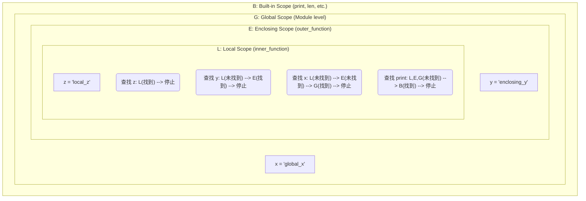

好的，总建筑师。接续“5.1 定义与调用函数”的坚实基础，我将严格遵循您的教学设计图，为您呈现 Python 技能金字塔第五章第二节 **“5.2 参数与作用域”** 的高质量 Markdown 教程。

---

在上一节中，我们掌握了函数的基本定义和调用，学会了如何通过参数向函数传递信息。现在，让我们深入探索函数更强大的能力：灵活多变的参数传递机制和至关重要的变量作用域规则。理解这些，是让你从编写简单函数，迈向设计复杂、健壮和可维护函数的关键一步。

### 🎯 核心目标 (Core Goal)

本节的核心目标是**深入理解函数参数的多种形式以及变量的作用域规则**。学完本节，你将能够自如地运用位置参数、关键字参数、默认参数、以及可变参数（`*args` 和 `**kwargs`），并能准确判断一个变量在代码的任何位置是否可访问，这对于避免程序中难以察觉的错误至关重要。

### 🔑 核心语法与参数 (Core Syntax & Parameters)

Python 的函数定义提供了极为灵活的参数处理能力。以下是本节涉及的核心语法：

1.  **默认参数值 (Default Argument Values)**
    在定义函数时，可以为一个或多个参数指定默认值。

    ```python
    def function_name(param1, param2="default_value"):
        # function body
        pass
    ```

2.  **可变位置参数 `*args` (Arbitrary Positional Arguments)**
    当你不确定函数会接收多少个位置参数时，使用 `*args`。

    ```python
    def function_name(*args):
        # args will be a tuple containing all positional arguments
        for arg in args:
            print(arg)
    ```

3.  **可变关键字参数 `**kwargs` (Arbitrary Keyword Arguments)**
    当你不确定函数会接收多少个关键字参数时，使用 `**kwargs`。

    ```python
    def function_name(**kwargs):
        # kwargs will be a dictionary containing all keyword arguments
        for key, value in kwargs.items():
            print(f"{key}: {value}")
    ```

4.  **参数顺序 (Parameter Order)**
    当组合使用这些参数时，必须遵循严格的顺序：
    `标准位置参数` -> `默认参数` -> `*args` -> `**kwargs`

    ```python
    def a_complex_function(pos_arg1, default_arg1="default", *args, **kwargs):
        # function body
        pass
    ```

### 💻 基础用法 (Basic Usage)

让我们通过具体的代码示例来理解这些参数的用法。

**示例 1: 位置参数与关键字参数**

我们在上一节已经接触过位置参数。调用函数时，实参会按位置顺序依次传递给形参。而**关键字参数**允许我们通过“`参数名=值`”的形式传递实参，此时顺序不再重要。

```python
def describe_pet(animal_type, pet_name):
    """显示宠物的信息。"""
    print(f"我有一只 {animal_type}。")
    print(f"它的名字叫 {pet_name}。")

# 1. 使用位置参数 (顺序很重要)
describe_pet("仓鼠", "哈哈")

print("-" * 20)

# 2. 使用关键字参数 (顺序不重要)
describe_pet(pet_name="咪咪", animal_type="猫")
```
**输出:**
```
我有一只 仓鼠。
它的名字叫 哈哈。
--------------------
我有一只 猫。
它的名字叫 咪咪。
```

**示例 2: 默认参数值**

默认参数让函数调用变得更简洁。只有在需要覆盖默认行为时，才需要提供该参数的值。

```python
def send_greeting(name, message="早上好"):
    """发送一条问候语，默认为早上好。"""
    print(f"{name}, {message}!")

# 调用时不提供 message 参数，使用默认值
send_greeting("张三")

# 调用时提供 message 参数，覆盖默认值
send_greeting("李四", "下午好")
```
**输出:**
```
张三, 早上好!
李四, 下午好!
```

**示例 3: 可变参数 `*args` 和 `**kwargs`**

当函数需要处理任意数量的参数时，`*args` 和 `**kwargs` 就派上了大用场。

```python
# *args 用于接收任意数量的位置参数
def calculate_sum(*numbers):
    """计算所有输入数字的总和。"""
    total = 0
    for num in numbers:  # numbers 是一个元组 (tuple)
        total += num
    return total

print(f"总和是: {calculate_sum(1, 2, 3)}")
print(f"总和是: {calculate_sum(10, 20, 30, 40, 50)}")

print("-" * 20)

# **kwargs 用于接收任意数量的关键字参数
def build_profile(first, last, **user_info):
    """创建一个用户字典，包含名字和其它信息。"""
    profile = {}
    profile['first_name'] = first
    profile['last_name'] = last
    for key, value in user_info.items(): # user_info 是一个字典 (dict)
        profile[key] = value
    return profile

user_profile = build_profile('爱因斯坦', '阿尔伯特',
                             location='普林斯顿',
                             field='物理学',
                             born=1879)
print(user_profile)
```
**输出:**
```
总和是: 6
总和是: 150
--------------------
{'first_name': '爱因斯坦', 'last_name': '阿尔伯特', 'location': '普林斯顿', 'field': '物理学', 'born': 1879}
```

### 🧠 深度解析 (In-depth Analysis)

#### 1. 参数解包 (Unpacking Arguments)

`*` 和 `**` 不仅可以在函数定义中使用，还可以在函数调用时使用，作用是“解包”一个集合（如列表、元组、字典）。

```python
def add(a, b, c):
    return a + b + c

# 使用 * 解包列表/元组
numbers_to_add = [1, 2, 3]
result = add(*numbers_to_add) # 等价于 add(1, 2, 3)
print(f"解包列表后的结果: {result}")

# 使用 ** 解包字典
def display_info(name, age):
    print(f"Name: {name}, Age: {age}")

user_data = {'name': 'Alice', 'age': 30}
display_info(**user_data) # 等价于 display_info(name='Alice', age=30)
```
**输出:**
```
解包列表后的结果: 6
Name: Alice, Age: 30
```

#### 2. 变量作用域 (Variable Scope) 与 LEGB 规则

作用域决定了代码中哪个部分可以访问一个变量。Python 遵循 **LEGB** 规则来查找一个变量。

*   **L (Local)**: 局部作用域。函数内部定义的变量，只在该函数内部有效。
*   **E (Enclosing)**: 闭包函数作用域。嵌套函数中，内层函数可以访问外层（非全局）函数的变量。
*   **G (Global)**: 全局作用域。在模块顶层定义的变量，在整个模块文件中都可见。
*   **B (Built-in)**: 内建作用域。Python 预先定义的变量/函数，如 `len()`, `print()`, `str` 等，在任何地方都可直接使用。

当访问一个变量时，Python 解释器会按照 L -> E -> G -> B 的顺序依次查找，一旦找到就停止。



**代码示例:**
```python
x = "I am global" # G: Global scope

def outer_function():
    y = "I am enclosing" # E: Enclosing scope

    def inner_function():
        z = "I am local" # L: Local scope
        print(z) # 访问 L
        print(y) # 访问 E
        print(x) # 访问 G
        print(len("hello")) # 访问 B

    inner_function()

outer_function()
```
**输出:**
```
I am local
I am enclosing
I am global
5
```

如果要**在函数内部修改全局变量**，必须使用 `global` 关键字声明。

```python
count = 0 # Global variable

def increment():
    global count # 声明 count 是全局变量，而不是创建一个新的局部变量
    count += 1

increment()
increment()
print(f"全局变量 count 的值: {count}") # 输出 2
```

### ⚠️ 常见陷阱与最佳实践 (Common Pitfalls & Best Practices)

**常见陷阱: 使用可变类型作为默认参数**

这是 Python 中最著名的陷阱之一。函数的默认参数只在函数**定义时**被创建一次。如果默认参数是可变对象（如列表、字典），后续调用会共享并修改这同一个对象。

```python
# 错误的方式
def add_item_to_list(item, target_list=[]):
    target_list.append(item)
    return target_list

list1 = add_item_to_list("apple")
print(list1) # 输出: ['apple']

# 第二次调用时，默认的 list 仍然是上一次被修改过的那个！
list2 = add_item_to_list("banana")
print(list2) # 惊悚的输出: ['apple', 'banana']
```

**最佳实践: 使用 `None` 作为可变类型的默认值**

正确的做法是使用一个不可变的值（如 `None`）作为哨兵，然后在函数内部检查并创建新的可变对象。

```python
# 正确的方式
def add_item_to_list_safe(item, target_list=None):
    if target_list is None:
        target_list = [] # 在函数体内创建新的列表
    target_list.append(item)
    return target_list

list1 = add_item_to_list_safe("apple")
print(list1) # 输出: ['apple']

list2 = add_item_to_list_safe("banana")
print(list2) # 正确的输出: ['banana']
```

**最佳实践:**

1.  **优先使用关键字参数**：对于接受多个参数，尤其是可选参数的函数，调用时使用关键字参数能极大地增强代码的可读性。`create_user(name="admin", active=True, expires_in=3600)` 远比 `create_user("admin", True, 3600)` 清晰。
2.  **谨慎使用 `global`**：`global` 关键字会破坏函数的封装性，使得代码的行为依赖于外部状态，难以追踪和测试。应优先考虑通过参数传入数据，并通过 `return` 返回结果。
3.  **明确区分 `*args` 和 `**kwargs`**：`*args` 用于收集“无名”的位置参数，`**kwargs` 用于收集“有名”的关键字参数。它们是处理不确定参数的强大工具，尤其在编写装饰器和代理函数时。

### 🚀 实战演练 (Practical Exercise)

**任务:** 创建一个高度可配置的日志记录函数 `log_message`。

**要求:**
1.  定义一个名为 `log_message` 的函数。
2.  它必须接收一个主要信息 `message` (位置参数)。
3.  它能接收任意数量的附加信息 `*details` (可变位置参数)，这些信息将被拼接在主信息后。
4.  它能接收任意数量的元数据 `**metadata` (可变关键字参数)，这些元数据将以 `[key: value]` 的格式显示。
5.  它有一个可选的关键字参数 `level`，默认值为 `"INFO"`。

**调用示例与预期输出:**

*   `log_message("User logged in")`
    *   输出: `[INFO] User logged in`
*   `log_message("File not found", "/path/to/file.txt", "Check permissions", level="WARNING")`
    *   输出: `[WARNING] File not found - /path/to/file.txt - Check permissions`
*   `log_message("Database connection failed", user="admin", db="prod_db", level="ERROR")`
    *   输出: `[ERROR] Database connection failed [user: admin] [db: prod_db]`

**参考答案:**
```python
def log_message(message, *details, level="INFO", **metadata):
    """
    记录一条格式化的日志信息。

    参数:
        message (str): 主要的日志信息。
        *details (str): 任意数量的附加详细信息。
        level (str): 日志级别，默认为 "INFO"。
        **metadata: 任意数量的键值对元数据。
    """
    # 1. 构建日志级别和主信息
    log_entry = f"[{level.upper()}] {message}"

    # 2. 拼接 *details
    if details:
        details_str = " - ".join(str(d) for d in details)
        log_entry += f" - {details_str}"

    # 3. 拼接 **metadata
    if metadata:
        metadata_str = " ".join(f"[{key}: {value}]" for key, value in metadata.items())
        log_entry += f" {metadata_str}"

    print(log_entry)

# --- 测试函数 ---
print("--- Test Case 1 ---")
log_message("User logged in")

print("\n--- Test Case 2 ---")
log_message("File not found", "/path/to/file.txt", "Check permissions", level="WARNING")

print("\n--- Test Case 3 ---")
log_message("Database connection failed", user="admin", db="prod_db", level="ERROR")

print("\n--- Test Case 4 (混合) ---")
log_message("Processing request", "ID-12345", level="DEBUG", source_ip="192.168.1.100", timeout=30)

```

**输出:**
```
--- Test Case 1 ---
[INFO] User logged in

--- Test Case 2 ---
[WARNING] File not found - /path/to/file.txt - Check permissions

--- Test Case 3 ---
[ERROR] Database connection failed [user: admin] [db: prod_db]

--- Test Case 4 (混合) ---
[DEBUG] Processing request - ID-12345 [source_ip: 192.168.1.100] [timeout: 30]
```

### 💡 总结 (Summary)

在本节中，我们极大地扩展了对 Python 函数的理解，从简单的参数传递升级到了高度灵活的接口设计：

*   你现在掌握了**位置参数**和**关键字参数**的区别和用法，学会了利用后者提升代码可读性。
*   你学会了使用**默认参数**来简化函数调用，并深刻理解了**使用可变对象作为默认参数的巨大风险**及规避方法。
*   你掌握了 `*args` 和 `**kwargs` 这两大神器，能够编写出可以接受任意数量参数的通用函数。
*   你理解了 Python 查找变量的 **LEGB 作用域规则**，这是理解闭包、调试代码和避免命名冲突的基础。

掌握了参数和作用域，你手中的“函数”工具才算真正磨砺锋利。你现在不仅能“制造”工具，更能设计出接口优雅、功能强大且不易误用的高质量工具，为构建更复杂的应用程序奠定了坚实的基础。