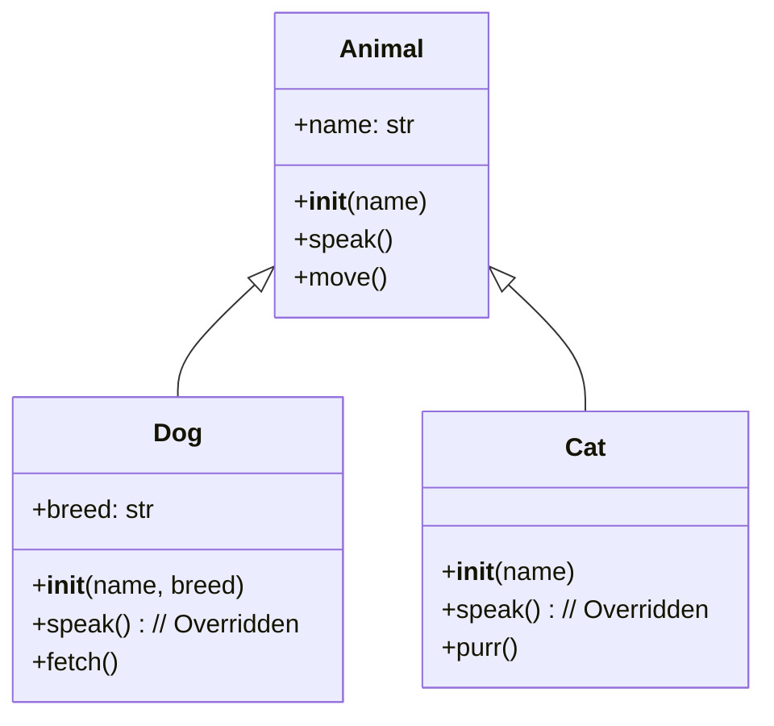

好的，总建筑师。在上一个章节中，我们学会了如何使用 `class` 关键字来设计和构建独立的“蓝图”，并创建出具体的“对象”。现在，我们将进入一个更高级、更强大的领域：如何在一个现有蓝图的基础上，构建一个更具体、更丰富的“升级版蓝图”。

这就是**继承**的核心思想。同时，我们还将探索**多态**这一神奇特性，它能让我们的代码变得异常灵活和优雅。

---

### 🎯 核心目标 (Core Goal)

本节的核心目标是让你掌握面向对象编程（OOP）的两大支柱：**继承（Inheritance）**与**多态（Polymorphism）**。学完本节，你将能够：

1.  通过**继承**来创建新的类（子类），复用并扩展一个已存在类（父类）的属性和方法，以减少代码重复。
2.  理解并应用**方法重写（Method Overriding）**来定制子类的特定行为。
3.  熟练使用 `super()` 函数来调用父类的方法，确保初始化和功能扩展的正确性。
4.  领会**多态**的精髓（特别是 Python 中的“鸭子类型”），编写出不关心具体对象类型、只关心对象行为的通用且灵活的代码。

### 🔑 核心语法与参数 (Core Syntax & Parameters)

继承与多态主要围绕着类的定义和方法调用展开，其核心语法非常直观。

**1. 创建子类（继承）**

要让一个类继承自另一个类，只需在定义类时，在类名后的括号里写上父类的名字。

```python
# 父类 (也叫基类 Base Class 或超类 Superclass)
class ParentClass:
    pass

# 子类 (也叫派生类 Derived Class)
class ChildClass(ParentClass):
    pass
```

*   **`class ChildClass(ParentClass):`**: 这行代码声明 `ChildClass` 继承自 `ParentClass`。`ChildClass` 将自动获得 `ParentClass` 中所有的属性和方法（非私有的）。

**2. 方法重写 (Method Overriding)**

如果子类想对从父类继承来的某个方法有自己的实现，只需在子类中定义一个与父类同名的方法即可。

```python
class Parent:
    def greet(self):
        return "Hello from Parent"

class Child(Parent):
    # 重写 greet 方法
    def greet(self):
        return "Greetings from Child!"
```

**3. `super()` 函数**

`super()` 是一个特殊的内置函数，它允许你在子类中调用父类的方法。这在重写方法时尤其有用，因为你可能只想在父类行为的基础上增加新功能，而不是完全替代它。

```python
class Child(Parent):
    def __init__(self, parent_arg, child_arg):
        # 1. 调用父类的 __init__ 方法来初始化父类部分
        super().__init__(parent_arg) 
        # 2. 初始化子类自己的属性
        self.child_attribute = child_arg
    
    def greet(self):
        # 1. 调用父类的 greet 方法获取基本问候语
        parent_greeting = super().greet() 
        # 2. 添加子类自己的行为
        return f"{parent_greeting}, and an extra hello from Child."
```

*   `super()` 返回一个临时的父类对象，允许你调用其方法，而无需硬编码父类的名字。

### 💻 基础用法 (Basic Usage)

让我们通过一个经典的 `Animal -> Dog` 的例子来贯穿这些概念。

**1. 定义父类 `Animal`**

创建一个通用的 `Animal` 类，所有动物都有名字，并且能发出声音。

```python
class Animal:
    """代表动物的基类"""
    def __init__(self, name):
        self.name = name
        print(f"一个动物 {self.name} 诞生了。")

    def speak(self):
        """发出通用的动物叫声"""
        return f"{self.name} 发出了一些声音。"

    def move(self):
        """描述动物的移动"""
        return f"{self.name} 移动了。"
```

**2. 创建子类 `Dog` 继承 `Animal`**

现在，我们定义一个更具体的 `Dog` 类。狗是一种动物，所以它应该继承 `Animal`。

```python
class Dog(Animal):
    """代表“狗”的子类，继承自 Animal"""
    
    def __init__(self, name, breed):
        # 使用 super() 调用父类的 __init__ 方法，完成 name 属性的初始化
        super().__init__(name)
        # 添加 Dog 特有的属性：品种
        self.breed = breed
        print(f"它是一只 {self.breed}。")

    # 方法重写：Dog 的叫声是特定的
    def speak(self):
        """重写 speak 方法以模拟狗叫"""
        return f"{self.name} 说：汪！汪！"
        
    # 添加 Dog 特有的方法
    def fetch(self):
        """模拟小狗叼东西"""
        return f"{self.name} 跑去捡球了！"
```

**3. 使用父类和子类的实例**

```python
# 创建一个父类实例
generic_animal = Animal("小怪物")
print(generic_animal.speak())  # 输出: 小怪物 发出了一些声音。
print(generic_animal.move())   # 输出: 小怪物 移动了。

print("\n" + "="*30 + "\n")

# 创建一个子类实例
my_dog = Dog("旺财", "金毛巡回犬")
# 调用被重写的方法
print(my_dog.speak())      # 输出: 旺财 说：汪！汪！ (调用的是 Dog 类的版本)
# 调用从父类继承来的方法
print(my_dog.move())       # 输出: 旺财 移动了。 (Animal 的 move 方法被复用)
# 调用子类特有的方法
print(my_dog.fetch())      # 输出: 旺财 跑去捡球了！
```

这个例子清晰地展示了：
*   `Dog` 通过继承复用了 `Animal` 的 `move` 方法。
*   `Dog` 通过方法重写，提供了 `speak` 方法的特定版本。
*   `Dog` 通过 `super().__init__` 扩展了父类的初始化过程。
*   `Dog` 添加了自己独有的方法 `fetch`。

### 🧠 深度解析 (In-depth Analysis)

#### 1. 继承的本质：“is-a”关系

继承代表了一种 **“is-a”（是一个）** 的关系。一个 `Dog` **is an** `Animal`。一个 `SavingsAccount` **is a** `BankAccount`。这种层级关系是现实世界的自然抽象，使得我们的代码结构与逻辑思维保持一致。

我们可以用 Mermaid 图来可视化这种继承关系：


*   `<|--` 箭头表示继承关系，从子类指向父类。
*   图清晰地展示了 `Dog` 和 `Cat` 都继承了 `Animal` 的公共特性，并各自添加了或重写了部分功能。

#### 2. 多态：程序的“万能插座”

**多态 (Polymorphism)** 源自希腊语，意为“多种形态”。在编程中，它意味着不同的对象可以对同一个消息（方法调用）做出不同的响应。

在 Python 中，多态通常通过 **“鸭子类型 (Duck Typing)”** 来体现。这个名字来源于一个说法：“如果它走起来像鸭子，叫起来也像鸭子，那么它就是一只鸭子。”

换言之，**Python 不关心对象的类型是什么，只关心它有没有我们需要的方法或属性。**

**代码对比：**

假设我们有一个函数，需要让传入的动物发出叫声。

**没有多态的思维 (不推荐):**
```python
def make_sound_rigid(animal_instance):
    if type(animal_instance) is Dog:
        print(animal_instance.speak()) # 假设 Dog 有 speak
    elif type(animal_instance) is Cat: # 假设 Cat 类存在
        print(animal_instance.speak()) # 假设 Cat 有 speak
    # ... 每增加一种动物，就要加一个 elif
    else:
        print("未知动物类型")
```
这种代码非常僵化，每次新增动物类型都需要修改这个函数。

**利用多态的思维 (推荐):**
```python
# 让我们先定义一个 Cat 类
class Cat(Animal):
    def speak(self):
        return f"{self.name} 说：喵~喵~"

# 这个函数不检查类型，只调用 .speak() 方法
def make_it_speak(any_animal):
    """
    这个函数接受任何具有 .speak() 方法的对象。
    这就是多态！
    """
    print(any_animal.speak())

# 创建不同类型的对象实例
my_dog = Dog("旺财", "金毛")
my_cat = Cat("咪咪")
generic_animal = Animal("小不点")

# 将不同类型的对象传入同一个函数
print("--- 多态演示 ---")
make_it_speak(my_dog)         # 输出: 旺财 说：汪！汪！
make_it_speak(my_cat)         # 输出: 咪咪 说：喵~喵~
make_it_speak(generic_animal) # 输出: 小不点 发出了一些声音。
```
`make_it_speak` 函数就像一个“万能插座”，任何有 `speak()` 方法“插头”的对象都能插进去并正常工作。它极大地提升了代码的灵活性和可扩展性。

### ⚠️ 常见陷阱与最佳实践 (Common Pitfalls & Best Practices)

1.  **陷阱：子类 `__init__` 忘记调用 `super().__init__()`**
    *   **问题描述**: 在子类的 `__init__` 方法中，忘记或未能正确调用父类的初始化方法。
    *   **后果**: 父类中定义的属性（如 `self.name`）将不会被创建，后续调用依赖这些属性的方法时会引发 `AttributeError`。
    *   **错误示例**:
        ```python
        class Dog(Animal):
            def __init__(self, name, breed):
                # 错误！没有调用 super().__init__(name)
                self.breed = breed
        
        bad_dog = Dog("捣蛋鬼", "哈士奇")
        print(bad_dog.move()) # AttributeError: 'Dog' object has no attribute 'name'
        ```
    *   **修正**: 始终确保在子类 `__init__` 中调用 `super().__init__(...)` 并传递所需参数。

2.  **陷阱：不恰当的继承关系**
    *   **问题描述**: 滥用继承，将没有“is-a”关系的类强行联系在一起。例如，让 `Car` 类继承 `Person` 类，这在逻辑上是错误的。
    *   **后果**: 会产生混乱、不合逻辑的代码结构，难以理解和维护。
    *   **最佳实践**: 继承应只用于表示明确的“is-a”层级关系。对于“has-a”（有一个）的关系，应使用**组合**（将一个类的实例作为另一个类的属性），例如 `Car` 类 **有一个** `Engine` 类的实例。

3.  **最佳实践：优先使用 `super()` 而不是硬编码父类名**
    *   **旧式写法**: `Animal.__init__(self, name)`
    *   **推荐写法**: `super().__init__(name)`
    *   **原因**: `super()` 更加灵活和健壮。如果你未来改变了继承结构（例如，在 `Animal` 和 `Dog` 之间插入一个 `Mammal` 中间类），`super()` 会自动找到正确的父类，而硬编码 `Animal` 的代码则需要手动修改，容易出错。

4.  **最佳实践：子类重写的方法应保持“契约”**
    *   当重写一个方法时，子类版本的行为应该与父类版本的目的一致。这被称为**里氏替换原则 (Liskov Substitution Principle)** 的通俗理解。
    *   例如，如果父类的 `calculate_area()` 方法返回一个数字，子类重写的版本也应该返回一个数字，而不是一个字符串或 `None`。这保证了多态的可靠性。

### 🚀 实战演练 (Practical Exercise)

**案例：扩展你的 `BankAccount` 系统**

基于上一节的 `BankAccount` 类，我们来创建一个更专业的 `SavingsAccount`（储蓄账户）子类。

**需求:**

1.  创建一个名为 `SavingsAccount` 的类，它继承自 `BankAccount`。
2.  **新属性**: `SavingsAccount` 除了拥有 `account_holder` 和 `balance` 外，还应该有一个 `interest_rate` (利率) 属性。
3.  **扩展 `__init__`**: 修改 `__init__` 方法，在接收 `account_holder` 和 `initial_balance` 的同时，接收 `interest_rate`。记得调用父类的 `__init__`。
4.  **新方法**: 添加一个 `add_interest()` 方法，该方法根据当前余额和利率计算利息，并将其存入账户。公式：`利息 = 余额 * 利率`。
5.  **重写 `withdraw`**: 为了鼓励储蓄，我们规定储蓄账户每次取款若余额低于 $50，则收取 $2 的手续费。重写 `withdraw` 方法来实现这个逻辑。

**请尝试自己编写这个类，然后与下面的参考答案进行对比。**

**参考答案:**

```python
# 首先，这是我们上一节的 BankAccount 类作为父类
class BankAccount:
    """一个简单的银行账户类 (父类)"""
    def __init__(self, account_holder, initial_balance=0.0):
        self.account_holder = account_holder
        self.balance = float(initial_balance)
        print(f"账户为 {self.account_holder} 创建成功，初始余额: ${self.balance:.2f}")

    def deposit(self, amount):
        if amount > 0:
            self.balance += amount
            print(f"存款 ${amount:.2f} 成功。当前余额: ${self.balance:.2f}")
        else:
            print("存款金额必须为正数。")

    def withdraw(self, amount):
        if amount <= 0:
            print("取款金额必须为正数。")
            return False
        if self.balance >= amount:
            self.balance -= amount
            print(f"取款 ${amount:.2f} 成功。当前余额: ${self.balance:.2f}")
            return True
        else:
            print(f"取款失败：余额不足。")
            return False

# ----- 实战演练：创建 SavingsAccount 子类 -----
class SavingsAccount(BankAccount):
    """储蓄账户子类，有利率和取款手续费逻辑"""

    def __init__(self, account_holder, initial_balance=0.0, interest_rate=0.01):
        """初始化储蓄账户"""
        # 1. 调用父类的 __init__ 来设置 name 和 balance
        super().__init__(account_holder, initial_balance)
        # 2. 设置子类特有的属性
        self.interest_rate = interest_rate
        print(f"该账户为储蓄账户，年利率为 {self.interest_rate:.2%}")

    def add_interest(self):
        """计算并添加利息到余额"""
        interest = self.balance * self.interest_rate
        print(f"计算利息: ${interest:.2f}")
        self.deposit(interest) # 复用父类的 deposit 方法来增加余额

    def withdraw(self, amount):
        """重写取款方法，增加手续费逻辑"""
        fee = 2.0
        # 如果余额低于50且取款成功，则加收手续费
        if self.balance < 50 and self.balance >= amount:
            print(f"余额低于 $50.00，本次取款将加收 ${fee:.2f} 手续费。")
            # 调用父类的 withdraw 方法，但金额是本金+手续费
            return super().withdraw(amount + fee)
        else:
            # 否则，行为与普通账户一致
            return super().withdraw(amount)

# ----- 使用 SavingsAccount 类 -----
my_savings = SavingsAccount("Bob", 100.0, 0.05) # 5% 的利率
print("-" * 30)

my_savings.add_interest()
print("-" * 30)

# 普通取款
my_savings.withdraw(20)
print("-" * 30)

# 触发手续费的取款
my_savings.withdraw(40) 
print("-" * 30)

# 再次取款
my_savings.withdraw(10)

```

### 💡 总结 (Summary)

在本节中，我们解锁了面向对象编程中复用与扩展代码的强大武器。现在，你的 OOP 工具箱中又多了几件利器：

*   **继承 (Inheritance)**: 允许你基于现有类（父类）创建新类（子类），自动获得父类的功能。它是实现“is-a”关系和代码复用的主要方式。
*   **方法重写 (Overriding)**: 让子类能够提供对父类方法的特定实现，从而定制化其行为。
*   **`super()` 函数**: 是连接子类与父类的桥梁，使得在扩展父类功能（尤其是在 `__init__` 中）时，代码既清晰又健壮。
*   **多态 (Polymorphism)**: 让你能够编写通用的代码来处理不同类型的对象，只要它们共享相同的接口（如都有 `speak` 方法）。这是 Python “鸭子类型”哲学的核心体现，极大地增强了代码的灵活性。

通过继承和多态，我们不仅仅是在创建孤立的类，而是在构建一个有组织、有层次、相互关联的类体系。这使我们能够以一种更接近现实世界的方式来建模复杂问题，编写出更易于维护和扩展的优雅代码。