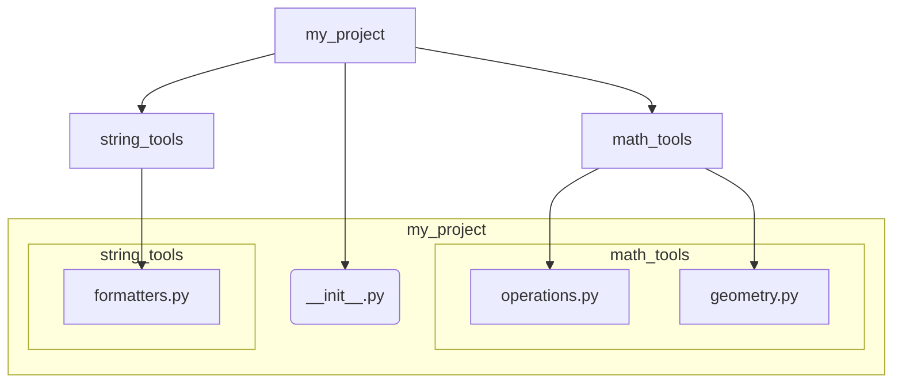

好的，总建筑师。作为您的 Python 技能金字塔专家，我将严格依据您提供的教学设计图，将“7.1 模块化编程”这一知识点，转化为一篇结构清晰、内容详实的高质量 Markdown 教程。

---

### 🎯 核心目标 (Core Goal)

本节的核心目标是让你掌握 Python 模块化编程的核心思想。学完本节，你将能够将复杂的代码拆分到不同的文件（即“模块”）中，并利用 Python 强大的导入系统，在不同地方复用和组织这些代码，从而显著提升代码的可维护性、可读性和协作效率。

### 🔑 核心语法与参数 (Core Syntax & Parameters)

模块化编程的基石是导入机制。Python 提供了两个核心关键字来实现这一功能：`import` 和 `from`。

1.  **`import module_name`**
    *   **作用**: 导入一个完整的模块。模块中的所有顶级对象（函数、类、变量）都会被加载，但你需要通过 `module_name.object_name` 的方式来访问它们。
    *   **语法**:
        ```python
        import module_name
        import module_name as alias # 使用别名简化模块名
        ```
    *   **示例**: `import math`, `import pandas as pd`

2.  **`from module_name import object_name`**
    *   **作用**: 从一个模块中只导入指定的对象（一个或多个函数、类或变量）到当前的命名空间。这样，你可以直接使用 `object_name`，而无需模块名前缀。
    *   **语法**:
        ```python
        from module_name import object_name1
        from module_name import object_name1, object_name2
        from module_name import object_name1 as alias_name # 为导入的对象指定别名
        from module_name import * # 导入模块中所有公开的对象（不推荐）
        ```
    *   **示例**: `from math import pi`, `from datetime import datetime as dt`

### 💻 基础用法 (Basic Usage)

让我们通过创建一个自定义模块来实践上述语法。假设我们正在开发一个项目，需要一些通用的数学和字符串处理工具。

**第一步：创建我们的工具模块 `utils.py`**

在你的项目文件夹中，创建一个名为 `utils.py` 的文件，并添加以下内容：

```python
# utils.py

PI = 3.14159

def calculate_area(radius):
    """计算圆的面积"""
    return PI * radius * radius

def greet(name):
    """返回一个问候语字符串"""
    return f"Hello, {name}! Welcome."
```
这个 `utils.py` 文件现在就是一个 Python 模块。

**第二步：在主程序 `main.py` 中使用模块**

在同一个文件夹下，创建另一个文件 `main.py`，并尝试用不同的方式导入和使用 `utils.py` 中的功能。

**方法一：使用 `import`**

```python
# main.py

import utils

# 访问模块中的变量和函数，需要加上 "utils." 前缀
radius = 10
area = utils.calculate_area(radius)
message = utils.greet("Alice")

print(f"The value of PI is: {utils.PI}")
print(f"The area of a circle with radius {radius} is: {area}")
print(message)
```
这种方式清晰地表明了 `calculate_area` 和 `PI` 来自于 `utils` 模块，可读性非常好。

**方法二：使用 `from ... import`**

```python
# main.py

from utils import calculate_area, greet

# 直接使用导入的函数，无需模块名前缀
radius = 5
area = calculate_area(radius)
message = greet("Bob")

print(f"The area of a circle with radius {radius} is: {area}")
print(message)

# 注意：PI 变量没有被导入，直接访问会报错
# print(PI) # NameError: name 'PI' is not defined
```
这种方式代码更简洁，但当导入的函数或变量很多时，可能会与当前文件的其他变量名冲突，或使来源变得不那么明确。

### 🧠 深度解析 (In-depth Analysis)

#### 1. `if __name__ == '__main__':` 的作用

你可能经常在 Python 脚本中看到这段代码。它到底是什么意思？

每个 Python 模块都有一个内置的特殊变量 `__name__`。它的值取决于该模块是如何被执行的：

*   **直接执行**：如果这个 `.py` 文件是作为主程序被直接运行的（例如，在终端执行 `python your_script.py`），那么 `__name__` 的值就是字符串 `'__main__'`。
*   **被导入时**：如果这个 `.py` 文件被其他模块通过 `import` 导入，那么 `__name__` 的值就是该模块的文件名（不含 `.py` 后缀）。

**为什么这很重要？**
这个机制允许一个模块既可以作为可复用的库被其他程序导入，也可以作为独立脚本被直接执行。通常，我们会将仅用于测试或演示该模块功能的代码放在 `if __name__ == '__main__':` 块内。

让我们修改 `utils.py` 来看看效果：

```python
# utils.py

PI = 3.14159

def calculate_area(radius):
    """计算圆的面积"""
    return PI * radius * radius

def greet(name):
    """返回一个问候语字符串"""
    return f"Hello, {name}! Welcome."

# 这部分代码只在直接运行 utils.py 时执行
if __name__ == '__main__':
    print("--- Running utils.py as a standalone script ---")
    test_radius = 2
    test_area = calculate_area(test_radius)
    print(f"Testing calculate_area({test_radius}): {test_area}")
    print(greet("Test User"))
    print(f"The __name__ in utils.py is: {__name__}")
```
*   当你运行 `python utils.py` 时，你会看到测试输出。
*   当你运行 `python main.py`（它会导入 `utils.py`），`utils.py` 中的测试代码 **不会** 被执行。

#### 2. 包 (Package) 的基本概念

当项目变得更大，拥有数十个模块时，仅仅将它们放在同一个目录下会显得杂乱无章。这时，我们就需要用“包”（Package）来组织模块。

**包就是一个包含多个模块的目录，且该目录下必须有一个 `__init__.py` 文件**（在 Python 3.3+ 中，这个文件可以是空的，但它的存在告诉 Python 这个目录应该被当作一个包来对待）。

**示例包结构：**

下面是一个简单的项目结构，其中 `my_project` 是一个包。


*   `my_project` 是顶层包。
*   `math_tools` 和 `string_tools` 是子包（或子模块）。
*   要从项目根目录的其他地方导入 `operations.py` 中的函数，你可以使用点（`.`）符号：
    ```python
    from my_project.math_tools import operations

    result = operations.add(2, 3)
    ```

### ⚠️ 常见陷阱与最佳实践 (Common Pitfalls & Best Practices)

1.  **陷阱：循环导入 (Circular Imports)**
    *   **问题**: 如果 `module_a.py` 导入了 `module_b.py`，而 `module_b.py` 同时又导入了 `module_a.py`，就会产生循环导入，导致程序在启动时崩溃。
    *   **解决方案**: 重新设计代码结构，将共享的功能提取到第三个独立的模块中，或者在函数/方法内部进行局部导入（非首选）。

2.  **陷阱：滥用 `from module import *`**
    *   **问题**: 这种方式会将模块中所有的公开名称都导入到当前命名空间，很容易造成命名冲突，并且让代码的来源变得模糊不清，降低了可读性和可维护性。
    *   **最佳实践**: 明确地导入你需要的对象，例如 `from module import func1, ClassA`。如果你确实需要导入很多东西，不如使用 `import module` 并通过 `module.name` 的方式访问。

3.  **最佳实践：使用绝对导入**
    *   在包（Package）结构中，优先使用绝对导入路径（从项目根目录开始），例如 `from my_project.utils import helper`。这比相对导入（如 `from ..utils import helper`）更清晰，不易出错，特别是在项目结构调整时。

4.  **最佳实践：模块命名**
    *   模块文件名应简短、全小写，并尽量避免使用下划线（除非是包的内部实现）。例如，使用 `textutils.py` 而不是 `text_utils.py`。

### 🚀 实战演练 (Practical Exercise)

**任务**：创建一个简单的计算器包。

1.  **创建目录结构**:
    ```
    calculator_project/
    ├── main.py
    └── calculator/
        ├── __init__.py
        ├── basic.py
        └── advanced.py
    ```

2.  **编写模块代码**:

    *   `calculator/__init__.py`:
        ```python
        # __init__.py
        # 可以为空，或者用于包级别的初始化
        print("Calculator package is being initialized.")
        ```

    *   `calculator/basic.py`:
        ```python
        # calculator/basic.py
        def add(a, b):
            return a + b

        def subtract(a, b):
            return a - b
        ```

    *   `calculator/advanced.py`:
        ```python
        # calculator/advanced.py
        def power(base, exp):
            return base ** exp
        ```

3.  **编写主程序 `main.py`**:
    ```python
    # main.py
    # 从我们的包中导入特定的模块
    from calculator import basic
    from calculator import advanced

    # 使用基础运算模块
    sum_result = basic.add(10, 5)
    print(f"10 + 5 = {sum_result}")

    # 使用高级运算模块
    power_result = advanced.power(2, 8)
    print(f"2 to the power of 8 is: {power_result}")

    # 也可以这样导入
    from calculator.basic import subtract
    diff_result = subtract(100, 42)
    print(f"100 - 42 = {diff_result}")
    ```

4.  **运行**: 在 `calculator_project` 目录下，执行 `python main.py`。你将看到计算结果和包的初始化信息。这个练习完美地结合了模块和包的概念。

### 💡 总结 (Summary)

模块化是 Python 编程的基石，它使得构建大型、复杂的应用程序成为可能。通过本节的学习，我们掌握了以下关键点：

*   **模块 (Module)**: 任何一个 `.py` 文件都是一个模块，是代码组织的基本单位。
*   **导入 (Import)**: 使用 `import` 和 `from ... import` 关键字来加载和复用其他模块中的代码。
*   **脚本执行入口**: `if __name__ == '__main__':` 是区分模块作为脚本直接运行还是被导入的关键，是编写可复用且可测试模块的标准模式。
*   **包 (Package)**: 当模块数量增多时，使用带 `__init__.py` 的目录（即包）来组织和层级化管理模块。

始终牢记，良好的模块化设计能让你的代码更像是一套组织有序的工具箱，而不是一个杂乱无章的抽屉。这是成为一名专业 Python 开发者的必经之路。