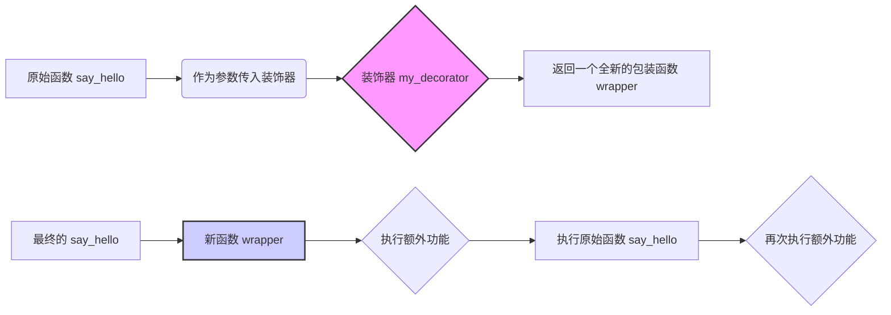

好的，总建筑师。作为您的世界级技术教育者和Python专家，我将严格遵循您提供的“教学设计图”，为您生成一篇高质量、多层次、结构清晰的Markdown教程。

---

### 🎯 核心概念
装饰器（Decorator）是一种设计模式，它允许我们在**不修改原函数代码**的前提下，动态地为函数**添加额外的功能**，是Python中实现“开闭原则”（对扩展开放，对修改关闭）的强大工具。

### 💡 使用方式
装饰器的本质是一个接收函数作为参数并返回一个新函数的函数。我们通常使用`@`语法糖来简化这个过程。

其工作流程可以分解为三步：
1.  定义一个装饰器函数（例如 `my_decorator`），它接收一个函数 `func` 作为参数。
2.  在装饰器函数内部，定义一个“包装函数”（例如 `wrapper`），这个包装函数会执行新添加的逻辑，并调用原始的 `func` 函数。
3.  装饰器函数返回这个包装函数 `wrapper`。
4.  当我们将 `@my_decorator` 放在目标函数 `say_hello` 上方时，Python会自动执行 `say_hello = my_decorator(say_hello)`。

这是一个简化的逻辑示意图：


### 📚 Level 1: 基础认知（30秒理解）
提供一个最简单、最直观的代码示例，让初学者一眼就能明白基本用法。

```python
# 1. 定义一个简单的装饰器
def simple_decorator(func):
    """一个简单的装饰器，在函数执行前后打印信息。"""
    def wrapper():
        print("--- 函数开始执行 ---")
        func()  # 调用原始函数
        print("--- 函数执行结束 ---")
    return wrapper

# 2. 使用 @ 语法糖应用装饰器
@simple_decorator
def say_hello():
    """一个打招呼的函数。"""
    print("你好，Python!")

# 3. 调用被装饰后的函数
say_hello()

# 预期输出结果:
# --- 函数开始执行 ---
# 你好，Python!
# --- 函数执行结束 ---
```

### 📈 Level 2: 核心特性（深入理解）
展示2-3个该知识点的关键特性或高级用法，每个特性配一个完整的代码示例和简要说明。

#### 特性1: 使用 `functools.wraps` 保留函数元信息
(如果不使用`@functools.wraps`，装饰器会“偷走”原函数的元信息，如函数名`__name__`和文档字符串`__doc__`。`@wraps`可以解决这个问题，将原函数的元信息复制到包装函数中。)

```python
import functools

def logging_decorator(func):
    """一个带日志功能的装饰器。"""
    # @functools.wraps(func) 是关键！
    @functools.wraps(func)
    def wrapper(*args, **kwargs):
        """这是wrapper函数的文档字符串。"""
        print(f"调用函数: {func.__name__}()")
        return func(*args, **kwargs)
    return wrapper

@logging_decorator
def calculate_sum(a, b):
    """这是一个计算两个数之和的函数。"""
    return a + b

# 打印被装饰后函数的元信息
print(f"函数名: {calculate_sum.__name__}")
print(f"函数文档: {calculate_sum.__doc__}")

# 如果没有 @functools.wraps(func)，输出将会是：
# 函数名: wrapper
# 函数文档: 这是wrapper函数的文档字符串。

# 预期输出结果:
# 函数名: calculate_sum
# 函数文档: 这是一个计算两个数之和的函数。
```

#### 特性2: 带参数的装饰器
(有时我们希望装饰器本身可以接收参数，这需要再增加一层函数嵌套。最外层函数接收装饰器的参数，并返回一个真正的装饰器。)
```python
import time

def repeat(num_times):
    """
    一个接收参数的装饰器工厂。
    它返回一个装饰器，该装饰器会让目标函数重复执行 N 次。
    """
    def decorator(func):
        @functools.wraps(func)
        def wrapper(*args, **kwargs):
            for i in range(num_times):
                print(f"第 {i+1} 次执行...")
                result = func(*args, **kwargs)
            return result
        return wrapper
    return decorator

# 使用带参数的装饰器，让函数重复执行3次
@repeat(num_times=3)
def greet(name):
    """打印问候语。"""
    print(f"你好, {name}!")

# 调用函数
greet("世界")

# 预期输出结果:
# 第 1 次执行...
# 你好, 世界!
# 第 2 次执行...
# 你好, 世界!
# 第 3 次执行...
# 你好, 世界!
```

### 🔍 Level 3: 对比学习（避免陷阱）
**陷阱：包装函数忘记返回原函数的执行结果**。这是初学者最常犯的错误之一，导致原函数即便有返回值，调用者也接收不到。

```python
# === 错误用法 ===
# ❌ wrapper 函数没有返回原函数的计算结果
def timer_decorator_wrong(func):
    """一个错误的计时器装饰器。"""
    @functools.wraps(func)
    def wrapper(*args, **kwargs):
        start_time = time.time()
        func(*args, **kwargs)  # 只执行了，但没有接收并返回其结果
        end_time = time.time()
        print(f"函数 {func.__name__} 耗时: {end_time - start_time:.4f} 秒")
        # 忘记了 return！
    return wrapper

@timer_decorator_wrong
def add(a, b):
    return a + b

result_wrong = add(10, 20)
print(f"计算结果 (错误): {result_wrong}") # 结果是 None，因为 wrapper 没有返回值

# 预期输出结果:
# 函数 add 耗时: 0.0000 秒
# 计算结果 (错误): None


# === 正确用法 ===
# ✅ wrapper 函数正确返回了原函数的计算结果
def timer_decorator_correct(func):
    """一个正确的计时器装饰器。"""
    @functools.wraps(func)
    def wrapper(*args, **kwargs):
        start_time = time.time()
        # 接收原函数的返回值
        value = func(*args, **kwargs)
        end_time = time.time()
        print(f"函数 {func.__name__} 耗时: {end_time - start_time:.4f} 秒")
        # 将返回值传递出去
        return value
    return wrapper

@timer_decorator_correct
def multiply(a, b):
    return a * b

result_correct = multiply(10, 20)
print(f"计算结果 (正确): {result_correct}") # 结果是 200

# 预期输出结果:
# 函数 multiply 耗时: 0.0000 秒
# 计算结果 (正确): 200
```

### 🚀 Level 4: 实战应用（真实场景）
**场景：** 🎮 魔法学院的咒语施放系统

在这个系统中，每个咒语都是一个函数。我们需要使用装饰器来为咒语附加施法条件检查（如魔力值）和施法效果（如元素加成），而无需修改每个咒语的基础实现。

```python
import functools

# --- 角色状态 ---
player = {
    "name": "大法师艾拉",
    "mana": 50,
    "max_mana": 100
}

# --- 装饰器 1: 魔力消耗检查 (带参数) ---
def require_mana(cost):
    def decorator(spell_func):
        @functools.wraps(spell_func)
        def wrapper(*args, **kwargs):
            if player["mana"] >= cost:
                player["mana"] -= cost
                print(f"✨ 施法成功！消耗 {cost} 点魔力，剩余 {player['mana']} 点。")
                return spell_func(*args, **kwargs)
            else:
                print(f"❌ 施法失败！魔力不足，需要 {cost} 点，当前只有 {player['mana']} 点。")
                return None
        return wrapper
    return decorator

# --- 装饰器 2: 元素加成 ---
def elemental_infusion(element):
    def decorator(spell_func):
        @functools.wraps(spell_func)
        def wrapper(target):
            base_damage = spell_func(target)
            if element == "火焰":
                bonus_damage = int(base_damage * 0.5)
                print(f"🔥 咒语附加了火焰效果，造成额外 {bonus_damage} 点灼烧伤害！")
                return base_damage + bonus_damage
            elif element == "冰霜":
                print(f"❄️ 咒语附加了冰霜效果，{target} 的速度降低了！")
                return base_damage
            return base_damage
        return wrapper
    return decorator

# --- 咒语定义 (函数) ---
@require_mana(cost=30)
@elemental_infusion(element="火焰")
def fireball(target):
    """发射一枚火球。"""
    print(f"对 {target} 发射了一枚威力巨大的火球...")
    return 100  # 基础伤害

@require_mana(cost=25)
def heal(target):
    """治疗一个目标。"""
    print(f"对 {target} 施放了治愈之光...")
    player["mana"] = min(player["max_mana"], player["mana"] + 40)
    print(f"{target} 的魔力恢复了，当前为 {player['mana']}。")
    return "治疗成功"

# --- 模拟战斗 ---
print(f"--- {player['name']} 的回合 ---")
print(f"当前魔力: {player['mana']}/{player['max_mana']}")

print("\n1. 施放【火焰强化火球术】攻击哥布林...")
total_damage = fireball("哥布林")
if total_damage:
    print(f"对哥布林造成总计 {total_damage} 点伤害！")

print(f"\n当前魔力: {player['mana']}/{player['max_mana']}")
print("\n2. 再次尝试施放【火焰强化火球术】...")
fireball("哥布林") # 此时魔力不足

print(f"\n当前魔力: {player['mana']}/{player['max_mana']}")
print("\n3. 施放【自我治疗】...")
heal("自己")

# 预期输出结果:
# --- 大法师艾拉 的回合 ---
# 当前魔力: 50/100
#
# 1. 施放【火焰强化火球术】攻击哥布林...
# ✨ 施法成功！消耗 30 点魔力，剩余 20 点。
# 对 哥布林 发射了一枚威力巨大的火球...
# 🔥 咒语附加了火焰效果，造成额外 50 点灼烧伤害！
# 对哥布林造成总计 150 点伤害！
#
# 当前魔力: 20/100
#
# 2. 再次尝试施放【火焰强化火球术】...
# ❌ 施法失败！魔力不足，需要 30 点，当前只有 20 点。
#
# 当前魔力: 20/100
#
# 3. 施放【自我治疗】...
# ❌ 施法失败！魔力不足，需要 25 点，当前只有 20 点。
```

### 💡 记忆要点
- **要点1**: **装饰器是“函数包装器”**。它的核心思想是接收一个函数，返回一个增强版的新函数。`@语法`只是为了调用方便。
- **要点2**: **保护元信息靠`@wraps`**。为了不让装饰器“吃掉”原函数的文档和名字，务必从 `functools` 模块导入并使用 `@wraps`。
- **要点3**: **别忘记`return`**。包装函数（wrapper）必须返回原函数的执行结果，否则调用者将永远得到 `None`。