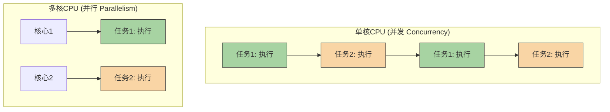

好的，作为一名世界级的技术教育者和 Python 专家，我将根据这份“教学设计图”为您精心打造一篇高质量的 Markdown 教程。

---

### 🎯 核心概念

并发编程旨在解决**程序执行效率**和**系统响应性**的问题。它让程序能够“同时”处理多个任务，从而充分利用现代计算机的多核CPU资源，或是在等待外部资源（如网络、磁盘）时执行其他工作，避免宝贵的CPU时间被浪费。

### 💡 使用方式

理解并发编程的核心在于区分几个关键概念，它们是选择正确工具的“决策树”。

1.  **并发 (Concurrency)**：**逻辑上**同时处理多个任务。在单核CPU上，这意味着快速地在任务之间切换，给人一种同时运行的错觉。
    *   **比喻**: 一位咖啡师在制作多杯咖啡。他会先为A杯加咖啡豆，在机器研磨时，去为B杯加热牛奶，然后再回来为A杯萃取。他只有一个人（单核），但通过切换任务，缩短了总耗时。

2.  **并行 (Parallelism)**：**物理上**同时处理多个任务。这需要多核CPU，每个核心在同一时刻独立执行一个任务。
    *   **比喻**: 两位咖啡师同时制作两杯不同的咖啡。他们是两个人（多核），真正地在同一时间做着各自的事情。

3.  **任务类型**:
    *   **I/O 密集型 (I/O-Bound)**: 任务大部分时间在等待外部资源，如等待网络响应、读取硬盘文件。CPU处于空闲状态。
    *   **CPU 密集型 (CPU-Bound)**: 任务需要大量的计算，CPU持续高速运转，如复杂的数学运算、视频编码。

以下图表清晰地展示了并发与并行的区别：



在 Python 中，我们主要使用 `threading`（线程）来实现并发，使用 `multiprocessing`（进程）来实现并行。

### 📚 Level 1: 基础认知（30秒理解）

让我们用一个简单的“下载”任务来感受并发的威力。假设我们有两个下载任务，每个都需要2秒。串行执行总共需要4秒，而使用并发（线程），它们可以“同时”等待，总耗时约2秒。

```python
import threading
import time

def fake_download(task_name):
    """模拟一个需要等待I/O的任务"""
    print(f"开始下载 {task_name}...")
    time.sleep(2)  # 模拟网络延迟
    print(f"{task_name} 下载完成!")

# --- 串行执行 ---
start_time = time.time()
fake_download("文件A")
fake_download("文件B")
end_time = time.time()
print(f"串行执行总耗时: {end_time - start_time:.2f} 秒\n")

# --- 并发执行 ---
start_time = time.time()
# 创建线程
thread1 = threading.Thread(target=fake_download, args=("文件C",))
thread2 = threading.Thread(target=fake_download, args=("文件D",))

# 启动线程
thread1.start()
thread2.start()

# 等待所有线程完成
thread1.join()
thread2.join()

end_time = time.time()
print(f"并发执行总耗时: {end_time - start_time:.2f} 秒")

# 预期输出结果:
# 开始下载 文件A...
# 文件A 下载完成!
# 开始下载 文件B...
# 文件B 下载完成!
# 串行执行总耗时: 4.00 秒
#
# 开始下载 文件C...
# 开始下载 文件D...
# 文件C 下载完成!
# 文件D 下载完成!
# 并发执行总耗时: 2.01 秒
```

### 📈 Level 2: 核心特性（深入理解）

#### 特性1: 线程 (Threading) - I/O 密集型任务的利器

线程是操作系统能够进行运算调度的最小单位。在 Python 中，由于全局解释器锁（GIL）的存在，同一时间只有一个线程能执行 Python 字节码。但这并不妨碍线程在处理 I/O 密集型任务时大放异彩。当一个线程等待 I/O 时（如 `time.sleep()`, 网络请求），GIL 会被释放，允许其他线程运行。

```python
import threading
import time
import requests # 需要安装: pip install requests

urls = [
    "https://www.google.com",
    "https://www.python.org",
    "https://www.github.com",
]

def fetch_url(url):
    """一个典型的I/O密集型任务：请求网页"""
    print(f"开始请求 {url}...")
    try:
        response = requests.get(url, timeout=5)
        print(f"完成请求 {url}, 状态码: {response.status_code}")
    except requests.exceptions.RequestException as e:
        print(f"请求 {url} 失败: {e}")

# 使用线程处理多个网络请求
start_time = time.time()
threads = []
for url in urls:
    thread = threading.Thread(target=fetch_url, args=(url,))
    threads.append(thread)
    thread.start()

for thread in threads:
    thread.join()

end_time = time.time()
print(f"\n使用线程处理 I/O 密集型任务，总耗时: {end_time - start_time:.2f} 秒")

# 预期输出结果 (顺序可能不同):
# 开始请求 https://www.google.com...
# 开始请求 https://www.python.org...
# 开始请求 https://www.github.com...
# 完成请求 https://www.google.com, 状态码: 200
# 完成请求 https://www.python.org, 状态码: 200
# 完成请求 https://www.github.com, 状态码: 200
#
# 使用线程处理 I/O 密集型任务，总耗时: 1.52 秒  (这个时间取决于你的网速，但会远小于三次请求时间的总和)
```

#### 特性2: 进程 (Multiprocessing) - CPU 密集型任务的救星

进程是操作系统资源分配的基本单位。每个进程都有自己独立的内存空间和 Python 解释器，因此它们不受 GIL 的限制。这使得 `multiprocessing` 成为执行 CPU 密集型任务、真正利用多核优势的唯一标准库选择。

```python
import multiprocessing
import time

def heavy_calculation(n):
    """一个典型的CPU密集型任务：大量计算"""
    print(f"开始计算 {n}...")
    count = 0
    for i in range(n):
        count += i
    print(f"计算 {n} 完成!")
    return count

# 使用进程处理多个计算任务
if __name__ == '__main__': # 在Windows/macOS上，multiprocessing必须放在这个block里
    start_time = time.time()
    
    # 创建一个进程池
    pool = multiprocessing.Pool(processes=2)
    
    # 任务列表
    tasks = [100_000_000, 100_000_001]
    
    # 异步提交任务
    results = pool.map(heavy_calculation, tasks)
    
    pool.close() # 关闭进程池，不再接受新任务
    pool.join()  # 等待所有子进程执行完毕
    
    end_time = time.time()
    print(f"\n使用进程处理 CPU 密集型任务，总耗时: {end_time - start_time:.2f} 秒")

# 预期输出结果 (在双核或以上CPU上):
# 开始计算 100000000...
# 开始计算 100000001...
# 计算 100000000 完成!
# 计算 100000001 完成!
#
# 使用进程处理 CPU 密集型任务，总耗时: 3.51 秒 (这个时间大约是单个任务的耗时，而不是两倍)
```

### 🔍 Level 3: 对比学习（避免陷阱）

**陷阱：误用 `threading` 处理 CPU 密集型任务**

由于 GIL 的存在，使用多线程执行纯计算任务，不仅不会变快，反而会因为线程创建、切换和锁竞争的开销而变得更慢！

```python
import threading
import multiprocessing
import time

def cpu_bound_task():
    """一个纯计算任务"""
    count = 0
    for _ in range(100_000_000):
        count += 1

# === 错误用法 ===
# ❌ 尝试用多线程加速计算，结果适得其反
print("--- 错误用法：多线程处理CPU密集型任务 ---")
start_time = time.time()
thread1 = threading.Thread(target=cpu_bound_task)
thread2 = threading.Thread(target=cpu_bound_task)
thread1.start()
thread2.start()
thread1.join()
thread2.join()
end_time = time.time()
print(f"多线程耗时: {end_time - start_time:.2f} 秒")
# 解释为什么是错的:
# GIL 强制同一时刻只有一个线程能执行Python代码。
# 两个线程为了争夺GIL会产生额外的开销，导致总时间比单个线程执行两次还要长。


# === 正确用法 ===
# ✅ 使用多进程绕过GIL，实现真正的并行计算
print("\n--- 正确用法：多进程处理CPU密集型任务 ---")
if __name__ == '__main__':
    start_time = time.time()
    process1 = multiprocessing.Process(target=cpu_bound_task)
    process2 = multiprocessing.Process(target=cpu_bound_task)
    process1.start()
    process2.start()
    process1.join()
    process2.join()
    end_time = time.time()
    print(f"多进程耗时: {end_time - start_time:.2f} 秒")
# 解释为什么这样是对的:
# 每个进程都有自己的Python解释器和GIL，它们可以在不同的CPU核心上并行执行，
# 从而将总耗时减少到接近单个任务的耗时（在多核CPU上）。

# 预期输出 (在一个至少双核的机器上):
# --- 错误用法：多线程处理CPU密集型任务 ---
# 多线程耗时: 9.85 秒  (比单个任务的耗时 * 2 还要慢)
#
# --- 正确用法：多进程处理CPU密集型任务 ---
# 多进程耗时: 5.12 秒  (接近单个任务的耗时，实现了加速)
```

### 🚀 Level 4: 实战应用（真实场景）

**场景：** 🚀 星际矿物分析站

我们的太空探测器发回了来自不同行星的矿物样本数据。分析站需要完成两项主要工作：
1.  **下载数据 (I/O 密集型)**: 从遥远的行星中继站下载地质扫描数据，网络延迟很高。
2.  **分析成分 (CPU 密集型)**: 对下载的数据进行复杂的算法分析，找出稀有元素。

我们将设计一个高效的分析流程，结合使用 `threading` 和 `multiprocessing` 来最大化效率。

```python
import threading
import multiprocessing
import time
import random

def download_data(planet_name):
    """(I/O密集型) 模拟从行星下载数据"""
    print(f"🛰️ [I/O线程] 开始从 {planet_name} 下载数据...")
    time.sleep(random.uniform(2, 4)) # 模拟高网络延迟
    data_packet = f"来自 {planet_name} 的原始数据包"
    print(f"✅ [I/O线程] {planet_name} 数据下载完毕!")
    return data_packet

def analyze_composition(data_packet):
    """(CPU密集型) 模拟分析矿物成分"""
    print(f"🔬 [CPU进程] 开始分析 '{data_packet}'...")
    # 模拟复杂的计算
    n = 80_000_000
    _ = sum(i * i for i in range(n))
    result = f"分析结果: 在 '{data_packet}' 中发现超能量晶体!"
    print(f"💎 [CPU进程] '{data_packet}' 分析完成!")
    return result

if __name__ == '__main__':
    planets = ["火星", "木卫二", "泰坦星"]
    
    print("--- 启动星际矿物分析站 ---")
    start_total_time = time.time()

    # --- Step 1: 使用线程池并发下载所有数据 ---
    print("\n--- [阶段一] 并发下载行星数据 ---")
    download_threads = []
    downloaded_data = [None] * len(planets)

    # 我们需要一个辅助函数来将结果存入列表
    def download_wrapper(index, planet):
        downloaded_data[index] = download_data(planet)

    for i, planet in enumerate(planets):
        thread = threading.Thread(target=download_wrapper, args=(i, planet))
        download_threads.append(thread)
        thread.start()

    for thread in download_threads:
        thread.join()
    
    print("\n--- [阶段一] 所有数据下载完成! ---")
    print("收到的数据包:", downloaded_data)

    # --- Step 2: 使用进程池并行分析数据 ---
    print("\n--- [阶段二] 并行分析矿物成分 ---")
    # 使用与CPU核心数匹配的进程数，或者根据需要调整
    num_processes = min(multiprocessing.cpu_count(), len(downloaded_data))
    with multiprocessing.Pool(processes=num_processes) as pool:
        analysis_results = pool.map(analyze_composition, downloaded_data)
    
    print("\n--- [阶段二] 所有分析工作完成! ---")
    print("最终分析报告:")
    for report in analysis_results:
        print(f"- {report}")
        
    end_total_time = time.time()
    print(f"\n✨ 任务完成！总耗时: {end_total_time - start_total_time:.2f} 秒")

# 预期输出 (顺序和时间可能略有不同):
# --- 启动星际矿物分析站 ---
#
# --- [阶段一] 并发下载行星数据 ---
# 🛰️ [I/O线程] 开始从 火星 下载数据...
# 🛰️ [I/O线程] 开始从 木卫二 下载数据...
# 🛰️ [I/O线程] 开始从 泰坦星 下载数据...
# ✅ [I/O线程] 火星 数据下载完毕!
# ✅ [I/O线程] 泰坦星 数据下载完毕!
# ✅ [I/O线程] 木卫二 数据下载完毕!
#
# --- [阶段一] 所有数据下载完成! ---
# 收到的数据包: ['来自 火星 的原始数据包', '来自 木卫二 的原始数据包', '来自 泰坦星 的原始数据包']
#
# --- [阶段二] 并行分析矿物成分 ---
# 🔬 [CPU进程] 开始分析 '来自 火星 的原始数据包'...
# 🔬 [CPU进程] 开始分析 '来自 木卫二 的原始数据包'...
# 🔬 [CPU进程] 开始分析 '来自 泰坦星 的原始数据包'...
# 💎 [CPU进程] '来自 火星 的原始数据包' 分析完成!
# 💎 [CPU进程] '来自 泰坦星 的原始数据包' 分析完成!
# 💎 [CPU进程] '来自 木卫二 的原始数据包' 分析完成!
#
# --- [阶段二] 所有分析工作完成! ---
# 最终分析报告:
# - 分析结果: 在 '来自 火星 的原始数据包' 中发现超能量晶体!
# - 分析结果: 在 '来自 木卫二 的原始数据包' 中发现超能量晶体!
# - 分析结果: 在 '来自 泰坦星 的原始数据包' 中发现超能量晶体!
#
# ✨ 任务完成！总耗时: 8.59 秒 (远小于所有任务串行执行时间的总和)
```

### 💡 记忆要点
- **要点1**: **并发是“看起来同时”，并行是“真正同时”**。并发通过任务切换实现，单核即可；并行需要多核CPU支持。
- **要点2**: **任务类型决定工具选型**。遇到网络请求、文件读写等 I/O 密集型任务，优先选择 `threading`；遇到科学计算、数据处理等 CPU 密集型任务，必须使用 `multiprocessing`。
- **要点3**: **GIL 是核心限制**。Python 的全局解释器锁（GIL）是 `threading` 无法利用多核进行并行计算的根本原因。`multiprocessing` 通过创建独立进程，每个进程拥有自己的 GIL，从而绕开了这个限制。