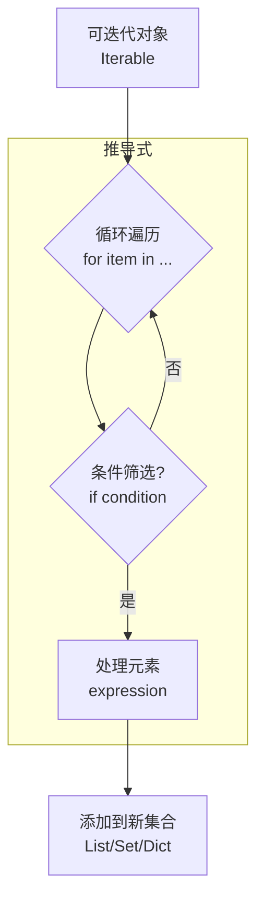

### 🎯 核心目标 (Core Goal)
本节的核心目标是让你熟练掌握列表、字典和集合推导式。通过学习，你将能够用一行代码替代传统的多行循环来创建集合，从而写出更简洁、高效且极具 Python 风格（Pythonic）的代码。这是从“能写代码”到“会写好代码”的关键一步。

### 🔑 核心语法与参数 (Core Syntax & Parameters)
推导式本质上是一种语法糖，它将循环和条件判断浓缩到一行表达式中，用于从一个可迭代对象中生成新的集合。其核心结构可以分解为以下几个部分：

1.  **列表推导式 (List Comprehension)**
    ```python
    [expression for item in iterable if condition]
    ```
    -   `expression`: 对 `item` 进行处理的表达式，其结果将成为新列表的元素。
    -   `item`: 从 `iterable` 中取出的每个元素。
    -   `iterable`: 一个可迭代对象，如列表、元组、字符串或 `range()`。
    -   `if condition` (可选): 一个筛选条件，只有当 `condition` 为 `True` 时，`item` 才会被处理并加入新列表。

2.  **字典推导式 (Dictionary Comprehension)**
    ```python
    {key_expression: value_expression for item in iterable if condition}
    ```
    -   `key_expression`: 用于生成新字典键（key）的表达式。
    -   `value_expression`: 用于生成新字典值（value）的表达式。
    -   其他部分与列表推导式类似。

3.  **集合推导式 (Set Comprehension)**
    ```python
    {expression for item in iterable if condition}
    ```
    -   语法与列表推导式几乎一样，只是将方括号 `[]` 换成了花括号 `{}`。
    -   最终生成的结果是一个集合，因此会自动处理重复元素。

### 💻 基础用法 (Basic Usage)
让我们通过具体的代码示例来感受推导式的优雅。

**1. 列表推导式：生成0-9的平方**

```python
# 传统 for 循环
squares = []
for i in range(10):
    squares.append(i * i)
# squares -> [0, 1, 4, 9, 16, 25, 36, 49, 64, 81]

# 使用列表推导式
squares_comp = [i * i for i in range(10)]
# squares_comp -> [0, 1, 4, 9, 16, 25, 36, 49, 64, 81]
```

**2. 字典推导式：创建数字到其平方的映射**

```python
# 传统 for 循环
num_to_square = {}
for i in range(5):
    num_to_square[i] = i * i
# num_to_square -> {0: 0, 1: 1, 2: 4, 3: 9, 4: 16}

# 使用字典推导式
num_to_square_comp = {i: i * i for i in range(5)}
# num_to_square_comp -> {0: 0, 1: 1, 2: 4, 3: 9, 4: 16}
```

**3. 集合推导式：从包含重复字符的字符串中提取唯一字符**

```python
# 传统 for 循环
text = "hello python"
unique_chars = set()
for char in text:
    if char.strip(): # 忽略空格
        unique_chars.add(char)
# unique_chars -> {'h', 'l', 'o', 'n', 'p', 't', 'y', 'e'}

# 使用集合推导式
unique_chars_comp = {char for char in text if char.strip()}
# unique_chars_comp -> {'h', 'l', 'o', 'n', 'p', 't', 'y', 'e'}
```

### 🧠 深度解析 (In-depth Analysis)
推导式不仅仅是代码更短，它在可读性和性能上都具有显著优势。

**推导式 vs. `for` 循环**

1.  **可读性 (Readability)**
    对于简单的集合生成任务，推导式将“做什么”（`expression`）和“从哪里做”（`for item in iterable`）紧密地结合在一起，代码意图一目了然。

    -   **For 循环**: "创建一个空列表。然后，遍历这个范围。对于每一个数字，计算它的平方，然后把它添加到列表中。" (描述过程)
    -   **推导式**: "给我一个列表，其中包含了0到9范围内每个数字的平方。" (描述结果)

    后者更接近自然语言的声明式表达，降低了读者的心智负担。

2.  **性能 (Performance)**
    推导式通常比等效的 `for` 循环更快。这是因为：
    -   **C语言级别的优化**: Python解释器在内部对推导式进行了优化。循环是在C语言层面实现的，避免了在Python虚拟机中反复调用 `.append()` 或 `.add()` 方法的开销。
    -   **更高效的内存分配**: 在某些情况下，Python可以预先计算出最终集合的大致大小，从而进行更有效的内存分配。

    让我们用一个简单的基准测试来验证这一点：

    ```python
    import timeit

    # 测试生成一百万个元素的列表
    size = 1_000_000

    # for 循环方法
    for_loop_stmt = """
    result = []
    for i in range(size):
        result.append(i * i)
    """

    # 列表推导式方法
    list_comp_stmt = "result = [i * i for i in range(size)]"

    for_loop_time = timeit.timeit(stmt=for_loop_stmt, globals={'size': size}, number=10)
    list_comp_time = timeit.timeit(stmt=list_comp_stmt, globals={'size': size}, number=10)

    print(f"For loop time: {for_loop_time:.6f} seconds")
    print(f"List comprehension time: {list_comp_time:.6f} seconds")
    # 典型输出:
    # For loop time: 0.612345 seconds
    # List comprehension time: 0.456789 seconds
    ```
    实验结果清晰地表明，列表推导式在性能上具有明显优势。

### ⚠️ 常见陷阱与最佳实践 (Common Pitfalls & Best Practices)
虽然推导式功能强大，但不当使用会适得其反。

1.  **陷阱：过度复杂的推导式**
    当逻辑变得复杂时（例如，多个 `for` 循环和 `if` 条件嵌套），强行使用单行推导式会严重损害代码的可读性。

    ```python
    # 糟糕的例子：难以阅读
    messy = [y for x in range(10) if x > 5 for y in range(x) if y % 2 == 0]

    # 最佳实践：当逻辑复杂时，回归使用 for 循环
    clean = []
    for x in range(10):
        if x > 5:
            for y in range(x):
                if y % 2 == 0:
                    clean.append(y)
    ```
    **最佳实践**: 保持推导式简洁。如果一个推导式包含了超过一个 `for` 循环和一个 `if` 条件，就应该考虑将其重构为标准的 `for` 循环。

2.  **陷阱：为副作用而使用推导式**
    推导式的核心目的是**创建集合**，而不是执行操作（如打印、写入文件等）。这种用法是反模式的，因为它会创建一个你根本不需要的列表，浪费内存。

    ```python
    # 错误的做法
    [print(i) for i in range(5)] # 会创建一个 [None, None, None, None, None] 列表

    # 正确的做法
    for i in range(5):
        print(i)
    ```
    **最佳实践**: 如果你的目的不是生成一个新的集合，请使用传统的 `for` 循环。

### 🚀 实战演练 (Practical Exercise)
**场景**: 假设你有一个产品列表，每个产品是一个字典。你需要筛选出价格高于20元的商品，并为它们生成一个新的字典，其中键是商品名称的大写形式，值是打九折后的价格。

**原始数据**:
```python
products = [
    {"name": "Laptop", "price": 1200},
    {"name": "Mouse", "price": 15},
    {"name": "Keyboard", "price": 75},
    {"name": "Monitor", "price": 300},
    {"name": "Webcam", "price": 20},
]
```

**任务**: 使用字典推导式完成上述转换。

**你的解答**:
```python
# 尝试在这里写出你的字典推导式
discounted_products = {
    p["name"].upper(): p["price"] * 0.9 
    for p in products 
    if p["price"] > 20
}

print(discounted_products)
# 预期输出:
# {'LAPTOP': 1080.0, 'KEYBOARD': 67.5, 'MONITOR': 270.0}
```
这个练习完美地展示了推导式的实战能力：在一行代码中完成了筛选、转换和创建新数据结构的全部工作。

### 💡 总结 (Summary)
推导式是 Python 提供的一项强大而优雅的特性，它允许我们以声明式的方式快速生成列表、字典和集合。

-   **核心优势**: 简洁、可读性强（对于简单逻辑）、性能更优。
-   **三大类型**: 列表 `[...]`、字典 `{key: val ...}`、集合 `{...}`。
-   **使用原则**: 用于**创建集合**，避免过度复杂和副作用。

掌握推导式是提升你 Python 代码质量和开发效率的重要一步。你可以将它的结构记为下面的心智模型：


现在，你已经掌握了 Python 中最优雅的集合创建方式之一。在你的下一个项目中，大胆地用它来替代那些冗长的 `for` 循环吧！