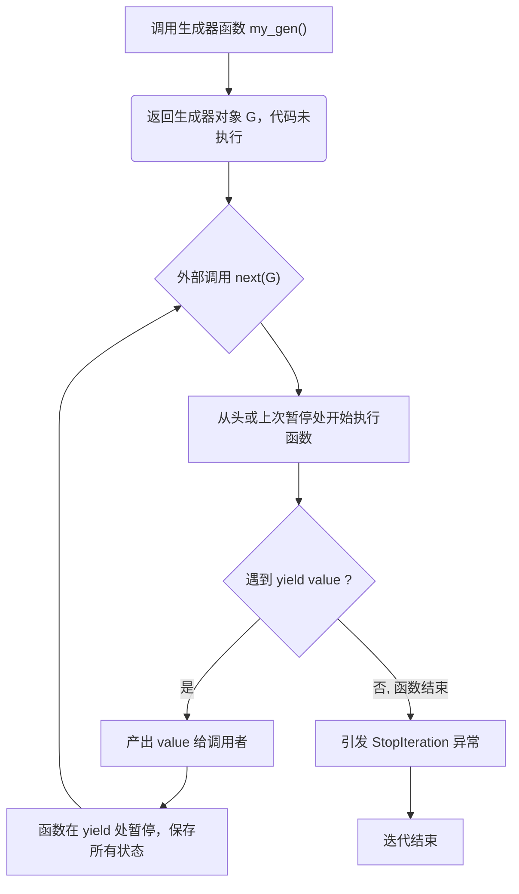
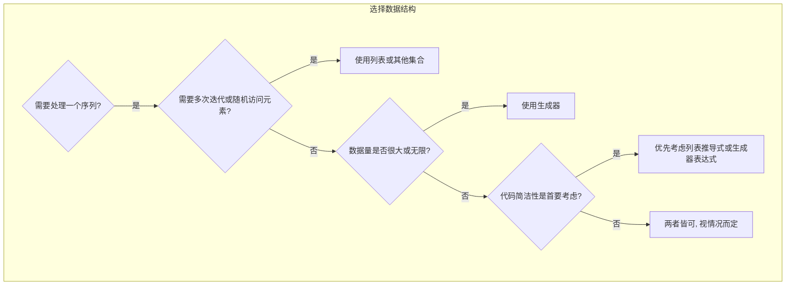

好的，总建筑师。上一节我们学习了推导式，它能一次性在内存中构建出整个集合，非常适合处理中小型数据。但如果数据量达到数百万甚至上亿，一次性加载到内存将是灾难性的。为了解决这个问题，Python 提供了更为优雅和高效的工具：**生成器与迭代器**。它们是处理大数据流和实现内存高效计算的基石。

***

### 🎯 核心目标 (Core Goal)
本节的核心目标是让你深入理解 Python 的迭代协议，并掌握创建和使用**生成器 (Generator)** 的两种核心方法：**生成器表达式**和**生成器函数 (`yield`)**。学完本节，你将能够编写出内存占用极低的代码来处理大型乃至无限的数据序列，真正实现“惰性求值”，让你的程序在处理大数据时也能保持轻盈和高效。

### 🔑 核心语法与参数 (Core Syntax & Parameters)
在深入生成器之前，我们必须先理解两个基础概念：可迭代对象 (Iterable) 和迭代器 (Iterator)。

1.  **可迭代对象 (Iterable)**
    -   **定义**: 任何实现了 `__iter__()` 方法的对象。这个方法返回一个迭代器对象。
    -   **例子**: 列表、元组、字典、集合、字符串、`range()` 对象等都是可迭代的。你可以对它们使用 `for` 循环。

2.  **迭代器 (Iterator)**
    -   **定义**: 任何实现了 `__next__()` 方法的对象。它也必须实现 `__iter__()` 方法，该方法返回对象自身 (即 `self`)，使其同时成为一个可迭代对象。`__next__()` 返回序列中的下一个元素。当没有更多元素时，它会引发 `StopIteration` 异常。
    -   **核心**: 迭代器是消耗性的，它记录着当前迭代的位置，并且只能向前移动。

现在，让我们来看创建**生成器**（它们是特殊且高效的迭代器）的两种主要 Pythonic 方式：

1.  **生成器表达式 (Generator Expression)**
    -   它看起来像一个列表推导式，但使用圆括号 `()` 而不是方括号 `[]`。
    -   它不会立即创建所有元素，而是返回一个生成器对象（它本身就是一个迭代器）。

    ```python
    (expression for item in iterable if condition)
    ```
    -   `expression`: 对 `item` 进行处理的表达式，其结果将在每次迭代时被“生成”。
    -   `item`: 从 `iterable` 中取出的每个元素。
    -   `iterable`: 任何可迭代对象。
    -   `if condition` (可选): 一个筛选条件，只有满足条件的 `item` 才会被处理和生成。

2.  **生成器函数 (Generator Function)**
    -   一个包含 `yield` 关键字的函数。
    -   调用生成器函数不会立即执行函数体，而是返回一个生成器对象。
    -   每次对生成器调用 `next()` 时，函数会执行到下一个 `yield` 语句，返回 `yield` 后面的值，并在此处“暂停”执行，保留所有局部状态。

    ```python
    def my_generator_function(params):
        # ... 一些逻辑 ...
        yield value_to_return
        # ... 更多逻辑 ...
        yield another_value
    ```
    -   `yield`: 这是一个神奇的关键字，它类似于 `return`，但它会保存函数的状态。当函数下一次被唤醒时，它会从 `yield` 的下一行代码继续执行。

### 💻 基础用法 (Basic Usage)
让我们通过实例来感受生成器的力量。

**1. 理解迭代协议**

```python
my_list = [1, 2, 3]

# my_list 是一个可迭代对象 (Iterable), 但不是一个迭代器 (Iterator)
# print(next(my_list)) # 这会引发 TypeError

# 使用 iter() 从可迭代对象获取迭代器
my_iterator = iter(my_list)

print(next(my_iterator)) # 输出: 1
print(next(my_iterator)) # 输出: 2
print(next(my_iterator)) # 输出: 3
# print(next(my_iterator)) # 再次调用会引发 StopIteration 异常
```
`for` 循环在内部就是这样工作的：首先调用 `iter()` 获取迭代器，然后反复调用 `next()` 获取每个值，直到捕获 `StopIteration` 异常。

**2. 使用生成器表达式**

假设我们要计算一百万个数字的平方和，但不想在内存中创建一个包含一百万个平方值的列表。

```python
# 列表推导式：立即在内存中创建包含 100 万个元素的列表
sum_list = sum([i*i for i in range(1_000_000)])

# 生成器表达式：创建一个生成器对象，不占用大量内存
# 值是在 sum() 函数请求时才逐个计算的
sum_gen = sum(i*i for i in range(1_000_000)) 

print(f"Sum calculated via list: {sum_list}")
print(f"Sum calculated via generator: {sum_gen}")
```
两者结果相同，但后者在内存使用上有着天壤之别。

**3. 使用 `yield` 的生成器函数**

让我们创建一个生成斐波那契数列的生成器函数。这是一个无限序列，用列表根本无法实现。

```python
def fibonacci_generator():
    """一个生成无限斐波那契数列的生成器"""
    a, b = 0, 1
    while True:
        yield a
        a, b = b, a + b

# 创建生成器对象
fib = fibonacci_generator()

# 获取前 10 个斐波那契数
print("First 10 Fibonacci numbers:")
for _ in range(10):
    print(next(fib), end=" ") # 输出: 0 1 1 2 3 5 8 13 21 34 
```
`fibonacci_generator` 函数在 `yield a` 处暂停，当我们再次调用 `next(fib)` 时，它从暂停的地方继续执行，更新 `a` 和 `b` 的值，然后再次遇到 `yield` 并暂停。

### 🧠 深度解析 (In-depth Analysis)
生成器的核心优势在于其 **惰性求值 (Lazy Evaluation)** 的特性。

**模块：`comparison` - 生成器 vs. 列表 (内存与性能)**

1.  **内存占用 (Memory Footprint)**
    生成器是内存的“节俭者”。它只存储生成下一个值所需的状态，而不是所有值。

    ```python
    import sys

    # 创建包含一千万个整数的列表
    large_list = [i for i in range(10_000_000)]
    print(f"List memory size: {sys.getsizeof(large_list)} bytes")

    # 创建一个等效的生成器
    large_gen = (i for i in range(10_000_000))
    print(f"Generator memory size: {sys.getsizeof(large_gen)} bytes")

    # 典型输出:
    # List memory size: 81528048 bytes (约 81.5 MB)
    # Generator memory size: 104 bytes (几乎为零)
    ```
    这个对比直观地展示了生成器在处理大数据集时的巨大内存优势。

2.  **性能与适用场景 (Performance & Use Cases)**
    -   **首次产出速度**: 生成器几乎是瞬时的，因为它不执行任何计算，只返回一个生成器对象。而列表需要完整计算和填充后才能返回。
    -   **迭代总耗时**: 对于简单的操作，列表可能会因为一次性分配好内存而略快。但对于复杂的计算，生成器将计算分散到每次迭代中，可以更快地产生第一个结果，提升用户体验。
    -   **适用性**:
        -   **列表**: 当你需要多次迭代数据、随机访问元素（如 `my_list[10]`）、或对数据进行切片时，列表是最佳选择。
        -   **生成器**: 当你处理非常大或无限的数据流、只需要对数据进行一次遍历、或者希望将多个处理步骤链接在一起（管道化）时，生成器是无可替代的。

**模块：`mermaid_diagram` - 生成器工作流**

下面是生成器函数 (`yield`) 的工作流程图：



### ⚠️ 常见陷阱与最佳实践 (Common Pitfalls & Best Practices)

1.  **陷阱：生成器只能被完整迭代一次**
    由于生成器是惰性求值的，并且只保存当前状态，一旦迭代完成，它就“耗尽”了。再次尝试迭代将不会产生任何结果。

    ```python
    squares_gen = (i * i for i in range(3))

    # 第一次迭代
    print("First pass:", list(squares_gen)) # 输出: First pass: [0, 1, 4]

    # 第二次迭代，生成器已耗尽
    print("Second pass:", list(squares_gen)) # 输出: Second pass: []
    ```
    **最佳实践**: 如果你需要多次使用数据，要么在第一次迭代时就将其存储在一个列表中 `data = list(my_generator)`，要么每次都重新创建一个新的生成器实例。

2.  **陷阱：在生成器表达式中创建过大的中间列表**
    虽然生成器本身很节省内存，但如果你在表达式内部创建了大型数据结构，这个优势就会丧失。

    ```python
    # 错误示例：读取大文件，但 readlines() 一次性加载了所有行
    # with open('large_file.txt') as f:
    #     lines = (line.upper() for line in f.readlines()) # readlines() 已经造成了内存问题

    # 正确做法：直接迭代文件对象，它本身就是一个高效的迭代器
    with open('large_file.txt') as f:
        lines = (line.upper() for line in f) # 每次只读取一行
    ```
    **最佳实践**: 善用 Python 中已有的迭代器（如文件对象），构建数据处理管道，让数据像水流一样通过每个处理环节，而不是一次性装入一个大水池。

### 🚀 实战演练 (Practical Exercise)
**场景**: 你正在分析一个巨大的服务器日志文件（`server.log`），可能有几个 GB 大小。你需要在不加载整个文件到内存的情况下，实时监控并提取所有包含 "FATAL" 级别的错误日志行。

**任务**: 编写一个生成器函数 `tail_log(filepath)`，它能持续监控文件的末尾，当有新行写入时，如果包含 "FATAL"，就 `yield` 出来。

**模拟代码**: （为了演示生成器处理数据流的特性，我们用一个简单的循环和列表来模拟文件行的逐行写入和处理，而非真实的动态文件监控）
```python
import time

def tail_log(filepath):
    """一个模拟 `tail -f` 并过滤日志的生成器"""
    # 假设我们打开文件并移动到末尾
    print(f"(Monitoring {filepath}...)")
    # 实际应用中会使用 file.seek()
    
    # 模拟日志不断写入
    log_lines = [
        "INFO: User logged in",
        "DEBUG: Connection established",
        "FATAL: Database connection lost",
        "INFO: Request processed",
        "WARNING: High memory usage",
        "FATAL: Core service unavailable",
    ]

    for line in log_lines:
        print(f"(New line written: {line})")
        time.sleep(1) # 模拟延迟
        if "FATAL" in line:
            yield line.strip()

# 使用生成器进行实时监控
error_monitor = tail_log("server.log")

print("Starting error monitor. Waiting for FATAL errors...")
for error in error_monitor:
    print(f"ALERT! Received fatal error: '{error}'")

# 预期输出 (带延迟):
# Starting error monitor. Waiting for FATAL errors...
# (Monitoring server.log...)
# (New line written: INFO: User logged in)
# (New line written: DEBUG: Connection established)
# (New line written: FATAL: Database connection lost)
# ALERT! Received fatal error: 'FATAL: Database connection lost'
# (New line written: INFO: Request processed)
# (New line written: WARNING: High memory usage)
# (New line written: FATAL: Core service unavailable)
# ALERT! Received fatal error: 'FATAL: Core service unavailable'
```
这个练习完美展示了生成器的强大之处：它可以表示一个随时间推移而产生的数据流，而不仅仅是静态的数据集。

### 💡 总结 (Summary)
生成器与迭代器是 Python 实现高效数据处理的核心，是每个进阶开发者都必须掌握的工具。

-   **核心区别**: 可迭代对象 (Iterable) 是“数据容器”，而迭代器 (Iterator) 是“数据流指针”。
-   **两大创建方式**:
    -   **生成器表达式 `(...)`**: 简洁，适用于简单的单行逻辑。
    -   **生成器函数 `yield`**: 功能更强大，适用于复杂的逻辑、状态管理和无限序列。
-   **核心优势**: **惰性求值**，带来无与伦比的**内存效率**，让处理大数据和数据流成为可能。
-   **心智模型**: 将生成器看作一个“数据管道”的组件。数据从一端流入，经过处理，再从另一端流出，整个过程是连续的、按需的，而不是一次性的。

掌握了生成器，你就拥有了驾驭海量数据的能力。请记住以下决策图，以帮助你在列表和生成器之间做出选择：


现在，你已经准备好用 Pythonic 的方式，以最小的资源消耗，处理任何规模的数据挑战了。