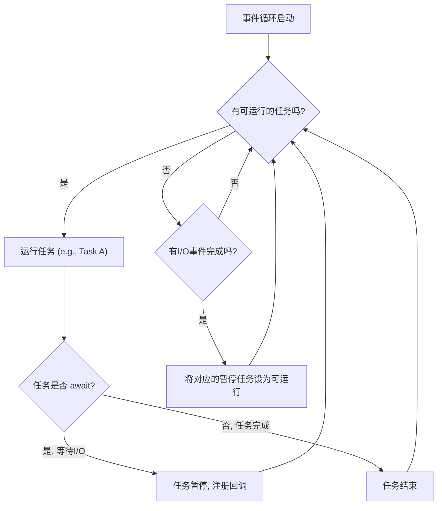

我们已经探索了使用线程和进程进行并发编程的强大能力，并通过 `concurrent.futures` 学习了如何以更简洁的方式管理它们。然而，对于需要处理成千上万个网络连接等超高并发的 I/O 密集型场景，线程和进程的资源开销（内存、上下文切换）可能会成为瓶颈。

为了解决这个问题，Python 引入了一种全新的、更为轻量级的并发模型：**异步编程**。现在，让我们进入现代 Python 并发的核心——`asyncio`。

## 8.3 现代异步编程：asyncio 核心

### 🎯 核心概念

`asyncio` 是一个使用 `async`/`await` 语法编写**单线程并发**代码的库。它通过一个**事件循环 (Event Loop)** 在多个任务之间进行协作式切换，让程序在等待 I/O 操作（如网络请求、数据库查询）时能去执行其他任务，从而以极低的资源开销实现极高的并发性能。

### 💡 使用方式

`asyncio` 的编程模型围绕着几个核心关键字和函数构建：

1.  **协程 (Coroutine)**: 通过 `async def` 定义的函数。调用它不会立即执行，而是返回一个协程对象，这像是一个可以被暂停和恢复的特殊函数。
2.  **`await` 关键字**: 用于“调用”另一个协程。当解释器遇到 `await`，它会暂停当前协程的执行，将控制权交还给事件循环，让事件循环去运行其他任务，直到 `await` 等待的操作完成。`await` 只能在 `async def` 函数内部使用。
3.  **事件循环 (Event Loop)**: `asyncio` 的心脏。它是一个调度器，负责运行协程、收集 I/O 事件，并在任务之间切换。
4.  **`asyncio.run(coroutine)`**: 启动异步程序的入口。它会创建一个新的事件循环，运行你传入的顶级协程，并在协程结束后关闭事件循环。

### 📚 Level 1: 基础认知（30秒理解）

让我们用一个简单的“泡茶”和“听歌”的例子来感受 `asyncio`。烧水需要3秒，但CPU在这期间是空闲的。异步编程允许我们在这3秒的等待时间里去做别的事情，比如听歌。

```python
import asyncio
import time

async def boil_water():
    """模拟烧水，这是一个耗时I/O操作"""
    print("开始烧水...")
    await asyncio.sleep(3)  # 使用 asyncio.sleep 模拟非阻塞等待
    print("水烧开了!")
    return "开水"

async def listen_to_music():
    """模拟在等待时做别的事情"""
    print("烧水的同时，开始听音乐...")
    await asyncio.sleep(2)
    print("音乐听完了。")

async def main():
    """主协程，程序的入口"""
    start_time = time.time()

    # 创建任务，让它们可以并发执行
    boil_task = asyncio.create_task(boil_water())
    music_task = asyncio.create_task(listen_to_music())

    # 等待烧水任务完成
    water = await boil_task
    # 也可以等待听音乐任务，但这里我们只关心水
    await music_task 

    end_time = time.time()
    print(f"拿到 {water}，可以泡茶了。")
    print(f"总耗时: {end_time - start_time:.2f} 秒")

# 运行主协程
if __name__ == "__main__":
    asyncio.run(main())

# 预期输出结果:
# 开始烧水...
# 烧水的同时，开始听音乐...
# 音乐听完了。
# 水烧开了!
# 拿到 开水，可以泡茶了。
# 总耗时: 3.01 秒 (而不是 3+2=5 秒)
```

### 📈 Level 2: 核心特性（深入理解）

#### 特性1: 事件循环 - 并发任务的指挥家

事件循环是 `asyncio` 的底层机制，它就像一个乐队指挥，不断地询问：“有谁准备好继续执行了吗？” 当一个协程 `await` 一个操作时，它就相当于告诉指挥：“我需要等一会儿，你先去指挥别人吧。”

下图生动地描绘了事件循环的工作流程：


这个循环不断进行，使得单线程能够高效地处理成百上千个并发任务。我们通常不需要直接操作事件循环，`asyncio.run()` 已经为我们处理好了一切。

#### 特性2: `asyncio.gather` - 并发执行与收集结果

当你有一组需要并发执行的协程，并且想在它们全部完成后统一收集结果时，`asyncio.gather()` 是一个极其方便的工具。它接收任意数量的协程或`Future`对象，并发地运行它们，并返回一个包含所有结果的列表（结果的顺序与输入协程的顺序一致）。

```python
import asyncio
import time

async def download_chapter(chapter_num):
    """模拟下载小说章节，耗时随机"""
    delay = chapter_num * 0.5
    print(f"开始下载第 {chapter_num} 章...")
    await asyncio.sleep(delay)
    result = f"第 {chapter_num} 章内容"
    print(f"✅ 第 {chapter_num} 章下载完成！")
    return result

async def main():
    start_time = time.time()
    
    # 使用 gather 并发下载第1, 2, 3章
    chapters_to_download = [
        download_chapter(1),
        download_chapter(2),
        download_chapter(3)
    ]
    
    print("--- 使用 gather 并发下载 ---")
    results = await asyncio.gather(*chapters_to_download)
    
    end_time = time.time()
    
    print("\n--- 所有章节已下载 ---")
    print(results)
    # 最长的任务是下载第3章，耗时3*0.5=1.5秒，所以总耗时约1.5秒
    print(f"总耗时: {end_time - start_time:.2f} 秒")

if __name__ == "__main__":
    asyncio.run(main())

# 预期输出结果 (下载完成的顺序可能不同，但最终结果顺序是固定的):
# --- 使用 gather 并发下载 ---
# 开始下载第 1 章...
# 开始下载第 2 章...
# 开始下载第 3 章...
# ✅ 第 1 章下载完成！
# ✅ 第 2 章下载完成！
# ✅ 第 3 章下载完成！
# 
# --- 所有章节已下载 ---
# ['第 1 章内容', '第 2 章内容', '第 3 章内容']
# 总耗时: 1.51 秒
```

### 🔍 Level 3: 对比学习（避免陷阱）

**陷阱：在协程中执行阻塞操作，冻结事件循环**

这是 `asyncio` 编程中最致命的错误。如果在协程中使用了传统的阻塞函数（如 `time.sleep()`, `requests.get()`)，它会冻结整个事件循环，导致所有并发任务都停滞不前，`asyncio` 的优势荡然无存。

```python
import asyncio
import time

async def correct_coroutine():
    """正确的异步操作"""
    print("✅ 正确的协程开始，将让出控制权。")
    await asyncio.sleep(1) # 非阻塞等待
    print("✅ 正确的协程结束。")

async def blocking_coroutine():
    """错误的阻塞操作"""
    print("❌ 错误的协程开始，将冻结事件循环！")
    time.sleep(1) # 阻塞等待，整个程序卡住
    print("❌ 错误的协程结束。")

async def main_demonstration():
    start_time = time.time()
    # 同时运行两个协程
    await asyncio.gather(correct_coroutine(), blocking_coroutine())
    end_time = time.time()
    print(f"总耗时: {end_time - start_time:.2f} 秒")


# === 错误用法 ===
# ❌ 两个任务本应并发，总耗时约1秒，但由于阻塞，总耗时变成了2秒。
print("--- 演示包含阻塞操作的错误用法 ---")
# 解释为什么是错的:
# blocking_coroutine 中的 time.sleep(1) 阻塞了整个线程。
# 在这1秒内，事件循环完全停止，无法调度 correct_coroutine，
# 即使 correct_coroutine 已经准备好运行。
# 必须等 time.sleep(1) 结束后，事件循环才能继续，
# 结果导致并发变成了串行。
asyncio.run(main_demonstration())

print("\n--- 正确用法：所有协程都是非阻塞的 ---")
# === 正确用法 ===
# ✅ 两个任务都使用 await asyncio.sleep，它们将并发执行，总耗时约1秒。
async def main_correct():
    start_time = time.time()
    await asyncio.gather(correct_coroutine(), correct_coroutine())
    end_time = time.time()
    print(f"总耗时: {end_time - start_time:.2f} 秒")

# 解释为什么这样是对的:
# 当第一个 correct_coroutine 调用 await asyncio.sleep(1) 时，它会暂停并通知事件循环，
# “我需要等待1秒，你可以去做别的事”。事件循环立即切换到第二个
# correct_coroutine，它也做了同样的事情。事件循环可以自由调度，
# 两个1秒的等待是重叠的，因此总时间接近1秒。
asyncio.run(main_correct())

# 预期输出结果:
# --- 演示包含阻塞操作的错误用法 ---
# ✅ 正确的协程开始，将让出控制权。
# ❌ 错误的协程开始，将冻结事件循环！
# (程序会在这里卡住1秒)
# ❌ 错误的协程结束。
# ✅ 正确的协程结束。
# 总耗时: 2.01 秒
#
# --- 正确用法：所有协程都是非阻塞的 ---
# ✅ 正确的协程开始，将让出控制权。
# ✅ 正确的协程开始，将让出控制权。
# ✅ 正确的协程结束。
# ✅ 正确的协程结束。
# 总耗时: 1.01 秒
```

### 🚀 Level 4: 实战应用（真实场景）

**场景：** 🤖 AI 助手的多任务并行处理系统

我们的 AI 助手需要同时执行多个任务来响应用户的请求：“嘿，AI，帮我查今天的天气，设置一个5秒后的提醒，再讲个笑话。” AI 必须并发处理这些任务，并在每个任务完成时立即给出反馈。

```python
import asyncio
import random
import datetime

async def get_weather():
    """模拟从API获取天气信息"""
    print("🤖 AI: 好的，正在查询天气...")
    await asyncio.sleep(1.5) # 模拟网络延迟
    return "今天天气晴朗，温度25摄氏度。"

async def set_reminder(seconds):
    """设置一个未来的提醒"""
    print(f"🤖 AI: 没问题，将在 {seconds} 秒后提醒您。")
    await asyncio.sleep(seconds)
    return f"⏰ 提醒时间到！({datetime.datetime.now().strftime('%H:%M:%S')})"

async def tell_joke():
    """从笑话库中随机挑选一个笑话"""
    print("🤖 AI: 让我给您讲个笑话...")
    jokes = [
        "为什么程序员总是分不清万圣节和圣诞节？因为 OCT 31 == DEC 25！",
        "一个程序员走进一家酒吧，要了一杯 'SQL injection'，然后指着两个顾客说：'从他们那儿给我续杯'。",
        "世界上有两种人：一种是懂二进制的，另一种是不懂的。"
    ]
    await asyncio.sleep(1) # 模拟思考时间
    return f"😄 笑话时间: {random.choice(jokes)}"

async def main():
    print(f"用户: 嘿，AI，帮我查今天的天气，设置一个3秒后的提醒，再讲个笑话。 ({datetime.datetime.now().strftime('%H:%M:%S')})")
    
    # 创建所有任务
    tasks = [
        asyncio.create_task(get_weather(), name="天气查询"),
        asyncio.create_task(set_reminder(3), name="设置提醒"),
        asyncio.create_task(tell_joke(), name="讲笑话")
    ]

    print("\n--- AI 开始并发处理 ---\n")

    # 使用 as_completed 在任务完成时立即处理
    for future in asyncio.as_completed(tasks):
        result = await future
        task_name = future.get_name() # Python 3.8+
        print(f"✅ AI 完成了 [{task_name}]: {result}")
        
    print("\n--- AI: 所有任务都已完成！ ---")

if __name__ == "__main__":
    asyncio.run(main())

# 预期输出结果 (完成顺序取决于它们的耗时):
# 用户: 嘿，AI，帮我查今天的天气，设置一个3秒后的提醒，再讲个笑话。 (14:30:00)
#
# --- AI 开始并发处理 ---
#
# 🤖 AI: 好的，正在查询天气...
# 🤖 AI: 没问题，将在 3 秒后提醒您。
# 🤖 AI: 让我给您讲个笑话...
# ✅ AI 完成了 [讲笑话]: 😄 笑话时间: 为什么程序员总是分不清万圣节和圣诞节？因为 OCT 31 == DEC 25！
# ✅ AI 完成了 [天气查询]: 今天天气晴朗，温度25摄氏度。
# ✅ AI 完成了 [设置提醒]: ⏰ 提醒时间到！(14:30:03)
#
# --- AI: 所有任务都已完成！ ---
```

### 💡 记忆要点

- **要点1**: **`async` 和 `await` 是天生一对**。`async def` 定义了一个“可暂停”的函数（协程），而 `await` 则是暂停点，它将控制权交还给事件循环。你只能在 `async` 函数内部使用 `await`。
- **要点2**: **杜绝阻塞，拥抱异步**。`asyncio` 的性能源泉在于其非阻塞特性。务必使用异步库（如 `aiohttp` 替代 `requests`，`asyncpg` 替代 `psycopg2`）或 `asyncio.sleep` 替代 `time.sleep`，否则你的异步代码会退化为缓慢的串行代码。
- **要点3**: **并发非并行，单线程是关键**。`asyncio` 在单个线程内实现并发，通过任务切换来利用I/O等待时间。它不能利用多核CPU进行计算密集型任务的并行处理，那仍然是 `multiprocessing` 的领域。