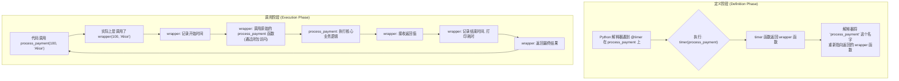
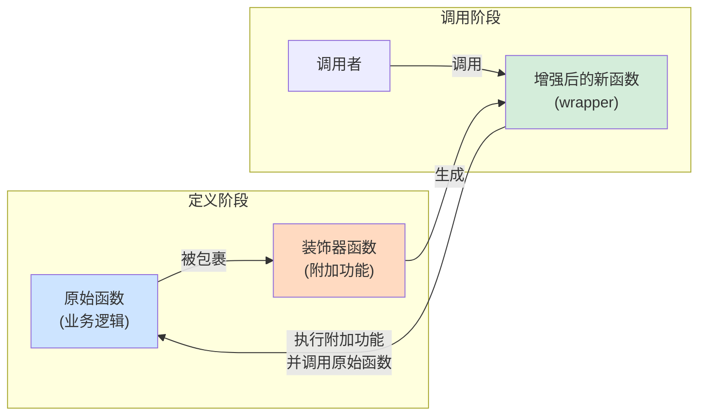

好的，总建筑师。我们已经掌握了如何高效地创建数据（推导式）和处理数据流（生成器）。现在，让我们将目光从“数据”转向“行为”本身。在复杂的软件系统中，我们常常需要在不修改核心业务逻辑的前提下，为其附加一些通用功能，如日志记录、性能监控或权限校验。为了应对这一挑战，Python 提供了一种极为强大且优雅的元编程工具——**装饰器 (Decorator)**。

***

### 🎯 核心目标 (Core Goal)
本节的核心目标是让你深入理解装饰器（Decorator）的本质，并学会如何编写和使用它。通过本节学习，你将能够**在不修改任何函数源代码的情况下，为已存在的函数动态地增加额外的功能**。这不仅能让你的代码更整洁、更易于维护，还能极大地提升代码的复用性，是通往高级 Python 编程的关键一步。

### 🔑 核心概念与基础 (Core Concepts & Foundations)
装饰器的魔法建立在 Python 两个核心特性之上：**函数是一等公民**和**闭包**。让我们逐一揭开它们的面纱。

**1. 基础：函数是一等公民 (Functions as First-Class Citizens)**

在 Python 中，函数与其他数据类型（如整数、字符串）地位相同。这意味着函数可以：
-   被赋值给一个变量。
-   作为参数传递给另一个函数。
-   作为另一个函数的返回值。

```python
def greet(name):
    return f"Hello, {name}!"

# 1. 赋值给变量
say_hello = greet
print(say_hello("Alice"))  # 输出: Hello, Alice!

# 2. 作为参数传递
def process_greeting(greeter_func, person_name):
    print(greeter_func(person_name))

process_greeting(greet, "Bob") # 输出: Hello, Bob!

# 3. 作为返回值
def get_greeter():
    return greet

greeter = get_greeter()
print(greeter("Charlie")) # 输出: Hello, Charlie!
```
这个特性是实现装饰器的前提。

**2. 核心：闭包 (Closure)**

闭包是指一个函数（内部函数）记住了其创建时的外部作用域（外部函数）中的变量，即使外部函数已经执行完毕。

```python
def outer_function(msg):
    # msg 是一个“自由变量”，被内部函数引用
    message = msg

    def inner_function():
        # inner_function 捕获并“记住”了 message 的值
        print(message)

    return inner_function # 返回内部函数，形成闭包

# 调用外部函数，它返回了内部函数
hello_func = outer_function("Hello")
world_func = outer_function("World")

# 此时 outer_function 已经执行完毕
# 但 hello_func 和 world_func 仍然“记得”它们各自的 message
hello_func() # 输出: Hello
world_func() # 输出: World
```
装饰器正是利用闭包来“包裹”并“记住”我们想要增强的那个函数。

**3. 装饰器的语法糖 (`@`)**

装饰器的本质是一个接收函数作为参数并返回一个新函数的函数。`@` 符号是一种简洁的语法糖。

```python
def my_decorator(func):
    def wrapper():
        print("Something is happening before the function is called.")
        func()
        print("Something is happening after the function is called.")
    return wrapper

@my_decorator
def say_whee():
    print("Whee!")

# 上面的 @my_decorator 写法完全等价于下面的手动赋值：
# say_whee = my_decorator(say_whee)

say_whee()
```
-   `my_decorator`: 这是装饰器函数。它接收一个函数 `func`作为参数。
-   `wrapper`: 这是内部函数（一个闭包），它执行额外的代码，并在中间调用原始函数 `func`。
-   `return wrapper`: 装饰器返回这个包装好的新函数。
-   `@my_decorator`: Python 解释器看到这个语法时，会自动将紧随其后的函数 `say_whee` 作为参数传递给 `my_decorator`，然后将返回的 `wrapper` 函数重新赋值给 `say_whee`。

### 💻 基础用法 (Basic Usage)
让我们通过编写两个最常见的装饰器来实践一下：日志装饰器和计时装饰器。

为了让我们的装饰器更通用，能够处理带任意参数的函数，我们需要在 `wrapper` 函数中使用 `*args` 和 `**kwargs`。

**1. 编写一个日志装饰器 (`@log_function_call`)**

这个装饰器会在函数执行前后打印日志信息，包括函数名和传入的参数。

```python
import functools

def log_function_call(func):
    @functools.wraps(func) # 最佳实践：保留原函数元信息
    def wrapper(*args, **kwargs):
        print(f"Calling function '{func.__name__}' with args: {args}, kwargs: {kwargs}")
        result = func(*args, **kwargs)
        print(f"Function '{func.__name__}' returned: {result}")
        return result
    return wrapper

@log_function_call
def add(a, b):
    """这是一个简单的加法函数"""
    return a + b

@log_function_call
def greet(name, greeting="Hello"):
    return f"{greeting}, {name}!"

add(2, 3)
print("-" * 20)
greet("World", greeting="Hi")
```
输出：
```
Calling function 'add' with args: (2, 3), kwargs: {}
Function 'add' returned: 5
--------------------
Calling function 'greet' with args: ('World',), kwargs: {'greeting': 'Hi'}
Function 'greet' returned: Hi, World!
```

**2. 编写一个计时装饰器 (`@timer`)**

这个装饰器用于测量并打印一个函数的执行时间。

```python
import time
import functools

def timer(func):
    @functools.wraps(func)
    def wrapper(*args, **kwargs):
        start_time = time.perf_counter()
        result = func(*args, **kwargs)
        end_time = time.perf_counter()
        run_time = end_time - start_time
        print(f"Function '{func.__name__}' executed in {run_time:.4f} seconds")
        return result
    return wrapper

@timer
def simulate_heavy_task(seconds):
    """模拟一个耗时任务"""
    time.sleep(seconds)
    return "Task finished"

simulate_heavy_task(1.5)
```
输出：
```
Function 'simulate_heavy_task' executed in 1.5012 seconds
```

### 🧠 深度解析 (In-depth Analysis)

装饰器的核心价值在于其**关注点分离 (Separation of Concerns)** 的能力。它允许我们将核心业务逻辑与横切关注点（cross-cutting concerns）分离开。

**关注点分离 (Separation of Concerns)**

-   **核心业务逻辑**: 函数本身要完成的主要任务。例如，`add` 函数的核心是执行加法，一个 `process_payment` 函数的核心是处理支付流程。
-   **横切关注点**: 那些会影响到系统中多个模块的功能。例如：日志记录、性能监控、权限校验、事务管理、缓存等。

**没有装饰器的情况 (逻辑耦合):**
```python
import time

def process_payment(amount, user):
    # --- 横切关注点：日志 ---
    print(f"Starting payment process for user '{user}' with amount {amount}...")
    # --- 横切关注点：计时 ---
    start_time = time.perf_counter()
    
    # === 核心业务逻辑 ===
    print("Contacting payment gateway...")
    time.sleep(1) # 模拟网络延迟
    print("Payment successful.")
    # =====================
    
    # --- 横切关注点：计时 ---
    end_time = time.perf_counter()
    print(f"Payment process took {end_time - start_time:.4f}s")
    # --- 横切关注点：日志 ---
    print("Payment process finished.")
    
    return {"status": "success"}

process_payment(100, "Alice")
```
这段代码的问题是：核心逻辑和附加功能（日志、计时）混杂在一起，难以阅读和维护。如果想给另一个函数也加上日志和计时，就必须复制代码。

**使用装饰器 (逻辑解耦):**
```python
# 装饰器已在上面定义 (log_function_call, timer)

@log_function_call
@timer
def process_payment(amount, user):
    """核心业务逻辑：处理支付"""
    print("Contacting payment gateway...")
    time.sleep(1)
    print("Payment successful.")
    return {"status": "success"}

process_payment(100, "Alice")
```
现在，`process_payment` 函数非常纯粹，只关心支付逻辑。日志和计时功能通过装饰器“附加”了上去，实现了代码的整洁和高度复用。

**装饰器的工作流程 (Decorator Workflow)**

下图清晰地展示了 `@` 语法糖背后的实际执行步骤：



### ⚠️ 常见陷阱与最佳实践 (Common Pitfalls & Best Practices)

1.  **陷阱：丢失原函数的元信息 (Metadata)**
    直接使用简单的 `wrapper` 会导致原函数的名称 (`__name__`)、文档字符串 (`__doc__`) 等元信息丢失，它们会被 `wrapper` 函数的信息所取代。这会给调试和自省带来麻烦。

    ```python
    def naive_decorator(func):
        def wrapper():
            return func()
        return wrapper

    @naive_decorator
    def my_function():
        """This is my function's docstring."""
        pass

    print(my_function.__name__)    # 输出: wrapper (不是 my_function)
    print(my_function.__doc__)     # 输出: None (文档字符串丢失)
    ```

    **最佳实践**: 始终使用 `functools` 模块中的 `@wraps` 装饰器来装饰你的 `wrapper` 函数。它能将原函数的元信息复制到 `wrapper` 函数上，保持函数签名的完整性。我们前面的例子中已经这样做了。

2.  **陷阱：装饰器栈的执行顺序**
    当多个装饰器应用在一个函数上时，它们的执行顺序是**从下到上**（或从里到外）应用的。

    ```python
    @decorator_A  # 第二个应用
    @decorator_B  # 第一个应用
    def my_func():
        print("Executing my_func")
    
    # 这等价于: my_func = decorator_A(decorator_B(my_func))
    ```
    调用 `my_func()` 时，执行流会像洋葱一样：先进入 `decorator_A` 的 `wrapper`，然后进入 `decorator_B` 的 `wrapper`，执行 `my_func`，再依次退出 `decorator_B` 和 `decorator_A` 的 `wrapper`。

### 🚀 实战演练 (Practical Exercise)

**场景**: 你在开发一个简单的 Web API，某些接口需要用户登录后才能访问。你需要创建一个 `@require_login` 装饰器来保护这些接口。

**任务**: 实现 `@require_login` 装饰器。为了模拟，我们假设有一个全局的会话字典 `session`，如果 `session.get('user')` 存在，则视为已登录。

**你的解答**:
```python
import functools

# 模拟全局会话
session = {}

def require_login(func):
    """
    一个检查用户是否登录的装饰器。
    如果未登录，返回错误信息；如果已登录，则执行原函数。
    """
    @functools.wraps(func)
    def wrapper(*args, **kwargs):
        if session.get('user'):
            print(f"User '{session.get('user')}' is authenticated. Accessing function '{func.__name__}'.")
            return func(*args, **kwargs)
        else:
            print(f"Authentication failed! User must be logged in to access '{func.__name__}'.")
            return {"error": "Authentication required"}, 401 # 模拟返回 API 错误
    return wrapper

@require_login
def view_profile():
    """显示用户个人资料页面 (需要登录)"""
    return {"data": f"Welcome to your profile, {session.get('user')}!"}

# --- 测试用例 ---
print("--- 1. 尝试未登录访问 ---")
session.clear() # 确保未登录
response, status_code = view_profile()
print(f"Response: {response}, Status Code: {status_code}")


print("\n--- 2. 尝试登录后访问 ---")
session['user'] = 'Alice' # 模拟登录
response = view_profile()
print(f"Response: {response}")
```
**预期输出**:
```
--- 1. 尝试未登录访问 ---
Authentication failed! User must be logged in to access 'view_profile'.
Response: {'error': 'Authentication required'}, Status Code: 401

--- 2. 尝试登录后访问 ---
User 'Alice' is authenticated. Accessing function 'view_profile'.
Response: {'data': 'Welcome to your profile, Alice!'}
```
这个练习完美地展示了装饰器在实际应用中的强大威力，它以一种非侵入式的方式为业务逻辑增加了权限控制。

### 💡 总结 (Summary)
装饰器是 Python 中一种功能强大的设计模式，它允许你动态地修改函数或类的行为，是元编程的核心工具之一。

-   **核心思想**: 装饰器是一个可调用对象（通常是函数），它接收一个函数作为输入，并返回一个新的函数作为输出。
-   **基石**: 构建于“函数是一等公民”和“闭包”这两个语言特性之上。
-   **语法糖**: `@` 符号让装饰器的使用变得直观和优雅，`@deco` 等同于 `func = deco(func)`。
-   **核心价值**: 实现**关注点分离**，将业务逻辑与日志、缓存、认证等横切关注点解耦，使代码更清晰、更易于维护和复用。
-   **最佳实践**: 永远记得使用 `@functools.wraps` 来保留被装饰函数的原始元信息。

掌握装饰器，意味着你能够编写出更具扩展性和维护性的框架级代码。请记住以下心智模型：



现在，你已经解锁了 Python 中一项极具表现力的功能。在你的代码中，寻找那些可以被抽象为横切关注点的重复模式，并用装饰器来优雅地重构它们吧！