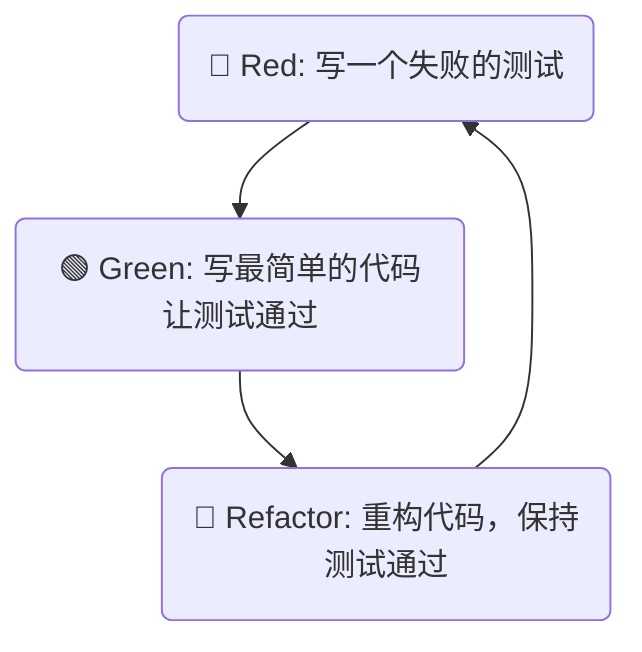

好的，总建筑师。作为您的 Python 技能金字塔专家和技术教育者，我将严格按照您提供的“教学设计图”，将关于 `pytest` 的知识点转化为一篇高质量的 Markdown 教程。

---

### 🎯 核心目标 (Core Goal)

本节的核心目标是让你深刻理解**自动化测试对于保障软件质量的至关重要性**，并掌握使用业界主流的 `pytest` 框架来编写和运行基础的单元测试。学完本节，你将能够为自己的函数编写测试用例，并通过自动化测试来验证代码的正确性，从而迈出构建健壮、可靠程序的关键一步。

### 🔑 核心语法与参数 (Core Syntax & Parameters)

`pytest` 的设计哲学是简洁和约定优于配置。入门时，你只需要掌握以下几个核心约定和命令。

1.  **安装 (Installation)**:
    通过 pip 安装 `pytest` 库。
    ```bash
    pip install pytest
    ```

2.  **文件和函数命名约定 (Discovery Convention)**:
    `pytest` 会自动发现需要执行的测试，无需任何配置，只要你遵循以下命名规则：
    *   **测试文件**: 文件名必须以 `test_` 开头或以 `_test.py` 结尾 (例如 `test_calculator.py` 或 `calculator_test.py`)。
    *   **测试函数**: 在测试文件中，所有以 `test_` 开头的函数都会被识别为测试用例 (例如 `def test_addition():`)。

3.  **断言语句 (Assertion)**:
    `pytest` 使用 Python 内置的 `assert` 关键字来验证结果是否符合预期。它的表达力非常强，且失败时能提供详细的上下文信息。
    ```python
    assert <表达式>  # 如果表达式为 False，测试失败
    assert <实际结果> == <预期结果>
    assert <某个值> in <某个集合>
    ```

4.  **运行命令 (Execution Command)**:
    在你的项目根目录下，直接运行 `pytest` 命令即可。
    ```bash
    # 运行所有发现的测试
    pytest

    # 提供更详细的输出信息 (-v for verbose)
    pytest -v

    # 遇到第一个失败就停止执行 (-x for exit first)
    pytest -x
    ```

### 💻 基础用法 (Basic Usage)

让我们通过一个完整的“编码-测试-运行”流程来体验 `pytest` 的基础用法。

**场景**: 我们有一个简单的计算器模块 `calculator.py`，其中包含一个加法函数。

**第一步：创建要测试的代码**

在你的项目文件夹中，创建一个名为 `calculator.py` 的文件：

```python
# calculator.py

def add(a: int, b: int) -> int:
    """计算两个整数的和"""
    return a + b
```

**第二步：编写测试用例**

在同一文件夹下，创建一个名为 `test_calculator.py` 的文件，并编写测试函数：

```python
# test_calculator.py
from calculator import add

def test_add_positive_numbers():
    """测试两个正数相加"""
    assert add(2, 3) == 5

def test_add_negative_numbers():
    """测试两个负数相加"""
    assert add(-1, -1) == -2

def test_add_positive_and_negative():
    """测试一正一负相加"""
    assert add(5, -3) == 2

# 让我们故意写一个会失败的测试，看看会发生什么
def test_add_fails_intentionally():
    """这是一个故意失败的测试，用于观察报告"""
    assert add(2, 2) == 5 
```

**第三步：运行测试并解读报告**

打开终端，确保你在项目文件夹的根目录下，然后运行 `pytest`：

```bash
pytest
```

**成功与失败的报告解读:**

`pytest` 会输出非常清晰的报告。

*   **成功的测试** 会用一个绿色的 `.` 表示。
*   **失败的测试** 会用一个红色的 `F` 表示。

你将看到类似下面的输出：

```
============================= test session starts ==============================
...
collected 4 items

test_calculator.py ...F                                                  [100%]

=================================== FAILURES ===================================
________________________ test_add_fails_intentionally ________________________

    def test_add_fails_intentionally():
        """这是一个故意失败的测试，用于观察报告"""
>       assert add(2, 2) == 5
E       assert 4 == 5
E        +  where 4 = add(2, 2)

test_calculator.py:18: AssertionError
=========================== short test summary info ============================
FAILED test_calculator.py::test_add_fails_intentionally - assert 4 == 5
========================= 1 failed, 3 passed in 0.01s ==========================
```

**报告解读**:
*   `collected 4 items`: `pytest` 发现了 4 个测试用例。
*   `...F`: 前 3 个通过 (`.`)，第 4 个失败 (`F`)。
*   **FAILURES** 部分:
    *   明确指出了哪个文件 (`test_calculator.py`) 和哪个函数 (`test_add_fails_intentionally`) 失败了。
    *   `> assert add(2, 2) == 5`: 显示了失败的断言代码行。
    *   `E assert 4 == 5`: **这是 `pytest` 的强大之处**。它智能地展示了 `assert` 左边的表达式 (`add(2, 2)`) 的实际计算结果是 `4`，而你期望的是 `5`。这使得调试变得异常简单。
*   `1 failed, 3 passed`: 最后的总结信息。

### 🧠 深度解析 (In-depth Analysis)

**1. 为什么选择 `pytest` 而不是 `assert` 手动调试？**

虽然你可以手动在代码里写 `print` 和 `assert` 来调试，但 `pytest` 将其系统化、自动化，并带来了巨大优势：
*   **自动化**: 一条命令运行所有测试，无需手动执行每个脚本。
*   **可重复性**: 确保代码修改后，旧的功能没有被破坏（这被称为“回归测试”）。
*   **清晰的报告**: 失败时提供精确的上下文，远胜于一个简单的 `AssertionError`。
*   **代码分离**: 测试代码与业务逻辑代码分离，保持项目整洁。

**2. 测试驱动开发 (Test-Driven Development, TDD) 的基本思想**

`pytest` 是实践 TDD 的绝佳工具。TDD 是一种颠覆传统开发流程的思想：**先写测试，再写实现代码**。它遵循一个简单的“红-绿-重构”循环。



*   **Red (红)**: 首先，为即将开发的新功能编写一个测试用例。因为功能还没实现，所以运行测试必然会失败，报告是红色的。
*   **Green (绿)**: 接下来，编写最少的、最直接的代码，仅仅为了让这个刚刚失败的测试通过。此时再运行测试，报告变为绿色。
*   **Refactor (重构)**: 现在测试已经通过，你可以安心地重构、优化代码结构，不必担心会破坏功能，因为测试会时刻保护你。只要重构后所有测试依然是绿色的，就证明重构是安全的。

TDD 并非只是测试，它是一种驱动代码设计和保证质量的开发方法论。它能让你在编码前思考清楚函数的功能、输入和预期输出，从而写出更清晰、更可靠的代码。

### ⚠️ 常见陷阱与最佳实践 (Common Pitfalls & Best Practices)

1.  **陷阱：命名不规范导致测试未被执行**
    *   **问题**: 新手最常犯的错误是测试文件或函数命名不符合 `pytest` 的约定（如 `my_test.py` 写成了 `mytest.py`，`def test_add` 写成了 `def add_test`）。这会导致 `pytest` 安静地跳过你的测试，给你一种“所有测试都通过”的假象。
    *   **实践**: 严格遵守 `test_*.py` / `*_test.py` 和 `test_*` 的命名规则。运行 `pytest -v` 时，注意看 `collected X items`，确认 `X` 的数量是否与你编写的测试用例数量一致。

2.  **陷阱：测试用例之间存在依赖**
    *   **问题**: 一个测试的成功依赖于另一个测试先执行并修改了某个全局状态。这是非常危险的，因为 `pytest` 不保证测试的执行顺序。
    *   **实践**: **保持测试的独立性 (Isolation)**。每个测试函数都应该能独立运行，不依赖于其他测试。测试所需的数据和状态应该在测试函数内部创建。

3.  **最佳实践：测试命名要清晰达意**
    *   一个好的测试函数名应该能清晰地描述它在测试什么场景。
    *   **不好**: `def test_1():`
    *   **好**: `def test_add_function_with_two_positive_integers():`

4.  **最佳实践：一个测试只做一件事**
    *   一个测试函数应该只验证一个具体的行为或逻辑点。如果一个函数需要测试多种场景（如正常输入、边界值、异常输入），应该为每个场景编写独立的测试函数。这样当测试失败时，你能立刻定位到是哪个场景出了问题。

### 🚀 实战演练 (Practical Exercise)

**案例研究：编写一个简单的邮件地址验证函数及其测试**

假设我们需要一个函数 `is_valid_email` 来检查一个字符串是否是合法的电子邮件格式。

**1. 任务目标**
为下面的 `validators.py` 文件编写一套完整的测试用例，覆盖多种场景。

**2. 待测试的代码**
创建一个 `validators.py` 文件：

```python
# validators.py
import re

def is_valid_email(email: str) -> bool:
    """
    一个非常基础的邮件格式验证器。
    - 必须包含一个 '@' 符号。
    - '@' 符号后必须有点 '.'。
    - '@' 符号不能是第一个字符。
    - '.' 符号不能是最后一个字符。
    """
    if not isinstance(email, str):
        return False
    # 使用正则表达式会更健壮，但这里为了教学目的，使用简单逻辑
    if email.count('@') != 1:
        return False
    if email.startswith('@') or email.endswith('.'):
        return False
    
    local_part, domain_part = email.split('@')
    if '.' not in domain_part:
        return False

    return True
```

**3. 你的任务**
创建 `test_validators.py` 文件，并思考需要测试哪些情况？至少应包括：
*   一个完全合法的邮件地址。
*   一个没有 `@` 的字符串。
*   一个没有 `.` 在域名部分的字符串。
*   一个以 `@` 开头的字符串。
*   一个非字符串类型的输入。

**4. 参考解答**

```python
# test_validators.py
from validators import is_valid_email

def test_valid_email():
    """测试一个标准的、合法的邮件地址"""
    assert is_valid_email("test.user@example.com") is True

def test_missing_at_symbol():
    """测试缺少 @ 符号的场景"""
    assert is_valid_email("test.userexample.com") is False

def test_missing_dot_in_domain():
    """测试域名部分缺少 . 的场景"""
    assert is_valid_email("test@examplecom") is False

def test_email_starts_with_at():
    """测试以 @ 开头的场景"""
    assert is_valid_email("@example.com") is False
    
def test_domain_ends_with_dot():
    """测试以 . 结尾的场景"""
    assert is_valid_email("test@example.com.") is False

def test_multiple_at_symbols():
    """测试包含多个 @ 的场景"""
    assert is_valid_email("test@user@example.com") is False

def test_non_string_input():
    """测试输入为非字符串（如整数）的场景"""
    assert is_valid_email(12345) is False
    
def test_none_input():
    """测试输入为 None 的场景"""
    assert is_valid_email(None) is False
```

现在，在你的终端运行 `pytest`，你应该能看到所有 8 个测试都通过了！这套测试就成为了 `is_valid_email` 函数行为的“安全网”。

### 💡 总结 (Summary)

在本节中，我们从零开始，踏入了 `pytest` 单元测试的世界。你已经掌握了保障代码质量的核心武器。

**关键回顾**:
*   **测试的重要性**: 它是代码质量的守护者，是安全重构的基石，也是最好的文档之一。
*   **`pytest` 核心工作流**:
    1.  `pip install pytest`
    2.  创建 `test_*.py` 测试文件。
    3.  编写 `test_*` 测试函数。
    4.  在函数内部使用 `assert` 进行断言。
    5.  在终端运行 `pytest` 命令。
*   **TDD 思想**: “红-绿-重构”的循环是一种强大的开发模式，它鼓励你面向接口而非实现来编程。
*   **核心原则**: 保持测试的**独立、小巧、命名清晰**，是编写高质量测试的关键。

你现在具备了为任何 Python 函数编写基础测试的能力。随着你在技能金字塔上继续攀登，我们还会学习 `pytest` 更高级的特性，如 Fixtures（测试夹具）、参数化测试、Mocking（模拟）等，它们将让你的测试能力变得更加强大和高效。