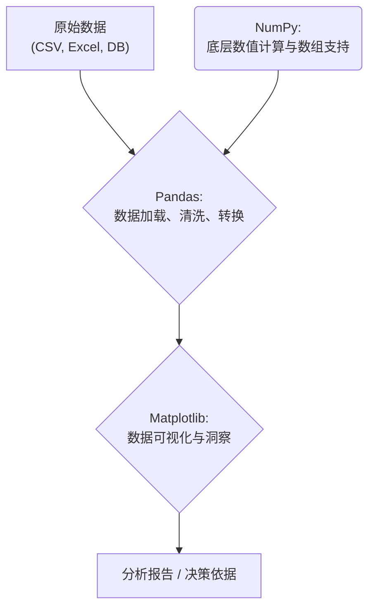

好的，总建筑师。我将严格遵循您的“教学设计图”，以世界级技术教育者的专业水准，为您生成这篇关于 Python 领域入门的 Markdown 教程。

---

### 🎯 核心目标 (Core Goal)
本章的核心目标是为你绘制出 Python 生态中最主流的两个职业发展路径图：**Web 开发**与**数据分析**。你将初步了解这两个领域的明星框架和库，理解它们的核心思想与应用场景，并获得清晰的指引，从而能够根据个人兴趣和职业规划，选择一个方向进行深入探索。这并非一次深入的技术教学，而是一次关键的“路标”指引。

### 🔑 核心语法与参数 (Core Syntax & Parameters)
在领域入门阶段，“语法”指的是各个领域的核心构建模块，即关键的框架与库。了解它们的名称和定位是第一步。

**1. Web 开发方向 (Web Development)**
- **Flask**: 一个轻量级的 “微框架” (Microframework)。
  - `核心思想`: 保持核心简单，易于扩展。不强制规定项目结构或依赖，给予开发者极大的自由度。
  - `代表模块/类`: `Flask`, `request`, `render_template`
- **Django**: 一个功能强大的 “全家桶” (Batteries-included) 框架。
  - `核心思想`: “不要重复造轮子”。内置了构建大型 Web 应用所需的大部分组件，如 ORM（对象关系映射）、后台管理、表单处理等。
  - `代表模块/类`: `models`, `views`, `urls`, `admin`

**2. 数据分析方向 (Data Analysis)**
- **NumPy (Numerical Python)**: Python 科学计算的基础包。
  - `核心思想`: 提供一个高效的多维数组对象 (`ndarray`)，以及对这些数组进行操作的函数。它是许多其他数据科学库的底层依赖。
  - `代表模块/类`: `numpy.array`, `numpy.arange`, `numpy.linalg`
- **Pandas**: 建立在 NumPy 之上的数据分析和操作库。
  - `核心思想`: 提供两种核心数据结构——`Series`（一维）和 `DataFrame`（二维），让处理结构化（表格型）数据变得直观而高效。
  - `代表模块/类`: `pandas.DataFrame`, `pandas.Series`, `pandas.read_csv`
- **Matplotlib**: 一个功能强大的数据可视化库。
  - `核心思想`: 能够创建各种静态、动态和交互式的图表。它是 Python 数据可视化的基石。
  - `代表模块/类`: `matplotlib.pyplot` (通常简写为 `plt`)

### 💻 基础用法 (Basic Usage)
为了让你对这两个领域有更直观的感受，我们来看一下它们各自“Hello, World!”级别的代码是什么样的。

**1. Web 开发: 使用 Flask 启动一个最简单的 Web 服务器**
这段代码创建了一个监听根路径 (`/`) 的 Web 应用。当用户访问这个地址时，会返回 "Hello, Web World!"。

```python
# 安装: pip install Flask
from flask import Flask

# 创建一个 Flask 应用实例
app = Flask(__name__)

# 定义一个路由：当访问网站根目录时，执行下面的函数
@app.route('/')
def hello_world():
    return 'Hello, Web World!'

# 如果这个脚本是主程序，则启动服务器
if __name__ == '__main__':
    app.run(debug=True)
```

**2. 数据分析: 使用 Pandas 和 Matplotlib 进行简单的数据处理与可视化**
这段代码创建了一个简单的数据表，计算了其中一列的平均值，并绘制了另一列的条形图。

```python
# 安装: pip install pandas matplotlib
import pandas as pd
import matplotlib.pyplot as plt

# 1. 创建一个 DataFrame (类似电子表格)
data = {
    'city': ['Beijing', 'Shanghai', 'Shenzhen', 'Guangzhou'],
    'population_million': [21.5, 24.2, 13.4, 15.3],
    'avg_temp_celsius': [14.0, 15.8, 22.5, 22.0]
}
df = pd.DataFrame(data)

# 2. 进行简单的数据分析
avg_population = df['population_million'].mean()
print(f"Average population: {avg_population:.2f} million")

# 3. 进行数据可视化
df.plot(kind='bar', x='city', y='population_million', title='City Population')
plt.ylabel('Population (Million)')
plt.show()
```

### 🧠 深度解析 (In-depth Analysis)
仅仅了解基础用法是不够的，理解它们背后的设计哲学和生态位差异至关重要。

**模块对比 (Comparison): Flask vs. Django**

| 特性 | Flask (微框架) | Django (全家桶) |
| :--- | :--- | :--- |
| **核心哲学** | 简单、灵活、可插拔 | 约定优于配置、快速开发 |
| **自带组件** | 核心功能极简 (路由、模板) | ORM、Admin后台、表单、认证等 |
| **项目结构** | 开发者自由定义 | 遵循 MVT (Model-View-Template) 架构 |
| **学习曲线** | 陡峭的起点，平缓的后续 | 平缓的起点，陡峭的后续 (组件多) |
| **适用场景** | 小型应用、API服务、需要高度定制的项目 | 大型、复杂的Web应用、需要快速上线的内容管理系统 |

**模块对比 (Comparison): 数据分析三剑客**

这三个库并非竞争关系，而是协作关系，构成了一个强大的数据处理流水线。



- **NumPy** 是地基，提供了高性能的数组运算能力。
- **Pandas** 是建在 NumPy 地基上的大楼，提供了更高级、更易用的 `DataFrame` 结构来组织和分析数据。
- **Matplotlib** 是大楼的“展示厅”，负责将 Pandas 处理好的数据以图表的形式直观地呈现出来。

**技术栈的思维差异**

- **Web 开发** 更多是 **工程思维**：关注请求-响应周期、数据库交互、用户认证、部署、高并发等问题。你是在构建一个为他人服务的、持久运行的系统。
- **数据分析** 更多是 **科学思维**：关注数据获取、模式发现、假设检验、结果解释、模型构建等问题。你是在从数据中提取信息和洞察，以支持决策。

### ⚠️ 常见陷阱与最佳实践 (Common Pitfalls & Best Practices)

1.  **陷阱：选择困难症，试图同时学习所有东西。**
    -   **原因**：两个领域都充满吸引力，初学者容易陷入“哪个更好”的无尽比较中，迟迟不开始行动。
    -   **最佳实践**：**兴趣驱动，快速启动**。问问自己：是“从零到一创造一个能与人交互的应用”更让你兴奋，还是“从一堆杂乱的数据中发现隐藏的宝藏”更让你着迷？根据你的第一直觉选择一个，然后投入至少一个月的时间深入学习，而不是在两者之间摇摆。

2.  **陷阱：只学工具，不学思想。**
    -   **原因**：只关注 `app.route` 怎么写，或 `df.plot` 有哪些参数，而忽略了 Web 开发中的 HTTP 协议、RESTful API 设计原则，或数据分析中的统计学基础、数据可视化的原则。
    -   **最佳实践**：**理论与实践并行**。学习 Django 时，花时间理解什么是 MVC/MVT 架构；学习 Pandas 时，了解一下关系型数据库的基本概念（如主键、索引）。这将让你走得更远。

3.  **陷阱：盲目追随热点，而非审视内心。**
    -   **原因**：初学者容易被“哪个领域更热门/薪资更高”等外部信息影响，选择了一个与自己兴趣和思维模式不符的方向，导致学习过程缺乏动力，甚至半途而废。
    -   **最佳实践**：**基于个人特质进行选择，而非外界喧嚣**。通过以下问题清单审视自己的偏好，可以帮助你做出更适合自己的决策。
    -   **如果你喜欢…**
        -   **构建用户可见的产品**，看到自己的想法变成可交互的网站或应用。
        -   **处理逻辑流程和系统架构**，思考用户、数据、服务器如何协同工作。
        -   **立即看到成果**（写完代码，刷新浏览器就能看到变化）。
        -   **➡️ 倾向于选择：Web 开发**
    -   **如果你喜欢…**
        -   **探索和解谜**，在数据中寻找规律和答案。
        -   **运用数学、统计学知识**，对事物进行量化分析。
        -   **通过图表讲述故事**，将复杂的分析结果以简单的方式呈现给他人。
        -   **➡️ 倾向于选择：数据分析**

### 🚀 实战演练 (Practical Exercise)
这是一个**思维与调研练习**，旨在帮助你具体化自己的选择，而非编码练习。

**任务**：从以下两个案例中选择一个你更感兴趣的，然后用 15-30 分钟的时间进行网络搜索，并尝试回答下列问题。

**案例研究 1 (Case Study): 个人博客网站**
- **领域**: Web 开发
- **调研问题**:
    1.  如果用 Flask 来做，我需要哪些扩展（比如处理数据库的 SQLAlchemy，处理表单的 Flask-WTF）？
    2.  如果用 Django 来做，它的 `admin` 后台能直接帮我管理文章吗？
    3.  一个博客至少需要哪些页面（路由）？（例如：首页列表、文章详情页、关于我）
    4.  初步设想一下，文章数据应该如何用模型（Model）来表示？（至少应包含标题、内容、发布时间等字段）

**案例研究 2 (Case Study): 分析城市天气数据**
- **领域**: 数据分析
- **数据集 (可自行搜索)**: "historical weather data for major cities"
- **调研问题**:
    1.  我能从这类数据中提出哪些有趣的问题？（例如：哪个城市的夏季最长？年温差最大的是哪个城市？）
    2.  数据通常以什么格式提供（如 CSV、JSON）？Pandas 是否有对应的读取函数？
    3.  为了回答我的问题，我需要对数据进行哪些清洗或转换操作？（例如：处理缺失值、转换日期格式）
    4.  我应该用哪种图表（如折线图、柱状图、散点图）来可视化我的发现？

完成这个练习后，你应该对自己更倾向于哪个领域有了更具体的感受。

### 💡 总结 (Summary)
今天，我们站在了 Python 技能金字塔的一个重要分岔路口。你已经了解了通往两个黄金领域——**Web 开发**和**数据分析**的地图。

- **Web 开发**的核心是**构建应用**，以 **Flask** 的灵活和 **Django** 的强大为代表，它们能帮助你将想法变成现实。
- **数据分析**的核心是**洞察数据**，以 **NumPy** 的计算能力、**Pandas** 的处理能力和 **Matplotlib** 的可视化能力为“三剑客”，它们能帮助你从信息中挖掘价值。

选择哪条路没有对错之分，关键在于它是否能点燃你的热情。现在，你已经有了足够的信息来迈出下一步。

**推荐学习资源**
- **Web 开发**:
    - [Flask 官方文档](https://flask.palletsprojects.com/)
    - [Django 官方文档](https://www.djangoproject.com/)
    - [The Flask Mega-Tutorial by Miguel Grinberg](https://blog.miguelgrinberg.com/post/the-flask-mega-tutorial-part-i-hello-world)
- **数据分析**:
    - [Pandas 官方文档](https://pandas.pydata.org/docs/)
    - [NumPy 官方文档](https://numpy.org/doc/)
    - [Matplotlib 官方文档](https://matplotlib.org/stable/contents.html)
    - [Kaggle](https://www.kaggle.com/): 获取数据集和学习案例的绝佳平台。

祝你在接下来的旅程中，探索愉快，学有所成！