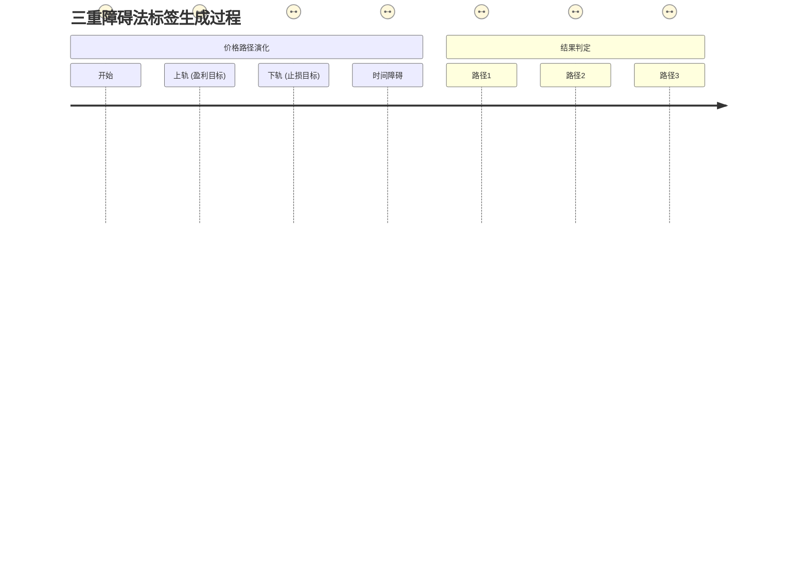

好的，我们已经掌握了如何从原始数据中提取和构建高质量的特征，如同为我们的“预测引擎”精心准备了高纯度的燃料。然而，一个引擎再强大，如果不知道目的地，也只能在原地轰鸣。在将这些特征投入模型之前，我们必须回答一个更为根本的问题：我们究竟在预测**什么**？

这引出了我们机制拆解的第二步，也是机器学习流程中至关重要的一环——定义预测目标，或称之为**打标签 (Labeling)**。

---

## 2.3 机制拆解(二)：定义预测目标 (Labeling)

我们已经拥有了一系列经过精心处理、承载着市场信息的特征（Features, X）。现在，我们需要为每一个历史时刻的特征，配上一个它应该预测的“答案”——标签（Label, Y）。在监督学习的框架下，模型的目标就是学习从 `X` 到 `Y` 的映射关系 `f`，即 `Y = f(X)`。

这个过程听起来似乎很简单。对于股票预测，最直观的目标不就是“涨”或“跌”吗？然而，这个看似简单的问题，在金融世界中却隐藏着无数的陷阱。如何定义“涨”或“跌”，其深刻程度和对策略最终成败的影响，丝毫不亚于我们之前讨论的任何一个数据挑战。

### 传统方法的局限：固定时间窗口的“快照”谬误

**问题背景：最直观，也最天真的定义**

当一个量化新人开始构建他的第一个模型时，他几乎总会从一个简单粗暴的定义开始：

> “如果未来 `k` 天的收益率为正，则标签为1（涨）；如果为负，则标签为-1（跌）。”

这种方法被称为**固定时间窗口法 (Fixed-Time Horizon Method)**。例如，我们可以定义“预测未来5天股价是否上涨”。这就像在每个交易日结束时，都问同一个问题：“从今天起，5个交易日后，世界会变成什么样？”

**类比：一次规定时间的航海**

想象你是一位17世纪的船长，你的赞助人给你下达了一个奇怪的任务：

> “从港口出发，航行**恰好5天**。5天后，只要你的船位于出发点以东的任何位置，就算任务成功；否则就算失败。”

你驾驶着当时最好的帆船出发了。现在，让我们看看这个任务规则会导致什么问题：

1.  **忽略了精彩的旅程（路径依赖问题）：** 在第二天，你可能就借助一股强大的洋流向东航行了100海里，这是一个绝佳的获利机会。但根据规则，你必须继续航行。在接下来的三天里，风向逆转，你拼尽全力才没有被吹回西边，最终在第5天结束时，你只比出发点偏东1海里。赞助人会说：“嗯，任务成功了。” 但你心里清楚，你错过了那个赚取100海里利润的黄金窗口。
    *   **金融场景：** 一只股票在未来5天内，可能第二天就暴涨了15%，达到了一个理想的卖出点，但随后四天一路下跌，到第五天收盘时只剩下2%的涨幅。固定时间窗口法会给这个事件打上一个微弱的“涨”标签（Label=1），完全无视了那个本可以锁定巨大利润的机会点。

2.  **无视了航行的风险（波动性问题）：** 考虑两种“成功”的航行。
    *   **航行A：** 风平浪静，你每天稳定地向东航行10海里，5天后到达东边50海里处。
    *   **航行B：** 你遭遇了巨大的风暴，船只先是被向东吹了200海里，然后又被向西卷了150海里，船员精疲力尽，桅杆也险些折断，最终在第5天也恰好停在东边50海里处。
    *   根据规则，这两次航行是**完全等价的成功**。但这显然是荒谬的。航行B的风险和不确定性远高于A。
    *   **金融场景：** 一只稳健的蓝筹股，在5天内平稳上涨了3%。另一只妖股，在5天内经历了+20% -> -15% -> +3%的剧烈波动。对于固定时间窗口法而言，这两个事件的标签是完全一样的（都是“涨”）。但任何一个理性的交易者都知道，这两个过程的风险收益特征截然不同。模型如果学习这种标签，它将无法区分“好的上涨”和“坏的上涨”，也无法学会风险管理。

3.  **武断的时间限制（参数敏感性）：** 为什么是5天？为什么不是4天或6天？这个“5”是一个没有任何理论依据的**超参数**。你可能会发现，用5天窗口定义的标签训练出的模型表现平平，但如果换成6天，回测结果就突然变好了。这往往不是因为你发现了什么经济规律，而仅仅是因为你“过拟合”了这个窗口长度。

**影响：模型学到的是扭曲的现实**

使用固定时间窗口法，我们实际上是在强迫市场遵循我们设定的、僵硬的节拍。我们等于在告诉模型：“我不在乎你是如何到达目的地的，也不在乎路上的风险有多大，我只要你在我规定的那个时间点上，给我一个快照。”

在这种扭曲的激励下，模型学到的很可能不是真正的Alpha信号，而是在特定时间窗口长度下的一些统计巧合。它无法理解一个头寸的完整生命周期——从建仓、盈利、止损到最终平仓。这从根本上违背了交易的本质。

### 核心思想：基于路径的标签 —— 从“终点”思维到“事件”思维

**解决方案：重新定义“成功”**

为了克服上述缺陷，我们需要一场思维上的革命。我们不应该再问：“在**固定时间点 T**，价格会**在哪里**？” 而是应该问：“从现在开始，**哪一个重要事件**会**最先发生**？”

这个思想转变，正是由量化金融领域的大师级人物Marcos Lopez de Prado在其著作中极力推广的**三重障碍法 (Triple-Barrier Method)** 的核心。

**类比：升级你的航海任务**

现在，你是一位更聪明的船长，你和赞助人重新商定了任务规则：

> “你的目标是向东航行**50海里（上轨/盈利目标）**。同时，为了安全，你必须在船上装载一个警报器，一旦船只偏离航线，向西漂移超过**20海里（下轨/止损目标）**，任务就必须中止返航。此外，如果**超过15天（时间障碍）**你既没有到达盈利目标，也没触发止损警报，你也必须返航，因为我们不能让船只和船员无限期地在海上漂流，这会产生巨大的机会成本。”

看，这个新规则多么优越！

*   **结果由事件驱动：** 任务的结束不再由一个固定的时间决定，而是由三个关键事件之一的**首次发生**来决定：(1) 达到盈利目标，(2) 触发止损，或 (3) 时间耗尽。
*   **风险与回报被内生化：** 止损和盈利目标被明确地写入了任务定义中。
*   **考虑了机会成本：** 时间限制承认了“原地踏步”也是一种成本。

这就是三重障碍法的精髓。我们不再对市场进行“定时快照”，而是为每一个交易机会设置一个“赛场”，这个赛场有三面墙壁：一面是盈利墙（上轨），一面是亏损墙（下轨），还有一面是时间墙（垂直障碍）。我们预测的，就是价格这条“小球”，会率先撞上哪面墙。

### 三重障碍法详解

三重障碍法通过设置三个边界来定义一个交易的生命周期，并以此生成标签。

1.  **上轨 (Upper Barrier): 盈利目标 (Profit-Taking)**
    *   **如何设置？** 这不是一个固定的价格点，而是动态计算的。一个常见且合理的方法是基于**波动性**。例如，我们可以计算过去20天的日均波动率（如ATR指标），然后将上轨设置为 `入场价格 * (1 + N * 波动率)`。这里的 `N` 是一个自定义的风险回报倍数，比如2或3。
    *   **为何基于波动性？** 因为这让目标变得“智能”。对于一只日常波动只有0.5%的稳定股票，一个1%的盈利目标可能已经很显著了；但对于一只日常波动5%的科技股，1%的目标毫无意义。基于波动性的目标可以自动适应不同资产和不同市场时期的风险状况。

2.  **下轨 (Lower Barrier): 止损目标 (Stop-Loss)**
    *   **如何设置？** 同样基于波动性。下轨可以设置为 `入场价格 * (1 - M * 波动率)`。这里的 `M` 通常与 `N` 形成一个风险回报比，例如，你可以设置 `N=2, M=1`，意味着你期望的回报是你愿意承担风险的两倍。
    *   **为何如此重要？** 它将风险管理的概念**直接编码**到了机器学习的标签中。模型在学习时，不仅仅是在寻找“上涨”的信号，而是在寻找那些“更有可能先触及上轨，而不是下轨”的模式。这使得模型的优化目标与我们的交易目标高度统一。

3.  **垂直障碍 (Vertical Barrier): 时间限制**
    *   **如何设置？** 这是一个最长持仓时间的限制，比如10个交易日。如果在10天内，价格既没有触及上轨，也没有触及下轨，那么就在第10天收盘时强制平仓。
    *   **为何需要它？** 它解决了资金占用的机会成本问题。一个策略如果让大量资金长期陷在没有明确方向的“盘整”行情中，即使不亏损，也是一种巨大的浪费。

**标签的生成逻辑**

对于每一个我们考虑入场的时刻 `t0`，我们向前看，追踪价格路径，直到它首次触碰到三个障碍中的任何一个：

*   如果价格路径**最先触及上轨**，则该时刻的标签为 **1** (代表这是一个值得买入的机会)。
*   如果价格路径**最先触及下轨**，则该时刻的标签为 **-1** (代表这是一个应该卖出或做空的机会)。
*   如果价格路径在时间限制内**既未触及上轨也未触及下轨**，而是在时间障碍处结束，则标签为 **0** (代表这是一个没有明确信号、应该持有的机会)。

**`mermaid diagram`：三重障碍法可视化**

让我们用一个流程图来清晰地展示这个过程：

这个图示清晰地表明，标签不再是某个固定时间点的快照，而是由价格的**完整运动路径**与我们预设的**交易逻辑**共同决定的动态结果。

### 优势分析：为何三重障碍法是范式转移？

与传统的固定时间窗口法相比，三重障碍法提供了一种远为深刻和实用的标签定义方式，其优势是根本性的：

1.  **内生化的波动性考量：** 目标和止损的设定与市场波动性挂钩，使得标签能够自动适应不同的市场环境（高波动期目标更远，低波动期目标更近）。这消除了固定百分比带来的僵化，让模型学到的规律更具鲁棒性。

2.  **与交易逻辑的完美对齐：** 机器学习的目标（预测标签1, -1, 0）与一个成熟交易员的决策过程（设置盈亏比、最大持仓时间）完全一致。这意味着，模型的优化方向就是策略盈利能力提升的方向。

3.  **降低样本标签的随意性：** 在固定时间窗口法中，窗口长度加一天或减一天，可能导致大量样本的标签从1变为-1，反之亦然。这种标签的不稳定性对模型训练是致命的。而三重障碍法的结果由显著的价格运动（触及障碍）决定，标签结果更加稳定和有意义。

4.  **信息量更丰富的标签：** 虽然我们这里定义的是分类标签（1, -1, 0），但三重障碍法可以轻松扩展。例如，对于触及时间障碍的样本（标签0），我们可以进一步用其在平仓时的收益率符号来定义标签（`sign(return)`），或者直接预测触及障碍的时间、路径的波动性等，从而产生更丰富的预测目标。

### 总结与启发性思考

在这一节中，我们完成了一次从“天真”到“成熟”的认知升级。我们深刻地剖析了定义预测目标这一看似简单的任务背后所蕴含的复杂性。

*   **告别僵化：** 我们摒弃了**固定时间窗口法**这种简单但充满缺陷的“快照”式思维。
*   **拥抱动态：** 我们引入了**三重障碍法**，其核心思想是基于**事件驱动**和**价格路径**来定义标签。
*   **统一目标：** 我们学习了如何通过设置**上轨（盈利）、下轨（止损）和时间障碍**，将波动性、风险回报比和机会成本这些核心交易理念，内生地融入到机器学习的标签定义中。

至此，我们已经构建了高质量的特征（X），也定义了有意义的标签（Y）。似乎万事俱备，只欠一个强大的机器学习模型来连接它们。然而，在我们急于开启“模型训练”这个激动人心的篇章之前，一个幽灵般的问题再次浮现，它源于我们在2.2节的结尾提出的那个挑战：我们创造了成百上千的特征，它们真的都是有用的吗？

将一个臃肿、充满冗余信息的特征集直接喂给模型，就像让一位将军指挥一支纪律涣散、人员混杂的庞大军队，其结果往往不是胜利，而是混乱和内耗。

因此，在真正踏上建模之路前，我们必须先成为一名高效的“参谋长”，学会如何从庞大的特征军团中进行裁汰、筛选和提纯，选拔出最精锐的“特种部队”。这，便是我们下一节将要面对的挑战：**特征选择与维度诅咒**。我们如何确保喂给模型的每一个信息，都是金子，而不是沙砾？