好的，作为您的专属教育家与作家，我将接过上一节的线索，从“罪与罚”的审判庭，步入“知与行”的建筑工地。我们已经学会了如何像侦探一样识别回测中的种种罪案，现在，我们将化身为工程师与建筑师，学习如何构建一个能够抵御市场风暴的、真正稳健的回测框架。

---

## 4.3 机制拆解：稳健的回测框架

在4.2节中，我们扮演了严苛的检察官，将回测中的“七宗罪”一一审判。我们看到，幸存者偏差、前视偏差、数据挖掘等原罪，如同地基中的蚁穴，足以让最宏伟的策略大厦在实盘的风雨中轰然倒塌。这段旅程或许令人沮丧，它揭示了通往成功之路遍布陷阱。

但是，请不要因此对回测心生畏惧或绝望。认识陷阱，正是为了建造更坚固的桥梁。这一节，我们的角色将发生根本性的转变。我们不再是手持放大镜的批评家，而是要成为怀揣蓝图的建筑师。我们的目标，不再是消极地“避免错误”，而是要主动地、系统性地**构建一个能够最大限度抵抗过拟合、增强策略可信度的回测体系**。

**类比：从“事故调查”到“防震设计”**

想象一下，前两节课我们所做的，如同在调查一座在地震中坍塌的大楼。我们分析了其钢筋的脆弱（忽略交易成本）、地基的虚浮（幸存者偏差）、设计的缺陷（前视偏差）以及为了应付检查而做的表面功夫（数据挖掘）。现在，我们的任务是吸取所有教训，去设计一座能够抵御9级强震的摩天大楼。

这种设计，依靠的不是祈祷，而是一整套先进的工程学原理。在量化投资中，这套“抗震工程学”，就是我们即将探讨的稳健回测框架。它的核心思想，源于现代机器学习的智慧，并由顶尖的量化金融学者针对金融市场的独特性质进行了精妙的改造。

### 核心思想：分离训练、验证与测试 —— 数据使用的“三权分立”

我们在4.2节已经初步接触了样本内外测试（In-Sample/Out-of-Sample）的概念，这是对抗过拟合的“第一道防线”。然而，这种简单的两分法，在复杂的策略研发过程中，仍然存在一个微妙但致命的漏洞。

**问题背景：** 假设你正在研发一个交易策略，它有两个关键参数：短期均线周期（`short_ma`）和长期均线周期（`long_ma`）。你将数据分为2010-2018年的训练集（In-Sample）和2019-2020年的测试集（Out-of-Sample）。

你在训练集上测试了上百种参数组合（`short_ma`从5到50，`long_ma`从60到200），发现“15日均线上穿125日均线”这个组合在2010-2018年期间的夏普比率最高。于是，你选定了这个组合。

现在，你用这个“最优”策略在测试集（2019-2020年）上进行回测。这个过程看起来像是完美的样本外测试，对吗？

不完全是。想一想，你为什么选择了“15/125”这个组合，而不是“20/150”？因为“15/125”在训练集上表现最好。但是，你**挑选模型**的这个行为本身，是不是也利用了训练集的信息？如果你的测试集（2019-2020）恰好与训练集（2010-2018）的市场环境有某些偶然的相似性，那么你挑选出的这个“冠军”，可能只是因为**它不仅拟合了训练集的规律，还碰巧“偷看”到了测试集的考题风格**。你通过选择模型的行为，已经无形中让测试集的信息“泄露”到了你的模型选择过程中。

**解决方案：三组分离 —— 训练集、验证集、测试集**

为了解决这个问题，机器学习领域建立了一个更严格的“三权分立”原则：

1.  **训练集 (Training Set):** 数据的最大部分，专门用于“训练”模型，即调整模型的内部参数。在我们的例子中，就是用它来计算不同均线组合的表现。这就像是学生的日常课堂学习和课后作业，知识在这里被吸收。

2.  **验证集 (Validation Set):** 一块独立的数据，它不参与模型参数的训练，专门用于“选择”模型。在训练集上，你可能得到了10个看似不错的模型（不同的参数组合）。你在验证集上分别运行这10个模型，然后选择在验证集上表现最好的那一个。这就像是学生的“模拟考试”，用于检验哪个复习策略最有效，并最终确定一个应考方案。

3.  **测试集 (Test Set):** 这是“保险箱里的最终考卷”。在整个研发过程中，这部分数据绝对不能以任何形式被触碰或参考。只有当你完成了所有的训练和模型选择，确定了最终的、唯一的策略版本后，才能打开这个保险箱，运行一次、且仅有一次回测。这次回测的结果，才是对策略未来表现最无偏的估计。这就像是决定命运的“高考”，它的结果是对学生真实水平的最终裁决。

**影响：** 这种三向分离，通过增加一个“验证”环节，有效地隔离了“参数调优”和“最终评估”，极大地降低了数据窥探的风险。它确保了最终的“高考”（测试集）对于你的整个研发流程来说是真正“陌生”的，从而让评估结果更加可信。

---

### 传统方法：步进回测 (Walk-Forward Analysis)

三组分离的思想虽然严谨，但对于时间序列数据（如金融市场数据）而言，一个固定的、静态的划分（如2010-2015为训练，2016-2017为验证，2018-2020为测试）仍然有其局限性。市场是动态演化的，一个在2010年学到的规律，到2020年可能早已失效。我们需要一个能够模拟策略**持续学习、适应市场**过程的回测方法。

**问题背景：** 静态划分意味着你的策略是“一劳永逸”的。你在2010-2015年的数据上训练好一个模型，然后就用这个“旧模型”去交易未来五年。这在现实中是不可思议的。一个真正的量化基金会定期（如每季度或每年）用最新的数据来重新校准和优化它的模型。

**解决方案：步进回测 (Walk-Forward Analysis, WFA)**

WFA正是为了模拟这种“滚动学习”的过程而设计的。它将样本内（训练）和样本外（测试）的概念，以一种动态、滚动的方式应用到整个历史数据中。

**类比：一位医生的职业生涯**

想象一位刚从医学院毕业的医生。
*   **第一阶段 (2010-2014):** 他在住院部接受了5年的系统性训练（**Training Period**），学习了所有已知的病例和治疗方案。
*   **第二阶段 (2015):** 他开始独立行医，将所学应用于新的病人身上。这一年的行医表现，是对他过去5年学习成果的一次真实检验（**Testing Period**）。
*   **第三阶段 (2011-2015):** 在2015年底，他总结了这一年的行医经验，并结合过去4年的知识，更新了他的知识库。现在，他的知识体系是基于2011-2015年的经验。
*   **第四阶段 (2016):** 他用这个更新后的知识体系，去面对2016年的新病人。
*   这个“学习-实践-再学习-再实践”的循环，贯穿了他的整个职业生涯。

WFA就是策略的“职业生涯模拟”。

**机制拆解：**

1.  **定义窗口：** 设定一个训练期长度（`Train_Length`）和一个测试期长度（`Test_Length`）。例如，`Train_Length = 5年`，`Test_Length = 1年`。
2.  **第一次迭代：**
    *   使用第1年到第5年的数据作为**训练集**，进行策略研发、参数优化，得到最优策略 A。
    *   将策略 A 应用于第6年的**测试集**，记录下这一年的样本外表现。
3.  **第二次迭代（向前滚动）：**
    *   将整个窗口向前移动1年。现在，使用第2年到第6年的数据作为新的**训练集**，重新优化，得到最优策略 B（注意，策略 B 可能与 A 相同，也可能不同）。
    *   将策略 B 应用于第7年的**测试集**，记录下这一年的样本外表现。
4.  **持续滚动：** 重复这个过程，直到数据的末尾。
5.  **最终评估：** 将所有测试期（第6年、第7年、第8年……）的表现拼接起来，形成一条完整的、完全由样本外数据构成的净值曲线。

**可视化步进过程 (`mermaid diagram`):**

```mermaid
gantt
    title Walk-Forward Analysis (Train: 4 periods, Test: 1 period)
    dateFormat X
    axisFormat %s

    section Path 1
    Train   : crit, 0, 4
    Test    : 4, 1

    section Path 2
    Train   : 1, 4
    Test    : 5, 1

    section Path 3
    Train   : 2, 4
    Test    : 6, 1

    section Path 4
    Train   : 3, 4
    Test    : 7, 1

    section Stitched OOS Performance
    OOS_1: done, 4, 1
    OOS_2: done, 5, 1
    OOS_3: done, 6, 1
    OOS_4: done, 7, 1
```

**影响：** WFA生成的净值曲线，比单一的样本内外测试要可靠得多。因为它模拟了策略在真实世界中的运作方式——定期再训练和调整。它所展示的，是一系列“小规模高考”的成绩总汇，而不是一次“模拟考”的好成绩。如果一条策略在WFA中表现稳健，说明它不仅在某个时期有效，而且其核心逻辑具有一定的**适应性和跨时期稳定性**。

---

### 先进技术：组合交叉验证 (Combinatorial Cross-Validation)

WFA已经是一个巨大的进步，但它仍然存在一个根本性的弱点：**路径依赖性 (Path Dependency)**。

**问题背景：** WFA虽然是滚动的，但它仍然是沿着历史时间轴的**唯一一条路径**前进的。训练集和测试集的配对方式是固定的、线性的。想象一下，如果你的策略恰好在某个测试期（例如，2008年金融危机）表现极差，这个单一的、糟糕的样本外表现可能会让你过早地放弃一个在其他时期都表现优异的策略。反之，如果测试期恰好都是风平浪静的牛市，你也可能会高估一个脆弱策略的稳健性。WFA的结果，在很大程度上取决于你划分窗口的“运气”。

**解决方案：组合交叉验证 (Combinatorial Cross-Validation, CCV)**

这个思想由量化金融领域的思想家马科斯·洛佩斯·德普拉多（Marcos López de Prado）在其著作《金融机器学习》中大力倡导。其核心是彻底打破WFA的线性路径依赖，通过组合的方式，创造出**成百上千条不同的历史“路径”**，从而全面评估策略的稳健性。

**类比：压力测试一艘船**

*   **WFA** 就像是让一艘新船沿着一条固定的、从南到北的航线航行一次。如果这条航线恰好风平浪静，你会得出结论“船很棒”。如果恰好遇到百年一遇的风暴，你可能会说“船不行”。这个结论非常片面。
*   **CCV** 则完全不同。它像是把这艘船置于一个巨大的水池中，用造浪机模拟出**所有可能的海况组合**：从大西洋的巨浪，到地中海的微风，再到北冰洋的浮冰……它测试船只在各种随机组合的恶劣环境下的表现。最终，你得到的不是一个“成功/失败”的答案，而是一份关于这艘船在不同风浪等级下的“性能衰减报告”。这才是对船只稳健性的真正度量。

**机制拆解 (简化版):**

1.  **数据分块：** 将整个时间序列数据分割成 `N` 个等长的小数据块 (Blocks)。例如，将10年的数据分成20个半年期的数据块。

2.  **组合生成：** 接下来，我们不再沿着时间线走，而是通过组合生成大量的（训练集，测试集）配对。例如：
    *   **组合1：** 用数据块 [1, 2, 3, ..., 10] 作为训练集，用数据块 [12] 作为测试集。
    *   **组合2：** 用数据块 [5, 6, ..., 15] 作为训练集，用数据块 [17] 作为测试集。
    *   **组合3：** 用数据块 [1, 3, 5, 7] (不连续的) 作为训练集，用数据块 [9] 作为测试集。
    *   ... 如此往复，生成成百上千种不同的组合。

3.  **净化与间隔 (Purging and Embargoing):** 这是德普拉多方法论中的一个关键技术细节，也是其针对金融数据特性的精髓所在。
    *   **净化 (Purging):** 在训练集的末尾，有一些数据点可能包含了对紧邻的测试集早期走势的预测信息（例如，一个为期30天的特征，其在训练集最后一天的计算会用到未来29天的数据，这会“污染”测试集）。CCV会主动“净化”，即删除掉训练集中这部分可能泄露未来信息的数据。
    *   **间隔 (Embargoing):** 在训练集和测试集之间设置一个“无人区”（Embargo），即一小段不用于训练也不用于测试的数据。这是因为金融市场的收益率存在序列相关性，一个时期的冲击会影响到紧接着的下一个时期。设置间隔可以防止这种相关性导致的“信息泄露”。

4.  **性能分布：** 对每一个组合都运行一次回测，计算其性能指标（如夏普比率）。由于你有成百上千次回测结果，你最终得到的**不是一个单一的夏普比率值，而是一个夏普比率的分布图（直方图）**。

**影响：从“单一真相”到“概率云”**

CCV彻底改变了我们评估策略的方式。我们不再问：“这个策略的夏普比率是多少？” 而是问：
*   “这个策略的夏普比率的**中位数**是多少？”
*   “在所有可能的历史路径中，有多大的**概率**（例如，95%的置信度）它的夏普比率会大于1？”
*   “这个策略表现最差的5%的路径是什么样的？它在最坏情况下的表现有多糟糕？”

一个策略如果在成百上千种不同的、经过净化的历史组合中，其性能分布都集中在优异的区间，那么我们就有极高的信心认为，这个策略的成功不是源于历史的偶然，而是源于其内在逻辑的真正稳健性。**CCV是目前学术界和顶级机构公认的、对抗数据挖掘和过拟合的最强有力的武器之一。**

---

### 压力测试与情景分析：为“未知的未知”做准备

WFA和CCV极大地提升了我们对策略在**历史数据**范围内表现的信心。但我们必须铭记一个谦卑的事实：历史数据只记录了已经发生过的事情。未来必然会发生历史上从未有过的事件组合。

**问题背景：** 一个策略可能完美地通过了基于1990-2020年数据的CCV测试。但是，如果明天全球央行突然宣布用比特币替代黄金作为储备资产，会发生什么？历史上没有这样的数据，任何基于历史的回测都无法告诉你答案。

**解决方案：主动制造“灾难”**

压力测试和情景分析，就是我们作为策略的“建筑师”，主动模拟各种极端甚至架空的“灾难”，来测试我们策略的“断裂点”。

1.  **情景分析 (Scenario Analysis):**
    *   **是什么：** 将你的策略在历史上一些著名的**极端时期**单独进行回测。
    *   **怎么做：** 提取特定历史时期的数据，例如：
        *   2008年全球金融危机（流动性枯竭、高相关性）
        *   2015年中国A股股灾（杠杆断裂、千股跌停）
        *   2020年3月新冠疫情冲击（史诗级波动率飙升）
        *   2022年俄乌冲突与加息周期（地缘政治与宏观范式转变）
    *   **目的：** 它回答了这个问题：“我的策略在历史上已知的、最糟糕的几种市场环境下，表现如何？是会崩溃，还是会幸存，甚至盈利？” 这有助于我们理解策略的“性格”和风险暴露。

2.  **压力测试 (Stress Testing):**
    *   **是什么：** 与其重放历史，不如**创造历史**。我们通过人工修改历史数据，来模拟一些未来可能发生但历史上未曾出现的极端情景。
    *   **怎么做：**
        *   **因子冲击：** 假设你的策略依赖于“小市值因子”。你可以人为地在数据中引入一个长达6个月的时期，在此期间，小市值股票的表现持续大幅跑输大市值股票。你的策略会如何反应？
        *   **波动率冲击：** 将所有资产的日波动率瞬间乘以3，并持续一个月。你的风险模型和仓位控制系统是否会崩溃？
        *   **相关性冲击：** 传统上，股和债是负相关的。你可以人为地将它们的相关性在一段时间内设定为+0.8。你的多元化投资组合是否还奏效？
        *   **流动性冲击：** 将所有资产的买卖价差（Bid-Ask Spread）扩大5倍，模拟市场流动性枯竭。你的交易成本会飙升到什么程度？策略是否还能盈利？
    *   **目的：** 压力测试回答了一个更深刻的问题：“**杀死我的策略需要什么条件？**” 它帮助我们识别策略最脆弱的环节，并可能促使我们加入一些“保险丝”机制，如在极端波动时自动减仓或暂停交易。

---
`checklist`
### 稳健回测框架的构建清单

在构建你的回测体系时，请对照以下清单，确保你建立的是一座“防震大楼”，而非“豆腐渣工程”：

-   [ ] **数据分离：** 我是否严格遵守了训练集、验证集、测试集的“三权分立”原则？我的最终测试是否是在一块“处女地”上完成的？
-   [ ] **动态模拟：** 我是否使用了步进回测（WFA）来模拟策略在真实世界中持续学习和适应的过程，而不是依赖静态的数据划分？
-   [ ] **路径依赖破除：** 我是否更进一步，采用了组合交叉验证（CCV）的思想，通过测试成百上千条历史路径，来评估策略性能的分布，而不仅仅是一个单一的数值？
-   [ ] **净化与隔离：** 在进行交叉验证时，我是否考虑了金融数据的时间序列特性，并采取了净化（Purging）和间隔（Embargoing）措施，以防止信息泄露？
-   [ ] **历史重演：** 我是否进行了情景分析，观察我的策略在2008年、2020年等历史极端事件中的具体表现？
-   [ ] **未来预演：** 我是否进行了压力测试，通过人为制造极端市场条件，来探索我的策略的“生存极限”和“断裂点”？

---

### 总结与展望：从“确定性”的幻觉到“稳健性”的追求

本节课，我们完成了一次重要的思维升级。我们从寻找一个能在历史中获得最高分的“最优策略”，转向了构建一个能在各种严酷考验下**稳定发挥**的“稳健策略”。

我们学习了从简单的三组分离，到模拟动态学习的**步进回测（WFA）**，再到彻底打破路径依赖、评估性能概率分布的**组合交叉验证（CCV）**。最后，我们通过**压力测试和情景分析**，将目光投向了历史之外的、充满不确定性的未来。

这一系列工具和方法论，共同构成了一个现代化的、科学的回测框架。它的核心不再是产生一条令人炫目的净值曲线去“证实”我们的天才，而是提供一整套证据，来冷静、客观地评估一个策略的**生存概率**。

然而，即使我们拥有了如此强大的“虚拟实验室”，一个终极问题依然萦绕在我们心头：回测，终究是基于过去。一个通过了所有虚拟考验的策略，在投入真金白银的那一刻，又会面临哪些新的挑战？从模拟交易到真实下单，这“最后一公里”的路，又隐藏着哪些魔鬼般的细节？

准备好迎接最终的考验。在下一章，我们将走出虚拟世界，踏入真实市场的喧嚣。我们将探讨交易执行、成本控制、资金管理等实战中的核心命题，学习如何将一个经过千锤百炼的策略，真正转化为持续盈利的交易系统。