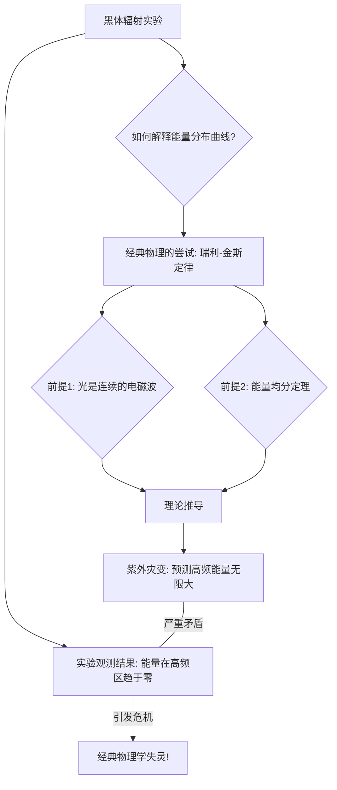

好的，作为一位世界级的教育家与作家，我将为您呈现这门量子力学课程的开篇之作。我将以引人入胜的叙事方式，带领读者穿越到19世纪末那个物理学的黄金时代，亲眼见证经典物理大厦上出现的两朵“乌云”，并理解它们如何引发了一场颠覆我们世界观的科学革命。

---

### **第一章：旧世界的裂痕 —— 为什么需要量子力学？**

#### **1.1 根本问题：为什么经典物理学在微观世界“失灵”了？**

欢迎来到量子力学的世界。在深入这个看似怪诞又充满魅力的领域之前，我们必须先回答一个至关重要的问题：我们为什么需要它？毕竟，在19世纪末，物理学的宏伟大厦似乎已经落成。牛顿的力学定律精确地描绘了从苹果落地到行星运转的一切宏观运动，如同一个由上帝精密设定的钟表宇宙，一切皆有因果，一切皆可预测。麦克斯韦的电磁理论则将电、磁、光统一在了一套优美的方程之下，预言了电磁波的存在，并解释了光的本质。物理学家们沉浸在前所未有的成功喜悦中，许多人相信，物理学的未来只剩下一些修修补补的工作，在已知的数字后面加上几个小数位而已。

然而，正是在这座看似坚不可摧的大厦晴朗的天空中，漂浮着两朵令人不安的“小乌云”，这是著名物理学家开尔文勋爵在1900年一次演讲中提出的比喻。他当时乐观地认为这些问题很快会被解决，但历史却开了一个巨大的玩笑：正是这两朵看似不起眼的乌云，最终汇聚成一场倾盆暴雨，彻底冲垮了经典物理学的根基，并在废墟之上，催生了我们今天称之为“量子力学”的全新理论。

这两朵乌云，便是我们本章要探讨的两个核心案例：**黑体辐射**与**光电效应**。它们是来自微观世界的“异常报告”，是经典物理无论如何也无法解释的实验事实。让我们化身为当时的物理学家，亲历那段困惑与突破交织的岁月，去理解那座宏伟的旧世界大厦，究竟是如何从内部开始崩塌的。

---

### **案例一：黑体辐射与“紫外灾变”**

#### **问题背景：一个完美的“吸光者”**

想象一个绝对黑色的物体，一个理论上能吸收射向它的任何频率的电磁辐射，而自身绝不反射的理想化模型——物理学家称之为“**黑体**”（Black Body）。你可能会问，研究这么一个不存在的理想物体有什么意义？

**类比与具象化：烤炉中的光**

一个非常接近黑体的现实例子，是一个内部涂黑、只开了一个极小孔洞的空腔（比如一个窑炉）。任何光线一旦从小孔射入，就会在空腔内壁经历无数次反射和吸收，最终几乎不可能再从小孔中逃逸。因此，这个小孔本身，就成为了一个近乎完美的“黑体”入口。

然而，有趣的事情发生在当我们加热这个空腔时。随着温度升高，空腔内壁的原子开始振动并发射电磁辐射，整个空腔内部充满了热辐射。此时，从小孔中“泄漏”出来的光，其颜色和光谱分布，就精确地代表了该温度下黑体辐射的特性。实验学家发现一个关键事实：这种辐射的特性（比如在哪个颜色上能量最强）**只与温度有关，而与构成空腔的材料无关**。这揭示了一个关于物质与光相互作用的普适规律，对于渴望探寻宇宙基本法则的物理学家来说，这无疑是一座金矿。

#### **经典理论的尝试与崩溃**

19世纪末的物理学家们手握两大理论利器：统计力学和麦克斯韦的电磁理论。他们信心满满地试图解释黑体辐射的能量分布曲线。其逻辑如下：

1.  **光的波动性**：根据麦克斯韦理论，光是电磁波。在被加热的空腔内，可以存在各种不同波长（或频率）的电磁波，就像在吉他弦上可以弹出不同音高的音符（驻波）一样。
2.  **能量均分**：根据经典统计力学中的“能量均分定理”，在一个处于热平衡的系统中，能量应该被平均地分配给每一个可能的“自由度”（在这里，可以理解为每一种可能存在的驻波模式）。每个模式分到的平均能量是 `kT`（其中 `k` 是玻尔兹曼常数，`T` 是绝对温度）。

这个逻辑看起来天衣无缝。然而，当物理学家瑞利（Rayleigh）和金斯（Jeans）将这个模型付诸计算时，一个荒谬绝伦的结果出现了。

**“紫外灾变”（Ultraviolet Catastrophe）**

问题出在“自由度”的数量上。对于电磁波，波长越短（频率越高），能在空腔中容纳的驻波模式就越多。事实上，随着波长趋向于零（频率趋向于无穷大），驻波模式的数量会**趋向于无穷多**。

**类比：一个“无底洞”的音乐厅**

想象你在一个音乐厅里分发能量（预算）。音乐厅里有各种乐器，从低音大提琴（长波长/低频率）到小提琴（短波长/高频率）。经典理论的规则是：给每一种可能的音高（每一种驻波模式）分配完全相同的能量。现在，假设这个音乐厅里的乐器种类是无限的，尤其是高音区的乐器，音高可以无限地向上延伸。按照这个规则，你的总预算将被无限多的高音乐器瓜分，最终导致总预算需要无穷大！绝大部分能量都会被那些频率极高（对应光谱中的紫外线及更高频段）的波所占据。

这便是“**紫外灾变**”：瑞利-金斯公式预言，一个炽热的物体，随着辐射频率的升高，其辐射能量将无限增大，导致其总辐射能量为无穷大。这意味着，你点燃一根火柴，它释放的能量就足以毁灭宇宙。这显然与我们日常观察到的事实——烤炉发出的是柔和的红光或白光，而非致命的伽马射线——构成了尖锐的、灾难性的矛盾。

实验数据明确无误地显示，黑体辐射的能量在某个特定频率达到峰值后，会随着频率的进一步升高而迅速下降至零。经典物理学在这里，遭遇了它诞生以来最彻底的失败。

#### **普朗克的解决方案：能量量子（Quanta）**

面对这场危机，德国物理学家马克斯·普朗克（Max Planck）在1900年，提出了一个他自己都感到不安的、近乎“绝望”的解决方案。他没有去挑战麦克斯韦理论或统计力学的基本框架，而是做了一个看似微小却影响深远的假设。

**普朗克的革命性假设**

普朗克提出，物质（构成空腔壁的振子）在吸收或发射电磁辐射时，其能量的交换不是连续不断的，而是**一份一份地**进行的。每一份能量的大小，与辐射的频率 `ν`（nu）成正比。

这个最小的、不可再分的能量单位，他称之为“**能量子**”（Quantum of Energy），其数学表达式为：

$$ E = h\nu $$

其中：
- `E` 是单个能量子的能量。
- `ν` 是电磁波的频率。
- `h` 是一个普适常数，后来被称为**普朗克常数**（$h \approx 6.626 \times 10^{-34} J \cdot s$），一个极其微小的数值。

这意味着，对于一个特定频率 `ν` 的辐射，振子只能拥有 `0`, `hν`, `2hν`, `3hν`, ... 这样整数倍的能量，而不能拥有 `1.5hν` 或 `2.7hν` 这样的中间值。

**类比：从“自来水”到“瓶装水”**

想象一下能量是水。经典物理认为，能量就像自来水龙头里的水，你可以接任意多的水，1毫升，1.1毫升，1.11毫升……它是**连续**的。而普朗克的量子化假设则认为，能量更像是超市货架上的瓶装水。你只能整瓶整瓶地买，可以买1瓶（`hν`），2瓶（`2hν`），但你绝对买不到半瓶水。能量的交换是**离散**的、**量子化**的。

**如何解决“紫外灾变”？**

这个看似简单的假设，却像一把钥匙，瞬间解开了“紫外灾变”的枷锁。

在高频区域（紫外区），`ν` 非常大，因此单个能量子 `hν` 的“价格”也极其高昂。在一个给定温度 `T` 的烤炉里，平均可用的热能是有限的。系统根本“负担不起”去激发这些高频率的振动模式，因为哪怕是激发最低的一级能量（`hν`），所需要的能量也太大了。这就好比在预算有限的音乐厅里，那些需要天价出场费的顶级高音歌唱家（高频模式）根本无法被邀请登台。

因此，能量更多地流向了那些“价格”低廉的低频模式，而在高频区域，由于“入场券”太贵，几乎没有模式被激发，能量分布自然就衰减为零。普朗克基于这个假设推导出的公式，与实验数据**完美吻合**。

**影响**

普朗克的解决方案在当时被视为一个巧妙的数学技巧，连他自己都对这个“能量子”的物理真实性持怀疑态度。然而，他无意中打开了潘多拉的魔盒。**能量量子化**——这个为了解决一个具体问题而引入的“凑数”概念，成为了量子革命的第一声号角。它暗示着，在微观尺度，物理世界的基本属性可能与我们宏观经验中的连续、平滑完全不同。旧世界的墙壁上，出现了第一道深刻的裂痕。

---

### **案例二：光电效应 —— 不听话的电子**

如果说黑体辐射是让经典物理学家感到困惑的第一朵乌云，那么光电效应就是让他们彻底陷入迷茫的第二朵。这个现象本身很简单：用光照射金属表面，有时会从中打出电子。这些被打出的电子被称为“光电子”。

#### **问题背景：光波如何“冲刷”出电子？**

根据19世纪牢固建立的光的波动理论，光是一种电磁波。这个理论对于解释光的干涉、衍射等现象非常成功。用这个理论来解释光电效应，会得到如下几个显而易见的推论：

1.  **能量与强度有关**：波的能量取决于其振幅的平方，对应于光的**强度**（亮度）。因此，更强的光（更亮的灯）应该能给予电子更大的初始能量，使其飞出金属表面后具有更大的动能。
2.  **频率无关紧要**：光的颜色（**频率**）应该不影响光电子的能量。只要光足够强，任何颜色的光都应该能打出电子。
3.  **能量积累需要时间**：如果光非常微弱，就像微弱的水波一样，它需要持续“冲刷”金属表面一段时间，让电子慢慢积累足够的能量后，才能最终逃逸。因此，从光照开始到电子射出，应该存在一个可观测到的**时间延迟**。

#### **实验事实的无情反驳**

然而，实验结果却与经典波动理论的预测背道而驰，呈现出三个“无法理喻”的特征：

1.  **动能只与频率有关**：光电子的最大初动能，与入射光的**强度无关**，而只与光的**频率**成正比。更强的光只会打出**更多**的电子，但每个电子的“单兵作战能力”（最大动能）并不会提升。
2.  **存在“截止频率”**：对于每种金属，都存在一个特定的“截止频率”（threshold frequency）。只有当入射光的频率**高于**这个值时，才能打出光电子。低于这个频率，无论光多强，照射多久，都不会有任何电子逸出。
3.  **瞬时响应**：光电效应的发生是**瞬时**的。只要光的频率超过截止频率，哪怕光弱到难以想象的程度，电子几乎在光照射的瞬间（小于 $10^{-9}$ 秒）就会被发射出来，根本没有所谓的“能量积累”时间。

**类比：海浪与沙滩上的小球**

让我们用一个海浪冲击沙滩上小球的类比来理解这个矛盾。

*   **经典波动理论就像是海浪**：
    *   **预测**：一波波巨大的、缓慢的浪（高强度、低频率）应该能把小球冲到很远的地方（高动能）。而微弱的涟漪（低强度）则需要很长时间才能把小球推出来（时间延迟）。
    *   **这与实验相悖！**

*   **实验结果更像是被“子弹”击中**：
    *   **事实**：沙滩上的小球是否被击飞，不取决于海浪有多大（强度），而取决于冲击物体的“冲击力”是否够强。就好像有人在用弹弓发射石子（光子）。
    *   **解释**：
        *   石子（光子）的速度（频率）决定了它能否把小球（电子）打出坑（金属束缚）。速度不够快的石子，来再多也没用（截止频率）。
        *   增加石子的数量（光强），只会打飞更多的小球，但每个小球被击飞的速度是由单个石子的速度决定的（动能与频率有关）。
        *   撞击是瞬时的，不存在积累过程（瞬时响应）。

这个类比清晰地揭示了波动理论的困境。光的行为，在这里完全不像一种弥散开来的波，而更像是一颗颗独立的、能量集中的粒子。

#### **爱因斯坦的洞见：光的粒子性（光子）**

1905年，在普朗克提出能量量子概念五年后，一位当时名不见经传的专利局职员——阿尔伯特·爱因斯坦，发表了一篇撼动物理学界的论文。他大胆地提出，普朗克的“能量子”并非只是物质与光交换能量时的“会计手段”，而是光本身的基本属性。

**爱因斯坦的假设**

爱因斯坦认为，光本身就是由一份份不连续的能量子组成的，他称之为“**光量子**”（light quanta），后来被称为“**光子**”（photon）。每一颗光子的能量，依然遵循普朗克的公式：

$$ E = h\nu $$

光电效应的本质，不再是电磁波与电子的相互作用，而是一场**光子与电子的一对一“碰撞”**。

**用光子模型解释一切**

有了这个模型，光电效应的所有谜团都迎刃而解：

1.  **动能与频率**：一个光子将其全部能量 `hν` 传递给一个电子。电子为了逃离金属表面，需要克服一种束缚能，称为**逸出功**（`W`）。如果光子能量足够，电子在支付了“过路费” `W` 之后，剩余的能量就表现为它的动能 `Ek`。
    $$ E_k = h\nu - W $$
    这个著名的**爱因斯坦光电效应方程**完美地解释了为什么电子动能只与频率 `ν` 呈线性关系，而与光强无关。
2.  **截止频率**：如果一个光子的能量 `hν` 连逸出功 `W` 都无法支付（`hν < W`），那么电子自然无法逃逸。那个恰好能让电子逃逸的临界频率，`ν_c = W/h`，就是截止频率。
3.  **瞬时性**：光子与电子的相互作用是瞬时的、一对一的。只要有一个能量足够的光子击中电子，这个过程就完成了，无需等待能量积累。

**影响**

爱因斯坦的解释是如此简洁、有力且完美，以至于它彻底改变了我们对光的看法。光的波动性在杨氏双缝实验等现象中得到了铁证，而光电效应则无可辩驳地证明了光的**粒子性**。光，这个我们最熟悉的东西，竟然同时拥有两种看似水火不容的身份：**波和粒子**。这就是后来被称为“**波粒二象性**”的开端，它是量子世界最核心、最令人费解也最迷人的特征之一。

因为这项对光电效应的解释，而不是他更为著名的相对论，爱因斯坦获得了1921年的诺贝尔物理学奖。它标志着普朗克的量子概念从一个数学假设，正式演变成了一个具有坚实物理实在的革命性思想。旧世界的第二道裂痕，比第一道更深、更宽。

---

### **核心结论与展望**

让我们回顾一下这次思想旅程。我们从19世纪末物理学的黄金时代出发，遇到了两朵无法驱散的“乌云”：

1.  **黑体辐射**的“紫外灾变”迫使普朗克提出了能量并非连续，而是以 `hν` 为单位进行交换的**量子化**假设。这暗示了**能量的离散性**。
2.  **光电效应**的种种反常现象，则在爱因斯坦的诠释下，揭示了光本身就是由能量为 `hν` 的**光子**组成的粒子流。这证明了**光的量子化**。

| **核心概念** | **经典物理预测 (波动理论)** | **实验观测事实** | **量子理论解释 (粒子/量子化)** |
| :--- | :--- | :--- | :--- |
| **黑体辐射** | 高频能量无限大（紫外灾变） | 高频能量趋于零 | 能量被量子化为 E=hν，高频能量“包”太大，难以被激发 |
| **光电效应 (动能)** | 电子动能由光强决定 | 电子动能由光的频率决定 | 动能 = 光子能量(hν) - 逸出功(W)，一对一碰撞 |
| **光电效应 (条件)** | 任何频率的光，只要足够强，就能打出电子 | 存在一个截止频率 | 光子能量(hν)必须大于逸出功(W) |
| **光电效应 (时间)** | 微弱光线下存在能量积累的时间延迟 | 瞬时发生 | 光子与电子的碰撞是瞬时的 |

这两大案例共同指向了一个颠覆性的结论：在微观世界，许多我们习以为常的物理量，比如能量，不再是连续、平滑的流体，而是像沙粒或像素点一样，呈现出**颗粒状的、离散的、量子化的**本性。普朗克常数 `h` 如同一个神秘的尺度标尺，定义了这种“颗粒感”的程度。当我们处理的能量和尺度远大于 `h` 时，这种颗粒感可以忽略不计，经典物理依然有效（就像我们从远处看一幅画，看不到像素点）；但当我们进入原子和亚原子的领域，这个量子化的本性就成为了支配一切的主导规则。

经典物理学的宏伟大厦，并非被全盘推翻，而是我们发现了它的适用边界。它依然是描述我们宏观世界的绝佳理论，但它无法踏入微观世界的大门。门内，是一个遵循全新逻辑的、奇异而美妙的新天地。

我们已经站在了新世界的门口，手中握着“量子化”这把钥匙。但这把钥匙也带来了更深刻的困惑：如果光既是波又是粒子，那么构成我们身体、我们所处世界的物质——比如电子、质子——又是什么呢？它们也会像光一样，呈现出这种匪夷所思的二元性吗？

这个问题，将是我们在下一章中探索的起点，它将引领我们直面量子力学最核心的奥秘——物质波与波粒二象性。旧世界的裂痕已经清晰可见，新世界的地基正待我们去挖掘。旅程，才刚刚开始。